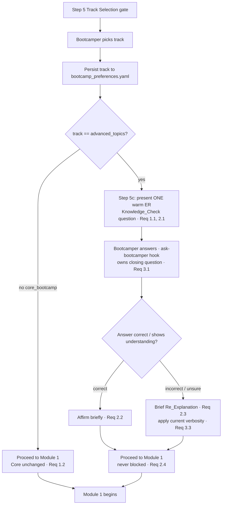

# Design Document

## Overview

The onboarding flow already pauses once for understanding: Step 5b (the
`onboarding-comprehension-check` Comprehension_Check) is a warm, non-blocking check-in that lives
in `onboarding-phase1b-intro-language.md`, just before track selection. It invites questions but
never confirms that the core entity-resolution (ER) idea actually landed. Track selection itself is
Step 5 in `onboarding-phase2-track-setup.md` — a ⛔ mandatory gate that stops for the bootcamper's
real choice ("core"/"core_bootcamp" or "advanced"/"advanced_topics"), which is then persisted to the
`track` key in `config/bootcamp_preferences.yaml`.

This feature adds a **Knowledge_Check** — a single, light ER comprehension question presented **only
to the Advanced track**, inserted after the track-selection gate resolves to Advanced and before
Module 1 begins. It reuses the Comprehension_Check's warm, "this is not a quiz" tone and the
standing onboarding rule that the `ask-bootcamper` hook owns the closing question on `agentStop`. A
correct or clearly-understanding answer earns a brief affirmation; an incorrect or unsure answer
earns a short plain-language **Re_Explanation**. Either way the flow proceeds to Module 1 — the
Knowledge_Check is explicitly **NOT a Mandatory_Gate (⛔)** and never blocks. The Core track is
unchanged: it never sees the Knowledge_Check.

Like the Comprehension_Check, this is a **steering-driven** feature: the behavior is authored as a
new sub-step in the onboarding steering files, not as a runtime script. There is no new hook, no new
Python entry point in the onboarding path, and no change to the track-selection gate. The verifiable
surface is therefore the steering content and the flow it encodes, plus a small reference model of
the branch decision that lets the flow be property-tested. The affected steering file's token count
in `senzing-bootcamp/steering/steering-index.yaml` is updated to reflect the added content
(enforced by `measure_steering.py --check` in CI).

### Design Goals

- Present exactly one light ER Knowledge_Check for the Advanced track, positioned after track
  selection is known and before Module 1 (Requirements 1.1, 1.3).
- Leave Core onboarding byte-for-byte unchanged in behavior — the Knowledge_Check is never
  presented for Core (Requirement 1.2).
- Keep the interaction light and non-punitive: one question, warm tone, affirm-on-correct,
  Re_Explanation-on-incorrect, and **never** block regardless of answer (Requirements 2.1–2.4).
- Reuse existing onboarding conventions: Comprehension_Check tone, the `ask-bootcamper`
  closing-question note, and the current verbosity settings when answering (Requirements 3.1, 3.3).
- Keep the steering index honest: update the modified file's token count (Requirement 3.2).
- Ship regression tests that pin the Advanced-only placement, the non-gate contract, and the
  proceed-to-Module-1 branching on both correct and incorrect answers (Requirements 4.1, 4.2).

### Non-Goals

- Turning onboarding into a test or adding a hard gate that can fail a bootcamper (explicitly
  rejected — Requirement 2.4).
- Adding the Knowledge_Check to the Core track or to any pre-track-selection step (Requirement 1.2).
- Changing the Track Selection gate (Step 5), the Comprehension_Check (Step 5b), or the
  `ask-bootcamper` hook.
- Introducing a new onboarding runtime script or hook. The logic is authored in steering; no
  per-turn process is spawned.
- Grading, scoring, or persisting the bootcamper's answer. The answer only selects the affirm vs.
  Re_Explanation branch in-conversation; it is not recorded.

## Architecture

The Knowledge_Check is a new steering sub-step — **Step 5c "Advanced Track Knowledge Check"** — added
to `onboarding-phase2-track-setup.md` immediately after the Step 5 (Track Selection) section, so it
sits between the resolved track-selection gate and the first module load. It is guarded by the
persisted `track`: it runs only when `track` is the Advanced track (`advanced_topics`), and is
skipped entirely for the Core track (`core_bootcamp`).



### Placement rationale

- **After** the Track Selection gate because the branch depends on the persisted `track`; the
  check cannot know the track before the bootcamper chooses (Requirement 1.3).
- **Before** Module 1 because the check exists to shore up conceptual grounding the deeper
  Advanced modules assume (Requirements 1.1, 1.3).
- In `onboarding-phase2-track-setup.md` (not phase1b) because that file already owns track selection
  and the "what happens once a track is known" transitions, keeping the Advanced-only branch next to
  the choice that gates it.

### Non-gate + hook interaction

Step 5c follows the standard onboarding rule: present the single question and stop — no inline
closing question, no `WAIT`, no gate marker. The `ask-bootcamper` hook fires on `agentStop` and
generates the contextual 👉 closing question, exactly as it does for Step 5b. Because the check never
blocks, an acknowledgment, a wrong answer, an "I don't know," or silence all lead to Module 1; a
wrong/unsure answer simply adds a Re_Explanation first (Requirements 2.2–2.4, 3.1).

## Components and Interfaces

This is a steering-content change. The "components" are the authored steering section, the steering
index entry it updates, and a small pure **reference model** of the branch decision used only by the
property tests (it ships in the test suite, not in the distributed power path).

### 1. New steering sub-step — `onboarding-phase2-track-setup.md` › "5c. Advanced Track Knowledge Check"

Positioned immediately after the `## 5. Track Selection` section and before `## Switching Tracks`.
Required content:

- **Advanced-only guard.** An explicit instruction that this step runs only when the persisted
  `track` is the Advanced track (`advanced_topics`) and is **skipped** for the Core track — Core
  onboarding proceeds straight to Module 1 (Requirements 1.1, 1.2).
- **Single warm question.** One light ER comprehension question in the Comprehension_Check tone
  ("gut-check," not an exam), emitted with the mandatory `👉` prefix, then stop (Requirements 2.1,
  3.1). The question targets a core ER concept introduced in `entity-resolution-intro.md` (e.g., the
  idea that entity resolution decides whether records refer to the *same real-world entity*).
- **Correct-answer handling.** When the answer is correct or clearly demonstrates understanding,
  affirm briefly and proceed to Module 1 (Requirement 2.2).
- **Incorrect/unsure handling.** When the answer is wrong or the bootcamper is unsure, offer a
  brief, plain-language Re_Explanation of the concept, applying the bootcamper's current verbosity
  settings from the preferences file, then proceed to Module 1 (Requirements 2.3, 3.3).
- **Non-gate note.** An explicit note that Step 5c is **NOT a mandatory gate**, never prevents
  continuing regardless of the answer, and that the `ask-bootcamper` hook handles the closing
  question — mirroring the Step 5b note and containing no gate markers or `WAIT` instruction
  (Requirements 2.4, 3.1).

### 2. Steering index update — `senzing-bootcamp/steering/steering-index.yaml`

Adding the section grows `onboarding-phase2-track-setup.md`. Two entries reference this file and
must be refreshed to the measured count (via `python3 scripts/measure_steering.py --check`, run in
CI):

- `onboarding.phases.phase2-track-setup.token_count` (currently `991`)
- `file_metadata."onboarding-phase2-track-setup.md".token_count` (currently `972`)

The `step_range` for the phase2 entry stays anchored on track selection or is widened to include the
new sub-step; the token counts are the required update (Requirement 3.2). The file remains well under
the `split_threshold_tokens` (5000) budget.

### 3. Reference decision model (test-only)

To make the branch logic property-testable without a runtime script, the property tests define a
small pure reference model that encodes exactly what Step 5c instructs. It lives in the test module
(not shipped in `senzing-bootcamp/` runtime scripts), keeping the power-distribution surface clean.

```python
Track = str            # "advanced_topics" | "core_bootcamp" (and unknown values)
AnswerClass = str      # "correct" | "incorrect" | "unsure"

def presents_knowledge_check(track: str) -> bool:
    """True iff the Advanced track was selected (Req 1.1, 1.2)."""
    return track == "advanced_topics"

@dataclass(frozen=True)
class CheckOutcome:
    presented: bool             # was a question shown?
    branch: str | None          # "affirm" | "re_explanation" | None (not presented)
    re_explanation: bool        # was a Re_Explanation offered?
    proceeds_to_module_1: bool  # always True — never blocks (Req 2.4)

def resolve_knowledge_check(track: str, answer: str | None) -> CheckOutcome:
    """Model Step 5c: gate on track, branch on answer, always proceed."""
    if not presents_knowledge_check(track):
        return CheckOutcome(False, None, False, True)   # Core: skipped, proceed
    if answer == "correct":
        return CheckOutcome(True, "affirm", False, True)
    # incorrect, unsure, or no answer -> Re_Explanation, then proceed
    return CheckOutcome(True, "re_explanation", True, True)
```

The content/flow tests keep this model faithful by asserting the real steering section actually
contains the Advanced-only guard, the single question, and both branches.

### Reused conventions (no modification)

- `entity-resolution-intro.md` — source of the "core ER concept" the question is drawn from.
- The Step 5b Comprehension_Check tone and `ask-bootcamper` closing-question note (pattern reused).
- The verbosity settings under the `verbosity` key of `config/bootcamp_preferences.yaml`
  (`onboarding-phase1b-intro-language.md` Step 5a) — applied verbatim when answering (Requirement
  3.3); no new verbosity logic is introduced.
- The Track Selection gate (Step 5) and the persisted `track` key — read, never changed.

## Data Models

### Track values (input to the guard)

| `track` value        | Meaning        | Knowledge_Check |
|----------------------|----------------|-----------------|
| `advanced_topics`    | Advanced track | Presented (Requirement 1.1) |
| `core_bootcamp`      | Core track     | Not presented (Requirement 1.2) |
| any other / missing  | Not Advanced   | Not presented (fail-safe: never inject the check when the track is unknown) |

Source of truth: the `track` key in `config/bootcamp_preferences.yaml`, written by the Step 5 gate.
The guard predicate is "track is the Advanced track," so only `advanced_topics` presents the check;
every other value (including a missing or malformed one) is treated as not-Advanced and skips it.

### Answer classification (input to the branch)

The bootcamper's free-text reply is interpreted into one of three classes; the model treats "no
answer" as non-correct so the fail-safe path is a Re_Explanation, never a block.

| Class       | Signal                                              | Branch          |
|-------------|-----------------------------------------------------|-----------------|
| `correct`   | Answers correctly or clearly shows understanding    | Affirm briefly (Requirement 2.2) |
| `incorrect` | Answers incorrectly                                 | Re_Explanation (Requirement 2.3) |
| `unsure`    | Signals uncertainty ("not sure", "I don't know")    | Re_Explanation (Requirement 2.3) |

### Outcome invariants

For every `(track, answer)` the modeled outcome satisfies:

- `presented == (track == "advanced_topics")` — Advanced-only presentation.
- `proceeds_to_module_1 == True` — always; the check never blocks (Requirement 2.4).
- `branch == "affirm"` ⇒ `re_explanation == False`; `branch == "re_explanation"` ⇒
  `re_explanation == True`; `presented == False` ⇒ `branch is None and re_explanation == False`.

### Steering index entry (data touched)

```yaml
onboarding:
  phases:
    phase2-track-setup:
      file: onboarding-phase2-track-setup.md
      token_count: <updated>   # was 991
file_metadata:
  onboarding-phase2-track-setup.md:
    token_count: <updated>     # was 972
```

## Correctness Properties

*A property is a characteristic or behavior that should hold true across all valid executions of a
system — essentially, a formal statement about what the system should do. Properties serve as the
bridge between human-readable specifications and machine-verifiable correctness guarantees.*

This feature is steering-driven, so its behavior is authored prose rather than a runtime function.
Most acceptance criteria (placement, tone, definition location, verbosity instruction, token-count
sync) are therefore verified by content/flow assertions against the real steering files (see Testing
Strategy). A small but genuine set of universal properties **does** apply to the branch decision the
steering encodes; they are stated over any `(track, answer)` input and checked against the pure
reference model, with content tests keeping that model faithful to the steering. Each property below
is universally quantified and implemented as a single Hypothesis property test whose iteration count
comes from the active profile (`fast`=5 locally, `thorough`=100 in CI).

### Property 1: Advanced-only presentation

*For any* `track` value (Advanced, Core, or any other/unknown string), the Knowledge_Check is
presented if and only if the track is the Advanced track (`advanced_topics`) — it is never presented
for the Core track or any non-Advanced value.

**Validates: Requirements 1.1, 1.2**

### Property 2: Correct answers affirm and proceed

*For any* correct (understanding-demonstrating) answer on the Advanced track, the outcome selects the
**affirm** branch (no Re_Explanation) and proceeds to Module 1.

**Validates: Requirements 2.2**

### Property 3: Incorrect or unsure answers trigger a Re_Explanation and proceed

*For any* incorrect or unsure answer on the Advanced track, the outcome offers a Re_Explanation and
then proceeds to Module 1.

**Validates: Requirements 2.3**

### Property 4: The Knowledge_Check never blocks

*For any* `(track, answer)` pair — including Core, unknown tracks, wrong answers, "unsure", and no
answer at all — the outcome proceeds to Module 1; there is no input for which the flow is blocked.

**Validates: Requirements 2.4**

## Error Handling

The Knowledge_Check is **non-blocking by contract** — no bootcamper input, however malformed or
absent, can stall onboarding (Requirement 2.4).

| Situation | Handling |
|---|---|
| `track` is Core (`core_bootcamp`) | Guard is false → skip Step 5c entirely; proceed straight to Module 1. Core onboarding is unchanged (Req 1.2). |
| `track` missing or malformed in preferences | Treated as not-Advanced (fail-safe) → skip the check; proceed to Module 1. The check is never injected on an unknown track. |
| Bootcamper answers incorrectly or "I don't know" | Offer a brief Re_Explanation, then proceed to Module 1 (Reqs 2.3, 2.4). |
| Bootcamper gives no answer / acknowledges only | Non-correct path → brief Re_Explanation (or affirm on clear acknowledgment), then proceed; never blocks (Req 2.4). |
| Verbosity settings missing from preferences | Fall back to the `standard` default (the existing Step 5a behavior); answering still proceeds (Req 3.3). |
| Bootcamper asks a clarifying question instead of answering | Answer it (as Step 5b does) using current verbosity, then continue toward Module 1; the `ask-bootcamper` hook owns the closing question (Reqs 3.1, 3.3). |

Because the step adds no runtime script and no hook, there is no new process, exit code, or I/O
failure surface to handle — the only "errors" are unexpected bootcamper inputs, all of which route to
the non-blocking proceed path.

## Testing Strategy

Tests live in `senzing-bootcamp/tests/` (they read the real bundled steering files under
`senzing-bootcamp/steering/`, not repo-root hook files), follow the project pattern (pytest +
Hypothesis, class-based, `sys.path` import of scripts where needed), and property tests draw their
example count from the active Hypothesis profile — **no hand-set `@settings(max_examples=...)`** to
restate the baseline (Requirement 4.2). Fixtures are synthetic only — no real PII or credentials.

A new test module, `senzing-bootcamp/tests/test_advanced_track_knowledge_check.py`, mirrors the
structure of `test_comprehension_check.py`: helpers that read the steering files and extract the
`5c. Advanced Track Knowledge Check` section, class-based content/contract tests, and Hypothesis
property tests over the reference decision model.

### Property-based tests (Hypothesis)

PBT applies in a focused, model-based way: the branch decision (`resolve_knowledge_check`) is pure
and has universal properties over a small but meaningful input space (track strings × answer
classes). One property test per correctness property above, each tagged:

`# Feature: advanced-track-knowledge-check, Property {number}: {property_text}`

Strategies (prefixed `st_`):

- `st_track()` — draws from `{"advanced_topics", "core_bootcamp"}` plus arbitrary/unknown strings
  and the empty string, so gating (Property 1) and non-blocking (Property 4) are exercised across the
  full track space, not just the two happy-path values.
- `st_answer_class()` — draws from `{"correct", "incorrect", "unsure"}` and `None` (no answer), so
  the branch properties (2, 3) and the never-blocks property (4) see every answer shape.

Property-to-test mapping:

- **Property 1** — for any `st_track()`, `presents_knowledge_check(track)` is true iff
  `track == "advanced_topics"`.
- **Property 2** — for any correct answer with the Advanced track, `branch == "affirm"`,
  `re_explanation is False`, `proceeds_to_module_1 is True`.
- **Property 3** — for any incorrect/unsure/no answer with the Advanced track,
  `re_explanation is True` and `proceeds_to_module_1 is True`.
- **Property 4** — for any `(st_track(), st_answer_class())`, `proceeds_to_module_1 is True`.

The reference model is defined in the test module (not shipped in the power runtime path). Its
fidelity to the steering is guarded by the content tests below, so the properties cannot pass against
a model that has drifted from the authored flow.

### Content / flow tests (example-based)

These read the real steering and pin the criteria that are structural rather than input-varying:

- **Placement (Reqs 1.1, 1.3):** the `5c. Advanced Track Knowledge Check` heading exists in
  `onboarding-phase2-track-setup.md` and appears **after** `## 5. Track Selection` and before the
  `## Switching Tracks` appendix; the section states the check precedes Module 1.
- **Advanced-only guard (Reqs 1.1, 1.2):** the section explicitly scopes the check to the Advanced
  track (`advanced_topics`) and states the Core track skips it / is unchanged.
- **Single warm question + tone (Reqs 2.1, 3.1):** the section contains exactly one `👉`-prefixed
  question, references a core ER concept, and carries non-quiz framing consistent with Step 5b.
- **Branch documentation (Reqs 2.2, 2.3):** the section documents the affirm-and-proceed path for
  correct answers and the Re_Explanation-and-proceed path for incorrect/unsure answers.
- **Non-gate contract (Req 2.4):** the section contains **no** gate markers — no `⛔`, no
  `MUST stop`, no `mandatory gate`, no `MUST NOT proceed`, and no `WAIT` — mirroring the Step 5b
  non-gate contract test.
- **Hook + verbosity notes (Reqs 3.1, 3.3):** the section references the `ask-bootcamper`
  closing-question note and instructs the agent to apply the bootcamper's current verbosity settings
  when giving the Re_Explanation.
- **Steering index sync (Req 3.2):** the `steering-index.yaml` entries for
  `onboarding-phase2-track-setup.md` (both the `phase2-track-setup` phase entry and the
  `file_metadata` entry) exist for the modified file; CI's `measure_steering.py --check` enforces the
  count matches the file.

### Smoke / CI

- `python3 senzing-bootcamp/scripts/measure_steering.py --check` verifies the updated token counts
  match the modified steering file (Requirement 3.2).
- The full suite runs under `HYPOTHESIS_PROFILE=thorough` in CI (100 iterations per property) and
  defaults to `fast` locally, per the registered Hypothesis profiles.
