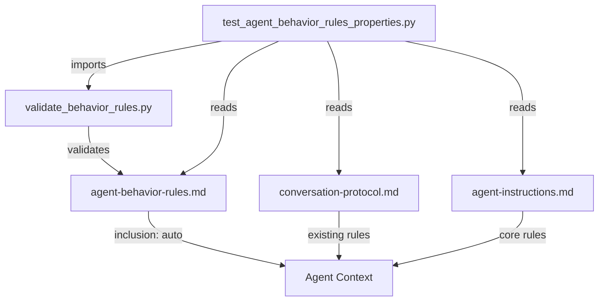

# Design Document

## Overview

This feature adds four agent behavior rules to the Senzing Bootcamp Power's steering files. The rules are implemented as a new steering file (`agent-behavior-rules.md`) with `inclusion: auto` frontmatter, ensuring they are loaded in every session. Each rule codifies expected agent behavior that was previously implicit or inconsistently enforced:

1. **Honor Explicit Continuation Requests** — The agent must never override a bootcamper's stated intent to continue by suggesting pauses or breaks.
2. **Acknowledge Bootcamper Responses** — Every answer gets a brief, substantive echo-back before the agent proceeds.
3. **Eliminate Ambiguous Yes/No Questions** — Questions must have exactly one unambiguous meaning for each possible answer.
4. **Consistent Pointer Indicator** — All bootcamper-directed prompts use the 👉 prefix uniformly.

The implementation is purely additive — a new steering file plus a validation script that can be used in tests to verify rule compliance programmatically.

## Architecture



The new steering file sits alongside existing behavioral steering (`conversation-protocol.md`, `agent-instructions.md`) and reinforces/extends their rules. A validation script provides programmatic checking of rule compliance for use in property-based tests.

### Design Decisions

1. **Single new steering file vs. modifying existing files**: A dedicated `agent-behavior-rules.md` keeps the rules cohesive and discoverable. Existing files already reference related concepts (one-question rule, 👉 prefix) — the new file adds the four specific rules without duplicating existing content. Cross-references link back to `conversation-protocol.md` for full protocol details.

2. **`inclusion: auto` frontmatter**: These rules apply universally across all bootcamp contexts (onboarding, modules, feedback, session resume), so auto-inclusion is appropriate. This matches the pattern used by `conversation-protocol.md`.

3. **Validation script in `scripts/`**: Following the project convention of stdlib-only Python scripts with `argparse` CLI, the validation logic lives in a reusable script that both CI and tests can invoke.

4. **Token budget consideration**: The new steering file targets ~400-600 tokens to stay within the `medium` size category, keeping context budget impact minimal.

## Components and Interfaces

### Component 1: `senzing-bootcamp/steering/agent-behavior-rules.md`

The steering file containing the four behavior rules. Structure:

```markdown
---
inclusion: auto
description: "Four agent behavior rules: honor continuation, acknowledge responses, no ambiguous questions, consistent pointer indicator"
---

# Agent Behavior Rules

## Rule 1: Honor Explicit Continuation Requests
[continuation phrases, prohibition on pause/stop/defer language, context-limit guidance]

## Rule 2: Acknowledge Bootcamper Responses Before Proceeding
[acknowledgment constraints: ≤2 sentences, ≤50 words, substantive content, position requirement]

## Rule 3: Eliminate Ambiguous Yes/No Questions
[compound question prohibition, numbered list format, rewrite requirement]

## Rule 4: Consistent Pointer Indicator
[👉 prefix on all input-requiring prompts, all contexts, multi-prompt handling]
```

### Component 2: `senzing-bootcamp/scripts/validate_behavior_rules.py`

A Python 3.11+ stdlib-only script that provides:

- `is_continuation_request(message: str) -> bool` — Detects explicit continuation phrases
- `contains_pause_language(text: str) -> bool` — Detects pause/stop/defer recommendations
- `validate_acknowledgment(text: str) -> AcknowledgmentResult` — Checks length, position, and substantiveness
- `is_compound_question(question: str) -> bool` — Detects ambiguous yes/no questions with prose conjunctions
- `has_pointer_prefix(line: str) -> bool` — Checks for 👉 prefix on a prompt line
- `validate_steering_file(path: Path) -> list[Violation]` — Validates a steering file against all four rules

CLI interface: `python3 validate_behavior_rules.py [--check] [files...]`

### Component 3: `senzing-bootcamp/tests/test_agent_behavior_rules_properties.py`

Property-based tests using Hypothesis that validate the correctness properties defined below.

### Interface: Steering File to Agent

The steering file communicates rules to the agent via natural language directives loaded into context. No programmatic API — the agent reads and follows the rules as part of its instruction set.

### Interface: Validation Script to Tests

```python
# Public API for test imports
def is_continuation_request(message: str) -> bool: ...
def contains_pause_language(text: str) -> bool: ...

@dataclass
class AcknowledgmentResult:
    valid: bool
    sentence_count: int
    word_count: int
    is_substantive: bool
    position_ok: bool

def validate_acknowledgment(text: str, bootcamper_response: str = "") -> AcknowledgmentResult: ...
def is_compound_question(question: str) -> bool: ...
def has_pointer_prefix(line: str) -> bool: ...
```

## Data Models

### Continuation Request Detection

```python
# Trigger phrases (case-insensitive matching)
CONTINUATION_PHRASES: list[str] = [
    "continue",
    "keep going",
    "next",
    "go on",
    "proceed",
    "let's continue",
    "let's keep going",
    "next module",
    "move on",
    "carry on",
]

# Pause/stop/defer language patterns (regex)
PAUSE_PATTERNS: list[str] = [
    r"\b(take a break|pause|stop here|pick this up later|"
    r"continue (later|tomorrow|next time|in a new session)|"
    r"call it a day|wrap up for now|save.*progress.*later)\b",
]
```

### Acknowledgment Validation

```python
@dataclass
class AcknowledgmentResult:
    valid: bool              # Overall pass/fail
    sentence_count: int      # Must be <= 2
    word_count: int          # Must be <= 50
    is_substantive: bool     # Not content-free ("Got it", "Okay", etc.)
    position_ok: bool        # Within first 2 sentences of response

# Content-free phrases that fail substantiveness check
CONTENT_FREE_PHRASES: list[str] = [
    "got it",
    "okay",
    "sure",
    "thanks",
    "understood",
    "noted",
    "alright",
    "ok",
]
```

### Compound Question Detection

```python
# Prose conjunction patterns that indicate compound questions
CONJUNCTION_PATTERNS: list[str] = [
    r"\bor\b(?!\s*$)",           # "or" not at end of line
    r"\balternatively\b",
    r"\bor would you rather\b",
    r"\bor should we\b",
    r"\bor would you prefer\b",
    r"\bor if you prefer\b",
]
```

### Steering Index Entry

```yaml
# Addition to steering-index.yaml file_metadata
agent-behavior-rules.md:
  token_count: <measured>
  size_category: medium
```

## Correctness Properties

*A property is a characteristic or behavior that should hold true across all valid executions of a system — essentially, a formal statement about what the system should do. Properties serve as the bridge between human-readable specifications and machine-verifiable correctness guarantees.*

### Property 1: Continuation Request Classification Round-Trip

*For any* string that contains at least one phrase from the defined CONTINUATION_PHRASES list (case-insensitive), `is_continuation_request` SHALL return `True`; and *for any* string that contains none of those phrases, it SHALL return `False`.

**Validates: Requirements 1.1, 1.4, 1.5**

### Property 2: Pause Language Detection

*For any* text that contains at least one match against the PAUSE_PATTERNS regexes, `contains_pause_language` SHALL return `True`; and *for any* text composed solely of words not matching any pause pattern, it SHALL return `False`.

**Validates: Requirements 1.1, 1.2, 1.4**

### Property 3: Acknowledgment Length Constraint

*For any* text string, `validate_acknowledgment` SHALL report `valid=False` when the text exceeds 2 sentences or 50 words, and SHALL report `valid=True` (for the length dimension) when the text is within both limits.

**Validates: Requirements 2.1, 2.2**

### Property 4: Substantive Acknowledgment Rejection of Content-Free Phrases

*For any* string composed entirely of one or more CONTENT_FREE_PHRASES (with optional punctuation and whitespace), `validate_acknowledgment` SHALL report `is_substantive=False`.

**Validates: Requirements 2.3**

### Property 5: Compound Question Detection

*For any* question string containing two or more alternatives joined by prose conjunctions (matching CONJUNCTION_PATTERNS), `is_compound_question` SHALL return `True`; and *for any* simple yes/no question without prose conjunctions joining alternatives, it SHALL return `False`.

**Validates: Requirements 3.1, 3.3, 3.5**

### Property 6: Numbered List Format Requirement

*For any* question presenting 2 or more distinct alternatives, the question SHALL be formatted as a numbered choice list (lines matching `^\d+\.\s+`) preceded by a single lead question. A question with alternatives that lacks numbered list format SHALL be detected as a violation.

**Validates: Requirements 3.2**

### Property 7: Universal Pointer Indicator Presence

*For any* bootcamper-directed prompt in the steering files (identified by adjacent STOP markers or being a direct question requiring input), the line SHALL begin with the 👉 prefix (after optional list markers).

**Validates: Requirements 4.1, 4.3, 4.4, 4.5**

## Error Handling

### Validation Script Errors

| Scenario | Handling |
|----------|----------|
| Steering file not found | Exit code 1, print path to stderr |
| Malformed YAML frontmatter | Skip frontmatter, validate body only |
| Empty file | Report as valid (no rules to violate) |
| Encoding error | Attempt UTF-8, fall back to latin-1, report warning |

### Rule Conflict Resolution

When the new behavior rules conflict with existing steering directives:

1. **Continuation vs. context budget**: If context is below 20%, the agent states the constraint but continues (Rule 1 takes precedence over context-budget unloading suggestions).
2. **Acknowledgment vs. one-question rule**: The acknowledgment is part of the response content, not a separate question. It precedes the next action — no conflict with one-question-per-turn.
3. **Pointer indicator vs. existing patterns**: The new rule reinforces the existing 👉 requirement in `conversation-protocol.md` and `agent-instructions.md`. No conflict — purely additive enforcement.

## Testing Strategy

### Property-Based Tests (Hypothesis)

File: `senzing-bootcamp/tests/test_agent_behavior_rules_properties.py`

- **Library**: Hypothesis (already in project dependencies)
- **Configuration**: `@settings(max_examples=100)` per property test for pure-function logic tests; `@settings(max_examples=20)` for file-reading tests (matching project convention)
- **Tag format**: Each test class docstring includes `Feature: agent-behavior-rules, Property N: {title}`
- **Strategies**: Custom `st_` prefixed strategies for generating continuation phrases, pause language, acknowledgment texts, compound questions, and pointer-prefixed lines

Properties to implement:
1. Continuation request classification (Property 1)
2. Pause language detection (Property 2)
3. Acknowledgment length constraint (Property 3)
4. Substantive acknowledgment rejection (Property 4)
5. Compound question detection (Property 5)
6. Numbered list format detection (Property 6)
7. Universal pointer indicator presence (Property 7)

### Unit Tests

File: `senzing-bootcamp/tests/test_agent_behavior_rules_unit.py`

- Specific examples for each rule (concrete inputs/outputs)
- Edge cases: empty strings, unicode, very long inputs, boundary conditions (exactly 50 words, exactly 2 sentences)
- Integration: verify the steering file is well-formed Markdown with valid YAML frontmatter
- Verify `steering-index.yaml` contains the new file entry

### CI Integration

The existing `validate-power.yml` workflow runs pytest, which will pick up the new test files automatically. The validation script can also be added to the CI pipeline as a standalone check if desired.
