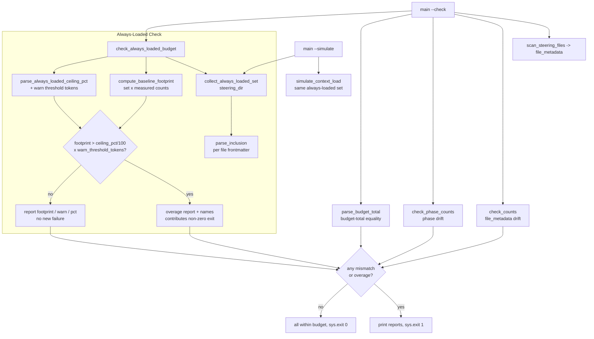

# Design Document

## Overview

`scripts/measure_steering.py --check` is the CI gate (`.github/workflows/validate-power.yml`)
that keeps `steering-index.yaml` honest: it compares stored per-file and per-phase `token_count`
values against the measured files (10% tolerance) and asserts `budget.total_tokens` equals the sum
of `file_metadata` counts (exact equality). What it does **not** do is guard the *baseline* — the
steering that is loaded for the entire session regardless of module. That baseline is only modeled
informally, inside `simulate_context_load`, as a hard-coded list
(`agent-instructions.md`, `conversation-protocol.md`, `module-transitions.md`, plus a representative
`lang-python.md`). Nothing fails CI when that baseline creeps toward the warn threshold
(`warn_threshold_pct: 60` of `reference_window: 200000` = 120,000 tokens), even though baseline
creep is the most direct way to erode the headroom the whole load/unload discipline depends on.

Two problems compound. First, the baseline definition is a **magic list** in one function rather
than derived from an authoritative source. Second, that list has already **drifted** from reality:
the files that actually declare `inclusion: always` in their frontmatter today are
`agent-instructions.md`, `module-transitions.md`, and `security-privacy.md` — whereas the simulation
list still names `conversation-protocol.md` (which is `inclusion: auto`, not `always`) and omits
`security-privacy.md`. A single authoritative definition is needed so `--simulate` and the new
check can never disagree.

This feature adds an **Always_Loaded_Check** to `--check`. It derives the **Always_Loaded_Set** from
the steering files' `inclusion: always` frontmatter (the single authoritative source), computes the
**Baseline_Footprint** from the measured `token_count` values, and **fails CI (exit non-zero)** when
that footprint exceeds a configurable ceiling — `budget.always_loaded_ceiling_pct` of the
**Warn_Threshold** — reporting the footprint in tokens, the warn-threshold in tokens, the
percentage consumed, and (on failure) the contributing files. The existing `file_metadata`, phase,
and budget-total checks and their 10% tolerance are preserved exactly, the check rides the existing
CI invocation (no new step), and the implementation stays Python 3.11+ stdlib-only.

### Design Goals

- Derive the Always_Loaded_Set from one authoritative source — `inclusion: always` frontmatter —
  and feed both `--simulate` and the new check from it, eliminating the hard-coded drift
  (Requirements 1.1, 1.2).
- Fail `--check` (exit non-zero) with an actionable report when the Baseline_Footprint exceeds the
  configured ceiling; pass silently when it is within budget (Requirements 2.2, 2.3, 3.1, 3.2).
- Make the ceiling configuration-driven in `steering-index.yaml`, consistent with the existing
  `warn_threshold_pct` / `critical_threshold_pct` authority (Requirement 2.4).
- Ride the existing CI `--check` invocation and preserve every existing check and its 10% tolerance
  byte-for-byte in behavior (Requirements 4.1, 4.2).
- Add only stdlib code and custom minimal YAML/frontmatter parsing — no PyYAML, no new dependency
  (Requirement 4.3).

### Non-Goals

- Changing the token-count model (`round(len/4)`), the `classify_size` thresholds, or the
  `file_metadata` / `budget` rebuild in update mode.
- Enforcing a ceiling on `critical_threshold_pct` or on per-module or language files — this feature
  guards the *always-loaded baseline* only.
- Rewriting `steering-index.yaml` from the check path; `--check` remains a pure read (like
  `check_counts` / `check_phase_counts`).
- Auto-correcting drift between the frontmatter and the simulation list; the feature *reconciles the
  definition* (one source) rather than editing files.

## Architecture

The Always_Loaded_Check is a set of new pure functions added to the existing
`scripts/measure_steering.py`. The `--check` dispatch in `main` gains one more mismatch source
(the always-loaded overage) that participates in the same aggregate exit decision as the existing
three checks. `simulate_context_load` is refactored to source its always-loaded list from the same
`collect_always_loaded_set` function, so the two code paths share one definition.



### Data Flow (`--check`)

1. **Scan** the steering directory (existing `scan_steering_files`) to get measured
   `{filename: {token_count, size_category}}`.
2. **Collect** the Always_Loaded_Set: `collect_always_loaded_set(steering_dir)` reads each `*.md`
   file's frontmatter via `parse_inclusion` and keeps the filenames whose `inclusion` is `always`
   (Requirement 1.1).
3. **Compute** the Baseline_Footprint: `compute_baseline_footprint(set, file_metadata)` sums the
   measured `token_count` of the files in the set (Requirement 2.1).
4. **Resolve** the ceiling: read `budget.warn_threshold_pct` and `budget.reference_window` to derive
   the Warn_Threshold in tokens, and `budget.always_loaded_ceiling_pct` for the ceiling fraction
   (Requirement 2.4).
5. **Decide** in `check_always_loaded_budget`: fail when footprint exceeds
   `ceiling_pct/100 * warn_threshold_tokens`, otherwise pass (Requirements 2.2, 2.3).
6. **Report** footprint tokens, warn-threshold tokens, and percent-consumed; on failure, also name
   the contributing files (Requirements 3.1, 3.2).
7. **Aggregate** with the existing mismatches — the overage joins `mismatches`, `phase_mismatches`,
   and `budget_mismatch` in the single `sys.exit(1)` decision (Requirements 4.1, 4.2).

### Invocation and CI

- No new CI step. `.github/workflows/validate-power.yml` already runs `measure_steering.py --check`;
  the new check is invoked from inside that same dispatch, so it is exercised on every CI run without
  a separate command (Requirement 4.1).
- `--simulate` continues to print its informational table but now draws its always-loaded list from
  `collect_always_loaded_set`, so simulation and enforcement share one definition (Requirement 1.2).

## Components and Interfaces

All additions live in `scripts/measure_steering.py`, follow the established script conventions
(stdlib only, `@dataclass`, type hints, Google-style docstrings, custom minimal YAML parsing), and
are pure reads that never write the index.

### New: `parse_inclusion`

```python
def parse_inclusion(filepath: Path) -> str | None:
    """Return the `inclusion` value from a steering file's YAML frontmatter.

    Reads only the leading frontmatter block delimited by `---` fences and
    extracts the `inclusion:` value (`always` | `fileMatch` | `manual` | `auto`),
    tolerating surrounding whitespace and optional quotes. Returns None when the
    file has no frontmatter or no `inclusion` key.
    """
```

- Minimal parser: locate the opening `---`, read lines until the closing `---`, match
  `^\s*inclusion:\s*["']?(\w+)["']?\s*$`. No PyYAML (Requirement 4.3). Never raises on a missing or
  malformed frontmatter block — returns `None`.

### New: `collect_always_loaded_set`

```python
def collect_always_loaded_set(steering_dir) -> list[str]:
    """Return the sorted filenames of steering files declaring `inclusion: always`.

    Scans `*.md` files in steering_dir (mirroring scan_steering_files' globbing),
    calls parse_inclusion on each, and returns the names whose inclusion is
    exactly `always`. This is the single authoritative Always_Loaded_Set that
    drives both `--simulate` and `check_always_loaded_budget`.
    """
```

- Sorted for deterministic reporting. Unreadable files are skipped with a warning (mirrors the
  `PermissionError` handling in `scan_steering_files`). This is the authoritative source referenced
  by Requirements 1.1 and 1.2.

### New: `compute_baseline_footprint`

```python
def compute_baseline_footprint(
    always_loaded: list[str], file_metadata: dict
) -> int:
    """Sum the measured token_count of the always-loaded files.

    Uses the measured file_metadata (from scan_steering_files) so the footprint
    reflects the files on disk, not stored values. Files absent from
    file_metadata contribute 0.
    """
    return sum(
        file_metadata.get(name, {}).get("token_count", 0)
        for name in always_loaded
    )
```

### New: `parse_always_loaded_ceiling_pct`

```python
def parse_always_loaded_ceiling_pct(
    content: str, default: int = 25
) -> int:
    """Extract budget.always_loaded_ceiling_pct from YAML content.

    Localized regex read (same style as parse_budget_total /
    simulate_context_load's reference_window read). Returns `default` when the
    key is absent, keeping the check operable before the key is added.
    """
    match = re.search(r"always_loaded_ceiling_pct:\s*(\d+)", content)
    return int(match.group(1)) if match else default
```

- Documented default (`25`) applies only when the key is missing; once present in the `budget`
  block, the configured value governs (Requirement 2.4).

### New: `check_always_loaded_budget`

```python
@dataclass
class AlwaysLoadedResult:
    """Outcome of the always-loaded baseline check."""
    always_loaded: list[str]     # authoritative set, sorted
    footprint_tokens: int        # Baseline_Footprint
    warn_threshold_tokens: int   # warn_threshold_pct/100 * reference_window
    ceiling_pct: int             # budget.always_loaded_ceiling_pct
    ceiling_tokens: int          # ceiling_pct/100 * warn_threshold_tokens
    pct_of_warn: float           # footprint / warn_threshold_tokens * 100
    over_budget: bool            # footprint > ceiling_tokens


def check_always_loaded_budget(
    index_path, steering_dir, file_metadata
) -> AlwaysLoadedResult:
    """Compute the always-loaded baseline result (pure read).

    Derives the authoritative set (collect_always_loaded_set), the footprint
    (compute_baseline_footprint), the warn threshold in tokens (from
    reference_window x warn_threshold_pct), and the ceiling
    (always_loaded_ceiling_pct). Sets over_budget when footprint exceeds the
    ceiling. Does not print or exit; main renders and aggregates.
    """
```

- Reads `reference_window` and `warn_threshold_pct` with the same localized-regex approach already
  used in `simulate_context_load`, defaulting to `200000` / `60` when absent for robustness.

### Reporting helper

```python
def format_always_loaded_report(result: AlwaysLoadedResult) -> list[str]:
    """Render the report lines: footprint tokens, warn-threshold tokens, and
    percent-of-warn consumed (always); the ceiling; and, when over_budget, the
    contributing always-loaded filenames with their token counts."""
```

- The always-present lines satisfy Requirement 3.1; the file listing on failure satisfies
  Requirement 3.2.

### Integration into `main` (`--check` branch)

`main`'s `--check` branch gains the always-loaded computation alongside the existing three checks and
folds `over_budget` into the single exit decision:

```python
elif args.check:
    mismatches = check_counts(args.index_path, file_metadata)
    phase_mismatches = check_phase_counts(args.index_path, args.steering_dir)
    content = load_yaml_content(args.index_path)
    declared_total = parse_budget_total(content)
    stored_metadata = _parse_stored_metadata(content) or {}
    expected_total = sum(m.get("token_count", 0) for m in stored_metadata.values())
    budget_mismatch = declared_total != expected_total

    always_result = check_always_loaded_budget(
        args.index_path, args.steering_dir, file_metadata
    )

    # ... existing mismatch / phase / budget printing unchanged ...
    for line in format_always_loaded_report(always_result):
        print(line)

    if mismatches or phase_mismatches or budget_mismatch or always_result.over_budget:
        sys.exit(1)
    else:
        print("All token counts are within 10% tolerance.")
        sys.exit(0)
```

- The existing `check_counts`, `check_phase_counts`, and budget-total logic and their 10% tolerance
  are untouched (Requirement 4.2); the always-loaded overage is purely additive to the exit
  condition (Requirements 2.3, 4.1).

### Refactor: `simulate_context_load`

The hard-coded `always_loaded = [...]` list is replaced by
`always_loaded = collect_always_loaded_set(steering_dir)`, giving `--simulate` and the check one
shared definition (Requirement 1.2). The representative language file (`lang-python.md`) remains a
simulation-only assumption and is not part of the enforced baseline unless it declares
`inclusion: always`. `simulate_context_load` gains a `steering_dir` argument (defaulting to
`DEFAULT_STEERING_DIR`) so existing call sites keep working.

## Data Models

### Ceiling configuration (`steering-index.yaml` `budget` block)

The ceiling is stored beside the existing budget authority, consistent with `warn_threshold_pct`
and `critical_threshold_pct` (Requirement 2.4):

```yaml
budget:
  total_tokens: 196855
  reference_window: 200000
  warn_threshold_pct: 60
  critical_threshold_pct: 80
  always_loaded_ceiling_pct: 25   # new: ceiling as a fraction of the warn threshold
  split_threshold_tokens: 5000
  router_ceiling: 1000
```

Derived quantities:

| Quantity | Formula | Current value |
|---|---|---|
| Warn_Threshold (tokens) | `warn_threshold_pct/100 * reference_window` | `0.60 * 200000 = 120000` |
| Ceiling (tokens) | `always_loaded_ceiling_pct/100 * Warn_Threshold` | `0.25 * 120000 = 30000` |
| Baseline_Footprint (tokens) | `sum(token_count for f in Always_Loaded_Set)` | see below |
| Percent of warn consumed | `Baseline_Footprint / Warn_Threshold * 100` | see below |

Note: `update_index` must emit `always_loaded_ceiling_pct` in the rebuilt `budget` block (preserving
it the way `split_threshold_tokens` and `router_ceiling` are already preserved) so update mode does
not drop the key.

### Frontmatter parse (the authoritative source)

Steering files carry YAML frontmatter fenced by `---`. Only the `inclusion` key is read:

```yaml
---
inclusion: always        # -> in the Always_Loaded_Set
---
```

Observed values across the corpus: `always`, `fileMatch` (language files, with
`fileMatchPattern`), `auto`, `manual`. Only `always` qualifies. Against today's corpus the
authoritative set is:

| File | `inclusion` | measured `token_count` |
|---|---|---|
| `agent-instructions.md` | `always` | 4376 |
| `module-transitions.md` | `always` | 1751 |
| `security-privacy.md` | `always` | 278 |
| **Baseline_Footprint** | | **6405** |

That is 6405 / 120000 ≈ **5.3%** of the warn threshold — comfortably under a 25% ceiling (30,000
tokens), so the check passes today. It also surfaces the drift this feature fixes: the current
simulation list names `conversation-protocol.md` (actually `inclusion: auto`) and omits
`security-privacy.md`; deriving from frontmatter reconciles both paths to the true set
(Requirement 1.2).

### Set semantics

- The Always_Loaded_Set is exactly `{ f : parse_inclusion(f) == "always" }` over the steering
  `*.md` files — no more, no less (Requirement 1.1).
- `compute_baseline_footprint` is order-independent and treats a file missing from `file_metadata`
  as contributing 0, so a newly added always-file with no measured entry never crashes the check.

## Correctness Properties

*A property is a characteristic or behavior that should hold true across all valid executions of a
system — essentially, a formal statement about what the system should do. Properties serve as the
bridge between human-readable specifications and machine-verifiable correctness guarantees.*

Each property below is universally quantified and implemented as a single Hypothesis property test.
Example counts come from the active Hypothesis profile (`fast`=5 locally, `thorough`=100 in CI); no
inline `max_examples` is set.

### Property 1: The always-loaded set is exactly the `inclusion: always` files, and one source drives both paths

*For any* generated corpus of steering files with assorted frontmatter `inclusion` values
(`always`, `fileMatch`, `manual`, `auto`, or no frontmatter at all), `collect_always_loaded_set`
returns exactly the filenames whose frontmatter `inclusion` is `always`, and the always-loaded list
used by `simulate_context_load` is identical to that same set.

**Validates: Requirements 1.1, 1.2**

### Property 2: Baseline footprint equals the sum of measured counts

*For any* always-loaded set and *any* measured `file_metadata` map, `compute_baseline_footprint`
returns the sum of the `token_count` values of exactly the files in the set (files absent from the
map contributing 0), independent of the order of the set.

**Validates: Requirements 2.1**

### Property 3: The pass/fail decision matches the ceiling boundary

*For any* Baseline_Footprint, `always_loaded_ceiling_pct`, `warn_threshold_pct`, and
`reference_window`, `check_always_loaded_budget` reports `over_budget` true (contributing a non-zero
exit) if and only if the footprint exceeds `always_loaded_ceiling_pct/100 * warn_threshold_pct/100 *
reference_window`; at or below that ceiling it reports `over_budget` false (no new failure).

**Validates: Requirements 2.2, 2.3**

### Property 4: The ceiling is read from configuration

*For any* `steering-index.yaml` content whose `budget` block declares
`always_loaded_ceiling_pct: N`, `parse_always_loaded_ceiling_pct` returns exactly `N`; when the key
is absent it returns the documented default, so no ceiling value is ever a magic number inside the
decision logic.

**Validates: Requirements 2.4**

### Property 5: The report states the required figures and names contributors on failure

*For any* always-loaded check result, the rendered report contains the Baseline_Footprint in
tokens, the Warn_Threshold in tokens, and the percentage of the Warn_Threshold consumed; and
whenever the result is over budget, the report additionally names every file in the Always_Loaded_Set
that contributes to the footprint.

**Validates: Requirements 3.1, 3.2**

## Error Handling

The check is a pure read that must never crash the existing `--check` gate.

| Failure mode | Handling |
|---|---|
| Steering file has no frontmatter or no `inclusion` key | `parse_inclusion` returns `None`; the file is simply not in the always-set. |
| Malformed frontmatter (unterminated fence, stray quotes) | `parse_inclusion` matches leniently and returns `None` on no match; never raises. |
| Unreadable steering file (`PermissionError`) | Skipped with a warning to stderr, mirroring `scan_steering_files`. |
| `always_loaded_ceiling_pct` absent from the index | `parse_always_loaded_ceiling_pct` returns the documented default (`25`); the check still runs. |
| `reference_window` / `warn_threshold_pct` absent | Fall back to `200000` / `60` (same defaults `simulate_context_load` already uses). |
| Always-file missing from measured `file_metadata` | Contributes 0 to the footprint; no crash, and the drift surfaces via the reported set. |
| Empty Always_Loaded_Set | Footprint is 0, `over_budget` is false; the check passes and reports 0 tokens. |

The always-loaded overage integrates into the existing aggregate exit: it can only *add* a failure
reason, never suppress the existing `file_metadata`, phase, or budget-total failures, preserving the
current pass/fail behavior and 10% tolerance exactly (Requirement 4.2).

## Testing Strategy

Tests live in `senzing-bootcamp/tests/` (e.g. `test_always_loaded_budget_check.py`), follow the
project pattern (pytest + Hypothesis, class-based `TestAlwaysLoadedBudgetCheck`, `sys.path` import
of `scripts/`), and property tests draw their example count from the active Hypothesis profile
(`fast` locally, `thorough` in CI) — no hand-set `max_examples`. Fixtures are synthetic steering
files written into a temp directory; they contain no PII, credentials, or connection strings
(power-distribution safety).

### Property-based tests (Hypothesis)

PBT IS appropriate here: the check is built from pure functions (frontmatter parsing, set
collection, summation, threshold comparison, report rendering) with universal properties over a
large input space of corpora, token maps, and threshold values. One property test per correctness
property above, each tagged:

`# Feature: always-loaded-steering-budget-check, Property {number}: {property_text}`

Custom strategies (prefixed `st_`) generate inputs:

- `st_inclusion_value()` — one of `always` / `fileMatch` / `manual` / `auto`, plus `None`
  (no frontmatter), with optional surrounding whitespace and quotes.
- `st_steering_corpus()` — a temp directory of synthetic `*.md` files, each with a chosen
  `inclusion` frontmatter and body text; records the expected always-subset for Property 1.
- `st_token_metadata(names)` — a `file_metadata`-shaped map assigning non-negative `token_count`
  values to a set of filenames (with some names optionally omitted) for Property 2.
- `st_budget_params()` — `(footprint, always_loaded_ceiling_pct, warn_threshold_pct,
  reference_window)` tuples spanning below-, at-, and above-ceiling boundaries for Property 3, and
  ceiling values rendered into YAML `budget` text for Property 4.

Properties 1-5 map one-to-one to these tests.

### Unit / example tests

Complement the properties with focused examples:

- **Under-ceiling pass**: a fixture corpus whose always-files sum below the ceiling → the
  always-loaded check reports pass and `main(["--check"])` exits 0 (Requirement 5.1).
- **Over-ceiling fail with naming**: a fixture whose always-files exceed the ceiling → `over_budget`
  true, the report names each contributing file, and `main(["--check"])` exits non-zero
  (Requirements 3.2, 5.1).
- **Authoritative derivation**: assert `collect_always_loaded_set` on a fixture returns exactly the
  `inclusion: always` files and that `simulate_context_load` uses the same list (Requirements 1.1,
  1.2, 5.1).
- **Config-driven ceiling**: an index with an explicit `always_loaded_ceiling_pct` is honored; one
  without falls back to the documented default (Requirement 2.4).
- **Regression / non-interference**: a clean index with an in-budget baseline still exits 0, and the
  existing `check_counts` / `check_phase_counts` / budget-total examples continue to pass unchanged
  (Requirements 4.1, 4.2).
- **`update_index` preserves the key**: running update mode retains `always_loaded_ceiling_pct` in
  the rebuilt `budget` block (guards the update-mode round trip).

### Integration test

One end-to-end test wiring the real script against a temp steering directory and index: write
synthetic always/manual/fileMatch files plus a `budget` block, run `main(["--check", ...])`, and
assert the exit code and report reflect the baseline footprint versus the configured ceiling — the
same path CI exercises (Requirement 4.1).
