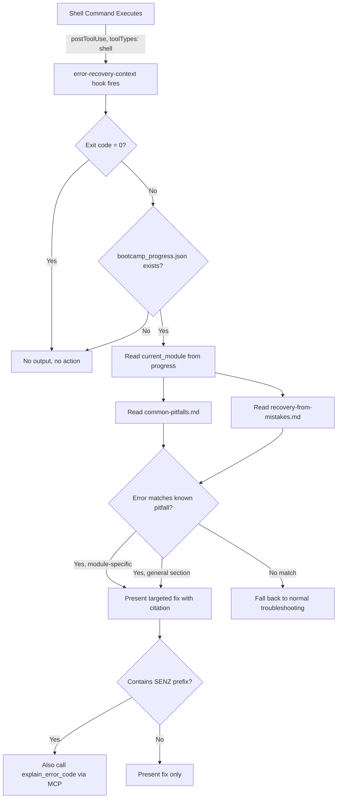

# Design Document: Auto-Load Error Recovery Context

## Overview

This feature adds a `postToolUse` hook (`error-recovery-context.kiro.hook`) that fires after every shell command execution. When the command exits with a non-zero status and the bootcamper is in an active bootcamp session, the hook prompts the agent to consult `common-pitfalls.md` and `recovery-from-mistakes.md`, match the error against known solutions, and provide targeted guidance. On success (exit code 0) or outside a bootcamp session, the hook produces no output.

The hook is registered under the `any` module category in `hook-categories.yaml`, making it available across all 11 modules without per-module activation.

## Architecture



**Key design decisions:**

1. **postToolUse with toolTypes: ["shell"]** — Triggers only after shell commands, not file reads or other tool use. This is the narrowest scope that captures all command failures.
2. **Module guard in prompt** — The prompt instructs the agent to check `config/bootcamp_progress.json` existence and validity before consulting pitfalls files. This prevents interference with non-bootcamp work in the same workspace.
3. **Module-scoped lookup first, then general** — The prompt instructs the agent to check the current module's section first for the most relevant match, then fall back to "General Pitfalls" and "Troubleshooting by Symptom" sections.
4. **Silent on success** — Exit code 0 produces no output, avoiding noise on every successful command.
5. **`any` category registration** — Registered under `modules.any` in `hook-categories.yaml` so it's available across all modules without per-module activation logic.

## Components and Interfaces

### Component 1: error-recovery-context.kiro.hook

**Location:** `senzing-bootcamp/hooks/error-recovery-context.kiro.hook`

**Interface (JSON structure):**

```json
{
  "name": "Auto-Load Error Recovery Context",
  "version": "1.0.0",
  "description": "Detects shell command failures and consults common-pitfalls.md and recovery-from-mistakes.md to provide targeted error recovery guidance during bootcamp modules.",
  "when": {
    "type": "postToolUse",
    "toolTypes": ["shell"]
  },
  "then": {
    "type": "askAgent",
    "prompt": "<multi-line prompt with error detection, module guard, pitfall lookup, and fallback logic>"
  }
}
```

**Prompt responsibilities (in order):**

1. Check exit code — if zero, produce no output and stop
2. Check `config/bootcamp_progress.json` exists — if missing, produce no output and stop
3. Extract error message, exit code, and command context from the tool result
4. Read `senzing-bootcamp/steering/common-pitfalls.md`
5. Read `senzing-bootcamp/steering/recovery-from-mistakes.md`
6. Scope pitfall lookup to the current module section first
7. If no module-specific match, check "General Pitfalls" and "Troubleshooting by Symptom"
8. If error contains a SENZ prefix, call `explain_error_code` from the Senzing MCP server
9. If a known solution is found: present only the matching fix, cite the source section, include the specific command/action needed
10. If multiple matches: present the most specific match based on module context
11. If no match: fall back to normal troubleshooting without claiming a known solution exists

### Component 2: hook-categories.yaml update

**Location:** `senzing-bootcamp/hooks/hook-categories.yaml`

**Change:** Add `error-recovery-context` to the existing `any` list:

```yaml
  any:
    - backup-project-on-request
    - error-recovery-context
    - git-commit-reminder
```

Entries in the `any` list are kept in alphabetical order.

### Component 3: hook-registry.md regeneration

After adding the hook file and category entry, `sync_hook_registry.py --write` regenerates the registry. The `EXPECTED_HOOK_COUNT` in `tests/test_hook_prompt_standards.py` must be updated from 23 to 24.

## Data Models

### Hook File Schema (existing, no changes)

```json
{
  "name": "string (human-readable title)",
  "version": "string (semver)",
  "description": "string (one-line summary)",
  "when": {
    "type": "string (event type from VALID_EVENT_TYPES)",
    "toolTypes": ["string[] (required for postToolUse/preToolUse hooks)"]
  },
  "then": {
    "type": "string ('askAgent' | 'runCommand')",
    "prompt": "string (required when then.type is 'askAgent')"
  }
}
```

### bootcamp_progress.json (existing, read-only)

```json
{
  "current_module": 5,
  "modules_completed": [1, 2, 3, 4],
  "current_step": 3
}
```

The hook reads `current_module` to scope pitfall lookup. No writes to this file.

### hook-categories.yaml structure (existing)

```yaml
critical:
  - hook-id-1
  - hook-id-2

modules:
  2:
    - module-specific-hook
  any:
    - cross-module-hook
```

The `any` key under `modules` holds hooks available across all modules.

## Correctness Properties

*A property is a characteristic or behavior that should hold true across all valid executions of a system — essentially, a formal statement about what the system should do. Properties serve as the bridge between human-readable specifications and machine-verifiable correctness guarantees.*

### Property 1: Hook structural validity

*For any* `.kiro.hook` file in `senzing-bootcamp/hooks/` (including the new `error-recovery-context.kiro.hook`), the file SHALL parse as valid JSON and contain all required fields (`name`, `version`, `when.type`, `then.type`), with `when.type` being a member of `VALID_EVENT_TYPES` and `then.type` being either "askAgent" or "runCommand".

**Validates: Requirements 1.1, 6.1, 6.2, 6.3, 6.4, 6.5**

### Property 2: Category-to-file bidirectional consistency

*For any* hook ID listed in `hook-categories.yaml` (under `critical` or any `modules` sub-key), a corresponding `.kiro.hook` file SHALL exist in `senzing-bootcamp/hooks/`.

**Validates: Requirements 5.1, 5.2**

### Property 3: ToolType validity for tool-event hooks

*For any* hook with `when.type` in `{"preToolUse", "postToolUse"}`, every entry in `when.toolTypes` SHALL be either a member of the valid tool categories set (`read`, `write`, `shell`, `web`, `spec`, `*`) or a compilable regex pattern.

**Validates: Requirements 1.6, 6.3**

## Error Handling

| Scenario | Handling |
|----------|----------|
| Shell command exits with code 0 | Hook prompt instructs agent to produce no output |
| `config/bootcamp_progress.json` missing | Hook prompt instructs agent to produce no output |
| `config/bootcamp_progress.json` has invalid JSON | Hook prompt instructs agent to produce no output |
| `current_module` field missing from progress | Hook prompt instructs agent to produce no output |
| Error matches module-specific pitfall | Present the fix with section citation |
| Error matches general pitfall only | Present the fix with section citation |
| Error contains SENZ prefix | Additionally call `explain_error_code` MCP tool |
| No known solution matches | Fall back to normal troubleshooting |
| Multiple pitfalls could match | Present the most specific match (module-scoped first) |
| Steering files missing or unreadable | Agent falls back to normal troubleshooting |

## Testing Strategy

### Property-Based Tests (Hypothesis)

Property-based testing is appropriate here because:

- Properties 1–3 are universal structural invariants over all hook files and category entries
- The input space (hook files, category entries, toolType values) benefits from exhaustive checking
- These properties provide regression coverage ensuring the new hook doesn't break existing infrastructure

**Library:** Hypothesis (Python)
**Configuration:** Minimum 100 iterations per property test
**Tag format:** `Feature: auto-load-error-recovery, Property {N}: {title}`

Test file: `tests/test_auto_load_error_recovery_properties.py`

### Example-Based Unit Tests (pytest)

Test file: `tests/test_auto_load_error_recovery.py`

Covers:

- Hook file parses as valid JSON with correct field values (name, version, description, when.type, when.toolTypes, then.type)
- Prompt content checks:
  - References `config/bootcamp_progress.json` for module guard
  - Contains silent-processing instructions for exit code 0
  - Contains silent-processing instructions for missing progress file
  - References `common-pitfalls.md` and `recovery-from-mistakes.md`
  - Contains instructions about module-scoped lookup
  - Contains fallback to General Pitfalls and Troubleshooting by Symptom
  - Contains instructions about citing source sections
  - References `explain_error_code` and SENZ prefix
  - Contains instructions about presenting only the matching fix
  - Contains instructions about specific commands/actions for resolution
- `hook-categories.yaml` contains `error-recovery-context` in `modules.any`
- Total hook count is 24
- Existing entries in `hook-categories.yaml` are preserved

### Integration Tests

- Run `sync_hook_registry.py --verify` to confirm registry stays in sync
- Run `test_hooks.py --hook error-recovery-context` to confirm structural validation passes
- Run existing `test_hook_prompt_standards.py` to confirm new hook passes all existing validation
