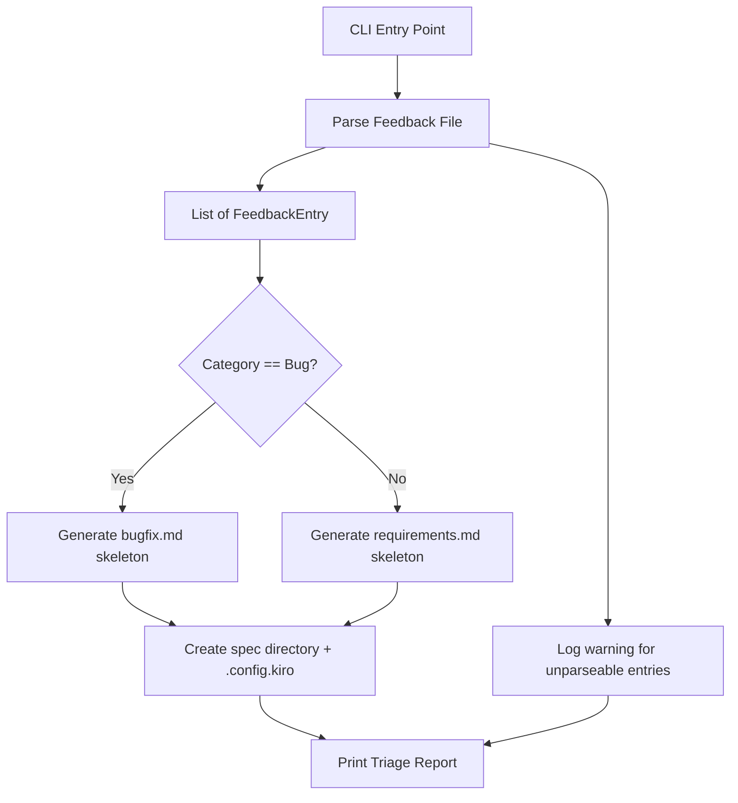

# Design Document: Automated Feedback Triage

## Overview

The Senzing Bootcamp feedback workflow collects improvement suggestions into a structured markdown file. Currently, turning feedback into actionable specs requires manual reading, classification, directory creation, and document population. This design adds `scripts/triage_feedback.py`, a standalone Python script that parses the feedback markdown file, classifies entries by category, and generates skeleton spec directories with pre-populated `bugfix.md` or `requirements.md` files — reducing the per-item effort from minutes to a single command invocation.

### Key Design Decisions

1. **Single script, no dependencies** — the triage script uses only the Python standard library (`re`, `pathlib`, `uuid`, `argparse`, `sys`). No third-party markdown parsers — the feedback template has a predictable structure that regex-based parsing handles reliably.
2. **Category-based routing** — entries with category "Bug" generate `bugfix.md` skeletons; all other categories generate `requirements.md` skeletons. Unrecognized categories default to requirements with a warning.
3. **Kebab-case directory naming** — spec directory names are derived from feedback titles using a deterministic kebab-case conversion (lowercase, special characters to hyphens, consecutive hyphens collapsed, leading/trailing hyphens stripped).
4. **Skip-on-conflict** — if a spec directory already exists, the script skips that entry and logs a warning rather than overwriting. This makes repeated runs safe.
5. **Dry-run support** — the `--dry-run` flag prints the triage report without creating files, enabling CI preview and manual review before committing.
6. **Content preservation** — the parser preserves all markdown formatting (bold, italic, code blocks, lists) within extracted fields, ensuring no user-reported context is lost.

## Architecture



## Components and Interfaces

### 1. Data Structures

```python
@dataclass
class FeedbackEntry:
    title: str
    date: str | None
    module: str | None
    priority: str | None
    category: str | None
    what_happened: str
    why_problem: str
    suggested_fix: str
    workaround: str | None

VALID_CATEGORIES = {"Documentation", "Workflow", "Tools", "UX", "Bug",
                    "Performance", "Security"}
VALID_PRIORITIES = {"High", "Medium", "Low"}
REQUIRED_FIELDS = {"title", "category"}
```

### 2. Parser Functions

```python
def parse_feedback_file(content: str) -> tuple[list[FeedbackEntry], list[str]]:
    """Parse feedback markdown into structured entries.
    
    Splits content on `## Improvement: <title>` headings, extracts fields
    from each section. Preserves markdown formatting within field content.
    
    Args:
        content: Raw markdown content of the feedback file.
    
    Returns:
        Tuple of (successfully_parsed_entries, warning_messages).
        Warnings include entries with missing required fields or
        unrecognized categories.
    """

def extract_field(section: str, field_name: str) -> str | None:
    """Extract content for a named field from a feedback section.
    
    Looks for patterns like `**Field Name:** content` or
    `### Field Name\\ncontent`. Handles multi-paragraph content
    by capturing everything until the next field heading.
    
    Preserves markdown formatting (bold, italic, code blocks, lists).
    """

def to_kebab_case(title: str) -> str:
    """Convert a title string to kebab-case for directory naming.
    
    Lowercase, replace spaces and special characters with hyphens,
    collapse consecutive hyphens, strip leading/trailing hyphens.
    """
```

### 3. Skeleton Generators

```python
def generate_bugfix_skeleton(entry: FeedbackEntry) -> str:
    """Generate bugfix.md content from a bug-category feedback entry.
    
    Sections:
      - Bug Report: from what_happened
      - Steps to Reproduce: from module, date, and sequential steps in what_happened
      - Expected Behavior: derived from inverse of why_problem
      - Suggested Fix: from suggested_fix
      - Known Workaround: from workaround (only if non-empty)
    """

def generate_requirements_skeleton(entry: FeedbackEntry) -> str:
    """Generate requirements.md content from a non-bug feedback entry.
    
    Sections:
      - Auto-generated comment header
      - Introduction: summary from title, what_happened, why_problem
      - Glossary: placeholder entries from title key terms
      - Requirements: one stub with user story from suggested_fix
    """

def generate_config(workflow_type: str, spec_type: str) -> str:
    """Generate .config.kiro JSON content with a unique UUID v4."""
```

### 4. Directory Creation

```python
def create_spec_directory(
    entry: FeedbackEntry,
    base_dir: Path,
    dry_run: bool = False,
) -> tuple[Path | None, str | None]:
    """Create a spec directory with skeleton document and config file.
    
    Args:
        entry: Parsed feedback entry.
        base_dir: Base directory for specs (default: .kiro/specs/).
        dry_run: If True, return what would be created without writing.
    
    Returns:
        Tuple of (created_path_or_None, warning_message_or_None).
        Returns (None, warning) if directory already exists or on error.
    """
```

### 5. Report Generation

```python
@dataclass
class TriageResult:
    path: Path
    title: str
    doc_type: str      # "bugfix" or "requirements"
    priority: str | None

def print_triage_report(
    generated: list[TriageResult],
    skipped: list[tuple[str, str]],  # (title_or_id, reason)
    total_entries: int,
) -> None:
    """Print the triage report to stdout.
    
    Lists generated specs with path, title, doc type, and priority.
    Lists skipped entries with reasons.
    Prints summary line: N processed, M generated, K skipped.
    """
```

### 6. CLI Entry Point

```python
def main(argv: list[str] | None = None) -> int:
    """CLI entry point for triage_feedback.py.
    
    Arguments:
        [path]: Path to feedback file (default: SENZING_BOOTCAMP_POWER_FEEDBACK.md)
    
    Flags:
        --dry-run: Print report without creating files
        --output-dir: Override default .kiro/specs/ base directory
    
    Exit codes:
        0: Success (including zero entries found)
        1: Feedback file not found or fatal error
    """
```

## Data Models

### FeedbackEntry

| Field | Type | Required | Source in Feedback Template |
|-------|------|----------|---------------------------|
| `title` | `str` | Yes | `## Improvement: <title>` heading |
| `date` | `str \| None` | No | `**Date:**` field |
| `module` | `str \| None` | No | `**Module:**` field |
| `priority` | `str \| None` | No | `**Priority:**` field |
| `category` | `str \| None` | Yes | `**Category:**` field |
| `what_happened` | `str` | Yes | `### What Happened` section |
| `why_problem` | `str` | Yes | `### Why It's a Problem` section |
| `suggested_fix` | `str` | Yes | `### Suggested Fix` section |
| `workaround` | `str \| None` | No | `### Workaround Used` section |

### Config File Structure

```json
{
    "specId": "<uuid-v4>",
    "workflowType": "requirements-first | bugfix",
    "specType": "feature | bugfix"
}
```

### Kebab-Case Conversion Rules

| Input | Output |
|-------|--------|
| `"Add Dark Mode Support"` | `add-dark-mode-support` |
| `"Fix: Module 3 crash"` | `fix-module-3-crash` |
| `"SDK  Setup  --  Timeout"` | `sdk-setup-timeout` |
| `"  Leading Spaces  "` | `leading-spaces` |

## Correctness Properties

*A property is a characteristic or behavior that should hold true across all valid executions of a system — essentially, a formal statement about what the system should do. Properties serve as the bridge between human-readable specifications and machine-verifiable correctness guarantees.*

### Property 1: Heading-Based Entry Identification

*For any* markdown content, the parser shall identify exactly the set of sections delimited by `## Improvement: <title>` headings as feedback entries, and no other headings shall be treated as entry delimiters.

**Validates: Requirements 1.3**

### Property 2: Field Extraction Completeness

*For any* valid feedback entry containing all fields (title, date, module, priority, category, what happened, why it's a problem, suggested fix, workaround), the parser shall extract all fields with their complete content.

**Validates: Requirements 1.4**

### Property 3: Missing Required Fields Cause Skip

*For any* feedback entry missing the `title` or `category` field, the parser shall log a warning and exclude that entry from the successfully parsed list.

**Validates: Requirements 1.5**

### Property 4: Kebab-Case Determinism

*For any* input string, `to_kebab_case` shall produce a string that is lowercase, contains only alphanumeric characters and hyphens, has no consecutive hyphens, and has no leading or trailing hyphens.

**Validates: Requirements 2.2**

### Property 5: Bug Category Routes to Bugfix Skeleton

*For any* feedback entry with category "Bug", the triage script shall generate a `bugfix.md` file (not `requirements.md`) in the spec directory, and for any entry with a non-bug category, it shall generate a `requirements.md` file (not `bugfix.md`).

**Validates: Requirements 3.1, 4.1**

### Property 6: Bugfix Skeleton Content Mapping

*For any* bug-category feedback entry, the generated `bugfix.md` shall contain the "What Happened" content in the "Bug Report" section, the "Suggested Fix" content in the "Suggested Fix" section, and a "Known Workaround" section if and only if the workaround field is non-empty.

**Validates: Requirements 3.2, 3.5, 3.6**

### Property 7: Requirements Skeleton Content Mapping

*For any* non-bug feedback entry, the generated `requirements.md` shall contain the title and problem description in the "Introduction" section, and a user story derived from the "Suggested Fix" content in the "Requirements" section.

**Validates: Requirements 4.2, 4.4**

### Property 8: Triage Report Accuracy

*For any* set of processed feedback entries, the triage report summary line shall show counts where `total = generated + skipped`, and every generated spec shall appear in the generated list with correct path, title, doc type, and priority.

**Validates: Requirements 5.2, 5.3, 5.4**

### Property 9: Config File UUID Uniqueness

*For any* set of generated spec directories, every `.config.kiro` file shall contain a valid UUID v4 in the `specId` field, and all UUIDs shall be distinct.

**Validates: Requirements 2.4, 2.5**

### Property 10: Parser Round-Trip Content Preservation

*For any* valid feedback entry, parsing the entry and writing it to the skeleton document shall preserve the substantive content of the "What Happened", "Why It's a Problem", and "Suggested Fix" fields without truncation or alteration, including all markdown formatting.

**Validates: Requirements 7.1, 7.2, 7.4**

## Error Handling

| Scenario | Handling |
|----------|----------|
| Feedback file not found | Print error identifying the missing file, exit with code 1 |
| Feedback file empty or no entries found | Print "No improvement entries found", exit with code 0 |
| Entry missing required fields (title, category) | Log warning identifying entry and missing fields, skip entry |
| Unrecognized category | Log warning, default to requirements skeleton |
| Spec directory already exists | Log warning, skip entry |
| Filesystem error creating directory/file | Log error, skip entry, continue processing remaining entries |
| Entry with empty optional fields | Parse successfully, omit optional sections from skeleton |

## Testing Strategy

### Property-Based Tests (Hypothesis)

The parser and generator functions are pure functions (string → data, data → string), making them well-suited for property-based testing.

**Library:** Hypothesis (Python) — already used in the project.

**Configuration:** Minimum 100 iterations per property test (`@settings(max_examples=100)`).

**Tag format:** `Feature: automated-feedback-triage, Property {N}: {title}`

| Property | Test Strategy |
|----------|---------------|
| P1: Heading identification | Generate random markdown with various heading patterns, verify only `## Improvement:` headings produce entries |
| P2: Field extraction | Generate random feedback entries with all fields, verify complete extraction |
| P3: Missing fields skip | Generate entries with missing title/category, verify warning and exclusion |
| P4: Kebab-case determinism | Generate random strings, verify output format invariants (lowercase, no consecutive hyphens, no leading/trailing hyphens) |
| P5: Category routing | Generate entries with "Bug" and non-bug categories, verify correct file type generated |
| P6: Bugfix content mapping | Generate bug entries, verify content appears in correct skeleton sections |
| P7: Requirements content mapping | Generate non-bug entries, verify content appears in correct skeleton sections |
| P8: Report accuracy | Generate random entry sets with mixed success/skip, verify summary counts |
| P9: UUID uniqueness | Generate multiple entries, verify all UUIDs are valid v4 and distinct |
| P10: Round-trip preservation | Generate entries with markdown formatting, verify content preserved through parse → generate |

### Example-Based Unit Tests

| Test | What it verifies |
|------|-----------------|
| Parse real feedback template | Parser handles the actual template structure (Req 1.3) |
| Default file path when no argument | CLI defaults to `SENZING_BOOTCAMP_POWER_FEEDBACK.md` (Req 1.2) |
| `--dry-run` creates no files | Dry run flag behavior (Req 6.5) |
| `--output-dir` overrides base directory | Output directory flag (Req 6.6) |
| Missing file exits with code 1 | Error handling (Req 6.2) |
| Filesystem error skips entry and continues | Error resilience (Req 6.4) |
| Auto-generated comment in requirements skeleton | Comment header (Req 4.5) |
| Empty feedback file exits with code 0 | Edge case (Req 5.5) |
| Existing directory causes skip with warning | Conflict handling (Req 2.3) |

### Integration Tests

| Test | What it verifies |
|------|-----------------|
| Full triage run on sample feedback file | End-to-end: parse, generate, report |
| Script runs with no third-party imports | Only stdlib dependencies (Req 6.1) |
| Generated config files have valid JSON | Config file structure (Req 2.4) |
