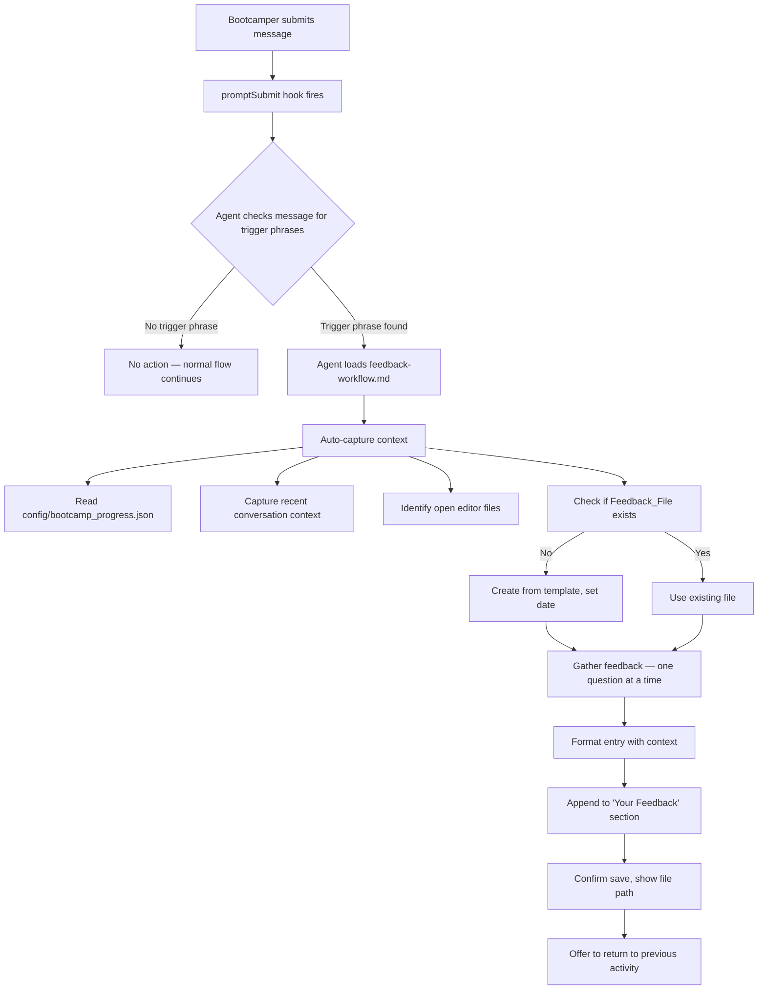

# Design Document: Bootcamp Feedback Hook

## Overview

This feature replaces the probabilistic feedback capture mechanism (agent voluntarily loading `feedback-workflow.md`) with a deterministic, event-driven hook. The deliverables are three file changes — a new hook JSON file and updates to two existing steering files — that together guarantee the agent follows the feedback workflow whenever a bootcamper uses a trigger phrase.

The core flow is:

1. Bootcamper submits a message containing a trigger phrase (e.g., "bootcamp feedback")
2. The `promptSubmit` hook fires deterministically on every message submission
3. The hook prompt instructs the agent to check for trigger phrases in the message
4. If a trigger phrase is found, the agent loads `feedback-workflow.md` and follows it
5. The agent auto-captures context (current module, recent activity, open files)
6. Feedback is appended to the local feedback file
7. The bootcamper is returned to their previous activity

No executable code is produced. All deliverables are JSON and Markdown configuration files.

## Architecture



The architecture is a linear pipeline with no branching services or external dependencies. The hook is the entry point; the steering file is the instruction set; the feedback file is the data store.

### Interaction Between Hook and Steering File

The hook and steering file have distinct responsibilities:

- **Hook** (`capture-feedback.kiro.hook`): Fires deterministically on `promptSubmit`. Its prompt tells the agent *when* to act (trigger phrase detected) and *what to load* (`feedback-workflow.md`).
- **Steering file** (`feedback-workflow.md`): Tells the agent *how* to act — the step-by-step workflow for context capture, question gathering, formatting, and file persistence.

This separation means the hook is small and stable (it just detects and dispatches), while the steering file can evolve independently with richer instructions.

## Components and Interfaces

### Component 1: Feedback Hook File

**Path:** `senzing-bootcamp/hooks/capture-feedback.kiro.hook`

A JSON file following the existing Kiro hook schema used by all other hooks in `senzing-bootcamp/hooks/`.

**Structure:**

```json
{
  "name": "Capture Bootcamp Feedback",
  "version": "1.0.0",
  "description": "Fires on every message submission. Instructs the agent to check for feedback trigger phrases and, if found, initiate the feedback workflow with automatic context capture.",
  "when": {
    "type": "promptSubmit"
  },
  "then": {
    "type": "askAgent",
    "prompt": "<prompt text — see below>"
  }
}
```

**Hook Prompt Content:**

The `prompt` field instructs the agent to:

1. Check if the bootcamper's message contains any of these trigger phrases (case-insensitive): "bootcamp feedback", "power feedback", "submit feedback", "provide feedback", "I have feedback", "report an issue"
2. If NO trigger phrase is found → do nothing, let the normal conversation continue
3. If a trigger phrase IS found → load the `feedback-workflow.md` steering file and follow it, starting with automatic context capture

The prompt text:

```text
Check if the bootcamper's message contains any of these feedback trigger phrases (case-insensitive): "bootcamp feedback", "power feedback", "submit feedback", "provide feedback", "I have feedback", "report an issue". If NONE of these phrases appear in the message, do nothing — let the conversation continue normally. If a trigger phrase IS found, load the steering file feedback-workflow.md and follow its complete workflow. Start by automatically capturing context: read config/bootcamp_progress.json for the current module, note what the bootcamper was doing in the recent conversation, and identify which files are open in the editor. Do NOT ask the bootcamper to re-explain their context.
```

### Component 2: Updated Feedback Workflow Steering File

**Path:** `senzing-bootcamp/steering/feedback-workflow.md`

The existing file is updated with:

1. A new **Step 0: Automatic Context Capture** inserted before the current Step 1, with explicit instructions to read `config/bootcamp_progress.json`, capture recent conversation context, and note open files
2. An updated feedback entry template that adds a **"Context When Reported"** section containing: current module, activity summary, and open files
3. A new **Step 6: Return to Previous Activity** that instructs the agent to offer resuming the bootcamper's prior work
4. Updated step numbering to accommodate the new steps

**Updated Feedback Entry Format:**

```markdown
## Improvement: [Brief title based on user's description]

**Date**: YYYY-MM-DD
**Module**: [Module number or "General"]
**Priority**: [High/Medium/Low]
**Category**: [Documentation/Workflow/Tools/UX/Bug/Performance/Security]

### What Happened
[User's description of the issue]

### Why It's a Problem
[User's explanation of impact]

### Suggested Fix
[User's suggestion, or "None provided"]

### Workaround Used
[If user found a workaround, or "None"]

### Context When Reported
- **Current Module**: [From bootcamp_progress.json, or "Unknown"]
- **What You Were Doing**: [Summary from recent conversation context]
- **Open Files**: [List of files open in editor]
```

### Component 3: Updated Agent Instructions

**Path:** `senzing-bootcamp/steering/agent-instructions.md`

Two changes:

1. **Communication section**: Replace the line `On "power feedback" / "bootcamp feedback": load feedback-workflow.md` with a reference to the hook: `On feedback trigger phrases: the capture-feedback hook handles this automatically — do not manually load feedback-workflow.md`
2. **Hooks section**: Add `capture-feedback.kiro.hook` to the list of hooks that should be installed alongside other bootcamp hooks

## Data Models

### Hook File Schema

The hook file follows the established Kiro hook JSON schema already used by all 14 existing hooks in `senzing-bootcamp/hooks/`:

| Field         | Type   | Value                            |
| ------------- | ------ | -------------------------------- |
| `name`        | string | `"Capture Bootcamp Feedback"`    |
| `version`     | string | `"1.0.0"`                        |
| `description` | string | Human-readable description       |
| `when.type`   | string | `"promptSubmit"`                 |
| `then.type`   | string | `"askAgent"`                     |
| `then.prompt` | string | Agent instruction text           |

### Feedback Entry Data Model

Each feedback entry appended to the Feedback_File contains:

| Field                     | Source                                              | Required |
| ------------------------- | --------------------------------------------------- | -------- |
| Title                     | Bootcamper input                                    | Yes      |
| Date                      | System date (YYYY-MM-DD)                            | Yes      |
| Module                    | `config/bootcamp_progress.json` or bootcamper input | Yes      |
| Priority                  | Bootcamper input (High/Medium/Low)                  | Yes      |
| Category                  | Bootcamper input                                    | Yes      |
| What Happened             | Bootcamper input                                    | Yes      |
| Why It's a Problem        | Bootcamper input                                    | Yes      |
| Suggested Fix             | Bootcamper input or "None provided"                 | Yes      |
| Workaround Used           | Bootcamper input or "None"                          | Yes      |
| Context: Current Module   | Auto-captured from `bootcamp_progress.json`         | Yes      |
| Context: Activity Summary | Auto-captured from conversation                     | Yes      |
| Context: Open Files       | Auto-captured from editor state                     | Yes      |

### Bootcamp Progress File (Read-Only)

`config/bootcamp_progress.json` — read by the agent during context capture. The agent does not write to this file during feedback collection. If the file does not exist, the agent records "Unknown" for the current module.

## Correctness Properties

*A property is a characteristic or behavior that should hold true across all valid executions of a system — essentially, a formal statement about what the system should do. Properties serve as the bridge between human-readable specifications and machine-verifiable correctness guarantees.*

### Property 1: Trigger phrase coverage

*For any* trigger phrase in the canonical list ("bootcamp feedback", "power feedback", "submit feedback", "provide feedback", "I have feedback", "report an issue"), the hook prompt text SHALL contain that phrase so the agent can match it case-insensitively.

Validates: Requirements 1.3, 1.4

### Property 2: Feedback append-without-loss

*For any* existing feedback file containing N feedback entries, and any new valid feedback entry, appending the new entry SHALL result in a file containing all N original entries plus the new entry — no existing entry is removed or modified.

Validates: Requirements 4.1, 4.2

### Property 3: Entry format completeness

*For any* feedback entry data (title, date, module, priority, category, description, impact, suggestion, workaround, context), the formatted Markdown entry SHALL contain all required sections: title heading, Date, Module, Priority, Category, "What Happened", "Why It's a Problem", "Suggested Fix", "Workaround Used", and "Context When Reported" (with Current Module, What You Were Doing, and Open Files sub-fields).

Validates: Requirements 4.3, 6.3

## Error Handling

### Missing `config/bootcamp_progress.json`

The steering file instructs the agent to handle this gracefully: if the file does not exist or cannot be read, record the current module as "Unknown" and proceed with feedback collection. The agent must not fail or abort the workflow.

### Missing `docs/feedback/` Directory

If the directory does not exist when the agent needs to create the Feedback_File, the agent creates the directory first, then creates the file from the template. This is an explicit instruction in the steering file.

### Missing Feedback_File

If `docs/feedback/SENZING_BOOTCAMP_POWER_FEEDBACK.md` does not exist, the agent creates it from the template (`senzing-bootcamp/docs/feedback/SENZING_BOOTCAMP_POWER_FEEDBACK_TEMPLATE.md`) and replaces the date placeholder with the current date. If the file already exists, the agent uses it as-is.

### Malformed or Empty Bootcamper Input

If the bootcamper provides empty or incomplete answers during the feedback questionnaire, the agent uses sensible defaults ("None provided", "None") for optional fields. The title, date, and module fields are always populated (module from auto-capture or "Unknown").

### Hook Fires on Non-Feedback Messages

The hook fires on every `promptSubmit` event. The prompt explicitly instructs the agent to check for trigger phrases first and do nothing if none are found. This is by design — the hook is lightweight and the phrase check is the first instruction.

## Testing Strategy

This feature produces configuration files (JSON and Markdown), not executable code with pure functions. The testing approach reflects this.

### Unit Tests (Example-Based)

Unit tests verify the structural correctness of each deliverable:

1. **Hook file validity**: Parse `capture-feedback.kiro.hook` as JSON, verify required fields (`name`, `version`, `when.type`, `then.type`, `then.prompt`) are present and correctly typed
2. **Hook event type**: Verify `when.type === "promptSubmit"`
3. **Hook prompt contains no-action instruction**: Verify the prompt tells the agent to do nothing when no trigger phrase is found
4. **Steering file context capture instructions**: Verify `feedback-workflow.md` contains instructions to read `bootcamp_progress.json`, capture conversation context, and identify open files
5. **Steering file fallback for missing progress**: Verify `feedback-workflow.md` contains a fallback instruction for when `bootcamp_progress.json` doesn't exist
6. **Steering file entry template**: Verify the feedback entry template includes the "Context When Reported" section with sub-fields
7. **Steering file return-to-activity step**: Verify `feedback-workflow.md` contains a step to offer returning to the previous activity
8. **Agent instructions hook reference**: Verify `agent-instructions.md` references `capture-feedback` hook and does not instruct manual loading of `feedback-workflow.md` for trigger phrases
9. **Agent instructions hooks section**: Verify `agent-instructions.md` hooks section mentions `capture-feedback.kiro.hook`

### Property-Based Tests

Property-based tests verify the three correctness properties using a PBT library (e.g., fast-check for TypeScript/JavaScript, or Hypothesis for Python). Each test runs a minimum of 100 iterations.

1. **Property 1 — Trigger phrase coverage**: Generate trigger phrases from the canonical list, verify each appears in the hook prompt text
   - Tag: `Feature: bootcamp-feedback, Property 1: Trigger phrase coverage`

2. **Property 2 — Feedback append-without-loss**: Generate random sequences of feedback entries (varying title, module, priority, category, descriptions), simulate appending each to a Markdown string representing the feedback file, verify all entries are present after each append
   - Tag: `Feature: bootcamp-feedback, Property 2: Feedback append-without-loss`

3. **Property 3 — Entry format completeness**: Generate random feedback entry data (random strings for title, description, etc.; random module numbers 0-12; random priorities; random categories), format using the entry template, verify all required sections are present in the output
   - Tag: `Feature: bootcamp-feedback, Property 3: Entry format completeness`

### Integration Tests

Not applicable — this feature has no external service dependencies. All deliverables are local files read by the Kiro agent runtime.

### What Is NOT Tested

- Agent behavior at runtime (whether the agent actually follows the steering file instructions) — this is the Kiro runtime's responsibility
- UI/UX quality of the feedback questionnaire interaction
- Whether the bootcamper finds the workflow intuitive
