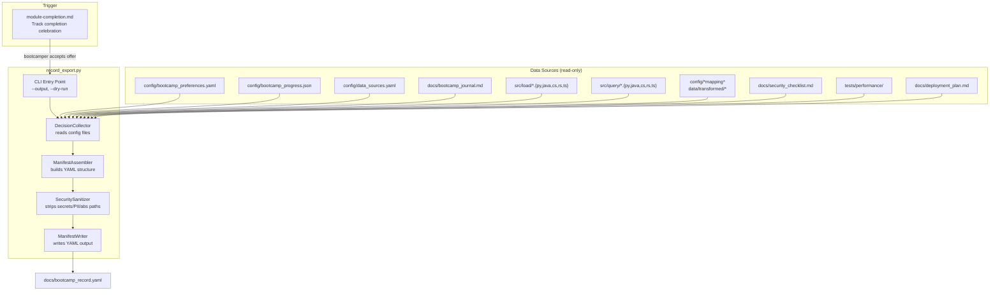

# Design Document: Bootcamp Record Export

## Overview

This feature adds a decision manifest generator that produces a structured YAML file (`docs/bootcamp_record.yaml`) capturing every meaningful choice a bootcamper made during their journey. The manifest is generated at track completion (graduation flow) and is designed to be both human-readable and machine-parseable for theoretical replay on a different machine or project.

The design prioritizes:
- **Zero re-entry**: All data is pulled from existing config files and project artifacts — the bootcamper is never asked to re-enter information
- **Security by default**: No PII, secrets, credentials, or absolute paths in the output — with active pattern scanning
- **Replay-ready structure**: Versioned schema, machine-readable values, consistent key naming for future automation
- **Graceful degradation**: Missing source files produce warnings and partial output, never failures

## Architecture



The architecture separates concerns into:
1. **DecisionCollector** — reads all source files and extracts structured decision data
2. **ManifestAssembler** — combines collected data into the manifest schema
3. **SecuritySanitizer** — scans output for secrets, PII, absolute paths and redacts
4. **ManifestWriter** — serializes to YAML and writes to disk

## Components and Interfaces

### DecisionCollector

```python
class DecisionCollector:
    """Reads project files and extracts bootcamp decisions."""

    def __init__(self, project_root: str,
                 file_reader: Callable[[str], str | None] = None):
        """Initialize with project root. file_reader injectable for testing."""

    def collect_all(self) -> CollectedDecisions:
        """Collect all decisions from available sources."""

    def collect_preferences(self) -> PreferencesData | None:
        """Read config/bootcamp_preferences.yaml."""

    def collect_progress(self) -> ProgressData | None:
        """Read config/bootcamp_progress.json."""

    def collect_data_sources(self) -> list[DataSourceEntry]:
        """Read config/data_sources.yaml or scan data/raw/ as fallback."""

    def collect_mappings(self) -> list[MappingDecision]:
        """Read mapping specs from config/ and data/transformed/."""

    def collect_loading_config(self) -> LoadingConfig | None:
        """Infer loading strategy from src/load/ scripts."""

    def collect_query_programs(self) -> list[QueryProgram]:
        """Scan src/query/ for scripts and extract metadata."""

    def collect_business_problem(self) -> BusinessProblem | None:
        """Extract Module 1 data from bootcamp journal."""

    def collect_performance_tuning(self) -> PerformanceTuning | None:
        """Extract Module 8 decisions if completed."""

    def collect_security_hardening(self) -> SecurityHardening | None:
        """Extract Module 9 decisions if completed."""

    def collect_monitoring_config(self) -> MonitoringConfig | None:
        """Extract Module 10 decisions if completed."""

    def collect_deployment(self) -> DeploymentDecision | None:
        """Extract Module 11 decisions if completed."""
```

### ManifestAssembler

```python
class ManifestAssembler:
    """Builds the Decision Manifest from collected data."""

    SCHEMA_VERSION = "1.0"
    POWER_VERSION = "1.0.0"  # read from POWER.md or hardcoded

    def assemble(self, decisions: CollectedDecisions) -> DecisionManifest:
        """Assemble full manifest from collected decisions."""

    def _build_metadata(self) -> dict:
        """Generate metadata section with timestamp, versions."""

    def _build_track_progress(self, progress: ProgressData | None,
                               prefs: PreferencesData | None) -> dict:
        """Build track_progress section."""

    def _build_optional_sections(self, decisions: CollectedDecisions) -> dict:
        """Build sections for modules 8-11 only if completed."""
```

### SecuritySanitizer

```python
class SecuritySanitizer:
    """Scans manifest content for sensitive data and redacts."""

    # Patterns that indicate secrets/credentials
    SECRET_PATTERNS: list[re.Pattern] = [
        # API keys (generic)
        re.compile(r'[A-Za-z0-9]{32,}'),
        # Connection strings
        re.compile(r'(postgres|mysql|sqlite|mongodb)://[^\s]+'),
        # AWS-style keys
        re.compile(r'AKIA[0-9A-Z]{16}'),
        # Generic token patterns
        re.compile(r'(token|key|secret|password|credential)\s*[:=]\s*\S+', re.I),
    ]

    def sanitize(self, manifest: DecisionManifest) -> tuple[DecisionManifest, list[str]]:
        """Sanitize manifest. Returns (cleaned_manifest, warnings)."""

    def check_value(self, value: str) -> bool:
        """Returns True if value appears to contain sensitive content."""

    def relativize_path(self, path: str, project_root: str) -> str:
        """Convert absolute path to relative. Return as-is if already relative."""

    def scan_for_pii(self, text: str) -> bool:
        """Heuristic check for email addresses, phone numbers, SSNs."""
```

### ManifestWriter

```python
class ManifestWriter:
    """Writes the Decision Manifest to YAML."""

    def write(self, manifest: DecisionManifest, output_path: str,
              overwrite: bool = False) -> str:
        """Write manifest to file. Returns the output path.
        Raises FileExistsError if file exists and overwrite=False."""

    def to_yaml(self, manifest: DecisionManifest) -> str:
        """Serialize manifest to YAML string with comments."""
```

### CLI Entry Point

```python
def main(argv: list[str] | None = None) -> int:
    """Parse args, collect decisions, assemble manifest, write output.
    Returns 0 on success, 1 on error."""
```

Arguments:
- `--output PATH` — output file path (default: `docs/bootcamp_record.yaml`)
- `--dry-run` — print manifest to stdout without writing to disk
- `--overwrite` — overwrite existing file without prompting

## Data Models

### CollectedDecisions

```python
@dataclasses.dataclass
class CollectedDecisions:
    preferences: PreferencesData | None
    progress: ProgressData | None
    business_problem: BusinessProblem | None
    data_sources: list[DataSourceEntry]
    mappings: list[MappingDecision]
    loading_config: LoadingConfig | None
    query_programs: list[QueryProgram]
    performance_tuning: PerformanceTuning | None
    security_hardening: SecurityHardening | None
    monitoring_config: MonitoringConfig | None
    deployment: DeploymentDecision | None
    warnings: list[str]  # collection warnings (missing files, etc.)
```

### PreferencesData

```python
@dataclasses.dataclass
class PreferencesData:
    language: str | None          # python, java, csharp, rust, typescript
    track: str | None             # core_bootcamp, advanced_topics
    database_type: str | None     # sqlite, postgresql
    deployment_target: str | None
    cloud_provider: str | None
    verbosity: str | None
```

### ProgressData

```python
@dataclasses.dataclass
class ProgressData:
    modules_completed: list[int]
    current_module: int | None
    step_history: dict[str, dict] | None  # module -> step data
```

### DataSourceEntry

```python
@dataclasses.dataclass
class DataSourceEntry:
    name: str
    file_path: str        # relative path
    file_format: str      # csv, json, jsonl, xml, etc.
    record_count: int | None
    module: int           # always 4
```

### MappingDecision

```python
@dataclasses.dataclass
class MappingDecision:
    source_name: str
    entity_type: str                    # PERSON, ORGANIZATION, etc.
    field_mappings: dict[str, str]      # source_field -> senzing_feature
    transformations: list[str]          # descriptions of transforms applied
    module: int                         # always 5
```

### LoadingConfig

```python
@dataclasses.dataclass
class LoadingConfig:
    strategy: str                # single_source, multi_source
    redo_processing: bool | None
    redo_reason: str | None
    script_files: list[str]     # relative paths to loading scripts
    module: int                 # always 6
```

### QueryProgram

```python
@dataclasses.dataclass
class QueryProgram:
    filename: str               # relative path
    query_type: str             # search_by_attributes, get_entity, find_relationships, etc.
    description: str            # from code comments or journal
    module: int                 # always 7
```

### BusinessProblem

```python
@dataclasses.dataclass
class BusinessProblem:
    problem_statement: str | None
    identified_sources: list[str]
    success_criteria: list[str]
    module: int                 # always 1
```

### PerformanceTuning

```python
@dataclasses.dataclass
class PerformanceTuning:
    tuning_decisions: list[str]
    baseline_metrics: dict[str, str] | None
    optimizations_applied: list[str]
    module: int                 # always 8
```

### SecurityHardening

```python
@dataclasses.dataclass
class SecurityHardening:
    choices: list[str]          # security decisions made
    checklist_items_completed: int | None
    checklist_items_total: int | None
    module: int                 # always 9
```

### MonitoringConfig

```python
@dataclasses.dataclass
class MonitoringConfig:
    tools_chosen: list[str]
    alert_configurations: list[str]
    module: int                 # always 10
```

### DeploymentDecision

```python
@dataclasses.dataclass
class DeploymentDecision:
    target: str                 # aws, azure, gcp, kubernetes, on-premises
    infrastructure_choices: list[str]
    deployment_method: str | None
    module: int                 # always 11
```

### DecisionManifest

```python
@dataclasses.dataclass
class DecisionManifest:
    metadata: dict              # schema_version, generated_at, power_version
    track_progress: dict        # track, modules_completed, modules_skipped, elapsed_time
    business_problem: dict | None
    sdk_setup: dict | None
    data_sources: list[dict]
    mapping_decisions: list[dict]
    loading_config: dict | None
    query_programs: list[dict]
    performance_tuning: dict | None
    security_hardening: dict | None
    monitoring_config: dict | None
    deployment: dict | None
    replay_notes: list[str]     # decisions requiring manual input on replay
```

## Decision Manifest Schema (Output Format)

```yaml
# Bootcamp Decision Record
# Generated by Senzing Bootcamp Power
# This file captures all decisions made during the bootcamp.
# It can be shared with colleagues or used to replay the same setup.

metadata:
  schema_version: "1.0"
  generated_at: "2026-05-15T14:30:00Z"
  power_version: "1.0.0"

track_progress:
  track_name: "Core Bootcamp"
  track_id: core_bootcamp
  total_modules_in_track: 7
  modules_completed:
    - module: 1
      name: "Business Problem"
      completed_at: "2026-05-10T09:00:00Z"
    - module: 2
      name: "SDK Setup"
      completed_at: "2026-05-10T11:00:00Z"
  modules_skipped: []
  elapsed_time: "5d 6h"  # or null if timestamps unavailable

business_problem:
  module: 1
  problem_statement: "Deduplicate customer records across CRM and billing systems"
  identified_sources:
    - "CRM export"
    - "Billing database dump"
  success_criteria:
    - "Identify duplicate customers across systems"
    - "Achieve >90% precision on known duplicates"

sdk_setup:
  module: 2
  language: python
  database_type: sqlite
  deployment_target: null
  cloud_provider: null

data_sources:
  - name: "crm_customers"
    file_path: "data/raw/crm_customers.csv"
    file_format: csv
    record_count: 10000
    module: 4
  - name: "billing_records"
    file_path: "data/raw/billing_records.jsonl"
    file_format: jsonl
    record_count: 8500
    module: 4

mapping_decisions:
  - source_name: "crm_customers"
    entity_type: "PERSON"
    field_mappings:
      full_name: "NAME_FULL"
      email: "EMAIL_ADDRESS"
      phone: "PHONE_NUMBER"
      address: "ADDR_FULL"
    transformations:
      - "Split full_name into first/last using space delimiter"
    module: 5

loading_config:
  strategy: multi_source
  redo_processing: false
  redo_reason: null
  script_files:
    - "src/load/load_crm.py"
    - "src/load/load_billing.py"
  module: 6

query_programs:
  - filename: "src/query/search_by_name.py"
    query_type: search_by_attributes
    description: "Search for entities by name and address"
    module: 7
  - filename: "src/query/get_entity_details.py"
    query_type: get_entity
    description: "Retrieve full entity record with related records"
    module: 7

# Optional sections (only present if module was completed)
# performance_tuning: ...
# security_hardening: ...
# monitoring_config: ...
# deployment: ...

replay_notes:
  - "Business problem statement was extracted from journal prose — verify accuracy before replay"
  - "Mapping transformations described in natural language — may need manual translation to code"
```

## Integration Points

### Module Completion Flow Integration

The export offer is inserted into `steering/module-completion.md` in the "Path Completion Celebration" section. It appears:
- **After** the existing `export_results.py` offer (shareable HTML/ZIP report)
- **Before** the analytics offer

Trigger text:
> "Would you like a record of your bootcamp journey? You can share it with your team or use it to replay the same setup on another project."

When accepted, the agent runs:
```
python3 scripts/record_export.py
```

### Graduation Flow Integration

The graduation flow in `steering/graduation.md` already reads preferences and progress during pre-checks. The record export is independent of graduation — it captures decisions, while graduation produces a production-ready codebase. Both can be offered; they serve different purposes.

### Relationship to export-results

| Feature | export-results | record-export |
|---------|---------------|---------------|
| Purpose | Share results/artifacts with stakeholders | Capture decisions for replay/sharing |
| Output | HTML report or ZIP archive | YAML decision manifest |
| Content | Metrics, journal, visualizations, code | Choices, configurations, mappings |
| Audience | Stakeholders, colleagues | Developers, future self |
| Script | `scripts/export_results.py` | `scripts/record_export.py` |

## Error Handling

| Scenario | Behavior |
|---|---|
| `config/bootcamp_preferences.yaml` missing | Warn, infer language from `src/` file extensions, use defaults |
| `config/bootcamp_progress.json` missing | Warn, generate manifest with available data, note in replay_notes |
| `config/data_sources.yaml` missing | Warn, scan `data/raw/` for files as fallback |
| Mapping specs not found | Warn, check `data/transformed/` for scripts, note in replay_notes |
| `src/load/` empty | Warn, omit loading_config section |
| `src/query/` empty | Warn, note no query programs in manifest |
| `docs/bootcamp_journal.md` missing | Warn, omit business_problem extraction from journal |
| Output file already exists | Ask bootcamper (via agent) whether to overwrite or abort |
| Secret pattern detected in value | Redact value, add warning to replay_notes |
| Absolute path detected | Convert to relative path automatically |
| YAML serialization error | Print error, exit with code 1 |
| File permission error on write | Print error, suggest alternative path, exit with code 1 |

## Correctness Properties

### Property 1: Sanitizer removes all absolute paths

*For any* string containing an absolute path (starting with `/` or a Windows drive letter like `C:\`), `SecuritySanitizer.relativize_path()` SHALL return a string that does not start with `/` or a drive letter. The relative portion of the path SHALL be preserved.

**Validates: Requirement 11.3**

### Property 2: Sanitizer detects secret patterns

*For any* string matching one of the defined secret patterns (API key format, connection string, AWS key, token assignment), `SecuritySanitizer.check_value()` SHALL return `True`. For strings that are normal configuration values (language names, database types, file paths, module names), `check_value()` SHALL return `False`.

**Validates: Requirement 11.4**

### Property 3: Manifest schema version is always present and valid

*For any* `CollectedDecisions` input (including all-None fields), `ManifestAssembler.assemble()` SHALL produce a `DecisionManifest` whose `metadata` dict contains `schema_version` equal to `"1.0"`, a `generated_at` string in ISO 8601 format, and a non-empty `power_version` string.

**Validates: Requirement 2.3, 13.1**

### Property 4: Optional sections appear only for completed modules

*For any* `ProgressData` with a `modules_completed` list, the assembled manifest SHALL include `performance_tuning` if and only if 8 is in `modules_completed`, `security_hardening` if and only if 9 is in `modules_completed`, `monitoring_config` if and only if 10 is in `modules_completed`, and `deployment` if and only if 11 is in `modules_completed`.

**Validates: Requirement 9.1, 9.2, 9.3, 9.4, 9.5**

### Property 5: Data source entries contain no actual record data

*For any* `DataSourceEntry` produced by `DecisionCollector.collect_data_sources()`, the entry SHALL contain only `name`, `file_path`, `file_format`, `record_count`, and `module` fields. No field SHALL contain data that could be a record value (content from the actual data file).

**Validates: Requirement 5.4, 11.1**

### Property 6: All paths in manifest are relative

*For any* `DecisionManifest` produced after sanitization, every string value that represents a file path (in `data_sources[].file_path`, `loading_config.script_files[]`, `query_programs[].filename`) SHALL NOT start with `/` or a Windows drive letter.

**Validates: Requirement 11.3**

### Property 7: Manifest YAML is valid and parseable

*For any* `DecisionManifest`, `ManifestWriter.to_yaml()` SHALL produce a string that, when parsed by a YAML parser, produces a dict with the same logical content as the original manifest. (Round-trip property: assemble → serialize → parse → compare.)

**Validates: Requirement 2.4, 13.2**

### Property 8: Track progress reflects actual completion state

*For any* `ProgressData` with `modules_completed` as a subset of 1–12 and a track from `{core_bootcamp, advanced_topics}`, the assembled `track_progress` section SHALL list exactly the modules in `modules_completed`, the `total_modules_in_track` SHALL match the track definition (7 for core, 11 for advanced), and no module outside `modules_completed` SHALL appear in the completed list.

**Validates: Requirement 10.1, 10.2**

### Property 9: Consistent snake_case key naming

*For any* `DecisionManifest` serialized to YAML, every key at every nesting level SHALL match the pattern `[a-z][a-z0-9_]*` (snake_case). No camelCase, PascalCase, or kebab-case keys SHALL appear.

**Validates: Requirement 13.2**

### Property 10: Missing source files produce warnings, not failures

*For any* subset of source files that are missing (preferences, progress, data_sources, journal), `DecisionCollector.collect_all()` SHALL return a `CollectedDecisions` with the corresponding fields set to `None` or empty lists, and the `warnings` list SHALL contain one entry per missing file. The collector SHALL NOT raise an exception.

**Validates: Requirement 12.7**

## Testing Strategy

### Property-Based Tests (Hypothesis)

**Library**: Hypothesis (Python)
**Minimum iterations**: 100 per property
**Test file**: `senzing-bootcamp/tests/test_record_export.py`

Key generators:
- `PreferencesData` generator: random language from `{python, java, csharp, rust, typescript, None}`, random track, random database_type
- `ProgressData` generator: random subset of 1–12 for modules_completed, optional current_module
- `DataSourceEntry` generator: random name (alphanumeric), random relative path, random format from `{csv, json, jsonl, xml, tsv}`, optional record_count
- `MappingDecision` generator: random source name, entity type from `{PERSON, ORGANIZATION, VEHICLE}`, random field_mappings dict
- `CollectedDecisions` generator: composite with optional None fields
- Path generator: mix of absolute (`/home/user/project/file.py`, `C:\Users\file.py`) and relative (`src/load/main.py`) paths
- Secret generator: strings matching API key, connection string, and token patterns mixed with normal config values

### Unit Tests (pytest)

- CLI argument parsing: `--output`, `--dry-run`, `--overwrite`
- YAML output is valid and contains expected top-level keys
- Overwrite protection: raises when file exists and `--overwrite` not set
- Journal parsing extracts Module 1 content correctly
- Query program type inference from filename patterns
- Loading strategy inference from script count and content
- Integration test: full collect → assemble → sanitize → write pipeline with fixture data
- Edge case: completely empty project (no config files, no source) produces minimal manifest with warnings

### Test File Location

`senzing-bootcamp/tests/test_record_export.py` — follows existing convention alongside other power test files.
