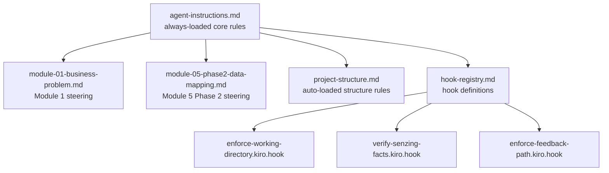

# Design Document

## Overview

This design addresses five UX and workflow improvements to the Senzing Bootcamp Kiro Power, all identified from real bootcamp usage feedback. The changes are confined to steering files (Markdown with YAML frontmatter) and hook definitions (JSON). No Python code, no new modules, no new hooks — only edits to existing files.

The five improvements form a cohesive set:

1. **Module 1 Step 7** — change gap-filling from "ask all unknowns in one grouped question" to "ask one unknown per turn"
2. **Hook silence rule** — strengthen the agent-instructions.md rule so hook evaluations that pass produce zero output
3. **Module 5 mapper path** — change `scripts/{source_name}_mapper.md` references to `docs/{source_name}_mapper.md`
4. **Docs directory enforcement** — add explicit rules to project-structure.md and agent-instructions.md that Markdown files belong in `docs/`, not `scripts/`
5. **Hook registry consistency** — ensure hook-registry.md prompt text matches the actual `.kiro.hook` JSON files for all three preToolUse hooks

### Design Rationale

All five changes are text edits to existing steering and hook files. The changes are small, localized, and independent of each other — they can be applied in any order. No new files are created. No existing file structure changes. The risk is low because the changes only affect agent behavioral instructions, not executable code.

## Architecture

There is no new architecture. The existing power architecture remains unchanged:

All changes are edits to existing nodes in this graph. No new nodes or edges are introduced.

## Components and Interfaces

### Component 1: Module 1 Step 7 (module-01-business-problem.md)

**Current behavior:** Step 7 instructs the agent to "Ask these as a single grouped question, not one at a time."

**New behavior:** Step 7 will instruct the agent to ask about one undetermined item per turn, then queue remaining items for subsequent turns after the bootcamper responds.

**Change scope:** Only the text block after "After confirmation, ask ONLY about items marked 'not yet determined'" in Step 7. The confirmation summary presentation stays the same. The list of possible follow-up questions stays the same. Only the instruction about how to deliver them changes.

**Specific edit:**

- Remove: "Ask these as a single grouped question, not one at a time. Do NOT ask about items the user already covered."
- Replace with: "Ask about only one undetermined item per turn. After the bootcamper responds, ask about the next undetermined item in a subsequent turn. Do NOT ask about items the user already covered. Queue remaining questions for subsequent turns."

### Component 2: Hook Silence Rule (agent-instructions.md)

**Current behavior:** The Hooks section in agent-instructions.md contains a paragraph about producing no output when hook checks pass. The rule exists but could be stronger.

**New behavior:** The existing paragraph will be strengthened with more explicit language and formatted as a clearly visible rule. The key additions:

- Explicit "zero tokens" language
- Prohibition on narrating evaluation reasoning
- Emphasis that only corrective action produces output

**Current text:**
> When a hook check passes with no action needed, produce no output. Do not acknowledge the check, do not explain your reasoning, do not print any status message. Do not narrate your evaluation. Do not explain why no action is needed. Your response must be completely empty — zero tokens. Only produce output when the hook requires corrective action.

**New text (strengthened):**
> **🔇 Hook silence rule:** When a hook check passes with no action needed, produce absolutely no output — zero tokens, zero characters. Do not acknowledge the check, do not explain your reasoning, do not print any status message, do not narrate your evaluation, do not explain why no action is needed. Your response must be completely empty. Only produce output when the hook identifies a problem requiring corrective action. This applies to ALL hooks — preToolUse, agentStop, fileEdited, fileCreated, and any other hook type.

### Component 3: Module 5 Mapper Path (module-05-phase2-data-mapping.md)

**Current behavior:** Steps 1, 11, and 12 reference `scripts/{source_name}_mapper.md` as the target path for per-source mapping specification documents.

**New behavior:** All three references change to `docs/{source_name}_mapper.md`.

**Specific edits (3 locations):**

1. Step 1 agent instruction box: `scripts/{source_name}_mapper.md` → `docs/{source_name}_mapper.md`
2. Step 11 "Per-source mapping specification" paragraph and code block: `scripts/{source_name}_mapper.md` → `docs/{source_name}_mapper.md`
3. Step 12 "Per-source completion checkpoint" paragraph: `scripts/{source_name}_mapper.md` → `docs/{source_name}_mapper.md`

### Component 4: Markdown Directory Enforcement (project-structure.md + agent-instructions.md)

**project-structure.md changes:**

- Add a new rule: "All Markdown documentation files (`*.md`) belong in `docs/` or a subdirectory of `docs/`. The `scripts/` directory is reserved for executable code only — no `.md` files."

**agent-instructions.md changes:**

- Add a row to the File Placement table: `Markdown docs` → `docs/`
- Add a redirect rule: "If about to write a `.md` file to `scripts/`, redirect to `docs/` instead."

### Component 5: Hook Registry Consistency (hook-registry.md)

**Current state:** The hook-registry.md prompt text for enforce-working-directory, verify-senzing-facts, and enforce-feedback-path already matches the actual `.kiro.hook` JSON files. The zero-output-on-pass instructions are already present in both locations.

**Verification needed:** After applying changes from Components 2–4, verify that the hook-registry.md entries still match the `.kiro.hook` files. If any hook JSON files were updated (they shouldn't need to be based on current analysis), the registry must be updated to match.

**Current analysis:** The three hook JSON files already contain explicit zero-output-on-pass instructions:

- `enforce-working-directory.kiro.hook`: "If all paths are within the working directory, produce no output at all — do not acknowledge, do not explain, do not print anything. STOP immediately and return nothing. Your response must be completely empty — zero tokens, zero characters."
- `verify-senzing-facts.kiro.hook`: "If the file contains no Senzing-specific content, or all Senzing content was already verified via MCP tools, produce no output at all — do not acknowledge, do not explain, do not print anything. STOP immediately and return nothing. Your response must be completely empty — zero tokens, zero characters."
- `enforce-feedback-path.kiro.hook`: "If you are NOT in the feedback workflow, produce no output at all — do not acknowledge, do not explain, do not print anything. STOP immediately and return nothing. Your response must be completely empty — zero tokens, zero characters."

The hook-registry.md entries contain identical prompt text. **No changes needed** to hook JSON files or their registry entries — they already satisfy Requirements 2.4, 2.5, and 2.6.

The registry consistency check (Requirement 5) reduces to verifying this match holds after all other changes are applied.

## Data Models

No data models are involved. All changes are to Markdown text and JSON configuration. No databases, no APIs, no data structures.

## Error Handling

No runtime error handling is needed. These are static text edits to steering files. The only "error" scenario is an inconsistency between hook-registry.md and the `.kiro.hook` files, which is addressed by the verification step in Component 5.

If the CI pipeline includes `sync_hook_registry.py --verify`, that script will catch any registry/hook mismatches after the changes are applied.

## Testing Strategy

### Why Property-Based Testing Does Not Apply

This feature involves only Markdown and JSON text edits to steering files and hook definitions. There are no pure functions, no parsers, no serializers, no algorithms, and no data transformations. The changes are declarative configuration edits — there is no input/output behavior to test with property-based testing. PBT is not appropriate here.

### Verification Approach

**1. Manual text verification (all requirements):**

- Read each modified file and confirm the expected text changes are present
- Confirm removed text is gone and replacement text is in place

**2. CI pipeline validation:**

- `sync_hook_registry.py --verify` — confirms hook-registry.md matches `.kiro.hook` JSON files (Requirement 5)
- `validate_commonmark.py` — confirms all Markdown files remain CommonMark-compliant after edits
- `validate_power.py` — confirms overall power structure integrity

**3. Grep-based consistency checks:**

- Search for any remaining `scripts/{source_name}_mapper.md` or `scripts/.*_mapper\.md` references across all steering files — should return zero results after fixes
- Search for the removed "single grouped question" phrase in module-01 — should return zero results
- Verify the hook silence rule paragraph exists in agent-instructions.md
- Verify the `docs/` Markdown rule exists in project-structure.md

**4. Hook registry consistency (Requirement 5):**

- For each of the three preToolUse hooks (enforce-working-directory, verify-senzing-facts, enforce-feedback-path), compare the `prompt` field in the `.kiro.hook` JSON file with the corresponding prompt text in hook-registry.md
- They must be identical

### Test Execution

The existing CI pipeline (`.github/workflows/validate-power.yml`) covers the automated checks. No new test files are needed. The verification is:

1. Run `python senzing-bootcamp/scripts/sync_hook_registry.py --verify` to confirm hook registry consistency
2. Run `python senzing-bootcamp/scripts/validate_commonmark.py` to confirm Markdown compliance
3. Run `python senzing-bootcamp/scripts/validate_power.py` to confirm power structure
4. Grep for stale `scripts/` mapper references across steering files
