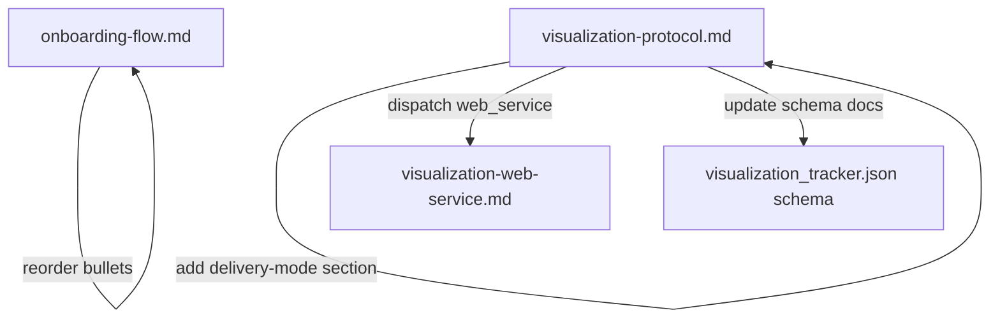

# Design Document: Bootcamp UX Feedback

## Overview

This feature implements two UX improvements to the Senzing Bootcamp Power based on live session feedback:

1. **Onboarding overview reorder** — Rearrange the Step 4 bullet points in `onboarding-flow.md` so that "Tracks" immediately follows the modules table, with licensing and test-data notes moved to secondary positions.
2. **Delivery-mode choice** — Add a delivery-mode question (static HTML vs. web service) to `visualization-protocol.md` after type selection, with corresponding tracker schema updates.

Both changes are surgical edits to existing steering files (Markdown with YAML frontmatter) and a JSON schema definition. No new scripts or runtime code is introduced.

## Architecture

The changes touch three files in the `senzing-bootcamp/steering/` directory and one JSON schema definition:



**Design Decision:** The delivery-mode question is added as a new section in `visualization-protocol.md` rather than in individual module files. This maintains the single-source-of-truth pattern already established by the protocol file.

**Design Decision:** The delivery-mode question is skipped for Module 5 (which only offers Static_HTML_Report) to avoid presenting a meaningless choice. This is implemented as a conditional rule in the protocol, not as a per-checkpoint override.

## Components and Interfaces

### Component 1: Onboarding Flow Step 4 (Content Reorder)

**File:** `senzing-bootcamp/steering/onboarding-flow.md`

**Change:** Reorder the overview bullet points in Step 4 (after the modules table, before the comprehension check) from the current order:

```text
- Test data available anytime. Three sample datasets: Las Vegas, London, Moscow
- Built-in 500-record eval license; bring your own for more
- Tracks let you skip to what matters
```

To the new order:

```text
- Tracks let you skip to what matters
- Built-in 500-record eval license; bring your own for more
- Test data available anytime. Three sample datasets: Las Vegas, London, Moscow
```

The guided-discovery preamble (first bullet) and glossary reference (last bullet) remain in their current positions.

### Component 2: Delivery-Mode Question (Visualization Protocol)

**File:** `senzing-bootcamp/steering/visualization-protocol.md`

**Change:** Add a new "Delivery-Mode Selection" section between the existing "Offer Template" / type-selection flow and the "Dispatch Rules" section.

**New section content:**

```markdown
## Delivery-Mode Selection

After the bootcamper selects a visualization type, present the delivery-mode choice. This determines how the visualization is served.

**Skip condition:** If the checkpoint's available types list contains ONLY `Static_HTML_Report` (e.g., Module 5), skip this question entirely and default to static delivery. Do not present the choice.

For all other checkpoints, present:

> Now that you've chosen **{chosen_type}**, how would you like it delivered?
>
> 1. **Static HTML** — Self-contained file with data baked in. Open directly in your browser, no server needed. Does not update with new data.
> 2. **Web service + HTML** — A small localhost HTTP service with live SDK queries. Data refreshes on reload. Requires a running local process.

🛑 STOP — End your response here. Wait for the bootcamper's input before proceeding.
```

### Component 3: Updated Dispatch Rules

**File:** `senzing-bootcamp/steering/visualization-protocol.md`

**Change:** Update the existing Dispatch Rules section to incorporate delivery mode:

- **Web service delivery mode:** Load `visualization-web-service.md` for scaffolding and lifecycle management, regardless of visualization type.
- **Static HTML delivery mode:** Generate inline following the module's existing generation logic. Do NOT load `visualization-web-service.md`.
- **Interactive_D3_Graph or Web_Service_Dashboard type + static delivery:** Load `visualization-guide.md` for generation logic only (no server scaffolding).

### Component 4: Tracker Schema Update

**File:** `senzing-bootcamp/steering/visualization-protocol.md` (Tracker Instructions section)

**Changes:**
1. Add `delivery_mode` field to the schema (valid values: `"static"`, `"web_service"`, or `null`)
2. Update version from `"1.0.0"` to `"1.1.0"`
3. Add `delivery_mode` to the field documentation table
4. Update state transition documentation to include delivery_mode behavior

**Updated schema:**

```json
{
  "version": "1.1.0",
  "offers": [
    {
      "module": 7,
      "checkpoint_id": "m7_exploratory_queries",
      "timestamp": "2025-07-15T10:30:00Z",
      "status": "offered",
      "chosen_type": null,
      "delivery_mode": null,
      "output_path": null
    }
  ]
}
```

## Data Models

### Visualization Tracker Entry (v1.1.0)

| Field | Type | Description |
|-------|------|-------------|
| module | integer | Module number (3, 5, 7, or 8) |
| checkpoint_id | string | Checkpoint identifier from the map |
| timestamp | string (ISO 8601) | When the event occurred |
| status | string | One of: `offered`, `accepted`, `declined`, `generated` |
| chosen_type | string or null | Set on accept (Static_HTML_Report, Interactive_D3_Graph, or Web_Service_Dashboard) |
| delivery_mode | string or null | Set on accept: `"static"` or `"web_service"`. Null when status is `offered`. Defaults to `"static"` for Module 5 (static-only checkpoint). |
| output_path | string or null | Set on generate (relative path to the output file) |

### State Transitions (updated)

- `offered` → `accepted`: Set `chosen_type` AND `delivery_mode`
- `offered` → `declined`: Leave `delivery_mode` as `null`
- `accepted` → `generated`: Set `output_path`


### Delivery-Mode Skip Logic

```python
# Pseudocode for delivery-mode skip condition
checkpoint_types = checkpoint_map[current_checkpoint]["types"]
if checkpoint_types == ["Static_HTML_Report"]:
    delivery_mode = "static"  # auto-set, no question asked
else:
    delivery_mode = ask_bootcamper()  # present the choice
```

## Correctness Properties

*A property is a characteristic or behavior that should hold true across all valid executions of a system — essentially, a formal statement about what the system should do. Properties serve as the bridge between human-readable specifications and machine-verifiable correctness guarantees.*

### Property 1: Tracker delivery_mode field validity

*For any* visualization tracker entry, the `delivery_mode` field SHALL be one of: `"static"`, `"web_service"`, or `null` — no other values are valid.

**Validates: Requirements 3.1**

### Property 2: New offer entries have null delivery_mode

*For any* newly created tracker entry with status `"offered"`, the `delivery_mode` field SHALL be `null`.

**Validates: Requirements 3.2**

### Property 3: Acceptance sets delivery_mode

*For any* tracker state transition from `"offered"` to `"accepted"`, the resulting entry SHALL have `delivery_mode` set to the bootcamper's selected value (`"static"` or `"web_service"`) — it SHALL NOT remain `null`.

**Validates: Requirements 2.5, 3.3**

### Property 4: Static-only checkpoints default to static

*For any* checkpoint whose available types list contains only `Static_HTML_Report`, the `delivery_mode` SHALL be set to `"static"` without presenting the delivery-mode question to the bootcamper.

**Validates: Requirements 2.6**

## Error Handling

| Scenario | Handling |
|----------|----------|
| Tracker file missing | Create with `{"version": "1.1.0", "offers": []}` (existing behavior, updated version) |
| Tracker has v1.0.0 schema (no delivery_mode) | Treat missing `delivery_mode` as `null` for backward compatibility. On next write, include the field. |
| Bootcamper provides invalid delivery-mode response | Re-prompt with the two options. Do not proceed until a valid selection is made. |
| Checkpoint not in map | Existing behavior — skip visualization offer entirely |

## Testing Strategy

**Testing framework:** pytest + Hypothesis (per project convention in `senzing-bootcamp/tests/`)

### Unit Tests (example-based)

1. **Onboarding bullet order** — Parse `onboarding-flow.md` Step 4 and verify the three reordered bullets appear in the correct sequence (Tracks → License → Test data).
2. **Content preservation** — Verify all original bullet points are present with unaltered text.
3. **Preamble/glossary position** — Verify guided-discovery preamble is first and glossary reference is last.
4. **Delivery-mode section presence** — Verify `visualization-protocol.md` contains the delivery-mode question with both options.
5. **Section ordering** — Verify delivery-mode section appears after type selection and before dispatch rules.
6. **Dispatch rules for web service** — Verify dispatch references `visualization-web-service.md` for web service mode.
7. **Dispatch rules for static** — Verify static path does NOT load `visualization-web-service.md`.
8. **STOP directive** — Verify delivery-mode section ends with a STOP directive.
9. **Schema version** — Verify tracker schema version is `"1.1.0"`.

### Property-Based Tests (Hypothesis)

Each property test runs a minimum of 100 iterations.

- **Property 1 test:** Generate random tracker entries with arbitrary field values. Validate that the schema validation function only accepts entries where `delivery_mode` is `"static"`, `"web_service"`, or `null`.
  - Tag: `Feature: bootcamp-ux-feedback, Property 1: Tracker delivery_mode field validity`

- **Property 2 test:** Generate random offer creation events (random module, checkpoint_id, timestamp). Verify all created entries have `delivery_mode = null`.
  - Tag: `Feature: bootcamp-ux-feedback, Property 2: New offer entries have null delivery_mode`

- **Property 3 test:** Generate random acceptance events (random chosen_type, random delivery_mode from valid set). Verify the resulting entry has a non-null `delivery_mode` matching the input.
  - Tag: `Feature: bootcamp-ux-feedback, Property 3: Acceptance sets delivery_mode`

- **Property 4 test:** Generate random checkpoint configurations. For any config where `types == ["Static_HTML_Report"]`, verify the resolved delivery_mode is `"static"`.
  - Tag: `Feature: bootcamp-ux-feedback, Property 4: Static-only checkpoints default to static`

### Test File Location

`senzing-bootcamp/tests/test_bootcamp_ux_feedback_properties.py` — property-based tests
`senzing-bootcamp/tests/test_bootcamp_ux_feedback_unit.py` — unit/example-based tests
