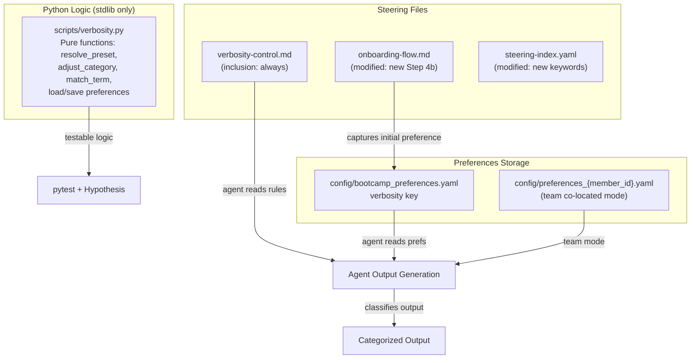

# Design Document: Bootcamp Verbosity Control

## Overview

This feature adds a verbosity control system to the senzing-bootcamp power that lets bootcampers choose how much output they see across five categorized output types. The system provides three named presets (concise, standard, detailed) that map to per-category levels 1–3, with the ability to fine-tune individual categories via natural language. Preferences are captured during onboarding and persisted to the bootcamper's YAML preferences file.

The implementation is primarily a **steering file feature** — the core deliverable is a new always-loaded steering file (`senzing-bootcamp/steering/verbosity-control.md`) that instructs the agent how to classify output, apply verbosity rules, and respond to adjustment requests. Two existing files are modified: the onboarding flow gains a verbosity question step, and the steering index registers the new file.

### Design Rationale

The bootcamp currently delivers output at a single fixed depth. Experienced developers find it verbose; beginners sometimes want more context. Rather than building runtime code to filter output, the verbosity system works through **agent instructions** — the steering file tells the agent what to include or omit at each level. This approach:

- Requires no new Python scripts or runtime dependencies
- Leverages the existing steering file infrastructure (YAML frontmatter, `inclusion: always`, steering index)
- Integrates naturally with the existing preferences persistence pattern (`config/bootcamp_preferences.yaml`)
- Can be tested by validating the steering file structure, the YAML preferences schema, and the preset/category logic via a small Python helper module

A thin Python module (`senzing-bootcamp/scripts/verbosity.py`) provides the pure-logic layer: preset resolution, natural language term matching, level clamping, and preferences serialization. This keeps the testable logic separate from the steering file content while giving the agent a reliable reference implementation.

## Architecture



### Component Responsibilities

1. **verbosity-control.md** — The authoritative reference for all verbosity rules. The agent loads this on every session (via `inclusion: always`) and consults it when generating output, handling adjustment requests, and framing code execution.

2. **onboarding-flow.md** — Modified to include a verbosity question during the introduction step (Step 4). Presents the three presets, captures the bootcamper's choice, and persists it.

3. **steering-index.yaml** — Updated to register the new file with keywords (`verbosity`, `verbose`, `output level`) and token count metadata.

4. **scripts/verbosity.py** — A pure-function Python module (stdlib only) that encapsulates the testable logic:
   - Preset definitions and resolution
   - Natural language term-to-category matching
   - Category level adjustment with clamping (1–3)
   - Preferences YAML serialization/deserialization (minimal custom parser, no PyYAML)
   - Validation of verbosity preference structures

5. **Preferences files** — The `verbosity` key in the bootcamper's preferences YAML stores the active preset name and per-category levels.

## Components and Interfaces

### 1. Verbosity Steering File (`verbosity-control.md`)

**Format:** Markdown with YAML frontmatter (`inclusion: always`)

**Sections:**
- Output Category Taxonomy — definitions, examples, and content rules per level
- Preset Definitions — the three named presets with their per-category mappings
- Natural Language Mapping — term-to-category lookup table
- "What and Why" Framing Pattern — examples at each level for the `explanations` category
- Code Execution Framing Pattern — before/what/after structure at each level
- Step Recap Pattern — recap structure at each level
- Adjustment Instructions — how the agent handles preset changes and NL adjustments

### 2. Verbosity Logic Module (`scripts/verbosity.py`)

```python
# --- Data Structures ---

@dataclass
class VerbosityPreferences:
    preset: str                    # "concise" | "standard" | "detailed" | "custom"
    categories: dict[str, int]     # category_name -> level (1-3)

# --- Constants ---

CATEGORIES: list[str]  # The 5 defined category names
PRESETS: dict[str, dict[str, int]]  # preset_name -> {category: level}
NL_TERM_MAP: dict[str, str]  # natural_language_term -> category_name

# --- Pure Functions ---

def resolve_preset(preset_name: str) -> VerbosityPreferences:
    """Return VerbosityPreferences for a named preset.
    
    Args:
        preset_name: One of "concise", "standard", "detailed".
    
    Returns:
        VerbosityPreferences with the preset's per-category levels.
    
    Raises:
        ValueError: If preset_name is not a recognized preset.
    """

def adjust_category(prefs: VerbosityPreferences, category: str, delta: int) -> VerbosityPreferences:
    """Return new preferences with one category's level adjusted by delta.
    
    Clamps the result to [1, 3]. Sets preset to "custom" if the result
    no longer matches any named preset.
    
    Args:
        prefs: Current preferences.
        category: The category to adjust.
        delta: +1 for "more", -1 for "less".
    
    Returns:
        New VerbosityPreferences (original is not mutated).
    
    Raises:
        ValueError: If category is not a recognized category name.
    """

def match_nl_term(term: str) -> str | None:
    """Match a natural language term to an Output_Category name.
    
    Args:
        term: The user's term (e.g., "code detail", "recaps", "internals").
    
    Returns:
        The matching category name, or None if no match.
    """

def detect_preset(categories: dict[str, int]) -> str:
    """Return the preset name matching the given category levels, or "custom".
    
    Args:
        categories: A dict of category_name -> level.
    
    Returns:
        "concise", "standard", "detailed", or "custom".
    """

def validate_preferences(data: dict) -> list[str]:
    """Validate a verbosity preferences dict structure.
    
    Args:
        data: The dict to validate (typically parsed from YAML).
    
    Returns:
        A list of error strings. Empty list means valid.
    """

def serialize_preferences(prefs: VerbosityPreferences) -> str:
    """Serialize VerbosityPreferences to YAML string fragment.
    
    Returns:
        A YAML string suitable for writing under the `verbosity` key.
    """

def deserialize_preferences(yaml_text: str) -> VerbosityPreferences:
    """Parse a YAML verbosity block into VerbosityPreferences.
    
    Args:
        yaml_text: The YAML text under the `verbosity` key.
    
    Returns:
        VerbosityPreferences instance.
    
    Raises:
        ValueError: If the YAML structure is invalid.
    """
```

### 3. Onboarding Flow Modification

A new sub-step is inserted into Step 4 (Bootcamp Introduction) of `onboarding-flow.md`, after the overview presentation and before track selection. The step:

1. Presents the three presets with one-line descriptions
2. Marks `standard` as recommended
3. Persists the selection to the preferences file
4. Informs the bootcamper how to change it later
5. Defaults to `standard` if the bootcamper skips

This is **not** a mandatory gate (⛔) — the bootcamper can skip it and get the default. This keeps the onboarding flow moving while still offering the choice.

### 4. Steering Index Registration

New entries in `steering-index.yaml`:

```yaml
# Under keywords:
verbosity: verbosity-control.md
verbose: verbosity-control.md
output level: verbosity-control.md

# Under file_metadata:
verbosity-control.md:
  token_count: <measured after creation>
  size_category: <small|medium|large based on token count>
```

## Data Models

### Verbosity Preferences (YAML Schema)

Stored under the `verbosity` key in `config/bootcamp_preferences.yaml` (or `config/preferences_{member_id}.yaml` in co-located team mode):

```yaml
verbosity:
  preset: standard          # "concise" | "standard" | "detailed" | "custom"
  categories:
    explanations: 2         # 1-3
    code_walkthroughs: 2    # 1-3
    step_recaps: 2          # 1-3
    technical_details: 2    # 1-3
    code_execution_framing: 2  # 1-3
```

### Preset Definitions

| Preset     | explanations | code_walkthroughs | step_recaps | technical_details | code_execution_framing |
|------------|:---:|:---:|:---:|:---:|:---:|
| `concise`  | 1 | 1 | 2 | 1 | 1 |
| `standard` | 2 | 2 | 2 | 2 | 2 |
| `detailed` | 3 | 3 | 3 | 3 | 3 |

### Natural Language Term Mapping

| Term(s) | Maps to Category |
|---------|-----------------|
| "explanations", "context", "explain", "why" | `explanations` |
| "code detail", "code walkthrough", "code walkthroughs", "line by line" | `code_walkthroughs` |
| "recaps", "summaries", "recap", "summary" | `step_recaps` |
| "technical", "internals", "technical detail", "technical details" | `technical_details` |
| "before and after", "execution framing", "code framing", "framing" | `code_execution_framing` |

### Output Category Content Rules

Each category defines what to include at each level:

**explanations:**
- Level 1: "What" statement only (one sentence describing the action)
- Level 2: "What" + "Why" (action description + purpose/rationale)
- Level 3: "What" + "Why" + workflow connection (how this fits the broader ER pipeline)

**code_walkthroughs:**
- Level 1: No walkthrough — code speaks for itself
- Level 2: Block-level summary (what each logical section does)
- Level 3: Line-by-line or detailed block explanation with SDK method rationale

**step_recaps:**
- Level 1: One-line summary + file paths created/modified
- Level 2: What was accomplished + files with paths + what to understand before proceeding
- Level 3: Level 2 + connection to next step and module goal

**technical_details:**
- Level 1: Omit SDK internals, config specifics, performance notes
- Level 2: Include relevant SDK details and config specifics when they aid understanding
- Level 3: Full SDK internals, configuration deep-dives, performance characteristics

**code_execution_framing:**
- Level 1: "What this code does" summary before execution + one-line "Result" after
- Level 2: "Before" state + "What this code does" + "After" state changes
- Level 3: Level 2 + specific before/after metric values (e.g., "Records: 0 → 500")


## Correctness Properties

*A property is a characteristic or behavior that should hold true across all valid executions of a system — essentially, a formal statement about what the system should do. Properties serve as the bridge between human-readable specifications and machine-verifiable correctness guarantees.*

### Property 1: Preferences Serialization Round-Trip

*For any* valid `VerbosityPreferences` (any preset name in `{"concise", "standard", "detailed", "custom"}` and any combination of category levels in the range 1–3 for all five categories), serializing to YAML and then deserializing back SHALL produce a `VerbosityPreferences` object with identical `preset` and `categories` values.

**Validates: Requirements 2.5, 3.3, 4.2, 5.4, 6.2**

### Property 2: Category Level Adjustment Clamping

*For any* valid `VerbosityPreferences` and *for any* valid category name and *for any* delta in `{+1, -1}`, calling `adjust_category` SHALL produce a new `VerbosityPreferences` where the adjusted category's level equals `clamp(original_level + delta, 1, 3)` and all other category levels remain unchanged.

**Validates: Requirements 5.1, 5.2**

### Property 3: Preset Detection After Adjustment

*For any* named preset (`concise`, `standard`, or `detailed`) and *for any* single-category adjustment that changes a level, if the resulting per-category levels do not match any named preset's definition, then `detect_preset` SHALL return `"custom"`. If the resulting levels happen to match a named preset, `detect_preset` SHALL return that preset's name.

**Validates: Requirements 5.5**

### Property 4: Unrecognized Natural Language Term Rejection

*For any* string that is not a key in the `NL_TERM_MAP` dictionary, `match_nl_term` SHALL return `None`. Conversely, *for any* string that is a key in `NL_TERM_MAP`, `match_nl_term` SHALL return the corresponding category name.

**Validates: Requirements 5.6**

## Error Handling

### Invalid Preset Name

When `resolve_preset` receives a preset name not in `{"concise", "standard", "detailed"}`, it raises `ValueError` with a message listing the valid preset names. The agent handles this by presenting the valid options to the bootcamper.

### Invalid Category Name

When `adjust_category` receives a category name not in the five defined categories, it raises `ValueError` with a message listing the valid category names. The agent handles this by listing the available categories (per requirement 5.6).

### Malformed Preferences YAML

When `deserialize_preferences` encounters YAML that doesn't match the expected schema (missing `preset` field, missing categories, non-integer levels, levels outside 1–3), it raises `ValueError` with a descriptive message. The agent falls back to the `standard` preset (per requirement 6.4) and informs the bootcamper that preferences were reset.

### Missing Verbosity Key

When the preferences file exists but has no `verbosity` key, the system applies the `standard` preset as the default (per requirement 6.4). No error is raised — this is the expected state for first-time bootcampers before onboarding reaches the verbosity question.

### Ambiguous Natural Language Input

When `match_nl_term` returns `None` (no matching category), the agent lists the five categories with brief descriptions and asks the bootcamper to clarify (per requirement 5.6). This is not an error condition — it's a normal conversational flow.

### Level Already at Boundary

When a bootcamper says "more" but the category is already at level 3, or "less" at level 1, `adjust_category` clamps silently. The agent confirms the current level and notes it's already at the maximum/minimum.

## Testing Strategy

### Property-Based Tests (Hypothesis)

Property-based tests validate the four correctness properties using `pytest` + `Hypothesis`. Each test runs a minimum of 100 iterations with generated inputs.

**Test file:** `senzing-bootcamp/tests/test_verbosity_properties.py`

**Library:** Hypothesis (already a test dependency in this project)

**Configuration:** `@settings(max_examples=100)` on each property test

**Properties to implement:**

| Property | Test Class / Function | Tag |
|----------|----------------------|-----|
| 1: Round-trip | `TestProperty1SerializationRoundTrip` | Feature: bootcamp-verbosity-control, Property 1: Preferences Serialization Round-Trip |
| 2: Clamping | `TestProperty2CategoryLevelClamping` | Feature: bootcamp-verbosity-control, Property 2: Category Level Adjustment Clamping |
| 3: Preset detection | `TestProperty3PresetDetectionAfterAdjustment` | Feature: bootcamp-verbosity-control, Property 3: Preset Detection After Adjustment |
| 4: NL rejection | `TestProperty4UnrecognizedTermRejection` | Feature: bootcamp-verbosity-control, Property 4: Unrecognized Natural Language Term Rejection |

**Hypothesis strategies:**

- `st_preset_name()` — `st.sampled_from(["concise", "standard", "detailed"])`
- `st_category_name()` — `st.sampled_from(CATEGORIES)`
- `st_category_level()` — `st.integers(min_value=1, max_value=3)`
- `st_categories()` — `st.fixed_dictionaries({cat: st_category_level() for cat in CATEGORIES})`
- `st_verbosity_preferences()` — builds `VerbosityPreferences` from `st_preset_name` or `st.just("custom")` and `st_categories()`
- `st_delta()` — `st.sampled_from([+1, -1])`
- `st_non_matching_term()` — `st.text(min_size=1, max_size=50).filter(lambda t: t.lower().strip() not in NL_TERM_MAP)`

### Unit Tests (pytest)

**Test file:** `senzing-bootcamp/tests/test_verbosity_unit.py`

Unit tests cover specific examples, edge cases, and structural validation:

- **Preset definitions:** Verify each preset returns the exact expected levels (Requirements 2.2, 2.3, 2.4)
- **Default behavior:** Verify missing verbosity key defaults to standard (Requirements 3.5, 6.4)
- **NL term mapping completeness:** Verify all specified terms from Requirement 5.3 are present in `NL_TERM_MAP`
- **Invalid preset name:** Verify `ValueError` is raised for unknown presets
- **Invalid category name:** Verify `ValueError` is raised for unknown categories
- **Boundary clamping examples:** Verify level 3 + "more" stays at 3, level 1 + "less" stays at 1
- **Validation errors:** Verify `validate_preferences` catches missing fields, out-of-range levels, wrong types

### Steering File Smoke Tests

**Test file:** `senzing-bootcamp/tests/test_verbosity_unit.py` (in a separate test class)

Smoke tests verify the steering file structure meets requirements 1.1, 1.2, 1.4, 10.1–10.10:

- File exists at the expected path
- Frontmatter contains `inclusion: always`
- All five category names are defined with descriptions
- All three presets are defined with level mappings
- NL term mapping table is present
- What/why framing examples exist for all three levels
- Code execution framing examples exist for all three levels
- Step recap examples exist for all three levels
- Steering index contains the three keyword entries

### Test Organization

```
senzing-bootcamp/tests/
├── test_verbosity_properties.py   # Property-based tests (Hypothesis)
└── test_verbosity_unit.py         # Unit tests + steering file smoke tests
```
