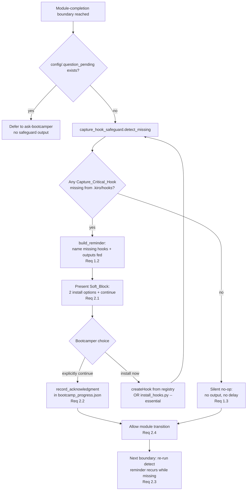

# Design Document

## Overview

The three **capture-critical** hooks — `session-log-events`, `module-recap-append`, and
`ask-bootcamper` — are what make the bootcamp's session deliverables complete: they feed the recap
(`docs/bootcamp_recap.md`), the Q&A transcript (`docs/bootcamp_transcript.md`), and the completion
summary (`docs/completion_summary.md`). They are created on the `createHook`-from-registry path at
session start (`ask-bootcamper` from `hook-registry-critical.md`; `module-recap-append` and
`session-log-events` from `hook-registry-module-any.md`) and can also be installed by
`python3 senzing-bootcamp/scripts/install_hooks.py --essential` (whose essential set is
`critical ∪ CAPTURE_CRITICAL`).

Today the only safety net for their *absence* is the **Capture-Critical Warn-on-Absence Check** in
`session-resume-phase2-setup-recovery.md`, which runs once at session start and is **advisory only —
it never blocks**. A bootcamper whose `createHook` failed (and who never ran `install_hooks.py`) can
therefore proceed module after module with a capture-critical hook missing, silently thinning the
recap, transcript, and completion summary; the gap only becomes visible at track completion when the
deliverables are thin. The `hook-architecture-improvements` spec (Requirement 10) deliberately keeps
the session-start check warn-only.

This feature adds the stronger angle the improvement review calls for: a **Module_Completion_Safeguard**
that runs at every module-completion boundary, detects any absent Capture_Critical_Hook, and presents
a **recurring reminder plus Soft_Block** — a stop-and-confirm the bootcamper can explicitly override,
**not** a Mandatory_Gate (⛔). The absence is thus acknowledged at each boundary rather than silently
carried forward, while progress is never permanently blocked. The safeguard **complements** the
session-start Warn_On_Absence_Check: it reuses the same Capture_Critical_Hooks list and the same two
install options, and it neither removes nor weakens that check.

The detection-and-decision logic lives in a new stdlib-only script,
`senzing-bootcamp/scripts/capture_hook_safeguard.py`, so it is deterministic and unit/property
testable; the recurring reminder and Soft_Block presentation are driven by steering at the
module-completion boundary. The feature adds **no** `preToolUse` write-tool hook and changes **no**
capture-critical hook behavior.

### Design Goals

- Detect an absent Capture_Critical_Hook at each module-completion boundary and name both the hook(s)
  and the output(s) each feeds (recap, transcript, completion summary).
- Present a recurring, overridable Soft_Block: offer the two existing install options and pause; a
  new reminder appears at **every** subsequent boundary while the hook stays missing.
- Stay a Soft_Block, never a Mandatory_Gate: an explicit "continue" always proceeds, so progress is
  never permanently blocked.
- Reuse a single source of truth for the Capture_Critical_Hooks list and install options so the new
  safeguard and the session-start Warn_On_Absence_Check cannot drift apart.
- Be silent and add no delay when all three hooks are present.

### Non-Goals

- Removing, weakening, or duplicating the session-start Warn_On_Absence_Check (Requirement 3.1).
- Adding or modifying any `preToolUse` write-tool hook, or changing the behavior of the
  capture-critical hooks themselves (Requirement 3.3).
- Turning absence into a hard gate — the safeguard is never a Mandatory_Gate (⛔) (Requirement 2.4).
- Installing the hooks automatically without the bootcamper's choice — the safeguard surfaces the
  install options; the bootcamper decides.

## Architecture

The Module_Completion_Safeguard is a new stdlib-only script,
`senzing-bootcamp/scripts/capture_hook_safeguard.py`, invoked by the module-completion steering at
each boundary. It inspects the bootcamper's `.kiro/hooks` directory, computes the set of missing
Capture_Critical_Hooks and the outputs they feed, and returns a decision the steering renders: a
silent no-op when all are present, or a recurring Soft_Block reminder when any are absent. When the
bootcamper explicitly continues, the safeguard records an acknowledgment marker in
`config/bootcamp_progress.json` and the module transition proceeds.



### Where it runs in the completion flow

The module-completion flow fires the recap, journal, and certificate artifacts from the Shared
Boundary-Detection Trigger (`module-completion.md`), then presents `next_step_options`. The safeguard
runs at the same boundary, **before** the module transition question is finalized, so:

- when all three hooks are present it is a **silent no-op** that does not delay the transition
  (Requirement 1.3); and
- when a hook is missing it interposes the Soft_Block reminder before the bootcamper moves on.

It honors the existing boundary rules: if `config/.question_pending` already exists, the safeguard
defers (produces no output) exactly as the artifact steps do, and its own Soft_Block prompt is a
single live `👉` pending question consistent with the Final-Message Invariant in
`conversation-protocol.md`. Invocation is via the completion steering only — never a hook, never a
per-write interception (Requirement 3.3).

### Consistency with the session-start check

The Capture_Critical_Hooks list and the two install options are defined once and reused. The script
imports the canonical set from the installer (`install_hooks.CAPTURE_CRITICAL` =
`{session-log-events, module-recap-append, ask-bootcamper}`) via the standard `sys.path` convention,
so the safeguard and the session-start Warn_On_Absence_Check reference the same three ids and the same
install paths (Requirement 3.2). The session-start check in
`session-resume-phase2-setup-recovery.md` is untouched and remains advisory-only (Requirement 3.1).

## Components and Interfaces

### New script: `scripts/capture_hook_safeguard.py`

Follows the standard script pattern: shebang, `from __future__ import annotations`, stdlib only,
dataclasses, `argparse`, `main(argv=None)`, exit 0 on success / 1 on error (the steering caller
treats it as non-blocking regardless of exit code).

```python
@dataclass(frozen=True)
class MissingHook:
    """A single absent capture-critical hook and the outputs it feeds."""
    hook_id: str            # e.g. "module-recap-append"
    outputs: tuple[str, ...]  # subset of ("recap", "transcript", "completion summary")

@dataclass
class ReminderPlan:
    """The decision the steering renders at a module-completion boundary."""
    missing: list[MissingHook]      # absent capture-critical hooks, sorted by id
    install_options: tuple[str, str]  # the two canonical install options (Req 2.1)
    is_noop: bool                   # True when nothing is missing (Req 1.3)
    is_soft_block: bool             # True when missing is non-empty; never a Mandatory_Gate
```

Key functions:

- `detect_missing_capture_hooks(hooks_dir: Path) -> list[str]` — inspect `hooks_dir` (the
  bootcamper's `.kiro/hooks`) for each `<id>.kiro.hook` file in `CAPTURE_CRITICAL`; return the sorted
  ids whose file is **absent**. A missing/unreadable directory yields all three as missing
  (Requirement 1.1). Presence of unrelated hook files never affects the result.
- `outputs_for_hook(hook_id: str) -> tuple[str, ...]` — map a capture-critical id to the output(s) it
  feeds, from the `HOOK_OUTPUTS` table (see Data Models). Used to name outputs in the reminder
  (Requirement 1.2).
- `build_reminder(missing_ids: list[str]) -> ReminderPlan` — assemble the decision: for an empty
  `missing_ids`, `is_noop=True`, `is_soft_block=False`, empty `missing`; otherwise `is_noop=False`,
  `is_soft_block=True`, one `MissingHook` per id with its outputs, and the two install options
  (Requirements 1.2, 1.3, 2.1, 2.4).
- `should_reprompt(missing_ids: list[str], progress: dict) -> bool` — return `True` whenever
  `missing_ids` is non-empty, **independent** of any prior acknowledgment recorded in `progress`.
  This encodes the recurring behavior: an acknowledgment permits *this* transition but never
  suppresses the reminder at a later boundary (Requirements 2.3, 2.4).
- `record_acknowledgment(progress_path: Path, module: int, missing_ids: list[str]) -> dict` — append
  an acknowledgment entry (module, timestamp, acknowledged ids) to the
  `capture_hook_safeguard.acknowledgments` list in `config/bootcamp_progress.json` and return the
  updated progress mapping. The entry is an audit trail that authorizes the transition; it is **not**
  consulted by `should_reprompt` for suppression (Requirement 2.2).
- `main(argv=None) -> int` — orchestrate detect → build_reminder, print the plan (missing hooks,
  outputs, install options) or nothing when it is a no-op, and, with `--record-ack`, record an
  acknowledgment. Wrapped in a broad handler that warns to stderr and returns without raising on any
  failure so the completion flow is never blocked. CLI: `--hooks-dir` (default `.kiro/hooks`),
  `--progress` (default `config/bootcamp_progress.json`), `--record-ack`, `--module N`.

### Reused interfaces (no modification)

- `install_hooks.CAPTURE_CRITICAL` — the single source of the three capture-critical ids, imported
  via `sys.path` (scripts are not a package). Guarantees the safeguard and the session-start check
  stay in sync (Requirement 3.2). `install_hooks.py` itself is unchanged.
- `install_hooks.py --essential` and the `createHook`-from-registry path — the two install options the
  reminder presents (Requirement 2.1). The safeguard only *names* them; it does not install on the
  bootcamper's behalf.

### Steering integration (no new hook)

The module-completion steering gains a safeguard step at the boundary that runs
`capture_hook_safeguard.py`, renders the `ReminderPlan`, and — on an explicit continue — invokes it
again with `--record-ack` before allowing the transition. No `.kiro.hook` file is added or modified;
in particular, no `preToolUse` write-tool hook is touched (Requirement 3.3), and the session-start
Warn_On_Absence_Check text is preserved verbatim (Requirement 3.1).

## Data Models

### Capture-critical hooks (single source of truth)

```python
# Imported from install_hooks.py — not redefined here.
CAPTURE_CRITICAL = {"session-log-events", "module-recap-append", "ask-bootcamper"}
```

### Hook to output mapping

Grounded in the intro of `requirements.md` ("feed the recap, the Q&A transcript, and the completion
summary") and the installer's hook descriptions:

| Hook id | Outputs fed |
|---|---|
| `module-recap-append` | recap (`docs/bootcamp_recap.md`) |
| `session-log-events` | transcript (`docs/bootcamp_transcript.md`), completion summary (`docs/completion_summary.md`) |
| `ask-bootcamper` | transcript (Q&A capture), completion summary |

Every capture-critical id maps to at least one non-empty output, so a named missing hook always
reports a concrete degraded deliverable (Requirement 1.2).

### Install options (presented on Soft_Block)

```text
1. Re-create the missing hook(s) with createHook from the hook registry
   (ask-bootcamper -> hook-registry-critical.md;
    module-recap-append, session-log-events -> hook-registry-module-any.md)
2. Run: python3 senzing-bootcamp/scripts/install_hooks.py --essential
```

These are the same two options offered by the session-start Warn_On_Absence_Check (Requirement 3.2).

### Acknowledgment marker (progress)

Recorded in `config/bootcamp_progress.json` (a routine power-managed internal file), never in a new
file. Shape:

```json
{
  "capture_hook_safeguard": {
    "acknowledgments": [
      {"module": 4, "acknowledged": ["session-log-events"], "timestamp": "2026-05-14T10:30:00-05:00"}
    ]
  }
}
```

The marker is an append-only audit trail that authorizes the *current* module transition after an
explicit override (Requirement 2.2). It is deliberately **not** used to suppress future reminders:
`should_reprompt` re-checks live hook presence at every boundary, so a hook that stays missing is
re-flagged at each boundary regardless of how many acknowledgments precede it (Requirements 2.3, 2.4).

### Soft_Block semantics

The Soft_Block is a stop-and-confirm with an always-available continue path. It carries no `⛔`
Mandatory_Gate marker and its `is_soft_block` decision never resolves to a hard block: the bootcamper
can always choose to continue, so progress is never permanently blocked (Requirement 2.4).

## Correctness Properties

*A property is a characteristic or behavior that should hold true across all valid executions of a
system — essentially, a formal statement about what the system should do. Properties serve as the
bridge between human-readable specifications and machine-verifiable correctness guarantees.*

These properties apply because the safeguard's detection-and-decision logic
(`detect_missing_capture_hooks`, `build_reminder`, `should_reprompt`, `record_acknowledgment`) is
pure and holds universally over a large input space of hook-directory states, missing sets, and
acknowledgment histories. Each property below is universally quantified and implemented as a single
Hypothesis property test whose example count comes from the active Hypothesis profile (`fast`=5
locally, `thorough`=100 in CI). The structural consistency criteria (Requirements 3.1, 3.2, 3.3) are
not universal properties and are covered by example/architecture tests in the Testing Strategy.

### Property 1: Detection names exactly the missing capture-critical hooks and the outputs they feed

*For any* `.kiro/hooks` directory containing an arbitrary subset of the three Capture_Critical_Hooks
plus arbitrary unrelated `*.kiro.hook` files, `detect_missing_capture_hooks` returns exactly the
capture-critical ids whose file is absent, and `build_reminder` reports each such id together with a
non-empty output list drawn from {recap, transcript, completion summary} — unrelated hook files never
affect the result.

**Validates: Requirements 1.1, 1.2**

### Property 2: All hooks present is a silent no-op

*For any* `.kiro/hooks` directory that contains all three Capture_Critical_Hooks (plus any number of
unrelated hook files), `detect_missing_capture_hooks` returns the empty list and `build_reminder`
yields a plan with `is_noop` true, `is_soft_block` false, and no missing entries — so the safeguard
produces no output and does not delay the module transition.

**Validates: Requirements 1.3**

### Property 3: A missing hook always yields an overridable Soft_Block with both install options

*For any* non-empty set of missing Capture_Critical_Hooks, `build_reminder` yields a plan with
`is_soft_block` true (never a Mandatory_Gate), carrying exactly the two canonical install options
(re-create via `createHook` from the registry, or `install_hooks.py --essential`).

**Validates: Requirements 2.1, 2.4**

### Property 4: An explicit override records an acknowledgment and permits the transition

*For any* existing `config/bootcamp_progress.json` mapping and *any* non-empty missing set,
`record_acknowledgment` appends exactly one acknowledgment entry (module, acknowledged ids,
timestamp) to `capture_hook_safeguard.acknowledgments`, preserves all pre-existing progress keys
byte-for-byte in value, and returns a state in which the module transition is permitted to proceed.

**Validates: Requirements 2.2**

### Property 5: The reminder recurs at every boundary while a hook stays missing and is never suppressed

*For any* non-empty missing set and *any* prior acknowledgment history in progress (including
repeated acknowledgments of the same ids across many boundaries), `should_reprompt` returns true —
the reminder re-presents at each boundary and an acknowledgment never suppresses a future reminder,
so the Soft_Block is recurring and progress is never permanently blocked.

**Validates: Requirements 2.3, 2.4**

## Error Handling

The safeguard is **non-blocking by contract** — a module transition never stalls on it
(Requirement 2.4 in spirit; the completion flow's non-blocking rule in
`module-completion-error-handling.md`).

| Failure mode | Handling |
|---|---|
| `.kiro/hooks` directory missing or unreadable | Treat every Capture_Critical_Hook as absent; the reminder lists all three. Detection never raises. |
| Unrelated / malformed hook files present | Ignored — detection keys only on the three `<id>.kiro.hook` filenames, never on file contents. |
| `config/bootcamp_progress.json` missing or unreadable | `record_acknowledgment` starts from an empty mapping, writes a well-formed file; the reminder still presents. A read error warns to stderr and the transition is allowed. |
| Progress write (acknowledgment) failure | Warn to stderr and return; the override still allows the transition — a lost audit entry never blocks progress. |
| `config/.question_pending` exists at boundary | Safeguard defers (no output), consistent with the artifact steps' defer-when-pending rule. |
| Any unexpected exception in `main` | Caught by a top-level guard that warns to stderr and returns, so the completion flow continues. |

`main` returns 0 on a clean run or clean no-op and 1 only on an internally handled error path; the
steering treats the step as non-blocking regardless of exit code.

## Testing Strategy

Property-based testing applies to the pure detection-and-decision logic. Structural and
consistency guarantees (Requirements 3.1, 3.2, 3.3) and the meta test-coverage criteria
(Requirements 4.1, 4.2) are covered by example, architecture, and placement tests.

**Test placement** (per `structure.md`):

- Script-behavior tests (properties + unit) for `capture_hook_safeguard.py` live in
  `senzing-bootcamp/tests/` (e.g. `test_capture_hook_safeguard.py`).
- Tests that validate **real hook files** on disk (the architecture guardrail for Requirement 3.3)
  live in repo-root `tests/` (e.g. `test_capture_hook_safeguard_architecture.py`).

**Conventions** (per `python-conventions.md`): pytest + Hypothesis, class-based organization, scripts
imported via `sys.path` manipulation, strategies prefixed `st_`, and example counts drawn from the
active Hypothesis profile — no hand-set `@settings(max_examples=...)` restating the baseline. Fixtures
are synthetic only (no real PII, credentials, or connection strings — power-distribution safety rule).

### Property-based tests (Hypothesis)

One property test per correctness property above, each tagged:

`# Feature: capture-hook-completion-safeguard, Property {number}: {property_text}`

Custom strategies:

- `st_hooks_dir_state()` — a chosen subset of the three Capture_Critical_Hooks marked present, plus a
  random set of unrelated `*.kiro.hook` filenames, materialized as empty files in a temp
  `.kiro/hooks` directory (Properties 1, 2).
- `st_missing_set()` — a non-empty subset of the three capture-critical ids (Properties 3, 5).
- `st_progress_mapping()` — arbitrary well-formed progress dicts, optionally pre-seeded with a list
  of prior `capture_hook_safeguard.acknowledgments` entries (Properties 4, 5).

Properties 1–5 map one-to-one to these tests, covering detection/naming (1.1, 1.2), the all-present
no-op (1.3), the overridable Soft_Block with install options (2.1, 2.4), acknowledgment recording
(2.2), and recurring-never-suppressed (2.3, 2.4).

### Unit / example tests

- **Detection of each individual missing hook** — three focused examples, each with exactly one of
  the capture-critical hooks absent, asserting that hook and its outputs are named (Requirement 4.1).
- **All-present silent no-op** — a concrete directory with all three present asserts `is_noop` and no
  output (Requirement 4.1).
- **Recurring re-prompt across multiple boundaries** — simulate three successive boundaries with a
  hook still missing and prior acknowledgments recorded; assert the reminder fires each time
  (Requirement 4.1).
- **Explicit-override continue path** — record an acknowledgment and assert the entry lands in
  progress and the transition proceeds (Requirement 4.1).
- **Consistency (Requirement 3.2)** — assert the safeguard's capture-critical set equals
  `install_hooks.CAPTURE_CRITICAL` and its install options match the two canonical options.
- **Warn-on-absence preserved (Requirement 3.1)** — assert
  `session-resume-phase2-setup-recovery.md` still contains the Capture-Critical Warn-on-Absence Check
  and its advisory-only / never-blocks language.

### Architecture guardrail tests (repo-root `tests/`)

- **No write-tool hook touched (Requirement 3.3)** — scan every `*.kiro.hook`; assert no
  `preToolUse` write-tool hook references the safeguard and that the feature adds no new write-tool
  hook. Assert the three capture-critical hook files are unchanged by this feature.

