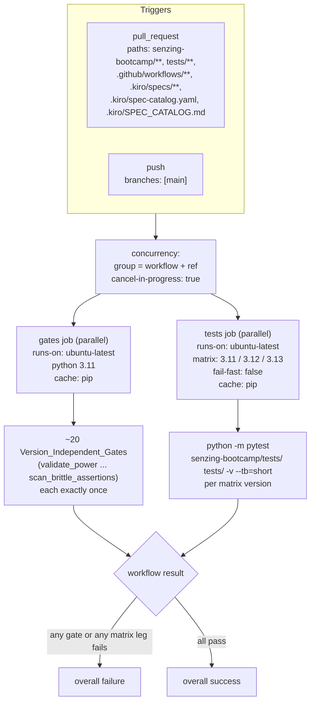

# Design Document

## Overview

This design restructures `.github/workflows/validate-power.yml` from a single `validate`
job that runs ~20 version-independent gates plus pytest across the
`['3.11', '3.12', '3.13']` Python matrix into two jobs:

- A **gates** job that runs every Python-version-independent gate **exactly once** on a
  single Python version (`3.11`).
- A **tests** job that runs `python -m pytest senzing-bootcamp/tests/ tests/ -v --tb=short`
  across the `3.11`/`3.12`/`3.13` matrix with `fail-fast: false`.

The change is purely CI orchestration. No validation script, test, or its arguments are
modified. Every gate and its exact command, arguments, and `::error::` annotations are
preserved; they are only relocated between jobs. The redesign additionally introduces pip
dependency caching, a concurrency group that cancels superseded runs, and pinned CI tool
versions via a `requirements-dev.txt` file so runs are reproducible.

The motivation is signal-per-minute: the ~20 documentation/lint/schema/registry gates
produce identical results on every interpreter, so running them three times triples runner
minutes without adding signal. Only pytest is genuinely version-sensitive and remains on the
matrix.

### Open Design Decisions — Resolutions

| # | Decision | Resolution | Rationale |
|---|----------|------------|-----------|
| 1 | **Gates_Python_Version** | `3.11` | The project's `[tool.ruff] target-version = "py311"` keys static analysis to 3.11, and 3.11 is the floor of the supported matrix. Running gates on the lowest supported version surfaces any 3.11-only syntax/stdlib issue in version-independent code paths. |
| 2 | **Tool-pinning mechanism** | A repo-root `requirements-dev.txt` with pinned `ruff`, `pytest`, and `hypothesis` (`==` pins). Both jobs install via `pip install -r requirements-dev.txt`. | A single pinned file is reproducible, doubles as the `cache-dependency-path` for pip caching, and is the least surprising convention. It is *additive* to the sibling specs: `test-suite-parallelization` may add `pytest-xdist` to the same file and `hypothesis-settings-centralization` may set a Hypothesis profile via env — neither is contradicted because this spec only requires that whatever CI installs is pinned, not *which* tools are installed. See "Sibling-spec reconciliation" below. |
| 3 | **Job topology** | **Independent parallel jobs** (no `needs:`). | Fastest total feedback: a contributor sees gate failures and version-specific test failures at the same time rather than serially. Tradeoff: matrix minutes are still spent when a gate fails. Accepted because the concurrency group (Req 6) already bounds wasted minutes by cancelling superseded runs, and parallel feedback is the higher-value property for this small, fast suite. |
| 4 | **Runner OS** | `ubuntu-latest` for both jobs. | Req 7 (reproducibility) is satisfied by pinning the *tools CI installs*, not the OS image. The runner OS is not a "tool CI installs," so `ubuntu-latest` stays. Pinning to `ubuntu-24.04` is noted as an optional future hardening if OS drift ever changes a gate result, but it is out of scope here. |
| 5 | **`test-suite-parallelization` relationship** | The tests job keeps a plain `python -m pytest senzing-bootcamp/tests/ tests/ -v --tb=short` invocation. | This spec must not pre-empt the sibling spec that owns `pytest-xdist`/`-n` flags and Hypothesis profile env. Keeping the invocation plain avoids contradiction; the sibling spec can later add `-n auto` and `pytest-xdist` to `requirements-dev.txt` without conflicting with this design. |
| 6 | **ruff classification confirmation** | Confirmed: ruff runs **once** in the gates job. | ruff's analysis is keyed to the configured `target-version = "py311"`, not the runtime interpreter, so its pass/fail result is identical on 3.11/3.12/3.13. It is therefore a Version_Independent_Gate and belongs in the gates job. |

### Sibling-spec reconciliation (Tool-pinning)

`requirements-dev.txt` is deliberately scoped to the tools **this** workflow installs today
(ruff, pytest, hypothesis):

- `test-suite-parallelization` owns the decision to add `pytest-xdist` and any `-n`/`--dist`
  flags. This design neither adds nor forbids them; appending `pytest-xdist==<pin>` to the
  same file is a non-conflicting change.
- `hypothesis-settings-centralization` owns Hypothesis profile selection (e.g. a
  `HYPOTHESIS_PROFILE` env var or `settings` registration). This design does not set any
  Hypothesis configuration; it only pins the `hypothesis` package version.

The contract this spec enforces is narrow: *every tool CI installs is installed at a pinned
version.* It does not constrain which additional tools the siblings introduce.

## Architecture



Key architectural points:

- **Two independent jobs** run in parallel under one workflow. GitHub Actions reports the
  workflow as failed if *any* job fails, and a matrix job fails if *any* leg fails. This is
  how both Req 2.5 (any gate fails → workflow fails) and Req 4.4 (any matrix leg fails →
  workflow fails) are satisfied without extra wiring.
- **Triggers and path filters are byte-for-byte preserved** from the current workflow
  (Req 8).
- **Concurrency** is declared once at workflow level so it applies to both jobs (Req 6).
- **Caching** is enabled on the `actions/setup-python` step of each job via `cache: 'pip'`
  with `cache-dependency-path: requirements-dev.txt` (Req 5).

## Components and Interfaces

The single deliverable is the rewritten `.github/workflows/validate-power.yml`, plus a new
`requirements-dev.txt`. The YAML structure is described below in the exact order steps must
appear.

### Workflow-level keys

```yaml
name: Validate Power

on:
  pull_request:
    paths:
      - 'senzing-bootcamp/**'
      - 'tests/**'
      - '.github/workflows/**'
      - '.kiro/specs/**'
      - '.kiro/spec-catalog.yaml'
      - '.kiro/SPEC_CATALOG.md'
  push:
    branches: [main]

concurrency:
  group: ${{ github.workflow }}-${{ github.ref }}
  cancel-in-progress: true
```

The `on:` block is copied verbatim from the current workflow (Req 8.1, 8.2). The
`concurrency` group keys on workflow name + ref; for a pull request `github.ref` resolves to
`refs/pull/<n>/merge`, so pushing new commits to the same PR cancels the prior in-progress
run (Req 6.1, 6.2).

### `gates` job

Runs every Version_Independent_Gate once on Python 3.11. Steps appear in the **same relative
order** as the current single job so reviewers can diff them one-to-one. The two inline
`pip install` calls in the current workflow (ruff, and pytest+hypothesis) are replaced by a
single pinned install; the gates job needs only ruff but installs the full dev file so the
cache key is shared with the tests job.

```yaml
jobs:
  gates:
    runs-on: ubuntu-latest
    steps:
      - uses: actions/checkout@v4
      - uses: actions/setup-python@v5
        with:
          python-version: '3.11'
          cache: 'pip'
          cache-dependency-path: requirements-dev.txt
      - name: Install pinned CI tools
        run: pip install -r requirements-dev.txt
      - name: Validate power integrity
        run: python senzing-bootcamp/scripts/validate_power.py
      - name: Validate steering token counts
        run: python senzing-bootcamp/scripts/measure_steering.py --check
      - name: Validate CommonMark
        run: python senzing-bootcamp/scripts/validate_commonmark.py
      - name: Validate module dependencies
        run: python senzing-bootcamp/scripts/validate_dependencies.py
      - name: Verify composed hook prompts are in sync
        run: |
          python senzing-bootcamp/scripts/compose_hook_prompts.py --verify || {
            echo "::error::Composed hook prompts drifted. Run: python senzing-bootcamp/scripts/compose_hook_prompts.py --write"
            exit 1
          }
      - name: Verify hook registry is in sync
        run: |
          python senzing-bootcamp/scripts/sync_hook_registry.py --verify || {
            echo "::error::Hook registry is out of sync. Run: python senzing-bootcamp/scripts/sync_hook_registry.py --write"
            exit 1
          }
      - name: Lint steering files
        run: python senzing-bootcamp/scripts/lint_steering.py
      - name: Validate module prerequisites
        run: python senzing-bootcamp/scripts/validate_prerequisites.py
      - name: Validate progress schema
        run: python senzing-bootcamp/scripts/validate_progress_ci.py
      - name: Validate preferences schema
        run: python senzing-bootcamp/scripts/validate_preferences_ci.py
      - name: Validate mandatory gates
        run: python senzing-bootcamp/scripts/validate_mandatory_gates.py
      - name: Validate governance rules
        run: python senzing-bootcamp/scripts/validate_governance_rules.py
      - name: Validate YAML schemas
        run: python senzing-bootcamp/scripts/validate_yaml_schemas.py
      - name: Validate external links
        run: python senzing-bootcamp/scripts/validate_links.py --timeout 10
      - name: Lint Python (ruff)
        run: ruff check senzing-bootcamp/scripts/ senzing-bootcamp/tests/ tests/
      - name: Conversational eval harness
        run: python senzing-bootcamp/scripts/eval_conversations.py
      - name: Verify generated POWER.md docs are in sync
        run: |
          python senzing-bootcamp/scripts/generate_power_docs.py --verify || {
            echo "::error::Generated POWER.md docs are out of sync. Run: python senzing-bootcamp/scripts/generate_power_docs.py --write"
            exit 1
          }
      - name: Verify spec catalog index is in sync
        run: |
          python senzing-bootcamp/scripts/generate_spec_catalog.py --check || {
            echo "::error::Spec catalog index is out of sync. Run: python senzing-bootcamp/scripts/generate_spec_catalog.py"
            exit 1
          }
      - name: Validate example-coverage record and disclosure
        run: python senzing-bootcamp/scripts/example_coverage_report.py --check
      - name: Scan for brittle test assertions
        run: python senzing-bootcamp/scripts/scan_brittle_assertions.py --check
```

Note: `ruff check` no longer runs `pip install ruff` inline; ruff is installed from the
pinned file. All four `::error::` annotations and remediation messages (compose_hook_prompts,
sync_hook_registry, generate_power_docs, generate_spec_catalog) are preserved exactly
(Req 2.4).

#### Gate-to-job mapping (all 20 version-independent gates → `gates` job)

| Step name | Command (unchanged) |
|-----------|---------------------|
| Validate power integrity | `python senzing-bootcamp/scripts/validate_power.py` |
| Validate steering token counts | `python senzing-bootcamp/scripts/measure_steering.py --check` |
| Validate CommonMark | `python senzing-bootcamp/scripts/validate_commonmark.py` |
| Validate module dependencies | `python senzing-bootcamp/scripts/validate_dependencies.py` |
| Verify composed hook prompts are in sync | `compose_hook_prompts.py --verify` (+ `::error::`) |
| Verify hook registry is in sync | `sync_hook_registry.py --verify` (+ `::error::`) |
| Lint steering files | `python senzing-bootcamp/scripts/lint_steering.py` |
| Validate module prerequisites | `python senzing-bootcamp/scripts/validate_prerequisites.py` |
| Validate progress schema | `python senzing-bootcamp/scripts/validate_progress_ci.py` |
| Validate preferences schema | `python senzing-bootcamp/scripts/validate_preferences_ci.py` |
| Validate mandatory gates | `python senzing-bootcamp/scripts/validate_mandatory_gates.py` |
| Validate governance rules | `python senzing-bootcamp/scripts/validate_governance_rules.py` |
| Validate YAML schemas | `python senzing-bootcamp/scripts/validate_yaml_schemas.py` |
| Validate external links | `python senzing-bootcamp/scripts/validate_links.py --timeout 10` |
| Lint Python (ruff) | `ruff check senzing-bootcamp/scripts/ senzing-bootcamp/tests/ tests/` |
| Conversational eval harness | `python senzing-bootcamp/scripts/eval_conversations.py` |
| Verify generated POWER.md docs are in sync | `generate_power_docs.py --verify` (+ `::error::`) |
| Verify spec catalog index is in sync | `generate_spec_catalog.py --check` (+ `::error::`) |
| Validate example-coverage record and disclosure | `example_coverage_report.py --check` |
| Scan for brittle test assertions | `scan_brittle_assertions.py --check` |

### `tests` job

The single Version_Sensitive_Gate (pytest) on the matrix.

```yaml
  tests:
    runs-on: ubuntu-latest
    strategy:
      fail-fast: false
      matrix:
        python-version: ['3.11', '3.12', '3.13']
    steps:
      - uses: actions/checkout@v4
      - uses: actions/setup-python@v5
        with:
          python-version: ${{ matrix.python-version }}
          cache: 'pip'
          cache-dependency-path: requirements-dev.txt
      - name: Install pinned CI tools
        run: pip install -r requirements-dev.txt
      - name: Run tests
        run: python -m pytest senzing-bootcamp/tests/ tests/ -v --tb=short
```

The matrix, `fail-fast: false`, and the exact pytest command (including `-v --tb=short`) are
preserved from the current workflow (Req 4.1–4.3). pytest and hypothesis come from
`requirements-dev.txt` instead of the inline `pip install pytest hypothesis`.

## Data Models

The only new data artifact is the dependency-pinning file at repo root:

**`requirements-dev.txt`**

```text
ruff==<pinned-version>
pytest==<pinned-version>
hypothesis==<pinned-version>
```

Format and semantics:

- Standard pip requirements format, one `name==version` per line, exact (`==`) pins so every
  run resolves to identical versions (Req 7.5).
- Covers exactly the tools the workflow installs today: ruff (gates job), pytest +
  hypothesis (tests job) (Req 7.1–7.3).
- Any future CI-installed tool is added here with an exact pin, satisfying Req 7.4 for
  additions.
- Doubles as the `cache-dependency-path` input to `actions/setup-python`, so the pip cache
  key changes only when a pin changes (Req 5.1, 5.2).
- The exact version numbers are an implementation detail chosen at task time (current latest
  stable releases of each tool); they are not fixed by this design beyond being exact pins.

No other data models are involved — the validation scripts and their inputs are unchanged.

## Correctness Properties

*A property is a characteristic or behavior that should hold true across all valid
executions of a system — essentially, a formal statement about what the system should do.
Properties serve as the bridge between human-readable specifications and machine-verifiable
correctness guarantees.*

This feature is a CI-orchestration refactor of a single static YAML file, so most acceptance
criteria are configuration/structure/platform checks rather than randomized property tests
(see Testing Strategy). The properties below are the ones that *are* universally quantified —
each ranges over an enumerable set (all original gates, all jobs, all pinned tools) and is
verifiable by parsing the workflow and asserting a structural invariant. They are the
high-value invariants that protect against silently dropping or weakening a gate.

### Property 1: Gate-set preservation (no gate removed, args unchanged)

*For all* gate commands present in the pre-restructure workflow, the exact command string
(script invocation plus arguments) appears in the restructured workflow across the union of
the `gates` and `tests` jobs. Equivalently, the original gate-command set is a subset of the
restructured gate-command set.

**Validates: Requirements 2.1, 2.2, 2.3, 9.2**

### Property 2: Version-independent gates placed in the gates job

*For all* gates in the Version_Independent_Gate set, the gate's command appears in a step of
the `gates` job (and not gated behind the Python version matrix).

**Validates: Requirements 1.3, 1.5**

### Property 3: Each version-independent gate runs exactly once per workflow run

*For all* gates in the Version_Independent_Gate set, the gate appears exactly once across the
`gates` job steps, and the `gates` job declares no Python version matrix (so it cannot be
multiplied across interpreters).

**Validates: Requirements 3.1, 3.2**

### Property 4: Verify-gate error annotations preserved

*For all* verify gates (compose_hook_prompts, sync_hook_registry, generate_power_docs,
generate_spec_catalog), the gate's `::error::` annotation line and its remediation message
appear verbatim in the restructured workflow.

**Validates: Requirements 2.4**

### Property 5: pytest runs on every matrix version

*For all* Python versions in the Python_Version_Matrix (`3.11`, `3.12`, `3.13`), the `tests`
job runs `python -m pytest senzing-bootcamp/tests/ tests/` on that version, with the matrix
configured `fail-fast: false`.

**Validates: Requirements 1.4, 4.1, 4.2, 4.3**

### Property 6: Every setup-python job enables pip caching

*For all* jobs that use the `actions/setup-python` action, that job's setup-python step sets
`cache: 'pip'`.

**Validates: Requirements 5.1, 5.2**

### Property 7: Every CI-installed tool is exactly pinned

*For all* tool entries CI installs (the lines of `requirements-dev.txt`), the entry specifies
an exact (`==`) version pin; and ruff, pytest, and hypothesis are each present.

**Validates: Requirements 7.1, 7.2, 7.3, 7.4, 7.5**

## Error Handling

This is CI configuration, so "error handling" means how failures surface as an overall
workflow result. There is no application-level error handling to add.

- **A failing gate fails the workflow.** Each gate is a `run` step with no
  `continue-on-error`. A non-zero exit fails the step, which fails the `gates` job, which
  fails the workflow (Req 2.5, 9.3). The four verify gates additionally use the
  `python ... --verify || { echo "::error::..."; exit 1; }` pattern: the explicit `exit 1`
  guarantees the step fails and the `::error::` annotation renders the remediation message in
  the GitHub UI (Req 2.4).
- **A failing matrix leg fails the workflow.** Because the `tests` job sets
  `fail-fast: false`, a failure on one Python version does not cancel the others — all three
  legs run to completion so every version-specific failure is visible (Req 4.3). Any failed
  leg still fails the `tests` job and therefore the workflow (Req 4.4, 9.4).
- **Independent jobs aggregate to the workflow result.** With parallel `gates` and `tests`
  jobs and no `needs:`, GitHub reports the workflow as failed if either job fails. A gate
  failure and a test failure surface simultaneously rather than masking each other.
- **No `continue-on-error` anywhere.** No step or job sets `continue-on-error: true`, so no
  failure is silently swallowed. This is an explicit invariant checked by the validation
  test below.
- **Install failures.** `pip install -r requirements-dev.txt` failing (e.g. a yanked pinned
  version) fails the step and the job, which is the desired fail-loud behavior for a
  reproducibility regression.

## Testing Strategy

Because the deliverable is a static GitHub Actions YAML file plus a pinned requirements file,
the bulk of verification is **structural assertion over the parsed workflow** and a
**before/after gate-set comparison**, not randomized property-based testing. Classic PBT does
not apply here (there is no large input space to a config file). However, the Correctness
Properties above are genuine universally-quantified invariants over enumerable sets and are
implemented as a single parsing-based assertion test, which is preferable to a manual
checklist where feasible.

### Workflow validation test (preferred, automated)

Add `senzing-bootcamp/tests/test_validate_power_workflow.py` (stdlib + PyYAML, matching the
existing `test_validate_yaml_schemas.py` convention; PyYAML is already an accepted dependency
per `tech.md`). The test parses `.github/workflows/validate-power.yml` and
`requirements-dev.txt` and asserts the structural invariants. Tests are organized in a class
and reference the design properties in comments using the tag format
**Feature: ci-workflow-restructure, Property N: <text>**.

The test encodes a canonical, hardcoded list of the 20 version-independent gate commands and
the pytest command (the "pre-restructure gate set") so the comparison is independent of the
old file once it is replaced:

- **Property 1 (gate-set preservation):** assert every canonical gate command string is a
  substring of some step's `run:` across the `gates` + `tests` jobs.
- **Property 2 (placement):** assert each of the 20 version-independent commands appears in a
  `gates`-job step.
- **Property 3 (exactly once / no matrix):** assert each version-independent command appears
  in exactly one `gates` step, and that `jobs.gates` has no `strategy.matrix`.
- **Property 4 (annotations):** assert each of the four `echo "::error::..."` remediation
  strings is present verbatim.
- **Property 5 (matrix):** assert `jobs.tests.strategy.matrix.python-version ==
  ['3.11','3.12','3.13']`, `strategy.fail-fast is False`, and a `tests` step runs
  `python -m pytest senzing-bootcamp/tests/ tests/`.
- **Property 6 (caching):** for every job whose steps `uses: actions/setup-python@...`,
  assert that step's `with.cache == 'pip'`.
- **Property 7 (pinning):** parse `requirements-dev.txt`; assert every non-comment line
  matches `^\S+==\S+$`, and that `ruff`, `pytest`, `hypothesis` are all present.

Because these properties range over finite enumerable sets (gates, jobs, tool lines) rather
than randomized inputs, the test is example-driven assertion rather than a Hypothesis
strategy; a 100-iteration PBT harness is not meaningful here and is intentionally not used.

### Smoke / configuration checks (in the same test or a focused checklist)

- **Parseability (Req 9.1):** the file loads via `yaml.safe_load` without error and has
  top-level `name`, `on`, `jobs`.
- **Two distinct jobs (Req 1.1, 1.2):** `jobs` contains distinct `gates` and `tests` keys.
- **Single gates version (Req 3.1):** `gates` setup-python `python-version == '3.11'`.
- **Gates excludes pytest (Req 1.5):** no `gates` step `run` contains `pytest`.
- **No swallowed failures (Req 2.5, 4.4, 9.3, 9.4):** no step or job sets
  `continue-on-error: true`.
- **Concurrency (Req 6.1, 6.2):** `concurrency.group` references `github.workflow` and
  `github.ref`; `concurrency.cancel-in-progress is True`.
- **Triggers preserved (Req 8.1, 8.2):** `on.pull_request.paths` equals the six documented
  globs exactly; `on.push.branches == ['main']`.
- **ruff target-version unchanged (Req 3.3):** `pyproject.toml [tool.ruff] target-version`
  remains `py311`, confirming the once-only ruff run is correct.

### What requires an actual CI run (out of automated unit scope)

Requirements 9.3 and 9.4 ("a real failing gate / failing test leg produces an overall
failure") are end-to-end platform behaviors. They are verified by reasoning about GitHub
Actions semantics (failed step → failed job → failed workflow; `fail-fast: false` runs all
legs) plus the structural "no `continue-on-error`" assertion above. Full end-to-end
confirmation is an integration observation on a real PR (e.g. a deliberately-broken branch),
not a unit test, and is documented as a manual verification step rather than automated to
avoid coupling the suite to the CI platform.

### Pre-merge dry checks

- Run the new workflow YAML through a linter such as the repository's own
  `validate_yaml_schemas.py` path / `actionlint` (if available) to catch syntax errors before
  merge.
- Run `python -m pytest senzing-bootcamp/tests/test_validate_power_workflow.py -v` locally.

## Requirements Traceability

| Requirement | Design element(s) | Verified by |
|-------------|-------------------|-------------|
| 1.1 Gates_Job distinct | `jobs.gates` (Components) | Smoke: two distinct jobs |
| 1.2 Tests_Job distinct | `jobs.tests` (Components) | Smoke: two distinct jobs |
| 1.3 Gates_Job runs all VI gates | Gate-to-job mapping table | Property 2 |
| 1.4 Tests_Job runs version-sensitive gate | `tests` job pytest step | Property 5 |
| 1.5 Gates_Job excludes pytest | `tests` job owns pytest; gates has none | Property 2 + smoke (no `pytest` in gates) |
| 2.1 Every pre-restructure gate runs | Gate-to-job mapping; full step list | Property 1 |
| 2.2 Pass/fail outcome preserved | Commands copied verbatim | Property 1 (exact string equality) |
| 2.3 Same `python .../<script>.py` form + args | Verbatim commands in step lists | Property 1 |
| 2.4 Preserve `::error::` annotations | Verify-gate steps retain `\|\| { echo "::error::..."; exit 1; }` | Property 4 |
| 2.5 Any gate fails → workflow fails | Error Handling (no `continue-on-error`) | Smoke: no `continue-on-error` |
| 3.1 Gates_Job on exactly one version | `gates` job `python-version: '3.11'`, no matrix | Property 3 + smoke |
| 3.2 Each VI gate runs exactly once | Single non-matrix gates job | Property 3 |
| 3.3 ruff uses project target-version | ruff step in gates; `pyproject` `target-version=py311` (Decision 6) | Smoke: pyproject unchanged |
| 4.1 Tests across 3.11/3.12/3.13 | `tests` job matrix | Property 5 |
| 4.2 `python -m pytest senzing-bootcamp/tests/ tests/` | `tests` job Run tests step | Property 5 |
| 4.3 `fail-fast: false` | `tests` job `strategy.fail-fast: false` | Property 5 |
| 4.4 pytest failure on any version → fail | Error Handling; `fail-fast: false` | Smoke + reasoning |
| 5.1 pip caching on setup-python jobs | `cache: 'pip'` on both setup-python steps | Property 6 |
| 5.2 Restore cache before install | setup-python (with cache) precedes install step | Property 6 + smoke (step order) |
| 6.1 Concurrency_Group keyed by ref/PR | workflow-level `concurrency.group` | Smoke: concurrency block |
| 6.2 New run cancels in-progress | `cancel-in-progress: true` | Smoke: concurrency block |
| 7.1 ruff pinned | `requirements-dev.txt` `ruff==` | Property 7 |
| 7.2 pytest pinned | `requirements-dev.txt` `pytest==` | Property 7 |
| 7.3 hypothesis pinned | `requirements-dev.txt` `hypothesis==` | Property 7 |
| 7.4 Any additional tool pinned | All-lines-pinned invariant | Property 7 |
| 7.5 Identical versions across runs | Exact `==` pins (determinism) | Property 7 |
| 8.1 Preserve pull_request paths | `on.pull_request.paths` copied verbatim | Smoke: path-set equality |
| 8.2 Preserve push to main | `on.push.branches: [main]` copied verbatim | Smoke: branch equality |
| 9.1 Valid GitHub Actions YAML | Whole workflow structure | Smoke: parseability |
| 9.2 No gate removed (set comparison) | Gate-set preservation | Property 1 |
| 9.3 VI gate failure → overall failure | Error Handling (no `continue-on-error`) | Smoke + integration reasoning |
| 9.4 pytest failure → overall failure | Error Handling; `fail-fast: false` | Smoke + integration reasoning |
