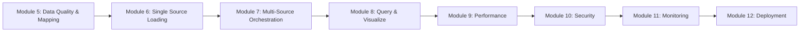
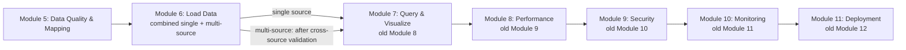
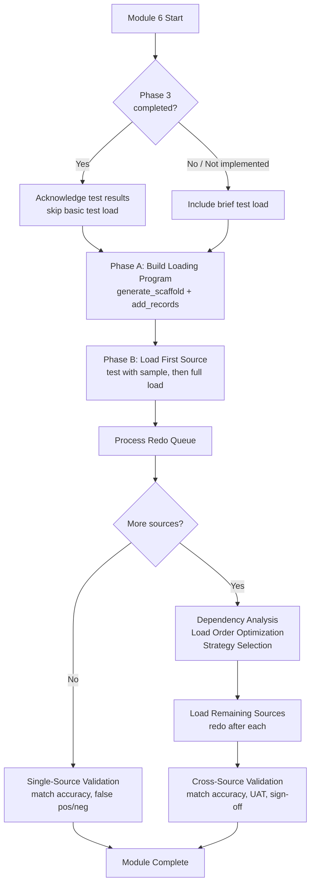

# Design Document: Combine Loading Modules

## Overview

This feature merges the current Module 6 (Single Source Loading) and Module 7 (Multi-Source Orchestration) into a single "Load Data" module (new Module 6), then renumbers Modules 8–12 to 7–11 to close the gap. The result is an 11-module bootcamp where a single loading module handles the complete data loading lifecycle — from building loading programs through cross-source validation — with conditional multi-source steps that activate only when the bootcamper has two or more data sources.

### Design Rationale

The current two-module split is artificial for multi-source use cases. The loading pattern is identical for each source, and Module 7's "orchestration" is essentially repeating the same load process for additional sources. Combining them eliminates redundancy while preserving all learning objectives. The cross-source validation, UAT, and stakeholder sign-off from Module 7 become conditional steps within the combined module, presented only when multiple sources are loaded.

### Coordination with mapping-workflow-integration Spec

The mapping-workflow-integration spec (`.kiro/specs/mapping-workflow-integration/`) refocuses the old Modules 6 and 7 on production concerns by integrating `mapping_workflow` steps 5–8 into Module 5 as Phase 3. If both specs are implemented:
- The combined module incorporates conditional logic to check whether Phase 3 was completed
- If Phase 3 was done, the combined module skips basic test loading and proceeds to production concerns
- If Phase 3 was skipped, the combined module includes a brief test load step first

If the mapping-workflow-integration spec has NOT been implemented, the combined module functions as a standalone loading module without Phase 3 conditional logic.

## Architecture

### Current Flow (12 modules)



### Proposed Flow (11 modules)



### Combined Module Internal Flow



## Components and Interfaces

### Files Created

| File | Description |
|------|-------------|
| `steering/module-06-load-data.md` | Combined loading steering file replacing old module-06 and module-07 |
| `docs/modules/MODULE_6_LOAD_DATA.md` | Combined loading module documentation |

### Files Removed

| File | Reason |
|------|--------|
| `steering/module-06-single-source.md` | Replaced by combined steering file |
| `steering/module-07-multi-source.md` | Replaced by combined steering file |
| `docs/modules/MODULE_6_SINGLE_SOURCE_LOADING.md` | Replaced by combined documentation |
| `docs/modules/MODULE_7_MULTI_SOURCE_ORCHESTRATION.md` | Replaced by combined documentation |
| `steering/module-07-reference.md` | Content incorporated into combined steering file as an inline reference section |

### Files Renamed (Renumbering)

| Old Name | New Name |
|----------|----------|
| `steering/module-08-query-validation.md` | `steering/module-07-query-validation.md` |
| `steering/module-09-performance.md` | `steering/module-08-performance.md` |
| `steering/module-10-security.md` | `steering/module-09-security.md` |
| `steering/module-11-monitoring.md` | `steering/module-10-monitoring.md` |
| `steering/module-12-deployment.md` | `steering/module-11-deployment.md` |
| `docs/modules/MODULE_8_QUERY_VALIDATION.md` | `docs/modules/MODULE_7_QUERY_VALIDATION.md` |
| `docs/modules/MODULE_9_PERFORMANCE_TESTING.md` | `docs/modules/MODULE_8_PERFORMANCE_TESTING.md` |
| `docs/modules/MODULE_10_SECURITY_HARDENING.md` | `docs/modules/MODULE_9_SECURITY_HARDENING.md` |
| `docs/modules/MODULE_11_MONITORING_OBSERVABILITY.md` | `docs/modules/MODULE_10_MONITORING_OBSERVABILITY.md` |
| `docs/modules/MODULE_12_DEPLOYMENT_PACKAGING.md` | `docs/modules/MODULE_11_DEPLOYMENT_PACKAGING.md` |

### Files Modified (Cross-Reference Updates)

| File | Change Type | Description |
|------|-------------|-------------|
| `POWER.md` | Major update | Replace 12-module with 11-module curriculum, update module table, tracks, steering file list, skip-ahead guidance |
| `steering/steering-index.yaml` | Major update | Remove old entries, add combined module entry, update renumbered entries, update file_metadata |
| `steering/module-transitions.md` | Moderate update | Update module references and transition guidance |
| `steering/module-05-data-quality-mapping.md` | Minor update | Update transition guidance to reference new Module 6 |
| `steering/module-prerequisites.md` | Moderate update | Update prerequisites table for combined module and renumbered modules |
| `steering/onboarding-flow.md` | Moderate update | Update track definitions, module table, validation gates |
| `steering/module-completion.md` | Minor update | Update path completion detection table |
| `scripts/validate_module.py` | Moderate update | Update VALIDATORS, MODULE_NAMES for 11-module scheme; add combined module validator |
| `scripts/status.py` | Moderate update | Update MODULE_NAMES, NEXT_STEPS for 11-module scheme |
| `scripts/rollback_module.py` | Moderate update | Update ARTIFACT_MANIFEST, MODULE_NAMES, PREREQUISITES for 11-module scheme |

### Component Interactions

**Combined Steering File → Data Source Registry:** Reads `config/data_sources.yaml` to determine which sources need loading and their status. Updates `load_status` as loading progresses.

**Combined Steering File → Bootcamp Progress:** Writes step-level checkpoints to `config/bootcamp_progress.json` for each completed step.

**Combined Steering File → mapping-workflow-integration (optional):** Reads `test_load_status` from the data source registry to determine if Phase 3 was completed, enabling conditional workflow.

**Scripts → Module Mappings:** All three scripts (validate_module, status, rollback_module) use hardcoded module number → name mappings that must be updated to the 11-module scheme.

## Data Models

### Module Number Mapping

| Old Number | New Number | Module Name |
|------------|------------|-------------|
| 1 | 1 | Business Problem |
| 2 | 2 | SDK Setup |
| 3 | 3 | Quick Demo |
| 4 | 4 | Data Collection |
| 5 | 5 | Data Quality & Mapping |
| 6 + 7 | 6 | Load Data (combined) |
| 8 | 7 | Query & Visualize |
| 9 | 8 | Performance Testing |
| 10 | 9 | Security Hardening |
| 11 | 10 | Monitoring & Observability |
| 12 | 11 | Package & Deploy |

### Combined Module Artifact Manifest (for rollback_module.py)

The combined module's artifact manifest merges the old Module 6 and Module 7 artifacts:

```python
6: ModuleArtifacts(
    files=["docs/loading_strategy.md"],
    directories=["src/load"],
    modifies_database=True,
)
```

### Script Module Mappings (11-module scheme)

```python
MODULE_NAMES = {
    1: "Business Problem",
    2: "SDK Setup",
    3: "Quick Demo",
    4: "Data Collection",
    5: "Data Quality & Mapping",
    6: "Load Data",
    7: "Query & Visualize",
    8: "Performance Testing",
    9: "Security Hardening",
    10: "Monitoring",
    11: "Deployment",
}
```

### Steering Index Structure (post-change)

```yaml
modules:
  1: module-01-business-problem.md
  2: module-02-sdk-setup.md
  3: module-03-quick-demo.md
  4: module-04-data-collection.md
  5: module-05-data-quality-mapping.md
  6: module-06-load-data.md
  7: module-07-query-validation.md
  8: module-08-performance.md
  9: module-09-security.md
  10: module-10-monitoring.md
  11: module-11-deployment.md
```

## Correctness Properties

*A property is a characteristic or behavior that should hold true across all valid executions of a system — essentially, a formal statement about what the system should do. Properties serve as the bridge between human-readable specifications and machine-verifiable correctness guarantees.*

This feature is primarily a structural reorganization of documentation, steering files, and script module mappings. Most acceptance criteria are content checks on markdown files (EXAMPLE-type tests). The two property-testable areas are cross-reference consistency and script module mapping completeness.

### Property 1: No stale module number references in steering and documentation files

*For any* steering file or module documentation file in the bootcamp, after the renumbering is applied, there SHALL be no references to "Module 12" as a bootcamp module, no references to the old file names (e.g., `module-08-query-validation.md` where `module-07-query-validation.md` is expected), and no references to "12-module" curriculum. References to "Module 8" through "Module 12" SHALL only appear in historical/version-history contexts, not as current module identifiers.

**Validates: Requirements 4.4, 5.2, 5.3, 6.1**

### Property 2: Script module mapping completeness and consistency

*For any* module number in the range 1–11, the scripts `validate_module.py`, `status.py`, and `rollback_module.py` SHALL each have a valid entry in their respective module mapping dictionaries (MODULE_NAMES, VALIDATORS/ARTIFACT_MANIFEST, NEXT_STEPS). No entries SHALL exist for module numbers greater than 11. The MODULE_NAMES values SHALL be consistent across all three scripts for the same module number.

**Validates: Requirements 8.1, 8.2, 8.3, 8.4**

## Error Handling

### Combined Module Error Scenarios

| Scenario | Handling |
|----------|----------|
| Loading fails partway through a source | Present recovery options: wipe-and-restart, resume-from-checkpoint, database restore |
| Source fails during multi-source orchestration | Isolate failure, continue with remaining sources, report in summary |
| Redo queue processing fails | Restart redo processor; if persistent, check for corrupted entities and suggest backup restore |
| Phase 3 conditional check fails (registry missing) | Treat as Phase 3 not completed; use full loading workflow |
| Single source selected but multiple sources exist | Present all sources, let bootcamper choose which to load; offer to load remaining after first |

### Renumbering Error Scenarios

| Scenario | Handling |
|----------|----------|
| Stale cross-reference found after renumbering | Caught by Property 1 tests; fix by updating the reference |
| Script module mapping inconsistency | Caught by Property 2 tests; fix by aligning all three scripts |
| External references to old module numbers | Out of scope — external documentation is not part of this spec |

## Testing Strategy

### Testing Approach

This feature is primarily documentation and steering file restructuring with script module mapping updates. Property-based testing applies to cross-reference consistency and script mapping completeness. The bulk of testing uses example-based structural checks on file content and existence.

### Property-Based Tests

**Cross-Reference Consistency (Property 1):**
- Library: Hypothesis (Python)
- Scan all `.md` files in `steering/` and `docs/modules/` for module number references
- Verify no stale references to old numbering scheme exist in current-context usage
- Minimum 100 iterations (generating random file selections and checking consistency)
- Tag: **Feature: combine-loading-modules, Property 1: No stale module number references in steering and documentation files**

**Script Module Mapping Completeness (Property 2):**
- Library: Hypothesis (Python)
- For each module number generated in range 1–11, verify all three scripts have valid entries
- For each module number generated > 11, verify no script has an entry
- Verify MODULE_NAMES consistency across scripts
- Minimum 100 iterations
- Tag: **Feature: combine-loading-modules, Property 2: Script module mapping completeness and consistency**

### Unit Tests (Example-Based)

**Combined Steering File Content:**
- Verify `generate_scaffold` and `add_records` references exist (Req 1.1)
- Verify sequential loading instructions for all sources (Req 1.2)
- Verify redo queue processing between sources (Req 1.3)
- Verify validation phase with all required subsections (Req 1.4)
- Verify single-source conditional skip for cross-source steps (Req 1.5)
- Verify error handling, progress tracking, statistics sections preserved (Req 1.6)
- Verify multi-source orchestration content with conditional presentation (Req 1.7)
- Verify checkpoint instructions at each numbered step (Req 1.8)
- Verify recovery guidance section (Req 1.9)

**Combined Module Documentation:**
- Verify complete lifecycle description (Req 2.1)
- Verify combined learning objectives (Req 2.2)
- Verify conditional workflow documentation (Req 2.3)
- Verify combined validation gates (Req 2.4)
- Verify output files documentation (Req 2.5)
- Verify file location map (Req 2.6)

**File Removal:**
- Verify old steering files do not exist (Req 3.1, 3.2)
- Verify old documentation files do not exist (Req 3.3, 3.4)
- Verify reference material preserved in combined module (Req 3.5)

**File Renaming:**
- Verify each renamed steering file exists with new name (Req 4.2)
- Verify each renamed documentation file exists with new name (Req 4.3)

**POWER.md Updates:**
- Verify single combined module row in module table (Req 5.1)
- Verify 11-module numbering in table (Req 5.2)
- Verify "11-module curriculum" text (Req 5.3)
- Verify updated track descriptions (Req 5.4)
- Verify updated steering file list (Req 5.5)
- Verify Bootcamp Modules table shows 11 modules (Req 5.6)
- Verify updated skip-ahead guidance (Req 5.7)

**Cross-Reference Updates:**
- Verify module-transitions.md uses new numbering (Req 6.1, 6.2)
- Verify module-05 references new Module 6 (Req 6.3)
- Verify module-prerequisites.md updated (Req 6.4)
- Verify onboarding-flow.md updated (Req 6.5)
- Verify module-completion.md updated (Req 6.6)

**Steering Index:**
- Verify old entries removed (Req 7.1)
- Verify combined module entry added (Req 7.2)
- Verify renumbered entries correct (Req 7.3)
- Verify reference file entry handled (Req 7.4)

**Reference Material Preservation:**
- Verify source ordering heuristics preserved (Req 9.1)
- Verify orchestration patterns preserved (Req 9.2)
- Verify error handling strategies preserved (Req 9.3)
- Verify conditional presentation for single-source users (Req 9.4)

**Mapping-Workflow-Integration Coordination:**
- Verify Phase 3 conditional logic in combined steering file (Req 10.1)
- Verify Phase 3 shortcut path reference in documentation (Req 10.2)
- Verify standalone functionality without Phase 3 (Req 10.3)

### Integration Tests

- Run `validate_module.py --module 6` and verify it checks combined module artifacts
- Run `validate_module.py --next 7` and verify it validates module 6 completion
- Verify `rollback_module.py --module 6 --dry-run` shows combined module artifacts
- Verify `status.py` displays correct module names for all 11 modules
- Run `validate_power.py` to verify overall power integrity after changes

### Preservation Checks

- Verify all content from old Module 6 steering file is present in combined module (error handling, progress tracking, loading statistics, recovery guidance)
- Verify all content from old Module 7 steering file is present in combined module (dependency analysis, load order, orchestration strategy, cross-source validation, UAT, stakeholder sign-off)
- Verify Module 7 reference material (source ordering examples, conflict resolution, error handling patterns) is preserved in combined module or linked reference file
