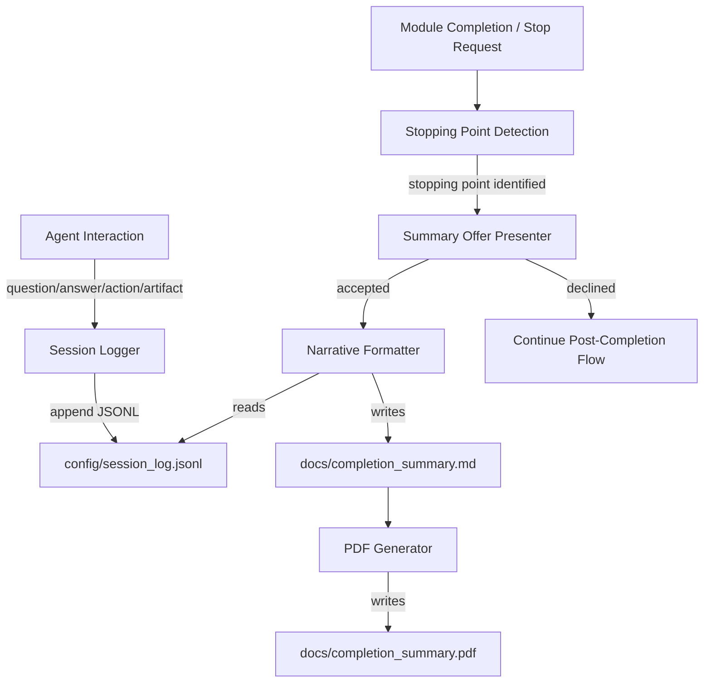
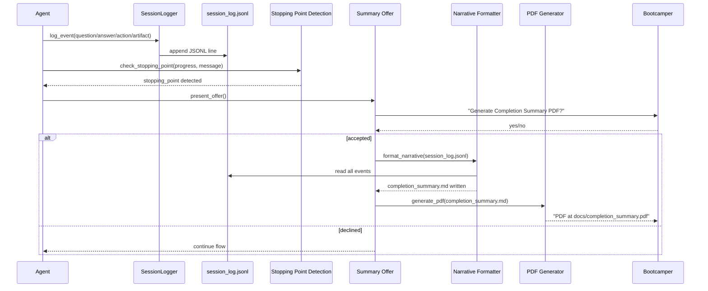

# Design Document: Completion Summary

## Overview

The completion-summary feature adds a progressive session logging system and automatic PDF summary generation to the Senzing bootcamp power. It extends the existing `session_logger.py` with a new event schema (question, answer, action, artifact), detects natural stopping points in the bootcamp flow, and offers a narrative PDF at each one.

The design reuses the existing `generate_recap_pdf.py` pattern (fpdf2, lazy import, fallback messaging) but operates on a distinct data source (`config/session_log.jsonl` with the new schema) and produces a separate output (`docs/completion_summary.pdf`). This ensures no collision with the existing recap/graduation workflow.

### Key Design Decisions

1. **Extend existing `session_logger.py`** rather than creating a new script — the file already handles JSONL append, directory creation, and error resilience. We add new event types and schema validation alongside the existing `turn`/`correction`/`module_start`/`module_complete` events.

2. **Steering-driven detection** — Stopping point detection is implemented as steering file instructions (not a standalone script) because the agent must evaluate conversational context (e.g., "I'm done") which cannot be reduced to a pure function.

3. **Separate PDF from recap** — The completion summary PDF (`docs/completion_summary.pdf`) is distinct from the graduation recap PDF (`docs/bootcamp_recap.pdf`). They draw from different data sources and serve different purposes.

4. **fpdf2 as sole external dependency** — Consistent with the existing pattern in `generate_recap_pdf.py`. Auto-install with timeout, fallback to markdown file.

## Architecture



### Component Interaction Sequence



## Components and Interfaces

### 1. Session Logger (Extended)

**File:** `senzing-bootcamp/scripts/session_logger.py`

Extends the existing script with new event types and schema. The existing `LogEntry` dataclass and `VALID_EVENTS` set are preserved for backward compatibility. New functionality is added alongside.

**Public Interface:**

```python
# New event types added to the module
COMPLETION_EVENT_TYPES: set[str] = {"question", "answer", "action", "artifact"}

@dataclass
class CompletionLogEntry:
    """A session log entry for the completion summary feature."""
    event_type: str       # one of COMPLETION_EVENT_TYPES
    module: int           # 0-11
    timestamp: str        # ISO 8601 UTC
    data: dict[str, str]  # event-type-specific fields

def build_completion_entry(
    event_type: str,
    module: int,
    data: dict[str, str],
) -> CompletionLogEntry:
    """Construct a CompletionLogEntry with validation and timestamp."""

def serialize_completion_entry(entry: CompletionLogEntry) -> str:
    """Serialize to compact JSON string."""

def append_completion_entry(log_path: str, entry: CompletionLogEntry) -> None:
    """Append to JSONL file. Creates file/dirs if needed. Non-blocking on error."""

def truncate_field(value: str, max_length: int) -> str:
    """Truncate a string to max_length characters."""

def generate_question_id() -> str:
    """Generate a unique question ID (UUID4 hex prefix)."""
```

### 2. Narrative Formatter

**File:** `senzing-bootcamp/scripts/generate_completion_summary.py`

Reads `config/session_log.jsonl`, filters to completion event types, organizes by module, and writes `docs/completion_summary.md`.

**Public Interface:**

```python
@dataclass
class NarrativeSection:
    """A per-module narrative block."""
    module_number: int
    module_name: str
    questions: list[tuple[str, str | None]]  # (question_text, answer_text_or_None)
    actions: list[str]
    artifacts: list[tuple[str, str, str]]  # (file_path, artifact_type, description)

@dataclass
class CompletionNarrative:
    """Complete narrative document."""
    bootcamper_name: str
    start_date: str
    completion_date: str
    total_duration: str
    track: str
    modules_completed: int
    total_artifacts: int
    er_stats: dict[str, str] | None
    sections: list[NarrativeSection]

def parse_session_log(log_path: str) -> list[CompletionLogEntry]:
    """Parse JSONL file into list of CompletionLogEntry objects."""

def build_narrative(
    entries: list[CompletionLogEntry],
    progress_path: str,
    preferences_path: str,
) -> CompletionNarrative:
    """Organize entries into a structured narrative."""

def filter_secrets(text: str) -> str:
    """Remove key=value patterns where key contains sensitive terms."""

def render_markdown(narrative: CompletionNarrative) -> str:
    """Render narrative as markdown string."""

def write_narrative(output_path: str, content: str, max_size_bytes: int = 512000) -> None:
    """Write narrative to file, truncating if over size limit."""
```

### 3. PDF Generator

**File:** `senzing-bootcamp/scripts/generate_completion_summary.py` (same file, PDF section)

Reuses the rendering pattern from `generate_recap_pdf.py` — lazy fpdf2 import, cover page, per-module pages, monospace for code spans.

**Public Interface:**

```python
def render_completion_pdf(narrative: CompletionNarrative, output_path: str) -> None:
    """Render narrative as PDF. Raises ImportError if fpdf2 unavailable."""

def ensure_fpdf2(timeout: int = 30) -> bool:
    """Attempt to install fpdf2 if not present. Returns True if available."""

def generate_pdf_with_fallback(md_path: str, pdf_path: str) -> str:
    """Generate PDF, returning status message for the bootcamper."""
```

### 4. Stopping Point Detection (Steering-Driven)

**File:** `senzing-bootcamp/steering/completion-summary-offer.md`

A steering file that instructs the agent on when and how to detect stopping points and present the summary offer. This is not a script because it requires conversational context evaluation.

**Detection Rules (encoded in steering):**
- Module 7 appears in `modules_completed` → stopping point
- Module 11 appears in `modules_completed` → stopping point
- Bootcamper message primary intent is to stop → stopping point
- Track switch at boundary → stopping point for completed track

### 5. Integration Hook

**File:** `senzing-bootcamp/hooks/session-log-events.kiro.hook`

A `postToolUse` hook that triggers session logging after file operations and MCP tool calls, ensuring events are captured without manual agent intervention.

## Data Models

### Session Log Entry Schema (JSONL)

Each line in `config/session_log.jsonl` is a JSON object:

```json
{
  "event_type": "question",
  "module": 3,
  "timestamp": "2025-01-15T14:30:00Z",
  "data": {
    "text": "What database are you using for Senzing?",
    "question_id": "a1b2c3d4"
  }
}
```

**Field Definitions:**

| Field | Type | Required | Constraints |
|-------|------|----------|-------------|
| `event_type` | string | yes | One of: `question`, `answer`, `action`, `artifact` |
| `module` | integer | yes | 0–11 (0 = outside module context) |
| `timestamp` | string | yes | ISO 8601 UTC format |
| `data` | object | yes | Event-type-specific fields (see below) |

**Data field by event_type:**

| event_type | data fields |
|------------|-------------|
| `question` | `text` (max 2000 chars), `question_id` (unique string) |
| `answer` | `text` (max 5000 chars), `question_id` (references originating question) |
| `action` | `action_type` (file_create, file_modify, file_delete, command_run, mcp_tool_call), `description` (max 500 chars), `file_path` (required for file_* types) |
| `artifact` | `file_path`, `artifact_type` (script, config, data, report, visualization), `description` (max 500 chars) |

### Completion Narrative Document Structure

The markdown output at `docs/completion_summary.md`:

```markdown
# Senzing Bootcamp Completion Summary

**Bootcamper:** Jane Smith
**Started:** 2025-01-10
**Completed:** 2025-01-15
**Duration:** 5 days, 12 hours
**Track:** Core Bootcamp

---

## Summary Statistics

| Metric | Value |
|--------|-------|
| Modules Completed | 7 |
| Artifacts Produced | 14 |
| Entity Count | 1,247 |
| Dedup Rate | 23% |
| Cross-Source Matches | 89 |

---

## Module 1: Business Problem

### Questions Asked
1. What business problem are you solving with entity resolution?

### Answers Given
1. We need to deduplicate customer records across three CRM systems.

### Actions Taken
- Created `docs/business_problem.md`
- Ran `assess_entry_point.py`

### Artifacts Created
- `docs/business_problem.md` (report) — Business problem documentation

---

## Module 2: SDK Setup
...
```

### Progress File Reference

The existing `config/bootcamp_progress.json`:

```json
{
  "current_module": 7,
  "modules_completed": [1, 2, 3, 4, 5, 6],
  "current_step": "step_3",
  "language": "python",
  "step_history": {},
  "track": "core_bootcamp"
}
```

### Preferences File Reference

The existing `config/bootcamp_preferences.yaml` provides:
- `name` — bootcamper name for the cover page
- `track` — track name for the narrative
- `language` — chosen programming language

## Correctness Properties

*A property is a characteristic or behavior that should hold true across all valid executions of a system — essentially, a formal statement about what the system should do. Properties serve as the bridge between human-readable specifications and machine-verifiable correctness guarantees.*

### Property 1: Entry serialization produces valid schema-compliant JSON

*For any* valid event type (question, answer, action, artifact), module number (0–11), and well-formed data dictionary, `build_completion_entry` followed by `serialize_completion_entry` SHALL produce a JSON string that, when parsed, contains exactly the fields `event_type`, `module`, `timestamp`, and `data`, where `event_type` matches the input, `module` is an integer in 0–11, `timestamp` is a valid ISO 8601 UTC string, and `data` contains all required subfields for that event type.

**Validates: Requirements 1.1, 1.2, 1.3, 1.4, 1.5, 6.1, 6.2, 6.3, 6.4, 6.5, 6.6, 6.7**

### Property 2: Invalid entries are rejected

*For any* event construction attempt where `event_type` is not in {question, answer, action, artifact}, or `module` is outside 0–11, or required `data` fields are missing for the given event type, `build_completion_entry` SHALL raise a `ValueError` and no entry SHALL be written to the log.

**Validates: Requirements 6.7, 6.8**

### Property 3: Truncation preserves prefix and enforces limit

*For any* string `s` and maximum length `n` (where n > 0), `truncate_field(s, n)` SHALL return a string whose length is `min(len(s), n)` and which equals `s[:n]`.

**Validates: Requirements 1.9**

### Property 4: Append-only JSONL integrity

*For any* sequence of valid `CompletionLogEntry` objects appended to a log file, reading the file back SHALL yield exactly one JSON object per line, the number of lines SHALL equal the number of entries appended, and each line SHALL parse as valid JSON matching the original entry's serialization.

**Validates: Requirements 1.6**

### Property 5: Narrative sections are ordered by module number ascending

*For any* set of session log entries spanning multiple modules, `build_narrative` SHALL produce a `CompletionNarrative` whose `sections` list is sorted by `module_number` in strictly ascending order.

**Validates: Requirements 4.1**

### Property 6: Every module with events gets all four subsections

*For any* set of session log entries where at least one entry exists for a given module, the corresponding `NarrativeSection` SHALL contain non-null lists for questions, actions, and artifacts (possibly empty lists, but present), ensuring all four content categories are represented.

**Validates: Requirements 4.2**

### Property 7: Question-answer pairing via question_id

*For any* set of question and answer entries sharing the same `question_id`, `build_narrative` SHALL pair them together in the narrative. *For any* question entry whose `question_id` has no corresponding answer entry, the narrative SHALL include that question with a placeholder indicating no answer was recorded.

**Validates: Requirements 4.3**

### Property 8: Narrative metadata completeness

*For any* valid set of inputs (session log entries, progress file, preferences file), the rendered markdown SHALL contain the bootcamper name, start date, completion date, duration, track, modules completed count, and artifacts produced count.

**Validates: Requirements 4.4, 4.5**

### Property 9: Secret filtering removes sensitive key-value patterns

*For any* text containing a pattern matching `key=value` where `key` contains one of {secret, password, token, key, credential, connection_string}, `filter_secrets` SHALL return text with that pattern removed. *For any* text not containing such patterns, `filter_secrets` SHALL return the text unchanged.

**Validates: Requirements 4.8**

### Property 10: Narrative output respects 500 KB size limit

*For any* set of session log entries (regardless of count or content size), `write_narrative` SHALL produce an output file whose size does not exceed 512,000 bytes.

**Validates: Requirements 4.10**

## Error Handling

### Session Logger Errors

| Error Condition | Behavior | User Impact |
|----------------|----------|-------------|
| File system write failure | Warning to stderr, continue execution | None — bootcamp flow uninterrupted |
| Missing parent directories | Auto-create directories | None |
| Invalid event data (wrong type, missing fields) | Raise `ValueError` | Entry not logged; caller handles |
| Text exceeds character limit | Truncate to limit | Slight data loss at end of long text |

### Narrative Formatter Errors

| Error Condition | Behavior | User Impact |
|----------------|----------|-------------|
| Session log missing or unparseable | Return error message, do NOT write partial output | Bootcamper informed, no corrupt file |
| Module completed but no log entries | Include module with "unavailable" note | Complete narrative with gap noted |
| Output exceeds 500 KB | Truncate earliest entries per module | Slight data loss from early interactions |
| Secrets detected in content | Silently filter out sensitive patterns | Clean narrative without credentials |

### PDF Generator Errors

| Error Condition | Behavior | User Impact |
|----------------|----------|-------------|
| fpdf2 not installed | Attempt `pip install fpdf2` (30s timeout) | Brief delay |
| fpdf2 install fails, no CLI tool | Inform bootcamper, provide markdown path + install command | Manual step required |
| PDF rendering fails | Inform bootcamper, provide markdown fallback | Can still access content |
| Empty narrative content | Inform bootcamper of insufficient data | No PDF generated |

### Stopping Point Detection Errors

| Error Condition | Behavior | User Impact |
|----------------|----------|-------------|
| Progress file missing/unreadable | Do not detect stopping point, log warning | Summary not offered (no interruption) |
| Ambiguous stop phrase in longer message | Do not detect stopping point | Bootcamper can explicitly request later |

## Testing Strategy

### Property-Based Tests (Hypothesis)

The feature is well-suited for property-based testing because the core logic involves:
- Data validation (schema compliance across many input combinations)
- Text processing (truncation, secret filtering)
- Data transformation (log entries → narrative structure)
- Ordering guarantees (module sorting)

**Library:** Hypothesis (already used in the project)
**Configuration:** `@settings(max_examples=100)` minimum per property test
**Location:** `senzing-bootcamp/tests/test_completion_summary_properties.py`

Each property test is tagged with:
```python
# Feature: completion-summary, Property N: [property text]
```

**Strategies needed:**
- `st_event_type()` — draws from {"question", "answer", "action", "artifact"}
- `st_module_number()` — integers 0–11
- `st_completion_entry()` — composite strategy building valid CompletionLogEntry
- `st_question_entry()` / `st_answer_entry()` / `st_action_entry()` / `st_artifact_entry()` — type-specific strategies
- `st_session_log()` — list of completion entries
- `st_sensitive_text()` — text with embedded secret patterns

### Unit Tests (Example-Based)

**Location:** `senzing-bootcamp/tests/test_completion_summary_unit.py`

Cover specific examples and edge cases:
- File/directory creation when log doesn't exist (1.7)
- Stderr warning on write failure (1.8)
- Module 7 and Module 11 stopping point detection (2.1, 2.2)
- Track switch stopping point (2.4)
- Overwrite behavior for existing output (4.6)
- Module with no events gets "unavailable" note (4.7)
- PDF generation success message (5.7)
- Empty narrative handling (5.9)
- Separate output path from recap PDF (7.4)

### Integration Tests

**Location:** `senzing-bootcamp/tests/test_completion_summary_integration.py`

End-to-end flow tests:
- Full pipeline: log events → format narrative → generate PDF
- Verify steering file content matches requirements (offer text, ordering)
- Verify hook file structure is valid

### CI Integration

Tests run as part of the existing pytest suite in `.github/workflows/validate-power.yml`. No additional CI configuration needed — the test files follow the existing naming convention and will be auto-discovered by pytest.

