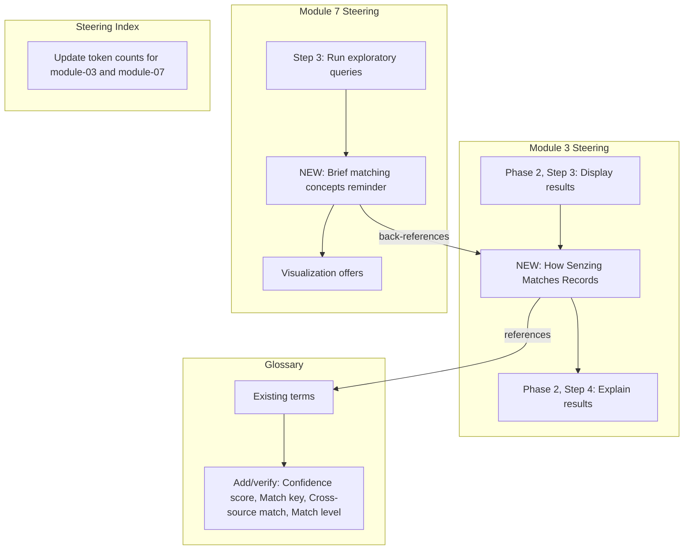

# Design Document: Confidence and Features Explanation

## Overview

This feature adds educational content to the Senzing bootcamp that explains how entity resolution matching works — specifically features, confidence scores, match keys, and cross-source connections. The content is delivered in two places:

1. **Module 3** gets a new "How Senzing Matches Records" section inserted into Phase 2 between step 3 (Display results) and step 4 (Explain results). This is the bootcamper's first encounter with resolution output, so the explanation is presented here in full.
2. **Module 7** gets a brief back-reference when presenting query results (step 3), reminding the bootcamper of the interpretation concepts without repeating them.
3. **Glossary** gets new or verified entries for "Confidence score", "Match key", "Cross-source match", and "Match level".

All Senzing-specific claims in the steering content must come from the MCP server (`search_docs`) at runtime — the steering files contain agent instructions to call `search_docs`, not hardcoded Senzing internals.

## Architecture

This is a content-only change to existing markdown and YAML files. No new code modules, APIs, or data models are introduced.

### Design Decisions

1. **Inline section, not a separate phase.** The matching explanation is inserted as a natural continuation of the results display, not as a gated step requiring user interaction. This keeps the demo flow uninterrupted (Requirement 8.1).

2. **Agent instructions, not static content.** The steering file tells the agent *what to explain* and *how to source it* (via `search_docs`), but does not hardcode score thresholds or algorithm details. This keeps content accurate as Senzing evolves (Requirement 6.4).

3. **MCP-first with fallback.** The agent must call `search_docs` before presenting the explanation. If the MCP server is unavailable, the agent uses the structural guidance in the steering file and notes it will verify details later (Requirement 6.3).

4. **Module 7 references, not repeats.** Module 7 includes a concise reminder of the three key concepts (features, confidence scores, cross-source connections) and directs the bootcamper to ask for a refresher if needed. This avoids duplication while reinforcing learning (Requirement 5.2).

5. **Glossary entries follow existing format.** New terms use the same bold-term-then-definition pattern and alphabetical ordering already in `GLOSSARY.md` (Requirement 7.4).

## Components and Interfaces

### Component 1: Module 3 Steering Update (`module-03-quick-demo.md`)

**What changes:**
- Insert a new "How Senzing Matches Records" sub-section in Phase 2, between step 3 (Display results) and step 4 (Explain results)
- Add MCP `search_docs` instructions before the explanation section
- Add MCP fallback guidance

**Content structure of the new section:**

The agent instruction block will direct the agent to:

1. **Call `search_docs`** twice — once for feature types and matching behavior, once for confidence scoring and match levels
2. **Explain features** — what they are, how each type has its own matching behavior, how to read match key strings like `+NAME+ADDRESS+PHONE`, referencing at least three feature types from the demo data
3. **Explain confidence scores** — what they represent, how to interpret score ranges, using at least one concrete example from the demo results, clarifying they are relative indicators not absolute probabilities
4. **Explain cross-source connections** — what they are, how they differ from within-source deduplication, their business value with a concrete scenario, pointing out specific cross-source connections in the demo results

**Constraints:**
- Must be concise (under two minutes of reading)
- Must reference the bootcamper's actual demo output
- Must use plain language
- Must not hardcode score thresholds or version-specific behavior
- Must pass `validate_commonmark.py` and `validate_power.py`

### Component 2: Module 7 Steering Update (`module-07-query-validation.md`)

**What changes:**
- Add a brief matching concepts reminder in step 3 (Run exploratory queries), before the visualization offers
- The reminder covers features, confidence scores, and cross-source connections
- Directs the bootcamper to ask for a refresher if needed
- Adapts to the bootcamper's own data context (not Module 3 sample data)

### Component 3: Glossary Updates (`senzing-bootcamp/docs/guides/GLOSSARY.md`)

**What changes:**
- Add "Confidence score" definition (does not currently exist)
- Verify "Cross-source match" definition exists and is consistent (it does exist)
- Verify "Match key" definition exists and is consistent (it does exist)
- Verify "Match level" definition exists and is consistent (it does exist)
- Maintain alphabetical ordering

### Component 4: Steering Index Update (`steering-index.yaml`)

**What changes:**
- Update `token_count` for `module-03-quick-demo.md` after content is added
- Update `token_count` for `module-07-query-validation.md` after content is added
- Run `measure_steering.py` to calculate new counts

## Data Models

No new data models are introduced. This feature modifies existing markdown and YAML files only.

**Files modified:**

| File | Type | Change |
|------|------|--------|
| `senzing-bootcamp/steering/module-03-quick-demo.md` | Markdown steering | Add matching explanation section |
| `senzing-bootcamp/steering/module-07-query-validation.md` | Markdown steering | Add back-reference paragraph |
| `senzing-bootcamp/docs/guides/GLOSSARY.md` | Markdown reference | Add "Confidence score" entry |
| `senzing-bootcamp/steering/steering-index.yaml` | YAML config | Update token counts |

## Error Handling

Error handling is limited since this is a content change, but two runtime scenarios are addressed:

1. **MCP server unavailable:** The Module 3 steering includes explicit fallback instructions — the agent presents the explanation using the structural guidance in the steering file and tells the bootcamper it will verify details when the server is available (Requirement 6.3).

2. **Demo produces no cross-source matches:** If the demo data comes from a single source or produces no cross-source connections, the agent should explain the concept using a hypothetical scenario rather than pointing to non-existent demo examples. The steering file includes guidance for this case.

## Testing Strategy

### Why Property-Based Testing Does Not Apply

This feature modifies markdown steering files, a glossary, and a YAML index. These are content and configuration artifacts, not functions with input/output behavior. There is no code logic that varies meaningfully with input, no pure functions to test, and no universal properties to verify across generated inputs. PBT is not appropriate here.

### Testing Approach

**Validation tests (CI pipeline):**
- `validate_commonmark.py` — all modified markdown files must pass CommonMark linting
- `validate_power.py` — the power structure must remain valid
- `measure_steering.py --check` — token counts in `steering-index.yaml` must match actual file sizes

**Manual review checklist:**
- Module 3 new section is positioned correctly (after step 3, before step 4 in Phase 2)
- Module 3 new section includes `search_docs` instructions for both feature types and confidence scoring
- Module 3 new section includes MCP fallback guidance
- Module 3 new section does not hardcode score thresholds
- Module 7 back-reference is positioned in step 3
- Module 7 back-reference covers all three concepts without repeating full explanations
- Glossary "Confidence score" entry exists and follows existing format
- Glossary entries are in alphabetical order
- All existing glossary entries ("Cross-source match", "Match key", "Match level") are consistent with the new explanation content

**Example-based tests:**
- Verify the glossary file contains all required terms
- Verify the steering index token counts are updated
- Verify modified steering files contain expected section headers
