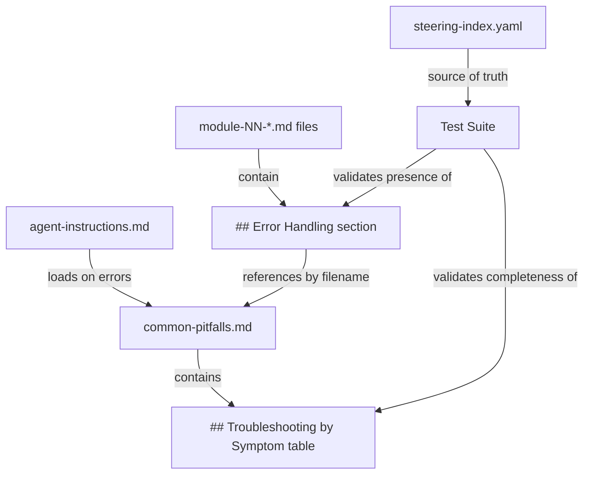

# Design Document: Consistent Error Handling

## Overview

This feature standardizes error handling across all 11 module steering files and adds a cross-module symptom-based troubleshooting table to `common-pitfalls.md`. Today, only module 2 and module 6 phase D reference `explain_error_code` for SENZ errors, while the remaining nine modules have no error handling guidance. The `agent-instructions.md` file says to load `common-pitfalls.md` "on errors" but individual module files don't tell the agent *how* to triage — whether to call `explain_error_code`, load `common-pitfalls.md`, or both.

The design adds two things:

1. A standard `## Error Handling` section (≤15 lines of Markdown) to every root module steering file, defining a deterministic decision procedure: check for SENZ error pattern → call `explain_error_code` → fall back to `common-pitfalls.md` → check the Troubleshooting by Symptom table.
2. A `## Troubleshooting by Symptom` table in `common-pitfalls.md` covering five cross-module symptoms, placed between Quick Navigation and the first module-specific section.

A property-based test suite validates that every module listed in `steering-index.yaml` has the section and that the symptom table is complete.

## Architecture

The feature touches three layers of the power:



**Key architectural decisions:**

1. **Error handling section in root files only.** Modules with phase sub-files (1, 5, 6, 11) get the section in the root file, not duplicated in each phase. Rationale: the root file is always loaded when a module starts, so the agent always has the triage procedure available. Duplicating it in phase files would waste token budget and create maintenance burden.

2. **Reference by filename, not inline content.** The error handling section references `common-pitfalls.md` by name rather than inlining pitfall data. Rationale: avoids duplicating pitfall content across 11 files, keeps the section within the 15-line budget, and ensures pitfall updates propagate automatically.

3. **Steering index as test oracle.** The test suite reads `steering-index.yaml` to discover which modules exist and their root file paths, rather than hardcoding module numbers. Rationale: new modules are automatically covered without updating the test file.

4. **Standard section template.** All 11 modules use the same error handling text (a shared template). Rationale: the decision procedure is module-agnostic — the module-specific pitfalls live in `common-pitfalls.md`, not in the error handling section itself.

## Components and Interfaces

### Component 1: Error Handling Section Template

A Markdown snippet (≤15 lines) inserted as `## Error Handling` in each root module steering file. The template defines the triage decision procedure:

```markdown
## Error Handling

When the bootcamper encounters an error during this module:

1. **Check for SENZ error code** — if the error message contains a code matching `SENZ` followed by digits (e.g., `SENZ2027`):
   - Call `explain_error_code(error_code="<code>", version="current")`
   - Present the explanation and recommended fix to the bootcamper
   - If `explain_error_code` returns no result, continue to step 2
2. **Load `common-pitfalls.md`** — navigate to this module's section and present only the matching pitfall and fix
3. **Check cross-module resources** — if no match in the module section, check the Troubleshooting by Symptom table and General Pitfalls section
```

**Interface:** This is static Markdown content. No code interface — the agent reads it as steering instructions.

**Placement rules:**
- In modules without phase sub-files (2, 3, 4, 7, 8, 9, 10): insert before the final section (typically before "Agent Rules", "Success Criteria", "Troubleshooting", or the last heading)
- In root files of split modules (1, 5, 6, 11): insert in the root file, not in phase sub-files
- Must use the exact heading `## Error Handling`

### Component 2: Troubleshooting by Symptom Table

A Markdown table added to `common-pitfalls.md` under the heading `## Troubleshooting by Symptom`. Placed between the Quick Navigation section and the first module-specific section (`## Module 2: SDK Setup`).

**Table structure:**

| Column | Content |
|--------|---------|
| Symptom | Observable problem description (case-insensitive matchable) |
| Likely Cause | Root cause explanation |
| Diagnostic Steps | Specific MCP tools or commands to run |

**Required rows (5 symptoms):**

1. "zero entities created" — references data format, DATA_SOURCE/RECORD_ID fields, loading output (modules 3, 5, 6, 7)
2. "loading hangs" — references record count, database type, threading, system resources (modules 6, 8)
3. "query returns no results" — references entity IDs, data loading verification, `get_sdk_reference(topic='flags')` (modules 7, 8)
4. "SDK initialization fails" — references `SENZING_ENGINE_CONFIGURATION_JSON`, CONFIGPATH/RESOURCEPATH/SUPPORTPATH, `explain_error_code` (modules 2, 3, 6)
5. "database connection fails" — references database file existence, connection string, permissions, PostgreSQL service status (modules 2, 6, 8)

**Interface:** Static Markdown content. The Quick Navigation section's anchor list will be updated to include a link to this new section.

### Component 3: Test Suite

**File:** `senzing-bootcamp/tests/test_error_handling_section_properties.py`

**Dependencies:** pytest, Hypothesis, PyYAML (for parsing `steering-index.yaml`), pathlib

**Key functions/fixtures:**

- `load_steering_index() -> dict` — Parses `steering-index.yaml` and returns the full index data
- `resolve_root_path(module_number: int, module_entry: str | dict) -> str` — Resolves a module entry to its root filename (handles both string entries and dict entries with a `root` key)
- `read_section(file_path: Path, heading: str) -> str | None` — Extracts the content under a given `##` heading from a Markdown file
- `parse_symptom_table(content: str) -> list[dict]` — Parses a Markdown table into a list of row dicts with keys `symptom`, `likely_cause`, `diagnostic_steps`

**Hypothesis strategies:**

- `st_module_number()` — Draws from the set of module numbers found in `steering-index.yaml`
- `st_symptom_name()` — Draws from the set `{"zero entities created", "loading hangs", "query returns no results", "SDK initialization fails", "database connection fails"}`

### Component 4: Steering Index Updates

The Quick Navigation line in `common-pitfalls.md` will be updated to include a `[Symptoms](#troubleshooting-by-symptom)` link. No changes to `steering-index.yaml` itself are needed — the module root file paths and token counts remain the same (the error handling section adds minimal tokens to each file).

**Token budget impact:** The error handling section template is ~120 tokens. Added to 11 root files, this increases total steering budget by ~1,320 tokens (from 87,710 to ~89,030), well within the 120k warn threshold.

## Data Models

### Steering Index Schema (existing, unchanged)

The test suite consumes the `modules` section of `steering-index.yaml`:

```yaml
modules:
  <module_number>: <filename>           # simple string entry
  <module_number>:                       # object entry with phases
    root: <filename>
    phases:
      <phase_name>:
        file: <filename>
        token_count: <int>
        size_category: <string>
        step_range: [<int>, <int>]
```

**Resolution rule:** When the value is a string, it is the root filename. When the value is an object, the `root` key is the root filename.

### Error Handling Section Structure

The section is identified by:
- Heading: exactly `## Error Handling`
- Must contain: a reference to `explain_error_code` (the MCP tool call)
- Must contain: a reference to `common-pitfalls.md` (the fallback file)

### Symptom Table Structure

The table is identified by:
- Heading: exactly `## Troubleshooting by Symptom`
- Table format: pipe-delimited Markdown table with header row and separator row
- Columns: Symptom | Likely Cause | Diagnostic Steps
- Each row's Symptom column must contain the symptom text (case-insensitive match)
- Likely Cause and Diagnostic Steps columns must be non-empty


## Correctness Properties

*A property is a characteristic or behavior that should hold true across all valid executions of a system — essentially, a formal statement about what the system should do. Properties serve as the bridge between human-readable specifications and machine-verifiable correctness guarantees.*

The prework analysis identified five consolidated properties after eliminating redundancy. Requirements 1.1, 1.2, 2.1, 2.3, 3.1, 4.3, 7.3, 7.4, and 7.5 all test aspects of the same underlying invariant (the error handling section exists and contains the right references), so they collapse into Property 1. Requirements 5.3, 5.4, 8.3, and 8.4 collapse into Property 4. Requirements 9.2 and 9.3 collapse into Property 5.

Requirements 2.2, 3.2, 3.3, 4.1, 5.1, 5.2, 5.5, 6.1–6.5 are content-quality or ordering concerns best validated by example-based tests or manual review, not property-based testing.

Requirements 7.1, 7.2, 7.6, 7.7, 8.1, 8.2, 8.5, 9.1 are test-implementation requirements (how the test suite itself should be built), not properties of the system under test.

### Property 1: Error Handling Section Completeness

*For any* module number in the steering index, the corresponding root module steering file SHALL contain a `## Error Handling` section that includes both a reference to `explain_error_code` and a reference to `common-pitfalls.md`.

**Validates: Requirements 1.1, 1.2, 2.1, 2.3, 3.1, 4.3, 7.3, 7.4, 7.5**

### Property 2: Phase Sub-File Exclusion

*For any* module that has phase sub-files in the steering index, none of the phase sub-files SHALL contain a `## Error Handling` heading.

**Validates: Requirements 1.3**

### Property 3: Section Conciseness

*For any* module number in the steering index, the `## Error Handling` section in the corresponding root module steering file SHALL be no more than 15 lines of Markdown.

**Validates: Requirements 4.2**

### Property 4: Symptom Table Completeness

*For any* symptom name drawn from the set {"zero entities created", "loading hangs", "query returns no results", "SDK initialization fails", "database connection fails"}, the Troubleshooting by Symptom table in `common-pitfalls.md` SHALL contain a row whose Symptom column includes that text (case-insensitive), and that row SHALL have non-empty Likely Cause and Diagnostic Steps columns.

**Validates: Requirements 5.3, 5.4, 8.3, 8.4**

### Property 5: Module Path Resolution

*For any* module entry in the steering index, the path resolution function SHALL return the entry itself when the entry is a plain string, and SHALL return the value of the `root` key when the entry is a dictionary.

**Validates: Requirements 9.2, 9.3**

## Error Handling

### Steering File Errors

- **Missing `## Error Handling` section:** The test suite catches this as a property violation. The fix is to add the standard template to the affected module file.
- **Section exceeds 15 lines:** The test suite catches this via Property 3. The fix is to trim the section — move detailed content to `common-pitfalls.md` instead.
- **Phase sub-file contains the section:** The test suite catches this via Property 2. The fix is to remove the section from the phase file (it belongs in the root file only).

### Test Suite Errors

- **Steering index file not found:** The test suite should raise `FileNotFoundError` with a clear message pointing to the expected path.
- **Root file listed in index does not exist on disk:** The test should fail with an assertion error that names the missing file and module number, rather than silently skipping (Requirement 9.4).
- **Malformed YAML in steering index:** The test suite should let the YAML parser's exception propagate with context about which file failed.

### Runtime Agent Errors

The error handling section itself defines the agent's runtime error triage procedure. If the agent encounters an error during a module:

1. SENZ error → `explain_error_code` → present fix
2. Non-SENZ error or no result from step 1 → load `common-pitfalls.md` → module section
3. No match in module section → Troubleshooting by Symptom table → General Pitfalls

This is a deterministic fallback chain with no ambiguity at any step.

## Testing Strategy

### Property-Based Tests (Hypothesis)

**File:** `senzing-bootcamp/tests/test_error_handling_section_properties.py`

**Library:** pytest + Hypothesis

**Configuration:** `@settings(max_examples=100)` on every property test.

Each property from the Correctness Properties section maps to one Hypothesis test class:

| Property | Test Class | Strategy | What It Validates |
|----------|-----------|----------|-------------------|
| Property 1 | `TestProperty1ErrorHandlingSectionCompleteness` | `st_module_number()` draws from steering index module set | Section exists with `explain_error_code` and `common-pitfalls.md` references |
| Property 2 | `TestProperty2PhaseSubFileExclusion` | `st_phase_sub_file()` draws from phase sub-files of split modules | Phase files do NOT contain `## Error Handling` |
| Property 3 | `TestProperty3SectionConciseness` | `st_module_number()` draws from steering index module set | Section is ≤15 lines |
| Property 4 | `TestProperty4SymptomTableCompleteness` | `st_symptom_name()` draws from the 5 required symptoms | Symptom row exists with non-empty columns |
| Property 5 | `TestProperty5ModulePathResolution` | `st_module_entry()` generates string and dict entries | Resolution returns correct root path |

**Tag format:** Each test class docstring includes:
`Feature: consistent-error-handling, Property {N}: {title}`

### Unit Tests (Example-Based)

Example-based tests cover the content-quality and structural requirements that aren't suitable for PBT:

- **Section ordering in common-pitfalls.md** (Req 5.2): Verify `## Troubleshooting by Symptom` appears after `## Quick Navigation` and before `## Module 2: SDK Setup`
- **Symptom table heading presence** (Req 5.1): Verify the heading exists in `common-pitfalls.md`
- **Missing file error reporting** (Req 9.4): Verify that a non-existent root file produces a clear error, not a silent skip

### Test Execution

```bash
pytest senzing-bootcamp/tests/test_error_handling_section_properties.py -v
```

Tests read the actual steering files on disk — no mocking of file content. This ensures the tests validate the real state of the power's steering files.
