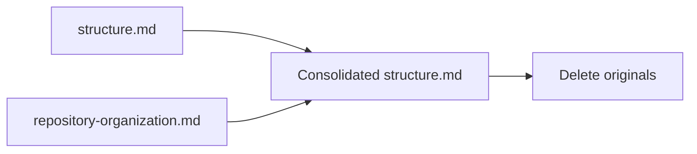

# Design Document

## Overview

This feature merges two overlapping `.kiro/steering/` auto-included files (`structure.md` and `repository-organization.md`) into a single file named `structure.md`. The two files currently duplicate directory layout information and together consume ~60 lines of context. The consolidated file preserves all rules from both sources in under 80 lines, reducing context window waste.

## Architecture

This is a file-level refactoring with no runtime components. The operation is:

1. Create a new `structure.md` that combines content from both files
2. Delete the original `structure.md` and `repository-organization.md`

No code, services, or infrastructure are involved. The `steering-index.yaml` in `senzing-bootcamp/steering/` does **not** track `.kiro/steering/` files, so it requires no changes.



## Components and Interfaces

### Consolidated File: `.kiro/steering/structure.md`

**Frontmatter:**

```yaml
---
inclusion: auto
description: "Project directory layout and naming conventions"
---
```

**Content sections (in order):**

1. **Directory tree** — compact `text` code block showing `senzing-bootcamp/` structure plus repo-level directories (`tests/`, `.github/workflows/`, `.kiro/specs/`)
2. **File placement table** — merged from `repository-organization.md`, mapping content type → location → audience
3. **Naming conventions** — bullet list from original `structure.md`
4. **Rules** — three short rules from `repository-organization.md`

### Proposed Consolidated Content (target: ≤ 78 lines)

````markdown
---
inclusion: auto
description: "Project directory layout and naming conventions"
---

# Project Structure

```text
senzing-bootcamp/           # Distributed power root
├── POWER.md / mcp.json     # Power config (root level)
├── CHANGELOG.md
├── config/                 # Machine-readable configs
├── docs/
│   ├── modules/            # MODULE_N_*.md companion docs
│   ├── guides/             # GLOSSARY, FAQ, QUICK_START, etc.
│   ├── feedback/           # Feedback templates
│   ├── policies/           # Agent policies (CODE_QUALITY_STANDARDS)
│   └── diagrams/           # Architecture and flow diagrams
├── hooks/                  # .kiro.hook JSON files + hook-categories.yaml
├── scripts/                # Python CLI tools (stdlib only)
├── steering/               # Agent steering files + steering-index.yaml
├── templates/              # User templates (checklists, lineage, UAT)
└── tests/                  # pytest + Hypothesis test suites
tests/                      # Repo-level tests (hook prompt validation)
.github/workflows/          # CI pipeline
.kiro/specs/                # Spec-driven development artifacts
```

## File Placement

| Content Type | Location | Audience |
|---|---|---|
| Module docs | `docs/modules/` | Users |
| User guides | `docs/guides/` | Users |
| Feedback templates | `docs/feedback/` | Users |
| Agent steering | `steering/` | Agents |
| Agent policies | `docs/policies/` | Agents |
| Code templates | `templates/` | Users |
| Hooks | `hooks/` | Agents |
| Scripts | `scripts/` | Both |
| Tests (power) | `tests/` | Developers |
| Power config | root (`POWER.md`, `mcp.json`) | Framework |

All paths above are relative to `senzing-bootcamp/`.

## Naming Conventions

- Scripts: `snake_case.py` with `main()` entry point and argparse CLI
- Steering files: `kebab-case.md` with YAML frontmatter
- Module steering: `module-NN-description.md` (zero-padded two digits)
- Hook files: `hook-id.kiro.hook` (matches registry ID)
- Tests: `test_feature_name.py` with class-based organization
- Configs: `kebab-case.yaml` or `snake_case.yaml`

## Rules

- Never place dev notes, build artifacts, or historical files in the repo — use git history.
- Power config files (`POWER.md`, `mcp.json`, `icon.png`) stay at `senzing-bootcamp/` root.
- Hook tests validating real hook files go in repo-root `tests/`, not `senzing-bootcamp/tests/`.
````

This draft is 56 content lines + frontmatter, well within the 80-line budget.

### Files Removed

| File | Reason |
|------|--------|
| `.kiro/steering/structure.md` | Replaced by consolidated file |
| `.kiro/steering/repository-organization.md` | Replaced by consolidated file |

### Files NOT Modified

| File | Reason |
|------|--------|
| `senzing-bootcamp/steering/steering-index.yaml` | Only tracks power steering files in `senzing-bootcamp/steering/`, not `.kiro/steering/` workspace files |

## Data Models

Not applicable — no runtime data structures. The only artifact is a static markdown file.

## Error Handling

| Scenario | Handling |
|----------|----------|
| Consolidated file exceeds 80 lines | Trim verbose comments from directory tree; abbreviate table rows |
| Missing rule from original files | Validate against requirements checklist before finalizing |
| Frontmatter parse error | Ensure YAML is valid (no tabs, proper `---` delimiters) |

## Testing Strategy

Property-based testing does **not** apply to this feature. This is a documentation consolidation task — there is no executable logic, no functions with inputs/outputs, and no universal properties to verify across generated inputs.

### Verification Approach

1. **Line count check** — Confirm the consolidated file is ≤ 80 lines (manual count or `wc -l`)
2. **Content completeness audit** — Manually verify each acceptance criterion from Requirements 2.1–2.7 is present in the consolidated file
3. **Frontmatter validation** — Run existing CI (`validate_commonmark.py`) to confirm valid markdown
4. **Deletion verification** — Confirm both original files no longer exist in `.kiro/steering/`
5. **No steering-index.yaml changes** — Confirm `senzing-bootcamp/steering/steering-index.yaml` is unmodified (Requirement 5 is not applicable since these are workspace-level steering files, not power steering files)

### Why PBT Does Not Apply

- The deliverable is a static markdown file, not a function
- There are no inputs to vary or outputs to assert properties over
- Correctness is verified by content audit against a fixed checklist
- The appropriate testing strategy is manual review + CI linting
