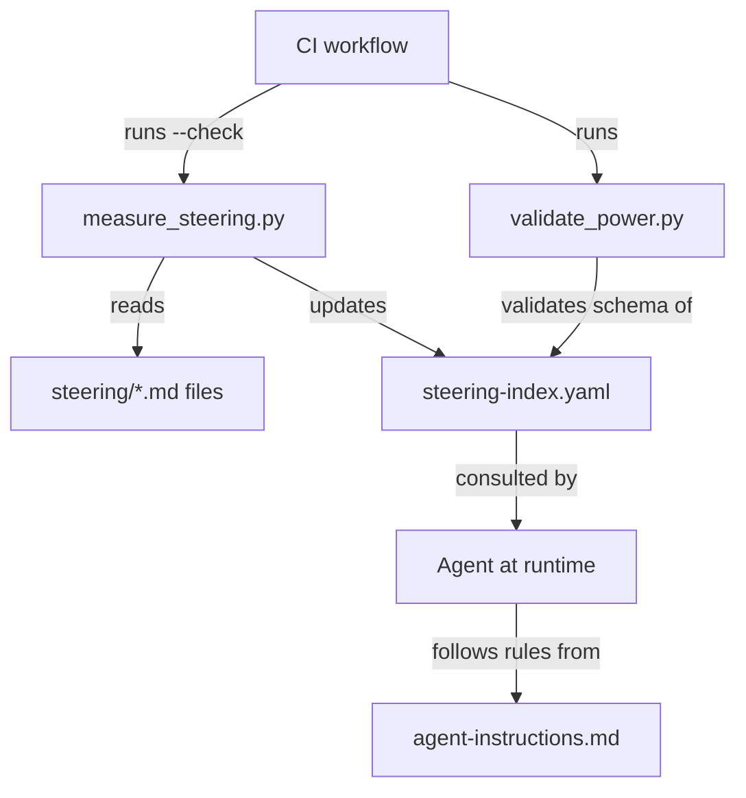

# Design Document: Context Budget Tracking

## Overview

This feature adds token-count awareness to the senzing-bootcamp power so the agent can make informed decisions about which steering files to load as the context window fills up. It introduces four coordinated changes:

1. A `file_metadata` section in `steering-index.yaml` mapping each steering file to its token count and size category
2. A `scripts/measure_steering.py` script that calculates token counts (chars ÷ 4) and updates the index
3. A `Context Budget` section in `agent-instructions.md` with threshold-based loading rules
4. CI integration via `--check` mode and `validate_power.py` schema validation

The design keeps everything in the Python standard library, preserves the existing YAML structure, and fits into the established CI pipeline with minimal friction.

## Architecture



The architecture is a simple pipeline:

- **Offline (developer time)**: `measure_steering.py` scans steering files, computes token counts, and writes `file_metadata` + `budget` into `steering-index.yaml`.
- **CI (pull request)**: The same script runs with `--check` to verify counts are fresh (within 10% tolerance). `validate_power.py` validates the schema of the new YAML sections.
- **Runtime (agent)**: The agent reads `file_metadata` from the index before loading files and follows the budget rules in `agent-instructions.md`.

No new runtime dependencies are introduced. The agent already reads `steering-index.yaml`; it just gets more data from it.

## Components and Interfaces

### 1. `measure_steering.py`

**Location**: `senzing-bootcamp/scripts/measure_steering.py`

**Responsibilities**:
- Scan `senzing-bootcamp/steering/*.md` for all markdown files
- Calculate token count per file: `round(len(content) / 4)`
- Assign size category: `small` (<500), `medium` (500–2000), `large` (>2000)
- Update `file_metadata` and `budget.total_tokens` in `steering-index.yaml` in place
- Print a summary table to stdout
- In `--check` mode: compare calculated vs. stored counts, exit non-zero if any differ by >10%

**Interface**:
```
python senzing-bootcamp/scripts/measure_steering.py          # update mode
python senzing-bootcamp/scripts/measure_steering.py --check  # validation mode
```

**Key design decisions**:
- Uses only Python standard library (no PyYAML) — parses and writes YAML with string manipulation to preserve existing content and comments
- Token estimation uses chars÷4 as specified in requirements — simple, deterministic, no tokenizer dependency
- The 10% tolerance in `--check` mode accommodates minor edits without forcing immediate re-measurement

**Internal functions**:

| Function | Purpose |
|---|---|
| `calculate_token_count(filepath)` | Read file, return `round(len(content) / 4)` |
| `classify_size(token_count)` | Return `small`, `medium`, or `large` based on thresholds |
| `scan_steering_files(steering_dir)` | Return dict of `{filename: {token_count, size_category}}` |
| `load_yaml_content(index_path)` | Read the raw YAML text of steering-index.yaml |
| `update_index(index_path, file_metadata, total_tokens)` | Write `file_metadata` and `budget` sections into the YAML, preserving existing content |
| `check_counts(index_path, calculated)` | Compare stored vs. calculated, return list of mismatches exceeding 10% |
| `print_summary(file_metadata, total_tokens)` | Print formatted table to stdout |
| `main()` | Parse args, dispatch to update or check mode |

### 2. `steering-index.yaml` Extensions

**New sections appended** (existing `modules`, `keywords`, `languages`, `deployment`, `references` sections are untouched):

```yaml
file_metadata:
  agent-instructions.md:
    token_count: 1475
    size_category: large
  common-pitfalls.md:
    token_count: 620
    size_category: medium
  # ... one entry per .md file in steering/

budget:
  total_tokens: 48250
  reference_window: 200000
  warn_threshold_pct: 60
  critical_threshold_pct: 80
```

### 3. `agent-instructions.md` — Context Budget Section

A new `## Context Budget` section appended to the existing agent instructions. Contains:

- Rule to consult `file_metadata` before loading any steering file
- Rule to track cumulative token count of loaded files
- Preference for `small`/`medium` files over `large` when alternatives exist
- Warn threshold behavior (60% of 200k = 120k tokens): load only directly relevant files
- Critical threshold behavior (80% of 200k = 160k tokens): unload non-essential files first
- Retention priority order: (1) agent-instructions.md, (2) current module, (3) language file, (4) active troubleshooting, (5) everything else
- Rule to announce token cost when loading `large` files

### 4. `validate_power.py` Extensions

**New function**: `check_steering_index_metadata()`

Added to the existing validation script. Validates:
- `file_metadata` mapping exists in steering-index.yaml
- Every `.md` file in `steering/` has a corresponding entry with integer `token_count` and valid string `size_category` (one of `small`, `medium`, `large`)
- `budget` mapping exists with `total_tokens` (int), `reference_window` (int), `warn_threshold_pct` (int), `critical_threshold_pct` (int)

### 5. CI Workflow Update

**File**: `.github/workflows/validate-power.yml`

New step inserted between "Validate power integrity" and "Run tests":

```yaml
- name: Validate steering token counts
  run: python senzing-bootcamp/scripts/measure_steering.py --check
```

### 6. POWER.md Updates

- Add context budget tracking to "What's New" section
- Add `measure_steering.py` to "Useful Commands" with both modes
- Mention budget thresholds in the steering files documentation

## Data Models

### File Metadata Entry

Each entry in the `file_metadata` mapping:

| Field | Type | Description |
|---|---|---|
| `token_count` | integer | Approximate tokens (chars ÷ 4, rounded) |
| `size_category` | string | One of: `small` (<500), `medium` (500–2000), `large` (>2000) |

### Budget Summary

The `budget` mapping:

| Field | Type | Description |
|---|---|---|
| `total_tokens` | integer | Sum of all file token counts |
| `reference_window` | integer | Fixed at 200,000 |
| `warn_threshold_pct` | integer | Fixed at 60 |
| `critical_threshold_pct` | integer | Fixed at 80 |

### Size Category Thresholds

| Category | Token Range | Rationale |
|---|---|---|
| `small` | < 500 | Negligible context cost, load freely |
| `medium` | 500 – 2000 | Moderate cost, load when relevant |
| `large` | > 2000 | Significant cost, announce before loading |


## Correctness Properties

*A property is a characteristic or behavior that should hold true across all valid executions of a system — essentially, a formal statement about what the system should do. Properties serve as the bridge between human-readable specifications and machine-verifiable correctness guarantees.*

### Property 1: Scan produces complete, correctly-structured metadata

*For any* set of `.md` files in a steering directory, running the scan logic SHALL produce a `file_metadata` dict whose keys exactly match the set of filenames, and where every value contains an integer `token_count` and a string `size_category` that is one of `small`, `medium`, or `large`.

**Validates: Requirements 1.1, 1.2, 2.4, 2.5**

### Property 2: Size classification follows threshold rules

*For any* non-negative integer token count, `classify_size` SHALL return `small` when the count is under 500, `medium` when the count is between 500 and 2000 inclusive, and `large` when the count is over 2000.

**Validates: Requirements 1.3**

### Property 3: Token count equals rounded character-count-over-four

*For any* string content, `calculate_token_count` SHALL return `round(len(content) / 4)`.

**Validates: Requirements 2.1**

### Property 4: Total tokens equals sum of individual counts

*For any* `file_metadata` dict produced by the scan, `budget.total_tokens` SHALL equal the sum of all `token_count` values in `file_metadata`.

**Validates: Requirements 1.4**

### Property 5: Update preserves existing YAML content

*For any* valid steering-index.yaml containing `modules`, `keywords`, `languages`, `deployment`, and `references` sections, running the update logic SHALL produce output where those sections are byte-identical to the original.

**Validates: Requirements 1.5, 2.2**

### Property 6: Summary output contains all file information

*For any* non-empty `file_metadata` dict, the printed summary SHALL contain every filename, its token count, its size category, and the total token count.

**Validates: Requirements 2.6**

### Property 7: Check mode detects mismatches exceeding 10% tolerance

*For any* pair of (stored_count, calculated_count) where `abs(stored_count - calculated_count) / max(calculated_count, 1) > 0.10`, the check function SHALL report that file as a mismatch. For pairs within 10%, it SHALL not report a mismatch.

**Validates: Requirements 2.7**

### Property 8: Validator detects missing or malformed metadata entries

*For any* set of `.md` files and a `file_metadata` mapping that is missing entries or contains entries with non-integer `token_count` or invalid `size_category`, the validation function SHALL report at least one error.

**Validates: Requirements 5.2, 5.3**

## Error Handling

| Scenario | Behavior |
|---|---|
| Steering directory does not exist | `measure_steering.py` exits with error message and non-zero status |
| `steering-index.yaml` does not exist | `measure_steering.py` creates it with only `file_metadata` and `budget` sections |
| `steering-index.yaml` has malformed YAML | `measure_steering.py` exits with parse error and non-zero status |
| No `.md` files found in steering directory | Produces empty `file_metadata` and `total_tokens: 0`; prints warning |
| File read permission error | Skips file, prints warning, continues with remaining files |
| `--check` mode finds mismatches | Prints mismatch details, exits with status code 1 |
| `validate_power.py` finds missing `file_metadata` | Reports error, continues other checks, exits non-zero at end |
| `validate_power.py` finds invalid `size_category` | Reports error per invalid entry |

## Testing Strategy

### Property-Based Tests (Hypothesis)

The project already uses `pytest` + `hypothesis` (visible in CI and existing test files). Each correctness property maps to a single property-based test with minimum 100 iterations.

**Library**: [Hypothesis](https://hypothesis.readthedocs.io/) (already a project dependency)

**Test file**: `tests/test_measure_steering.py`

| Test | Property | What it generates |
|---|---|---|
| `test_scan_completeness_and_structure` | Property 1 | Random sets of filenames and file contents in a temp directory |
| `test_classify_size_thresholds` | Property 2 | Random non-negative integers |
| `test_token_count_formula` | Property 3 | Random strings (including empty, unicode, large) |
| `test_total_tokens_sum_invariant` | Property 4 | Random file metadata dicts |
| `test_update_preserves_existing_yaml` | Property 5 | Random YAML content with known sections + random file metadata |
| `test_summary_contains_all_info` | Property 6 | Random file metadata dicts |
| `test_check_mode_threshold_detection` | Property 7 | Random pairs of (stored, calculated) counts |
| `test_validator_detects_malformed_metadata` | Property 8 | Random file sets + deliberately malformed metadata |

Each test tagged with: `# Feature: context-budget-tracking, Property N: <title>`

Configuration: `@settings(max_examples=100)`

### Unit Tests (Example-Based)

**Test file**: `tests/test_measure_steering.py` (same file, separate section)

- Verify `--check` mode does not modify the YAML file (Req 2.7)
- Verify script runs with no external dependencies (Req 2.8 — smoke test)
- Verify `agent-instructions.md` contains Context Budget section with all required instructions (Req 3.1–3.7)
- Verify CI workflow YAML has the token validation step in correct position (Req 4.1, 4.3)
- Verify `validate_power.py` exits non-zero on missing `file_metadata` (Req 5.1, 5.5)
- Verify `validate_power.py` exits non-zero on missing `budget` fields (Req 5.4, 5.5)
- Verify POWER.md contains expected documentation updates (Req 6.1–6.3)

### Integration Tests

- End-to-end: run `measure_steering.py` against the real steering directory, then run `--check` — should pass
- End-to-end: run `validate_power.py` against the real power directory — should pass with new schema checks
