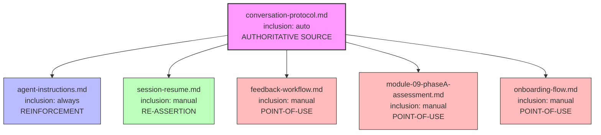

# Design Document: Conversation UX Rules

## Overview

This design addresses five recurring conversation UX violations in the senzing-bootcamp power by modifying steering files (Markdown with YAML frontmatter). The violations are:

1. **Multi-question turns** — Agent asks multiple questions in a single response
2. **Not waiting for responses** — Agent continues past a question without bootcamper input
3. **Dead-end silences** — Agent acknowledges input but provides no forward action
4. **Missing 👉 prefix** — Questions lack the visual marker signaling bootcamper's turn
5. **Self-answering** — Agent answers its own questions after session resume

The fix is purely content-based: adding enforcement sections, violation examples, STOP markers, and 👉 prefixes to existing steering files. No code, scripts, or new files are created beyond the steering content modifications.

### Design Rationale

The existing `conversation-protocol.md` (auto-loaded, always in context) contains the right rules but lacks:

- Explicit violation examples that make misinterpretation harder
- A self-check mechanism the agent can apply before ending a turn
- Reinforcement at the point of use in context-specific steering files
- Re-assertion on session resume when context resets

The strategy is: strengthen the authoritative source (conversation-protocol.md), then reinforce at known violation points (feedback-workflow, module-09, onboarding-flow, session-resume, agent-instructions).

## Architecture



Loading hierarchy:

- `conversation-protocol.md` — auto-loaded (always in context during active sessions). Highest token cost for additions.
- `agent-instructions.md` — always-loaded. Second highest token cost.
- `session-resume.md` — manually loaded on session start only.
- `feedback-workflow.md`, `module-09-phaseA-assessment.md`, `onboarding-flow.md` — manually loaded when their workflow/module is active.

## Components and Interfaces

### Component 1: conversation-protocol.md (Primary — 4 new sections)

**Current token count:** 515 tokens
**Estimated addition:** ~400 tokens (new sections are concise to minimize auto-load cost)
**New estimated total:** ~915 tokens (stays within `medium` size category)

#### New Section: One Question Rule

Placed after the existing "Question Stop Protocol" section. Defines the constraint explicitly:

- Each turn contains at most one 👉 question
- Multi-question patterns with conjunctions (and, or, also, but first) are violations
- Sequential information gathering requires separate turns

#### New Section: Violation Examples

Concrete before/after examples for each of the five rule categories. Format:

```markdown
## Violation Examples

### Multi-Question (WRONG)
> 👉 What language do you want? Also, which track interests you?

### Multi-Question (CORRECT)
> 👉 What language do you want?
> 🛑 STOP
> [wait for response, then in next turn:]
> 👉 Which track interests you?

[...one example per category...]
```

#### New Section: Rule Priority

Single paragraph stating conversation UX rules take precedence over content generation. The agent must never sacrifice turn-taking correctness to deliver more information.

#### New Section: Self-Check

Four questions the agent verifies before ending any turn:

1. Does this turn contain more than one 👉 question?
2. Does any 👉 question lack the prefix?
3. Is there content after a 👉 question?
4. Am I answering my own question?

### Component 2: session-resume.md (New section between Step 2 and Step 3)

**Current token count:** 1620 tokens
**Estimated addition:** ~150 tokens
**New estimated total:** ~1770 tokens (stays `medium`)

#### New Section: Behavioral Rules Reload

Inserted between "Step 2: Load Language Steering" and "Step 3: Summarize and Confirm". Contains:

- Explicit re-statement of all five core rules (one sentence each)
- Reference to conversation-protocol.md as authoritative source
- Self-answering prohibition with example forbidden phrases
- Instruction to write `config/.question_pending` after the "Ready to continue?" question

### Component 3: feedback-workflow.md (Preamble + STOP markers)

**Current token count:** 1062 tokens
**Estimated addition:** ~120 tokens
**New estimated total:** ~1182 tokens (stays `medium`)

#### New Section: Conversation Rules (preamble before Step 0)

Brief preamble stating:

- One question per turn
- Use 👉 prefix on every question
- 🛑 STOP after each question
- Do not combine confirmation and priority questions

#### Modification: Step 2 questions get 👉 prefix and 🛑 STOP markers

Each of the six questions in Step 2 gets:

- 👉 prefix on the question text
- `🛑 STOP — End your response here.` block after each question

### Component 4: module-09-phaseA-assessment.md (👉 prefix on questions)

**Current token count:** 1220 tokens (from steering-index; actual ~1680)
**Estimated addition:** ~4 tokens (two 👉 characters)
**New estimated total:** negligible change

#### Modification: Step 1a and Step 1b questions

Add 👉 prefix to:

- Step 1a: `👉 "Do you have any compliance requirements?..."`
- Step 1b: `👉 "Who are the security stakeholders for this project?..."`

### Component 5: agent-instructions.md (Communication section reinforcement)

**Current token count:** 1676 tokens
**Estimated addition:** ~60 tokens
**New estimated total:** ~1736 tokens (stays `medium`)

#### Modification: Communication section

Add after the existing "One question at a time" bullet:

- Explicit prohibition against combining questions with conjunctions (and, or, also, but first)
- Cross-reference statement: "These rules apply in ALL contexts — onboarding, feedback workflow, module steps, and session resume. See conversation-protocol.md for the full rule set."
- Statement that a question without 👉 prefix is a formatting violation

### Component 6: onboarding-flow.md (👉 prefix on gate questions)

**Current token count:** 4020 tokens
**Estimated addition:** ~30 tokens (👉 prefixes on existing questions)
**New estimated total:** ~4050 tokens (stays `large`)

#### Modification: Mandatory gate questions and preference questions

Add 👉 prefix to:

- Step 2 (Language Selection): The language choice prompt
- Step 4b (Verbosity Preference): The verbosity question
- Step 4c (Comprehension Check): The check-in question
- Step 5 (Track Selection): The track choice prompt

These already have 🛑 STOP markers (mandatory gates) or hook-based stopping, so only the prefix is needed.

## Data Models

This feature does not introduce new data models. The only data artifact is the existing `config/.question_pending` file, which is a plain text file containing the question text. Its usage is already defined; this design makes its use mandatory (not optional) for every 👉 question.

File: `config/.question_pending`

- Created by: Agent, immediately after outputting a 👉 question
- Contains: The question text (plain string)
- Deleted by: Agent, at the start of the next turn when processing bootcamper input
- Purpose: Enforcement mechanism preventing the agent from generating content when a question is pending

## Correctness Properties

*A property is a characteristic or behavior that should hold true across all valid executions of a system — essentially, a formal statement about what the system should do. Properties serve as the bridge between human-readable specifications and machine-verifiable correctness guarantees.*

### Property 1: Universal 👉 prefix on bootcamper-directed questions

*For any* steering file in `senzing-bootcamp/steering/` that contains a question directed at the bootcamper (identified by an adjacent 🛑 STOP marker or ⛔ mandatory gate annotation), the question text SHALL be prefixed with 👉.

Validates: Requirements 4.1, 4.2, 4.3, 4.4, 7.2, 7.4

### Property 2: STOP marker follows every 👉 question before next question

*For any* steering file in `senzing-bootcamp/steering/` that contains multiple 👉 questions, there SHALL be a 🛑 STOP marker (or end-of-file) between each 👉 question and the next 👉 question in document order.

Validates: Requirements 1.3, 2.3, 7.3

### Property 3: Behavioral Rules Reload completeness and ordering

*For any* valid `session-resume.md` file, there SHALL exist a "Behavioral Rules Reload" section that (a) appears before the "Step 3" heading in document order, and (b) contains references to all five core rules: one-question-per-turn, wait-for-response, no-dead-ends, 👉-prefix-required, and no-self-answering.

Validates: Requirements 6.1, 6.2

### Property 4: Violation Examples section covers all five rule categories

*For any* valid `conversation-protocol.md` file, the "Violation Examples" section SHALL contain at least one before/after example pair for each of the five rule categories: multi-question, not-waiting, dead-end, missing-prefix, and self-answering.

Validates: Requirements 8.1

### Property 5: Self-Check section contains all verification questions

*For any* valid `conversation-protocol.md` file, the "Self-Check" section SHALL contain all four verification questions: (a) multiple 👉 questions in turn, (b) missing 👉 prefix, (c) content after 👉 question, (d) answering own question.

Validates: Requirements 8.3

## Error Handling

Since this feature modifies only Markdown steering files, "errors" manifest as:

1. **CommonMark validation failures** — CI runs `validate_commonmark.py` on all steering files. All additions must be valid CommonMark. Mitigation: avoid HTML entities, ensure proper heading hierarchy, use fenced code blocks for examples.

2. **Token budget overruns** — `measure_steering.py --check` enforces token budgets from `steering-index.yaml`. Mitigation: keep additions minimal, especially in auto-loaded files. The largest addition (~400 tokens to conversation-protocol.md) keeps it well under the `split_threshold_tokens: 5000`.

3. **Heading duplication warnings** — MD024 warns on duplicate headings. Mitigation: use unique heading text for new sections (e.g., "Violation Examples" not "Examples").

4. **Inconsistent rule statements** — If the same rule is stated differently in conversation-protocol.md vs. agent-instructions.md, the agent may receive conflicting guidance. Mitigation: conversation-protocol.md is the authoritative source; all other files reference it rather than restating rules in full.

5. **Missing 👉 prefix on future questions** — New module steering files added later may omit the prefix. Mitigation: Property 1 can be run as a CI check to catch regressions.

## Testing Strategy

### Property-Based Tests (Hypothesis)

The correctness properties above are structural properties of Markdown files that can be validated by parsing. Property-based testing applies here because:

- We can generate variations of steering file content and verify structural invariants hold
- The input space (file content with questions, markers, sections) is large
- Universal properties (every question has prefix, every question has STOP) are natural PBT targets

**Library:** Hypothesis (Python) — already in use in this project
**Location:** `senzing-bootcamp/tests/`
**Minimum iterations:** 100 per property test

Each property test will:

1. Parse the actual steering files from `senzing-bootcamp/steering/`
2. Verify the structural invariant holds
3. For generative tests: generate random steering file fragments with questions and verify the invariant detection logic works correctly

Tag format: `Feature: conversation-ux-rules, Property {N}: {property_text}`

### Unit Tests (pytest)

Example-based tests for specific acceptance criteria not covered by properties:

- Verify conversation-protocol.md contains the "Rule Priority" section
- Verify conversation-protocol.md states question_pending is mandatory
- Verify session-resume.md references conversation-protocol.md
- Verify agent-instructions.md Communication section contains conjunction prohibition
- Verify feedback-workflow.md has "Conversation Rules" preamble section
- Verify session-resume.md contains self-answering prohibition text before Step 3

### CI Integration

The existing CI pipeline (`validate-power.yml`) already runs:

- `validate_commonmark.py` — ensures all steering files are valid CommonMark
- `measure_steering.py --check` — ensures token budgets are not exceeded
- `pytest` — runs all tests including the new property and unit tests

No new CI steps are needed. The new tests integrate into the existing pytest suite.

### Implementation Order

Changes should be applied in this order to minimize risk:

1. **conversation-protocol.md** — Add all four new sections (authoritative source first)
2. **session-resume.md** — Add Behavioral Rules Reload section
3. **agent-instructions.md** — Add Communication section reinforcement
4. **feedback-workflow.md** — Add preamble + 👉 prefixes + 🛑 STOP markers on Step 2
5. **module-09-phaseA-assessment.md** — Add 👉 prefix to Step 1a/1b questions
6. **onboarding-flow.md** — Add 👉 prefix to gate/preference questions
7. **steering-index.yaml** — Update token counts for modified files
8. **Tests** — Write property-based and unit tests validating all changes
