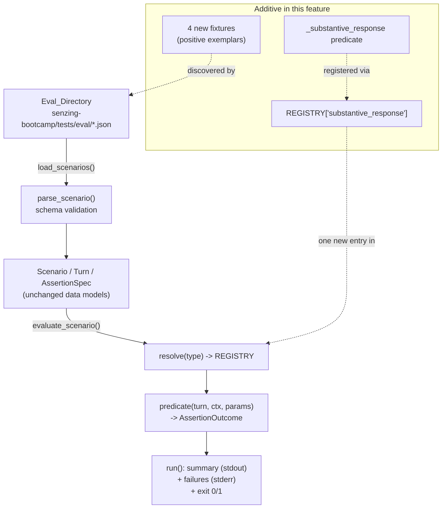

# Design Document

## Overview

This feature expands the behavioral coverage of the existing conversational-eval harness
(`senzing-bootcamp/scripts/eval_conversations.py`) without redesigning it. It adds four new
positive-exemplar Scenario_Fixtures and exactly one new Assertion_Type (`substantive_response`),
plus tests, to give behavioral coverage to four high-value governing rules that today are verified
only by string-presence tests.

The work is deliberately small and additive. The fixture schema, loader, validator, registry
mechanism, reporter, summary line, CLI, and exit-code contract are all unchanged. The only code
change to `eval_conversations.py` is:

1. One new pure predicate function `_substantive_response(turn, ctx, params) -> AssertionOutcome`.
2. One new `REGISTRY` entry mapping `"substantive_response"` to that predicate.
3. One new documentation block in the registry comment.

No `REQUIRED_PARAMS` entry is added (the new type takes no parameters), and no existing predicate's
evaluation logic is touched.

### Verification performed before writing this design

Every API and convention referenced below was read from the real codebase, not assumed:

- **Predicate signature** — every predicate is `(turn: Turn, ctx: EvalContext, params: dict[str, object]) -> AssertionOutcome`, returns `AssertionOutcome(True, "")` on pass and `AssertionOutcome(False, <reason>)` on fail, and is a pure function (no IO).
- **`REGISTRY`** — a `dict[str, Predicate]` with the 9 existing types; `resolve()` rejects unknown types with a `SchemaError`.
- **`REQUIRED_PARAMS`** — a `dict[str, tuple[str, ...]]` listing only the parameterized types (`contains_marker`, `absent_marker`, `mentions_tool`, `gate_not_bypassed`). Types absent from this map take no parameters.
- **Existing predicates** — `_exactly_one_pointer`, `_ends_with_question_then_stop`, `_no_compound_question`, `_no_self_answer`, `_contains_marker`, `_absent_marker`, `_mentions_tool`, `_transition_response_completeness`, `_gate_not_bypassed`, and the helpers `count_pointers`, `_last_pointer_line_index`, `_is_boundary_line`, `count_question_marks`, `COMPOUND_CONJUNCTION_PATTERNS`.
- **Existing fixtures** — `single_question_stop.json`, `module_transition_completeness.json`, `module3_gate_not_bypassed.json`, `license_insufficient_search_docs.json`, including the `🛑 STOP — End your response here...` boundary-line convention.
- **Test conventions** — `senzing-bootcamp/tests/test_eval_conversations.py`: `from __future__ import annotations`, class-based organization, `st_`-prefixed strategies, `@settings(max_examples=20)`, the `_outcome()` helper, the `_SHIPPED_FIXTURES`/`_EVAL_DIR` constants, and the oracle test `TestShippedFixturesPassProperty` which asserts `len(_SHIPPED_FIXTURES) == 4`.
- **Steering anchors and tokens** — confirmed in the steering corpus (citations in the fixture sections below): the MCP-First Invariant and its tool list, the SQL redirect rule and its real internal table names, the Question Disambiguation rule, and the Answer Processing Priority substantive-output rule.

### Resolved design decisions (flagged in requirements)

**(a) Positive-exemplars-only — confirmed; harness contract unchanged.** The current harness asserts
that recorded agent turns are *correct*: a fixture passes when all of its attached assertions hold,
and the CI step exits 0. Every new fixture in this feature is a Positive_Exemplar whose agent turns
pass all attached assertions. We do **not** introduce negative-example (expected-fail) support,
because that would require a new per-assertion "expected outcome" concept in the schema and a change
to the evaluation/exit-code contract — out of scope and explicitly excluded by Requirement 7.3. The
harness contract (`run()` returns 0 iff zero assertions fail) is preserved exactly.

**(b) Hook-silence rule stays deferred (Requirement 11.1).** The hook-silence rule
(`hook-architecture.md`, "when a hook check passes, zero visible tokens") cannot be expressed in the
current transcript model. A passing hook produces an *absence* of an agent turn — there is no turn
text to attach an assertion to. The harness data model is an ordered list of `Turn` objects, and
assertions are evaluated only against the `content` of a present agent turn (`evaluate_scenario`
skips any turn that is not an agent turn or has no assertions). There is no construct for "assert
that no turn exists at this position," so silence is not representable without a model change. This
candidate is recorded as deferred, along with the other deferred candidates (additional
mandatory-gate skip scenarios per R11.2, and additional MCP-First branches such as
`explain_error_code` / `generate_scaffold` per R11.3). None are implemented in v1 (R11.4).

## Architecture

The harness architecture is unchanged. The diagram shows where the additive change plugs in
(highlighted): one new predicate and its single registry entry; four new fixtures discovered by the
existing loader.



Key architectural facts preserved:

- **Single extension point.** Adding an Assertion_Type means writing a predicate and adding one
  `REGISTRY` entry (plus one `REQUIRED_PARAMS` entry only if it takes a parameter). This feature uses
  exactly that extension point and adds no parameter, so `REQUIRED_PARAMS` is untouched.
- **Offline and deterministic.** The new predicate is a pure function of its `turn.content`; it makes
  no network, filesystem, clock, or random-source access, so repeated runs are identical (R6.4, R10.5).
- **Discovery is automatic.** `load_scenarios()` globs `*.json` in the Eval_Directory in sorted order,
  so the four new fixtures are picked up with no loader change (R1.5).

## Components and Interfaces

### Component 1: The `substantive_response` predicate (new)

A new module-level predicate added to `eval_conversations.py` alongside the existing predicates,
with the identical uniform signature so the registry dispatches it the same way.

#### Signature and contract

```python
def _substantive_response(
    turn: Turn, ctx: EvalContext, params: dict[str, object]
) -> AssertionOutcome:
    """Pass when the agent turn is a Substantive_Response, not Minimal_Output (R6.2, R6.3).

    Substantive_Response = NOT Minimal_Output. Minimal_Output is content that is
    empty, whitespace-only, a single-word acknowledgment, or fewer than 50
    characters of content. Mirrors the answer-processing substantive-output rule
    in conversation-protocol.md (".", "OK", empty, or < 50 chars are violations).

    The predicate takes no parameters (so it has no REQUIRED_PARAMS entry, R6.6).
    It is a pure function of turn.content — no network, filesystem, clock, or
    random-source access (R6.4), consistent with every existing predicate.

    Args:
        turn: The agent turn being evaluated.
        ctx: Surrounding-transcript context (unused).
        params: Assertion parameters (unused; the type takes none).

    Returns:
        Passing outcome when the content is substantive; otherwise a failing
        outcome whose message names which Minimal_Output condition was hit.
    """
    content = turn.content.strip()
    if not content:
        return AssertionOutcome(False, "minimal output: empty or whitespace-only content")
    words = content.split()
    if len(words) <= 1:
        return AssertionOutcome(
            False, f"minimal output: single-word acknowledgment {content!r}"
        )
    if len(content) < 50:
        return AssertionOutcome(
            False,
            f"minimal output: {len(content)} characters of content "
            f"(Substantive_Response requires >= 50)",
        )
    return AssertionOutcome(True, "")
```

#### Pass/fail logic and the threshold

The predicate evaluates three Minimal_Output conditions in order, returning the first that matches;
if none match, the content is a Substantive_Response and the predicate passes:

1. **Empty / whitespace-only** — `turn.content.strip()` is `""`. Covers empty output and
   whitespace-only output.
2. **Single-word acknowledgment** — the stripped content splits into at most one whitespace-delimited
   token. Covers `"."`, `"OK"`, `"Okay"`, `"Understood"`, `"Got"`. (A 0-token case is already caught
   by step 1; step 2 catches the 1-token case.)
3. **Too short** — the stripped content is fewer than 50 characters. This is the exact threshold from
   the steering rule ("any response under 50 characters ... is a protocol violation"), so `< 50`
   fails and `>= 50` passes.

#### How "content" is measured, and whether markers count — decision and justification

**Decision: "content" is the full turn text after `str.strip()`, including any `👉` / `🛑` markers;
its `len()` is compared against the threshold.**

Justification — this is consistent with how the harness already measures turn length. The only other
length-based predicate, `_transition_response_completeness`, computes `length = len(content)` over the
**entire raw `turn.content`** (markers included) and compares `length <= 50`. To stay consistent,
`substantive_response` measures the same way, differing only by stripping leading/trailing whitespace
first so that a turn of pure whitespace is correctly classified as empty rather than as "long enough."
The steering rule itself speaks of "any response under 50 characters," i.e. the whole response, which
confirms counting the full content rather than trying to subtract marker characters. Stripping (rather
than raw `len`) is the minimal, defensible refinement: it makes the empty/whitespace case exact without
changing the outcome for any genuinely substantive turn (a real module-start turn is hundreds of
characters, far above the threshold regardless of a few marker glyphs).

#### Human-readable failure messages

On failure the predicate returns a specific, human-readable reason (matching the existing convention
of messages like `"expected exactly one pointer, found {count}"`):

- empty/whitespace → `"minimal output: empty or whitespace-only content"`
- single word → `"minimal output: single-word acknowledgment '<content>'"`
- too short → `"minimal output: <n> characters of content (Substantive_Response requires >= 50)"`

#### Registration — one-line addition (R6.5), no `REQUIRED_PARAMS` entry (R6.6)

```python
REGISTRY: dict[str, Predicate] = {
    "exactly_one_pointer": _exactly_one_pointer,
    "ends_with_question_then_stop": _ends_with_question_then_stop,
    "no_compound_question": _no_compound_question,
    "no_self_answer": _no_self_answer,
    "contains_marker": _contains_marker,
    "absent_marker": _absent_marker,
    "mentions_tool": _mentions_tool,
    "transition_response_completeness": _transition_response_completeness,
    "gate_not_bypassed": _gate_not_bypassed,
    "substantive_response": _substantive_response,  # NEW (R6.5)
}
```

`REQUIRED_PARAMS` is **not** modified — the new type takes no parameters, so it must not appear there
(R6.6). Because it takes no parameters, a fixture attaches it as `{"type": "substantive_response"}`,
exactly like the other parameterless types.

#### Registry documentation block (R6.7)

A documentation stanza is added to the registry comment alongside the existing nine, matching their
format:

```text
#   substantive_response
#       Purpose: pass when the agent turn is a Substantive_Response (not
#                Minimal_Output: not empty, not whitespace-only, not a
#                single-word acknowledgment, and >= 50 characters of content).
#       Params:  none.
```

#### Purity confirmation (R6.4)

`_substantive_response` reads only `turn.content` and Python builtins (`str.strip`, `str.split`,
`len`). It performs no IO and contains no randomness or clock access, so it is a pure, total function
over its string input — it returns an `AssertionOutcome` for every possible input and never raises.
This is verified by the existing stdlib-only/no-network import audit (the predicate adds no imports)
and by the determinism already guaranteed for the evaluation layer.

### Component 2: Four new Scenario_Fixtures (new, positive exemplars)

All four fixtures use the existing schema exactly (`scenario`, `description`, `rule_ref`, `turns` with
`role`/`content`/`assertions`) and live in `senzing-bootcamp/tests/eval/`. Each is reasoned through
below to confirm every attached assertion passes against the predicate logic.

#### Fixture 1 — MCP-First SDK / attribute branch (Requirement 2)

`senzing-bootcamp/tests/eval/mcp_first_sdk_reference.json`

```json
{
  "scenario": "mcp_first_sdk_reference",
  "description": "Bootcamper asks for an SDK method signature; the agent consults the MCP server via get_sdk_reference before stating the signature, then ends on a single pointer question and stops. Exercises the MCP-First Invariant for the SDK-reference branch, distinct from the licensing branch in license_insufficient_search_docs.json.",
  "rule_ref": "agent-instructions.md#mcp-first-invariant",
  "turns": [
    {
      "role": "bootcamper",
      "content": "What parameters does the add_record method take in the Senzing SDK?"
    },
    {
      "role": "agent",
      "content": "Good question, and I will not quote the signature from memory. Let me look it up with the Senzing MCP server by calling get_sdk_reference(method='add_record', language='python') so we use the current, authoritative definition.\n\nHere is what the current reference returns: add_record takes the data source code, the record identifier, and the record definition, plus optional engine flags. I will use that exact signature when we scaffold your loader.\n\n👉 Want me to scaffold the add_record call for your loader now?\n\n🛑 STOP — End your response here and wait for the bootcamper's real input.",
      "assertions": [
        {"type": "mentions_tool", "tool": "get_sdk_reference"},
        {"type": "exactly_one_pointer"},
        {"type": "ends_with_question_then_stop"}
      ]
    }
  ]
}
```

Grounding: `get_sdk_reference` is the real tool for "Signatures" per `agent-instructions.md`
(line 48: "Signatures → `get_sdk_reference`") and `mcp-tool-decision-tree.md` ("Looking up method
signatures or flags? → get_sdk_reference"). The MCP-First Invariant violation example in
`agent-instructions.md` is literally "Stating that `add_record` accepts a `LOAD_ID` parameter without
calling `get_sdk_reference`," so this exemplar shows the corrected behavior.

Assertion pass-through reasoning:

- `mentions_tool {tool: "get_sdk_reference"}` → `\bget_sdk_reference\b` matches in
  "calling get_sdk_reference(method=..." (space before, `(` after — both word boundaries). **Pass.**
- `exactly_one_pointer` → exactly one `👉` in the content. **Pass.**
- `ends_with_question_then_stop` → the last `👉` line is the question; the only non-empty line after it
  is the `🛑 STOP — End your response here...` line, which `_is_boundary_line` recognizes (matches the
  `🛑 STOP` hard-stop regex and contains "end your response"). No substantive content follows. **Pass.**

(`no_compound_question` and `no_self_answer` are not attached here, matching Requirement 2.3–2.4, which
specify only `mentions_tool`, `exactly_one_pointer`, and `ends_with_question_then_stop`.)

#### Fixture 2 — No-direct-SQL redirect (Requirement 3)

`senzing-bootcamp/tests/eval/sql_redirect_reporting_guide.json`

```json
{
  "scenario": "sql_redirect_reporting_guide",
  "description": "Bootcamper poses a SQL-tempting 'count entities' request; the agent redirects to the SDK via reporting_guide and emits no direct SQL against the Senzing database, then ends on a single pointer question and stops. Exercises the SQL Redirect Rule, complementing the string-presence test test_no_direct_sql_preservation.py.",
  "rule_ref": "mcp-usage-reference.md#sql-redirect-rules",
  "turns": [
    {
      "role": "bootcamper",
      "content": "How do I count how many entities are in the database? Can I just run a query against the tables directly?"
    },
    {
      "role": "agent",
      "content": "Counting entities is a great question, and we do that through the SDK rather than touching the database directly. Querying the internal storage by hand bypasses the SDK abstraction and can return misleading numbers, so I will use the Senzing MCP server instead by calling reporting_guide(topic='entity_summary') to get an authoritative entity count for your loaded data.\n\nThat gives us the resolved entity total without hand-writing any database access against the internal storage.\n\n👉 Want me to pull the entity summary for your current data source now?\n\n🛑 STOP — End your response here and wait for the bootcamper's real input.",
      "assertions": [
        {"type": "mentions_tool", "tool": "reporting_guide"},
        {"type": "absent_marker", "marker": "SELECT"},
        {"type": "absent_marker", "marker": "RES_ENT"},
        {"type": "exactly_one_pointer"},
        {"type": "ends_with_question_then_stop"}
      ]
    }
  ]
}
```

Grounding: `reporting_guide` is the real redirect target for "count entities" per
`mcp-usage-reference.md#sql-redirect-rules` (table row: `"count entities" | reporting_guide`) and
`mcp-tool-decision-tree.md` ("Counting entities or getting statistics? → reporting_guide (NEVER direct
SQL against Senzing database)"). `SELECT` and `RES_ENT` are the exact SQL keyword and internal table
name named in the rule: "Never generate direct SQL (SELECT, INSERT, UPDATE, DELETE) ... or its internal
tables (RES_ENT, OBS_ENT, ...)".

Assertion pass-through reasoning:

- `mentions_tool {tool: "reporting_guide"}` → `\breporting_guide\b` matches in
  "calling reporting_guide(topic=...". **Pass.**
- `absent_marker {marker: "SELECT"}` → `_absent_marker` checks `"SELECT" not in content` (case-sensitive
  substring). The agent prose contains no uppercase `SELECT` (it deliberately avoids SQL; words like
  "resolved" and "misleading" do not contain the substring `SELECT`). **Pass.**
- `absent_marker {marker: "RES_ENT"}` → `"RES_ENT" not in content`. No occurrence of `RES_ENT`
  ("resolved", "results", "storage" do not contain it). **Pass.**
- `exactly_one_pointer` → one `👉`. **Pass.**
- `ends_with_question_then_stop` → `👉` line is last, followed only by the `🛑 STOP` boundary line.
  **Pass.**

Note: the bootcamper turn says "query against the tables directly" and includes a `?`, but bootcamper
turns carry no assertions and are never evaluated, so the redirect/absent-marker checks apply only to
the agent turn (R2.4 forbids assertions on bootcamper turns; the loader enforces this).

#### Fixture 3 — 👉 disambiguation confirmation (Requirement 4)

`senzing-bootcamp/tests/eval/confirmation_question_disambiguation.json`

```json
{
  "scenario": "confirmation_question_disambiguation",
  "description": "After summarizing captured context, the agent poses a single confirmation pointer question with exactly one unambiguous yes/no meaning, no appended follow-up, no compound conjunction, and no self-answer, then stops. Exercises the Question Disambiguation Rule, distinct from single_question_stop.json in that it targets a confirmation question that must not carry an appended follow-up.",
  "rule_ref": "conversation-protocol.md#question-disambiguation",
  "turns": [
    {
      "role": "bootcamper",
      "content": "We keep customer records in two separate systems and we want to merge them into one clean list."
    },
    {
      "role": "agent",
      "content": "Here is what I captured: you keep customer records in two separate systems, and your goal is to resolve them into a single deduplicated master list. I will use that as the basis for the mapping work in the next step.\n\n👉 Does that capture your situation accurately?\n\n🛑 STOP — End your response here and wait for the bootcamper's real input.",
      "assertions": [
        {"type": "exactly_one_pointer"},
        {"type": "no_compound_question"},
        {"type": "no_self_answer"},
        {"type": "ends_with_question_then_stop"}
      ]
    }
  ]
}
```

Grounding: `conversation-protocol.md#question-disambiguation` gives this exact CORRECT exemplar —
"👉 Does that capture your situation accurately?" — and forbids appending "or should we adjust
anything?" / "Anything I missed?" to a confirmation. `agent-behavior-rules.md` Rule 3 ("Eliminate
Ambiguous Yes/No Questions") is the companion rule.

Assertion pass-through reasoning (special attention to the conjunction and self-answer predicates):

- `exactly_one_pointer` → one `👉`. **Pass.**
- `no_compound_question` → two checks:
  - `count_question_marks(content)` must be `<= 1`. The summary sentences contain **no** `?`
    ("Here is what I captured: ... master list." and "I will use that ... next step." both end with
    `.`); only the confirmation line has a `?`. Total `?` count = 1, so the `> 1` branch does not fire.
  - No line may match `COMPOUND_CONJUNCTION_PATTERNS` (the distinctive multi-word conjunctions:
    `alternatively`, `or would you rather`, `or should we`, `or would you prefer`, `or if you prefer`).
    The summary uses "and" (a bare "and", not in the pattern list) and contains none of those phrases.
    The bare word "or" never appears. **Pass.**
- `no_self_answer` → `_last_pointer_line_index` is the `👉` confirmation line; after it the only
  non-empty line is the `🛑 STOP` boundary, which is skipped as a boundary. No declarative answering
  sentence follows the question. **Pass.**
- `ends_with_question_then_stop` → same structure: nothing substantive after the `👉` line. **Pass.**

The exemplar prose is deliberately written to avoid tripping `_no_compound_question` and
`_no_self_answer`: the only `?` is on the pointer line, there is no second question, no distinctive
conjunction joins alternatives, and no sentence after the pointer line answers the question.

#### Fixture 4 — Substantive response after a Transition_Confirmation (Requirement 5)

`senzing-bootcamp/tests/eval/substantive_response_after_confirmation.json`

```json
{
  "scenario": "substantive_response_after_confirmation",
  "description": "After the bootcamper affirmatively confirms readiness for the next module (a Transition_Confirmation), the agent produces a Substantive_Response (a full module start), not Minimal_Output. Exercises the answer-processing substantive-output rule via the new substantive_response assertion type.",
  "rule_ref": "conversation-protocol.md#answer-processing-priority",
  "turns": [
    {
      "role": "bootcamper",
      "content": "Yes, I'm ready to start Module 2."
    },
    {
      "role": "agent",
      "content": "━━━━━━━━━━━━━━━━━━━━━━━━━━━━━━\nMODULE 2: SDK Setup\n━━━━━━━━━━━━━━━━━━━━━━━━━━━━━━\n\nGreat — your business problem is documented, so now we stand up the Senzing SDK in your chosen language. Step 1 detects whether the SDK is already installed so we never reinstall something that is already working on your machine.",
      "assertions": [
        {"type": "substantive_response"}
      ]
    }
  ]
}
```

Grounding: `conversation-protocol.md#answer-processing-priority` requires substantive output after a
pending answer, and the Module Transition Protocol section states that a response under 50 characters
(or a single-word ack / empty) after a Transition_Confirmation is a protocol violation. This exemplar
shows the corrected behavior: a real module start.

Assertion pass-through reasoning:

- `substantive_response` → `turn.content.strip()` is the full module-start block: non-empty, dozens of
  whitespace-delimited words, and well over 50 characters (the banner plus two sentences are several
  hundred characters). None of the three Minimal_Output conditions fire. **Pass.**

Complementary assertions were considered. `transition_response_completeness` would also pass against
this content (it has a banner, "MODULE 2", before/after framing via "documented ... now", and "Step 1"),
but it is intentionally **omitted** here to keep this fixture's purpose unambiguous — it exercises the
*new* `substantive_response` type — and because the existing `module_transition_completeness.json`
already covers the four-element transition check. Keeping the two fixtures non-overlapping avoids
redundant coverage.

### Component 3: Test additions (new)

Additions to `senzing-bootcamp/tests/test_eval_conversations.py` (detailed in Testing Strategy):

1. Import `_substantive_response` into the existing `from eval_conversations import (...)` block.
2. A property-test class for `substantive_response` (Substantive_Response vs Minimal_Output).
3. A fixture-pass class verifying each of the four new fixtures evaluates with zero failures.
4. Update the oracle constant assertion `len(_SHIPPED_FIXTURES) == 4` to `== 8` (see Error Handling).

## Data Models

No data model changes. The new predicate and fixtures reuse the existing models verbatim. They are
restated here for reference.

### Fixture schema (unchanged)

```text
Scenario_Fixture (JSON object)
├── scenario: string (non-empty)            # R1.2
├── description: string                       # R1.3
├── rule_ref: string (optional)               # R1.6
└── turns: array (>= 1)                        # R1.4
    └── Turn
        ├── role: "agent" | "bootcamper"      # R2.1
        ├── content: string                    # R2.2
        └── assertions: array (agent only)     # R2.3, R2.4
            └── AssertionSpec
                ├── type: string (registered)  # R2.5, resolved via REGISTRY
                └── <named params...>          # R2.6, validated via REQUIRED_PARAMS
```

### In-memory models (unchanged)

- `Turn(role: str, content: str, assertions: list[AssertionSpec])`
- `AssertionSpec(type: str, params: dict[str, object])`
- `EvalContext(turns: list[Turn], index: int, scenario_id: str)`
- `AssertionOutcome(passed: bool, message: str)` — the new predicate returns this, like all others.
- `EvalFailure(scenario_id, turn_index, assertion_type, message)` — produced when an assertion fails.

The `substantive_response` value `"substantive_response"` becomes a new key in `REGISTRY: dict[str, Predicate]`;
its predicate conforms to the existing `Predicate = Callable[[Turn, EvalContext, dict[str, object]], AssertionOutcome]`
type alias. No new dataclass, field, or type is introduced.
