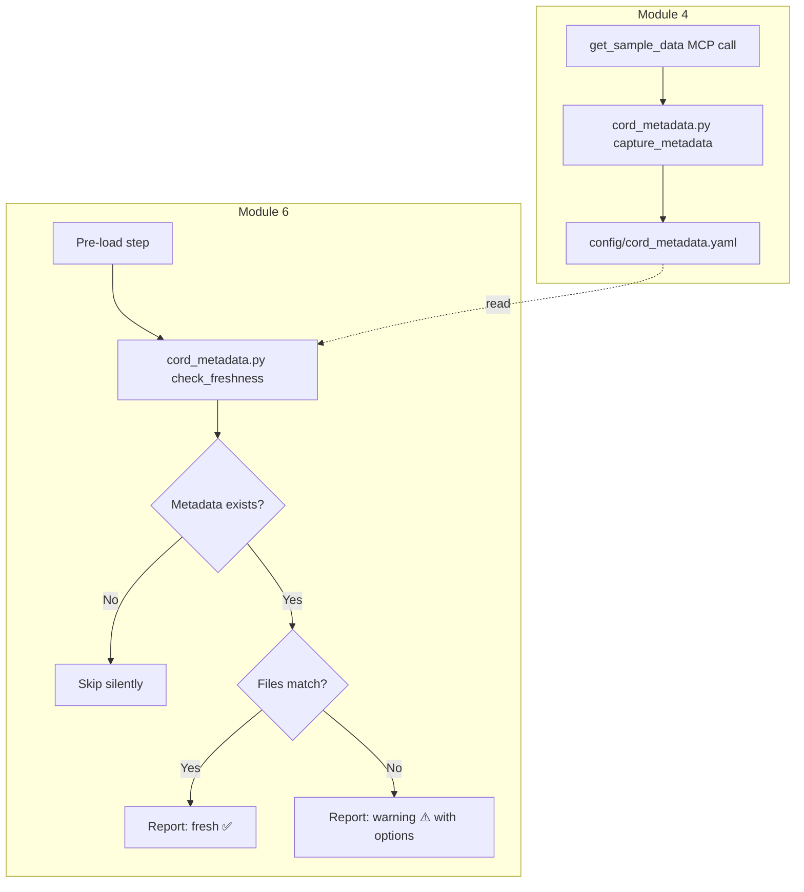

# Design: CORD Data Freshness Indicator

## Overview

This feature adds a lightweight metadata caching and verification layer between Module 4 (data collection) and Module 6 (data loading). When bootcampers download CORD datasets, the system captures a metadata snapshot (dataset name, sources, record counts, download timestamp, content hash). Before loading in Module 6, the system compares stored metadata against current file state on disk. If files have changed (e.g., CORD dataset updated upstream during a multi-week bootcamp), the bootcamper receives an advisory warning with options — never a hard block.

The design follows the project's existing patterns: Python 3.11+ stdlib-only scripts, YAML config files, and pytest + Hypothesis tests.

## Architecture



The feature consists of a single script (`cord_metadata.py`) with two entry points:
- `capture` subcommand: called during Module 4 after CORD download
- `check` subcommand: called during Module 6 before loading

## Components and Interfaces

### Script: `senzing-bootcamp/scripts/cord_metadata.py`

```python
#!/usr/bin/env python3
"""Capture and verify CORD dataset metadata for freshness checks."""

from __future__ import annotations

import argparse
import hashlib
import json
import os
from dataclasses import dataclass, field
from datetime import datetime, timezone
from pathlib import Path


@dataclass
class SourceMetadata:
    """Metadata for a single CORD data source file."""
    name: str
    file_path: str
    record_count: int
    file_size_bytes: int


@dataclass
class CordMetadata:
    """Complete CORD dataset metadata snapshot."""
    dataset_name: str
    sources: list[SourceMetadata]
    download_date: str  # ISO 8601
    content_hash: str   # SHA-256
    schema_version: str = "1"


@dataclass
class FreshnessResult:
    """Result of a freshness check."""
    status: str          # "fresh", "stale", "skipped"
    message: str
    mismatches: list[dict] = field(default_factory=list)


def capture_metadata(
    dataset_name: str,
    source_files: list[str],
    output_path: str = "config/cord_metadata.yaml",
) -> CordMetadata:
    """Capture metadata for downloaded CORD files and write to YAML."""
    ...


def check_freshness(
    metadata_path: str = "config/cord_metadata.yaml",
) -> FreshnessResult:
    """Check stored metadata against current file state on disk."""
    ...


def main(argv: list[str] | None = None) -> int:
    """CLI entry point with capture/check subcommands."""
    ...
```

### Public Interface

| Function | Input | Output | Side Effects |
|----------|-------|--------|--------------|
| `capture_metadata(dataset_name, source_files, output_path)` | Dataset name, list of file paths, output YAML path | `CordMetadata` | Writes `config/cord_metadata.yaml` |
| `check_freshness(metadata_path)` | Path to metadata YAML | `FreshnessResult` | None (read-only) |
| `serialize_metadata(metadata)` | `CordMetadata` object | YAML string | None |
| `parse_metadata(yaml_content)` | YAML string | `CordMetadata` object | None |
| `compute_content_hash(file_path, max_records)` | File path, max records to hash | SHA-256 hex string | None |

### Integration Points

- **Module 4 steering** (`module-04-data-collection.md`): After `get_sample_data` downloads CORD files, the agent runs `python senzing-bootcamp/scripts/cord_metadata.py capture --dataset <name> --files <paths>`
- **Module 6 steering** (`module-06-load-data.md`): Before loading begins, the agent runs `python senzing-bootcamp/scripts/cord_metadata.py check` and presents the result to the bootcamper
- **Data source registry** (`config/data_sources.yaml`): The capture step reads record counts from the registry if available, or counts records directly from files

## Data Models

### `config/cord_metadata.yaml` Schema

```yaml
schema_version: "1"
dataset_name: "cord-las-vegas"
sources:
  - name: "CORD_LAS_VEGAS"
    file_path: "data/raw/cord-las-vegas.jsonl"
    record_count: 8421
    file_size_bytes: 4523891
download_date: "2025-07-15T14:30:00+00:00"
content_hash: "a3f2b8c1d4e5f6a7b8c9d0e1f2a3b4c5d6e7f8a9b0c1d2e3f4a5b6c7d8e9f0a1"
```

**Field definitions:**

| Field | Type | Description |
|-------|------|-------------|
| `schema_version` | string | Always "1" for forward compatibility |
| `dataset_name` | string | CORD dataset identifier (e.g., "cord-las-vegas") |
| `sources` | list | One entry per downloaded source file |
| `sources[].name` | string | DATA_SOURCE key (uppercase) |
| `sources[].file_path` | string | Relative path to the data file |
| `sources[].record_count` | int | Number of records at download time |
| `sources[].file_size_bytes` | int | File size in bytes at download time |
| `download_date` | string | ISO 8601 timestamp of download |
| `content_hash` | string | SHA-256 of first 100 records (or full file if < 100 records) |

### `FreshnessResult` States

| Status | Meaning | User Action |
|--------|---------|-------------|
| `fresh` | All files match stored metadata | Proceed with loading |
| `stale` | One or more files differ from metadata | Advisory warning with options |
| `skipped` | No metadata file found (non-CORD data or first run) | Proceed silently |

### YAML Serialization

The script uses a custom minimal YAML serializer (no PyYAML dependency), following the same pattern as `data_sources.py` in this project. The serializer handles:
- Scalar values (strings, integers)
- Lists of mappings (for sources)
- Top-level mapping structure

## Correctness Properties

*A property is a characteristic or behavior that should hold true across all valid executions of a system — essentially, a formal statement about what the system should do. Properties serve as the bridge between human-readable specifications and machine-verifiable correctness guarantees.*

### Property 1: Metadata serialization round-trip

*For any* valid `CordMetadata` object (with arbitrary dataset name, 1+ sources with valid paths/counts/sizes, valid ISO 8601 date, and valid SHA-256 hash), serializing to YAML and then parsing back SHALL produce an equivalent `CordMetadata` object with all fields preserved.

**Validates: Requirements 1, 2**

### Property 2: Freshness check correctly detects mismatches

*For any* stored metadata and current file state where at least one source file has a different size or record count than recorded, `check_freshness` SHALL return status "stale" with a non-empty mismatches list identifying the changed files. Conversely, when all files match their stored metadata exactly, it SHALL return status "fresh" with an empty mismatches list.

**Validates: Requirements 3, 4**

### Property 3: Non-blocking advisory behavior

*For any* input state — valid metadata with matching files, valid metadata with mismatched files, missing metadata file, corrupt/unparseable metadata file, missing data files on disk, or non-CORD data configuration — `check_freshness` SHALL complete without raising an exception and SHALL return a `FreshnessResult` with status in {"fresh", "stale", "skipped"}.

**Validates: Requirements 5, 8**

## Error Handling

| Scenario | Behavior | Result |
|----------|----------|--------|
| Metadata file missing | Skip freshness check | `FreshnessResult(status="skipped", message="No CORD metadata found...")` |
| Metadata file corrupt/unparseable | Skip freshness check | `FreshnessResult(status="skipped", message="Could not parse metadata...")` |
| Data file missing from disk | Report as stale (file disappeared) | `FreshnessResult(status="stale", ...)` with mismatch entry |
| Data file unreadable (permissions) | Report as stale | `FreshnessResult(status="stale", ...)` with mismatch entry |
| Hash computation fails | Fall back to size-only comparison | Still produces valid result |
| `capture_metadata` called with no files | Return error exit code 1 | Print usage guidance to stderr |
| `capture_metadata` file not found | Skip that source, warn | Capture remaining sources |

Design rationale: The freshness check is purely advisory. Any error condition during the check itself must degrade gracefully — never crash, never block the bootcamper from loading data. The `capture` command can be stricter since it runs at download time when files should be present.

## Testing Strategy

### Property-Based Tests (Hypothesis)

The feature is well-suited for property-based testing because:
- `serialize_metadata` / `parse_metadata` are pure functions with clear round-trip behavior
- `check_freshness` has universal properties (non-blocking, correct detection) across a large input space
- Input generation is straightforward (random strings, integers, file states)

**Library:** Hypothesis (already used in this project)
**Configuration:** `@settings(max_examples=100)` per property test
**Tag format:** `Feature: cord-data-freshness, Property N: <property_text>`

Each correctness property maps to a single property-based test class:

| Property | Test Class | Strategy |
|----------|-----------|----------|
| 1: Round-trip | `TestMetadataRoundTrip` | Generate random `CordMetadata` objects, serialize → parse → assert equality |
| 2: Mismatch detection | `TestFreshnessDetection` | Generate metadata + file states (matching/mismatched), verify correct status |
| 3: Non-blocking | `TestNonBlockingBehavior` | Generate adversarial inputs (missing files, corrupt YAML, empty metadata), verify no exceptions |

### Unit Tests (pytest)

Example-based tests for specific scenarios from Requirement 9:

| Test | Scenario |
|------|----------|
| `test_capture_creates_metadata_file` | Capture with valid CORD files → file exists with correct content |
| `test_freshness_check_pass` | Metadata matches files → status "fresh" |
| `test_freshness_check_fail_size_mismatch` | File size changed → status "stale" |
| `test_freshness_check_missing_metadata` | No metadata file → status "skipped" |
| `test_capture_cli_subcommand` | CLI `capture` subcommand works end-to-end |
| `test_check_cli_subcommand` | CLI `check` subcommand works end-to-end |
| `test_non_cord_data_skipped` | No metadata file for custom data → skipped |

### Test File Location

`senzing-bootcamp/tests/test_cord_data_freshness.py` — following the project convention of power tests in `senzing-bootcamp/tests/`.
