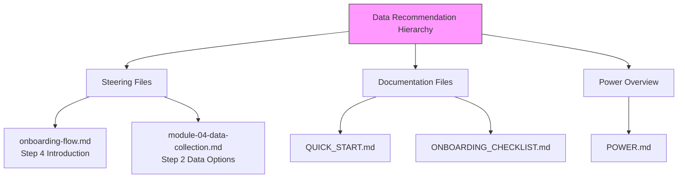

# Design Document: CORD Data Priority

## Overview

This feature updates all user-facing messaging across the Senzing Bootcamp power to establish and enforce a clear data recommendation hierarchy:

1. **Bootcamper's own data** (always preferred)
2. **CORD data** from Senzing (curated, real-world-like datasets for entity resolution evaluation)
3. **Synthesized test data** (last resort, generated by script)

Currently, several touchpoints present synthesized test data as an equal or primary alternative when a bootcamper lacks their own data. CORD datasets (Las Vegas, London, Moscow) are higher quality and more representative than synthesized data, making them the better default recommendation.

The changes span 5 files:
- `senzing-bootcamp/steering/onboarding-flow.md` — Step 4 (Bootcamp Introduction)
- `senzing-bootcamp/POWER.md` — "Don't have data?" section and related messaging
- `senzing-bootcamp/docs/guides/QUICK_START.md` — "Don't have data?" line
- `senzing-bootcamp/steering/module-04-data-collection.md` — Step 2 data options
- `senzing-bootcamp/docs/guides/ONBOARDING_CHECKLIST.md` — Data section

### Design Rationale

CORD (Collections Of Relatable Data) datasets are purpose-built by Senzing for entity resolution evaluation. They contain realistic patterns (name variations, address formats, cross-source overlaps) that synthesized data cannot replicate. Promoting CORD as the primary alternative ensures bootcampers learn with data that behaves like production data.

## Architecture

This is a content-layer change — no new code modules, APIs, or data models are introduced. The architecture is:



All changes follow the same pattern: wherever data options are presented, reorder to show CORD before synthesized test data, add the CORD reference URL, and frame synthesized data as a fallback.

## Components and Interfaces

### Component 1: Onboarding Flow (Step 4 — Bootcamp Introduction)

**File:** `senzing-bootcamp/steering/onboarding-flow.md`

**Current state:** Step 4 mentions "Test data available anytime. Three sample datasets: Las Vegas, London, Moscow" without distinguishing CORD from synthesized data or establishing priority.

**Target state:** Step 4 will:
- Explicitly name CORD as Senzing's curated data collections
- Include the CORD reference URL
- Position synthesized test data as available only if CORD doesn't meet needs
- Retain the mention of Las Vegas, London, Moscow datasets (these ARE CORD datasets)

### Component 2: POWER.md Data Messaging

**File:** `senzing-bootcamp/POWER.md`

**Current state:** The "Don't have data handy?" paragraph mentions "test data can be generated at any point" and lists sample datasets, but doesn't establish a clear hierarchy or explain what CORD is.

**Target state:** The paragraph will:
- Lead with CORD as the primary recommendation
- Explain CORD briefly (curated, real-world-like datasets for ER evaluation)
- Include the CORD reference URL
- Mention synthesized test data as a fallback if CORD doesn't suffice
- Retain the `get_sample_data` tool reference

### Component 3: Quick Start Guide

**File:** `senzing-bootcamp/docs/guides/QUICK_START.md`

**Current state:** Single line: "Don't have data? Test data can be generated at any point."

**Target state:** Will recommend CORD first, mention synthesized test data as fallback, and reference `get_sample_data` for obtaining CORD datasets.

### Component 4: Module 4 Data Collection Steering

**File:** `senzing-bootcamp/steering/module-04-data-collection.md`

**Current state:** Step 2 presents two options when user doesn't have data: (1) MCP sample data from CORD datasets, (2) free raw data from GitHub. The CORD option is already first, but the framing doesn't explicitly establish the hierarchy or position synthesized data as last resort.

**Target state:** Step 2 will:
- Lead with asking if the bootcamper has their own data (already done)
- Recommend CORD data as the primary alternative with explanation and URL
- Position synthesized test data generation as available only after CORD is declined
- Include the CORD reference URL in the recommendation text

### Component 5: Onboarding Checklist

**File:** `senzing-bootcamp/docs/guides/ONBOARDING_CHECKLIST.md`

**Current state:** Data section says "the bootcamp provides three sample datasets (Las Vegas, London, Moscow) and can generate test data at any point" — no hierarchy.

**Target state:** Will name CORD as the primary sample data option, position synthesized test data as a fallback.

## Data Models

No new data models are introduced. This feature modifies only Markdown content in existing files.

The only structured data relevant to this feature is the existing `get_sample_data` MCP tool interface, which already returns CORD datasets. No changes to tool interfaces are needed.


## Correctness Properties

*A property is a characteristic or behavior that should hold true across all valid executions of a system — essentially, a formal statement about what the system should do. Properties serve as the bridge between human-readable specifications and machine-verifiable correctness guarantees.*

### Property 1: CORD precedes synthesized test data in all touchpoints

*For any* Markdown file in the `senzing-bootcamp/` directory tree that mentions both CORD data (or CORD datasets/sample datasets) and synthesized/generated test data, the first mention of CORD SHALL appear at a lower line number than the first mention of synthesized test data.

**Validates: Requirements 1.1, 1.2, 7.1, 7.2**

### Property 2: CORD reference URL present wherever CORD is recommended

*For any* Markdown file in the `senzing-bootcamp/` directory tree that recommends CORD data to a bootcamper, the file SHALL contain the reference URL `https://senzing.com/senzing-ready-data-collections-cord/` or a reference to the `get_sample_data` MCP tool.

**Validates: Requirements 2.3, 3.2, 4.3, 5.3**

## Error Handling

This feature modifies only static Markdown content. No runtime error handling is needed.

**Validation errors during implementation:**
- If a file cannot be found at the expected path, the implementation task should fail with a clear message indicating the missing file.
- If a file's structure has changed such that the target section cannot be located, the implementer should read the current file and adapt the edit to the current structure.

## Testing Strategy

### Property-Based Tests (Hypothesis)

This feature is suitable for property-based testing because the core invariant (ordering consistency) can be verified across all files programmatically. The input space is the set of all Markdown files in the power, and the property must hold universally.

**Library:** Hypothesis (already in use per project conventions)

**Configuration:** Minimum 100 iterations per property test (though for file-scanning properties, the iteration count is bounded by the number of files).

**Test file:** `senzing-bootcamp/tests/test_cord_data_priority.py`

Each property test will:
1. Scan all Markdown files under `senzing-bootcamp/`
2. Identify files that mention both CORD and synthesized test data
3. Verify the ordering/presence invariant holds

Tag format: `# Feature: cord-data-priority, Property N: <property text>`

### Unit Tests (Example-Based)

Example-based tests will verify specific acceptance criteria on individual files:

| Test | Validates | What It Checks |
|------|-----------|----------------|
| `test_onboarding_flow_cord_in_step4` | 2.1, 2.2, 2.4 | Step 4 mentions CORD with description, before synthesized data |
| `test_power_md_cord_primary` | 3.1, 3.3, 3.4 | POWER.md leads with CORD, retains get_sample_data |
| `test_quick_start_cord_first` | 4.1, 4.2 | QUICK_START.md recommends CORD before synthesized |
| `test_module04_cord_hierarchy` | 5.1, 5.2 | Module 4 steering recommends CORD first, synthesized as fallback |
| `test_onboarding_checklist_cord` | 6.1, 6.2 | Checklist mentions CORD as primary, synthesized as fallback |

### Integration Tests

Requirements 1.4 and 7.3 (agent confirms CORD was declined before generating synthesized data) are runtime agent behaviors that cannot be verified from file content alone. These would require manual testing or agent simulation, which is out of scope for automated tests.

### Test Organization

```python
# senzing-bootcamp/tests/test_cord_data_priority.py

class TestCordDataPriorityProperties:
    """Property-based tests for cross-file consistency."""
    # Property 1: CORD precedes synthesized test data
    # Property 2: CORD URL present where CORD is recommended

class TestCordDataPriorityExamples:
    """Example-based tests for specific file requirements."""
    # Individual file checks per acceptance criteria
```
