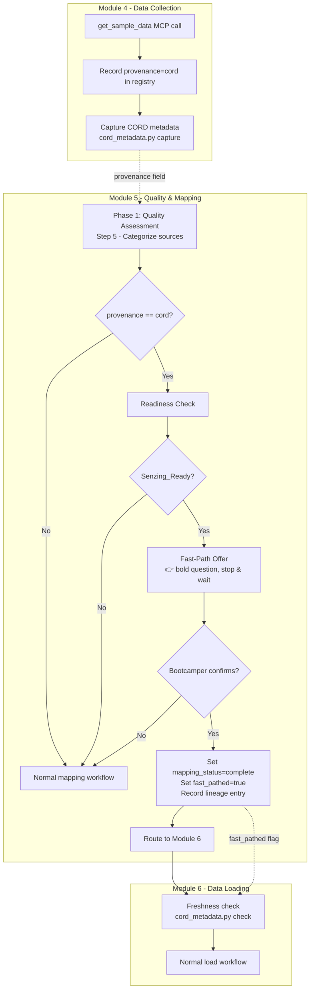
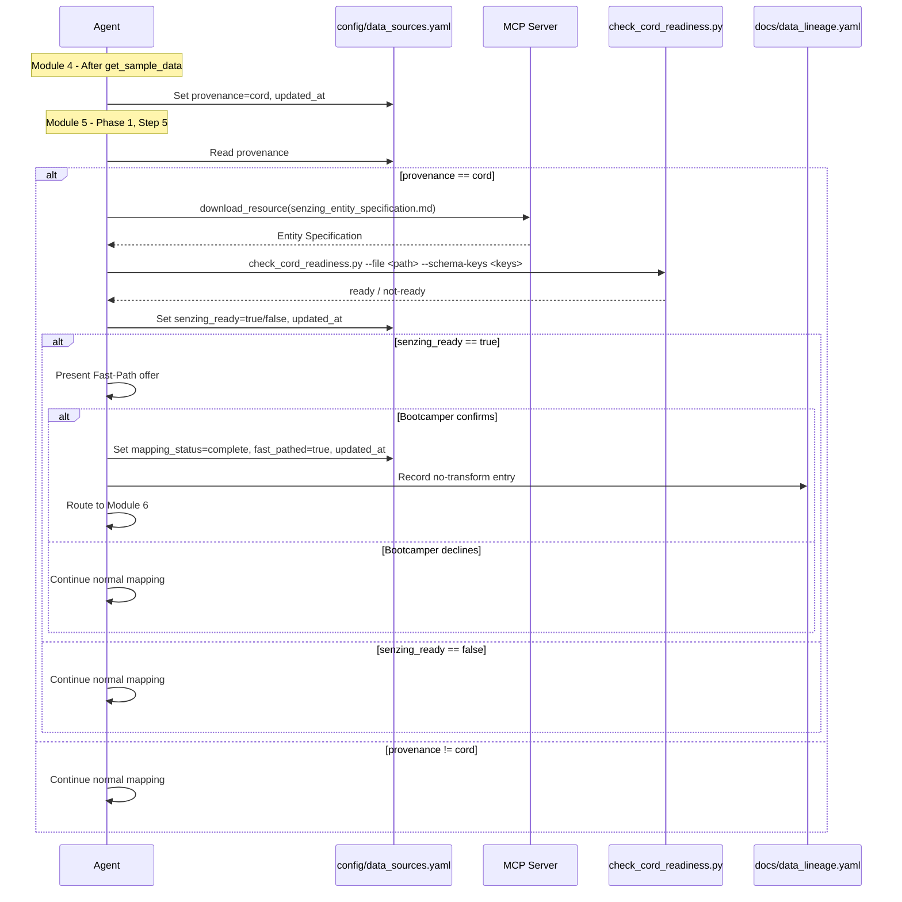

# Design Document: CORD Mapping Fast-Path

## Overview

This feature adds a conditional fast-path that lets CORD-sourced data skip the Module 5 mapping phase when that data is already in a Senzing-loadable form. The fast-path couples two independent signals — CORD provenance (recorded in Module 4) and a lightweight readiness check (performed at the start of Module 5) — to offer the bootcamper the option to bypass mapping and proceed directly to Module 6 loading.

The feature is delivered primarily through steering Markdown changes, with an optional Python stdlib-only helper script (`check_cord_readiness.py`) for structural pre-screening. All Senzing schema facts come from the MCP server; the helper script performs only structural detection (presence of expected top-level keys, array structures) without asserting what constitutes valid Senzing attributes.

### Design Rationale

CORD datasets obtained via `get_sample_data` often arrive already in Senzing-loadable JSON format (FEATURES-array structure with `DATA_SOURCE` and `RECORD_ID`). Sending these through the full mapping workflow (profiling, planning, field mapping, transformation, validation) adds 10+ interaction steps with no transformation value. However, not all CORD data is loadable as-is — some datasets use legacy flat/sub-list structures that genuinely need mapping. The two-signal approach (provenance + readiness) ensures we only offer the fast-path when it's safe to skip.

### Integration Context

This feature integrates with:
- **cord-data-freshness**: Fast-pathed sources still pass through the Module 6 freshness check (`cord_metadata.py check`) before loading.
- **cord-data-priority**: The provenance recording in Module 4 aligns with the CORD-first data recommendation hierarchy.
- **data-source-registry**: New fields (`provenance`, `senzing_ready`, `fast_pathed`) are additive optional extensions to the existing registry schema.
- **data-collection-template**: Module 4 steering already captures CORD metadata; provenance recording piggybacks on that step.

## Architecture



### Component Interaction



## Components and Interfaces

### Component 1: Module 4 Steering — Provenance Recording

**File:** `senzing-bootcamp/steering/module-04-data-collection.md`

**Change:** Add an agent instruction block after the existing "CORD Metadata Capture" instruction in Step 2, recording provenance in the registry.

**New instruction block:**

```markdown
> **Agent instruction — CORD Provenance Recording:** After each data source file is
> collected and its Registry_Entry created/updated in `config/data_sources.yaml`,
> set the `provenance` field based on the data origin:
>
> - `cord` — source obtained via `get_sample_data` MCP tool
> - `own` — bootcamper's own data (uploaded, URL, database, or API)
> - `free_data` — data from the free-data GitHub repository
> - `synthesized` — generated test data
> - `unknown` — origin cannot be determined
>
> Set `updated_at` to the current ISO 8601 timestamp when writing provenance.
> A source with `provenance: unknown` is never eligible for the fast-path.
```

### Component 2: Module 5 Phase 1 — Readiness Check Insertion

**File:** `senzing-bootcamp/steering/module-05-phase1-quality-assessment.md`

**Change:** Insert a new step between the current Step 5 (Categorize each data source) and Step 6 (Assess data quality), which performs the readiness check for CORD sources and offers the fast-path.

**New Step 5a — CORD Readiness Check and Fast-Path Offer:**

```markdown
5a. **CORD Readiness Check and Fast-Path Offer** (CORD sources only):

   > **Agent instruction — CORD Fast-Path Assessment:**
   >
   > For each source where `provenance` is `cord` in `config/data_sources.yaml`:
   >
   > 1. **Obtain the Senzing schema definition**: Call
   >    `download_resource(filename="senzing_entity_specification.md")` to retrieve
   >    the Entity Specification. Extract the list of required top-level structural
   >    indicators for a Senzing-loadable record (e.g., presence of FEATURES array,
   >    DATA_SOURCE, RECORD_ID).
   >
   > 2. **Perform the Readiness Check**: Examine up to 100 sample records from the
   >    source file. For each record, verify:
   >    - The record is valid JSON
   >    - The record contains the structural indicators identified from the Entity
   >      Specification (top-level keys, array structures)
   >    - DATA_SOURCE and RECORD_ID are present or derivable
   >
   >    If ALL sampled records pass, classify as Senzing_Ready.
   >    If ANY sampled record fails, classify as not Senzing_Ready.
   >
   >    Optionally, use the helper script:
   >    ```bash
   >    python senzing-bootcamp/scripts/check_cord_readiness.py \
   >      --file <source_file_path> \
   >      --schema-keys DATA_SOURCE,RECORD_ID,FEATURES \
   >      --max-records 100
   >    ```
   >
   > 3. **Record the result**: Set the source's `senzing_ready` field in
   >    `config/data_sources.yaml` to `true` or `false` and update `updated_at`.
   >
   > 4. **If Senzing_Ready — Present the Fast-Path offer:**
   >
   >    👉 **"Your CORD source [SOURCE_NAME] is already in Senzing-loadable form
   >    (it has the correct JSON structure with DATA_SOURCE, RECORD_ID, and
   >    properly structured features). Would you like to skip the mapping phase
   >    and proceed directly to loading in Module 6?"**
   >
   >    🛑 STOP — Wait for the bootcamper's answer.
   >
   >    - **If confirmed**: Set `mapping_status: complete` and `fast_pathed: true`
   >      in the registry. Keep `file_path` pointing at the original `data/raw/`
   >      file. Record a data-lineage entry (see lineage section below). Route the
   >      source to Module 6.
   >    - **If declined**: Continue through the normal quality assessment and
   >      mapping workflow for this source.
   >
   > 5. **If NOT Senzing_Ready or MCP unavailable**: Continue through the normal
   >    quality assessment and mapping workflow. Do NOT present the fast-path offer.
   >
   > 6. **Non-CORD sources**: Skip this step entirely. Never present the fast-path
   >    offer for sources with provenance other than `cord`.

   **Checkpoint:** Write step 5a to `config/bootcamp_progress.json`.
```

### Component 3: Module 5 Phase 2 — Guard Against Re-Offer

**File:** `senzing-bootcamp/steering/module-05-phase2-data-mapping.md`

**Change:** Add a guard at the top of the Phase 2 workflow (before the "Mapping Verbosity Check") that skips already-fast-pathed sources.

```markdown
> **Agent instruction — Skip fast-pathed sources:**
>
> Before starting the mapping workflow for a source, check its Registry_Entry in
> `config/data_sources.yaml`. If `fast_pathed` is `true` and `mapping_status` is
> `complete`, skip this source entirely — it has already been routed to Module 6.
> Proceed to the next unmapped source.
```

### Component 4: Module 5 Hub — Fast-Path Mention

**File:** `senzing-bootcamp/steering/module-05-data-quality-mapping.md`

**Change:** Add a brief note in the Phase Sub-Files section indicating that Phase 1 now includes the CORD readiness check.

```markdown
- **Phase 1 — Quality Assessment** (steps 1–7): `module-05-phase1-quality-assessment.md`
  *(Includes CORD readiness check and fast-path offer for eligible sources)*
```

### Component 5: Readiness Check Helper Script

**File:** `senzing-bootcamp/scripts/check_cord_readiness.py`

**Purpose:** Optional lightweight structural pre-screen. The agent can perform the check inline using MCP + JSON parsing, but this script provides a repeatable, testable implementation.

```python
#!/usr/bin/env python3
"""Senzing Bootcamp - CORD Readiness Check Helper.

Performs a lightweight structural pre-screen of a CORD data file to determine
if its records are already in a Senzing-loadable form. Does NOT assert what
constitutes valid Senzing attributes — the caller provides the expected
top-level schema keys (obtained from the MCP server's Entity Specification).

Usage:
    python scripts/check_cord_readiness.py \
      --file data/raw/cord-las-vegas.jsonl \
      --schema-keys DATA_SOURCE,RECORD_ID,FEATURES \
      --max-records 100

Exit codes:
    0 — All sampled records pass structural checks (ready)
    1 — One or more records fail (not ready) or error

Depends only on the Python standard library.
"""

from __future__ import annotations

import argparse
import json
import sys
from dataclasses import dataclass
from pathlib import Path


@dataclass
class ReadinessResult:
    """Result of the structural readiness check."""
    ready: bool
    records_checked: int
    records_passed: int
    records_failed: int
    failure_reasons: list[str]


def check_readiness(
    file_path: str,
    schema_keys: list[str],
    max_records: int = 100,
) -> ReadinessResult:
    """Check if records in a JSONL file contain the expected schema keys.

    Args:
        file_path: Path to the JSONL data file.
        schema_keys: List of top-level keys that must be present in each record.
        max_records: Maximum number of records to examine (default 100).

    Returns:
        ReadinessResult with pass/fail classification.
    """
    ...


def main(argv: list[str] | None = None) -> int:
    """CLI entry point.

    Args:
        argv: Command-line arguments (defaults to sys.argv[1:]).

    Returns:
        Exit code: 0 if ready, 1 if not ready or error.
    """
    ...
```

**Key design decisions:**
- The script does NOT hardcode Senzing attribute names. The `--schema-keys` argument is populated by the agent from the Entity Specification retrieved via MCP.
- Maximum 100 records sampled (configurable via `--max-records`).
- ALL sampled records must pass for a "ready" classification (fail-fast on first structural mismatch for efficiency, but still report count).
- Output is machine-readable JSON to stdout (for agent consumption) plus human-readable summary to stderr.

### Component 6: Data Lineage Entry for Fast-Pathed Sources

**Integration with:** `docs/data_lineage.yaml` (per `senzing-bootcamp/steering/data-lineage.md`)

When a source is fast-pathed, the agent records a transformation lineage entry indicating no transformation occurred:

```yaml
transformations:
  CORD_LAS_VEGAS:
    source_file: data/raw/cord-las-vegas.jsonl
    transformation_script: null  # No transformation — fast-pathed
    output_file: data/raw/cord-las-vegas.jsonl  # Same file
    records_in: 8421
    records_out: 8421
    records_rejected: 0
    quality_score: null  # Quality assessment skipped
    fast_pathed: true
    fast_path_reason: "CORD source already in Senzing-loadable form"
```

The key invariant is `source_file == output_file` and `records_in == records_out` with `records_rejected == 0`.

### Component 7: Registry Schema Extension

**File:** `config/data_sources.yaml` (in bootcamper's project)

Three new additive optional fields on each Registry_Entry:

| Field | Type | Default | Description |
|-------|------|---------|-------------|
| `provenance` | string | `null` (absent) | Data origin: `cord`, `own`, `free_data`, `synthesized`, `unknown` |
| `senzing_ready` | boolean | `null` (absent) | Whether the source passed the readiness check |
| `fast_pathed` | boolean | `null` (absent) | Whether the source was fast-pathed (skipped mapping) |

These fields are optional and their absence does not break any existing behavior. The existing `mapping_status` and `load_status` value sets are unchanged — `fast_pathed` sources use `mapping_status: complete` (an existing valid value).

**Example extended entry:**

```yaml
CORD_LAS_VEGAS:
  name: "CORD Las Vegas"
  file_path: "data/raw/cord-las-vegas.jsonl"
  format: jsonl
  record_count: 8421
  file_size_bytes: 4523891
  quality_score: null
  mapping_status: complete
  load_status: not_loaded
  provenance: cord
  senzing_ready: true
  fast_pathed: true
  added_at: "2025-07-15T14:30:00Z"
  updated_at: "2025-07-15T14:35:00Z"
```

### Component 8: Token Budget Updates

**File:** `senzing-bootcamp/steering/steering-index.yaml`

After modifying steering files, token counts must be updated. Expected changes:

| File | Current tokens | Estimated delta | Reason |
|------|---------------|-----------------|--------|
| `module-04-data-collection.md` | 4320 | +~120 | Provenance recording instruction |
| `module-05-phase1-quality-assessment.md` | 1710 | +~450 | Readiness check + fast-path offer step |
| `module-05-phase2-data-mapping.md` | 5355 | +~80 | Fast-path skip guard |
| `module-05-data-quality-mapping.md` | 689 | +~20 | Phase 1 note update |

All files remain within their size categories. The Phase 1 file stays "medium" (< 5000 tokens). Exact counts will be determined by running `measure_steering.py` after implementation.

## Data Models

### ReadinessResult (check_cord_readiness.py)

```python
@dataclass
class ReadinessResult:
    """Result of the structural readiness check."""
    ready: bool              # True if all sampled records pass
    records_checked: int     # Number of records examined (≤ max_records)
    records_passed: int      # Records that have all schema keys
    records_failed: int      # Records missing one or more schema keys
    failure_reasons: list[str]  # Human-readable reasons for failures
```

### Fast-Path Lineage Entry

| Field | Type | Value for fast-pathed source |
|-------|------|------------------------------|
| `source_file` | string | Path to original CORD file in `data/raw/` |
| `transformation_script` | string \| null | `null` (no transformation) |
| `output_file` | string | Same as `source_file` |
| `records_in` | int | Record count from registry |
| `records_out` | int | Same as `records_in` |
| `records_rejected` | int | `0` |
| `quality_score` | float \| null | `null` (quality assessment may be skipped) |
| `fast_pathed` | bool | `true` |
| `fast_path_reason` | string | Explanation of why fast-path was applied |

## Correctness Properties

*A property is a characteristic or behavior that should hold true across all valid executions of a system — essentially, a formal statement about what the system should do. Properties serve as the bridge between human-readable specifications and machine-verifiable correctness guarantees.*

### Property 1: Registry schema backward compatibility

*For any* valid registry entry (with the existing required fields `name`, `file_path`, `format`, `mapping_status`, `load_status`, `added_at`, `updated_at`), adding or omitting the new optional fields (`provenance`, `senzing_ready`, `fast_pathed`) SHALL produce a valid registry entry that preserves all existing field values unchanged.

**Validates: Requirements 1.3, 6.6**

### Property 2: Readiness classification correctness

*For any* JSONL file and set of required schema keys, the readiness check SHALL classify the file as ready if and only if every sampled record contains all specified schema keys as top-level JSON keys. If any sampled record is missing any required key, the result SHALL be not-ready.

**Validates: Requirements 2.3, 2.4**

### Property 3: Bounded sample invariant

*For any* JSONL file with N records and a configured maximum M, the readiness check SHALL examine at most min(N, M) records, where M defaults to 100.

**Validates: Requirements 2.5**

### Property 4: Unavailable schema defaults to not-ready

*For any* CORD source file, if the schema keys list is empty or the check cannot determine structural conformance, the readiness check SHALL return not-ready.

**Validates: Requirements 2.7, 8.5**

### Property 5: Fast-path lineage entry invariant

*For any* fast-pathed source with record count N, the generated lineage entry SHALL have `source_file == output_file`, `records_in == records_out == N`, and `records_rejected == 0`.

**Validates: Requirements 6.4**

## Error Handling

| Scenario | Behavior | User Impact |
|----------|----------|-------------|
| MCP server unavailable during readiness check | Classify source as not-ready; continue normal mapping | Source goes through mapping (safe default) |
| CORD file missing or unreadable | Classify as not-ready; warn bootcamper | Normal mapping path; warning message |
| JSON parse error in CORD records | Classify as not-ready (malformed records need attention) | Normal mapping path |
| Registry write failure (provenance/senzing_ready) | Log warning; continue workflow | Fast-path may not be offered (safe fallback) |
| Lineage entry write failure for fast-pathed source | Allow fast-path to proceed; log failure for later retry | Source still routes to Module 6 |
| Helper script not found | Agent performs readiness check inline (MCP + JSON parsing) | Transparent to bootcamper |
| Provenance cannot be determined | Set to `unknown`; treat as non-CORD | Normal mapping path (safe default) |

**Design principle:** Every error condition defaults to the safe path (normal mapping). The fast-path is an optimization that must never cause a source to skip necessary transformation.

## Testing Strategy

### Property-Based Tests (Hypothesis)

This feature is suitable for property-based testing because:
- The readiness check is a pure function with clear input/output behavior
- Registry schema validation has universal properties across input variations
- The lineage entry generator has structural invariants that must hold for all inputs
- The bounded-sample property is a metamorphic property testable across file sizes

**Library:** Hypothesis (already in use per project conventions)
**Test file:** `senzing-bootcamp/tests/test_cord_mapping_fast_path.py`

Each correctness property maps to a property-based test:

| Property | Test | Strategy |
|----------|------|----------|
| 1: Registry backward compat | `test_registry_schema_backward_compatible` | Generate valid registry entries; add/remove optional fields; verify required fields unchanged |
| 2: Readiness classification | `test_readiness_classification_correctness` | Generate JSONL content + schema keys; verify classification matches structural conformance |
| 3: Bounded sample | `test_bounded_sample_invariant` | Generate files with varying record counts; verify ≤ min(N, max) records examined |
| 4: Unavailable schema | `test_empty_schema_defaults_not_ready` | Generate any CORD file; pass empty schema keys; verify not-ready |
| 5: Lineage invariant | `test_fast_path_lineage_entry_invariant` | Generate source metadata; verify lineage entry has input==output and equal counts |

**Configuration:** Tests use the active Hypothesis profile baseline (no inline `@settings(max_examples=...)` override needed).

**Tag format:** `# Feature: cord-mapping-fast-path, Property N: <property text>`

### Unit Tests (Example-Based)

| Test | Validates | What It Checks |
|------|-----------|----------------|
| `test_readiness_check_valid_cord_file` | 2.3 | A well-formed CORD JSONL file with all keys → ready |
| `test_readiness_check_legacy_structure` | 2.4 | A flat/sub-list structure CORD file → not ready |
| `test_readiness_check_mixed_records` | 2.3 | File with some valid and some invalid records → not ready |
| `test_provenance_valid_values` | 1.1, 1.2 | Each allowed provenance value is accepted |
| `test_provenance_unknown_not_eligible` | 1.5 | provenance=unknown → not eligible for fast-path |
| `test_fast_path_lineage_no_transform` | 6.4 | Lineage entry for fast-pathed source has null transformation_script |
| `test_lineage_failure_non_blocking` | 6.8 | Lineage write error doesn't raise; returns gracefully |
| `test_helper_script_cli` | 8.3 | Script has main(), argparse, exits 0/1 correctly |
| `test_helper_stdlib_only` | 2.8 | Script imports only stdlib modules |

### Integration Considerations

Requirements 3.x, 4.x, 5.x, and 7.x describe agent workflow behavior (routing, offer presentation, safeguard application) that cannot be unit-tested against a script. These are verified through:
- Manual walkthrough of the steering file changes
- The existing `validate_commonmark.py` CI check ensuring steering files parse correctly
- The `measure_steering.py --check` CI check ensuring token budgets remain accurate

### Test Organization

```python
# senzing-bootcamp/tests/test_cord_mapping_fast_path.py

class TestRegistrySchemaProperties:
    """Property: Registry schema backward compatibility."""
    # Feature: cord-mapping-fast-path, Property 1

class TestReadinessCheckProperties:
    """Properties: Readiness classification, bounded sample, unavailable schema."""
    # Feature: cord-mapping-fast-path, Property 2, 3, 4

class TestLineageProperties:
    """Property: Fast-path lineage entry invariant."""
    # Feature: cord-mapping-fast-path, Property 5

class TestReadinessCheckExamples:
    """Example-based tests for specific readiness scenarios."""

class TestProvenanceExamples:
    """Example-based tests for provenance field behavior."""

class TestHelperScriptConventions:
    """Smoke tests for script structure and conventions."""
```
