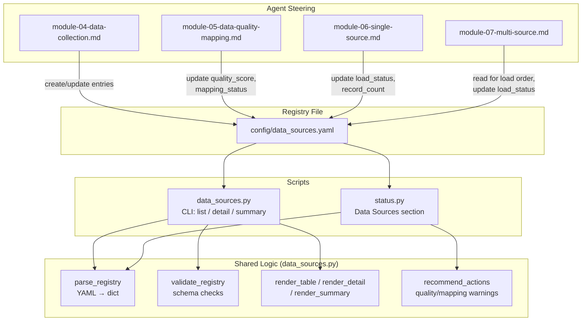

# Design Document: Data Source Registry

## Overview

This feature adds a centralized YAML registry (`config/data_sources.yaml`) that tracks every data source's lifecycle as it moves through Modules 4–7 of the bootcamp pipeline. Today the agent re-discovers source metadata each session and bootcampers have no quick way to see which sources are ready, mapped, or loaded. The registry solves this by providing a single source of truth that:

1. The agent maintains automatically via steering file instructions (Modules 4–7).
2. A new CLI script (`senzing-bootcamp/scripts/data_sources.py`) reads and displays.
3. The existing `status.py` script summarizes in its output.

Design priorities:
- **Zero dependencies**: stdlib-only Python, matching all existing scripts.
- **Testability**: pure-function logic for registry I/O, validation, rendering, and recommendation — separated from filesystem access via injectable callables.
- **Cross-platform**: Linux, macOS, Windows.
- **Backward compatibility**: when no registry file exists, `status.py` and the agent behave exactly as today.

## Architecture



### Key Design Decisions

1. **Minimal YAML parser**: PyYAML is not in the stdlib. The registry schema is constrained (flat scalars, one level of nesting under `sources`, optional `issues` list). A focused line-by-line parser handles this reliably — same approach used by `team_config_validator.py` for `team.yaml`.

2. **Validation as pure function**: `validate_registry(raw: dict) -> list[str]` returns error strings. Empty list means valid. This is easily property-tested.

3. **Rendering separated from I/O**: `render_table`, `render_detail`, and `render_summary` accept data structures and return strings. No direct `print()` calls in logic functions.

4. **Agent instructions in steering files, not in scripts**: The scripts are read-only tools. The agent updates the YAML file directly based on steering file instructions. No write commands in `data_sources.py`.

5. **`status.py` integration is additive**: A new function `render_data_sources_section(registry_path)` is added. When the file doesn't exist, the section is silently omitted.

## Components and Interfaces

### Registry Parser

```python
def parse_registry_yaml(content: str) -> dict:
    """Parse the restricted YAML subset used by data_sources.yaml into a dict.
    Returns dict with 'version' and 'sources' keys."""

def serialize_registry_yaml(data: dict) -> str:
    """Serialize a registry dict back to YAML string.
    Handles version, sources mapping, and nested fields."""
```

### Registry Validator

```python
VALID_FORMATS = {"csv", "json", "jsonl", "xlsx", "parquet", "xml", "other"}
VALID_MAPPING_STATUSES = {"pending", "in_progress", "complete"}
VALID_LOAD_STATUSES = {"not_loaded", "loading", "loaded", "failed"}
REQUIRED_ENTRY_FIELDS = {
    "name", "file_path", "format", "record_count", "quality_score",
    "mapping_status", "load_status", "added_at", "updated_at",
}

def validate_registry(raw: dict) -> list[str]:
    """Validate registry structure. Returns list of error strings (empty = valid).
    Checks: version field, sources mapping, required fields per entry,
    enum values for format/mapping_status/load_status."""
```

### Registry Data Structures

```python
@dataclasses.dataclass
class RegistryEntry:
    data_source: str           # key: uppercase DATA_SOURCE name
    name: str                  # human-readable display name
    file_path: str             # relative path to source file
    format: str                # csv | json | jsonl | xlsx | parquet | xml | other
    record_count: int | None
    file_size_bytes: int | None
    quality_score: int | None  # 0-100
    mapping_status: str        # pending | in_progress | complete
    load_status: str           # not_loaded | loading | loaded | failed
    added_at: str              # ISO 8601
    updated_at: str            # ISO 8601
    issues: list[str] | None   # optional list of warning/error strings

@dataclasses.dataclass
class Registry:
    version: str               # "1"
    sources: list[RegistryEntry]

    def by_load_status(self, status: str) -> list[RegistryEntry]: ...
    def by_mapping_status(self, status: str) -> list[RegistryEntry]: ...
    def low_quality_sources(self, threshold: int = 70) -> list[RegistryEntry]: ...
    def average_quality(self) -> float | None: ...
    def total_records(self) -> int: ...
```

### Rendering Functions

```python
def render_table(registry: Registry) -> str:
    """Render a formatted table of all entries showing DATA_SOURCE, record count,
    quality score, mapping status, and load status."""

def render_detail(entry: RegistryEntry) -> str:
    """Render all fields for a single entry in a readable format."""

def render_summary(registry: Registry) -> str:
    """Render aggregate statistics: total sources, sources by mapping status,
    sources by load status, average quality score, total record count."""
```

### Recommendation Engine

```python
QUALITY_THRESHOLD = 70

def recommend_actions(registry: Registry) -> list[str]:
    """Generate agent recommendations based on registry state.
    Returns list of recommendation strings:
    - Low quality sources that should be fixed before loading
    - Unmapped sources that need mapping before loading
    - Suggested load order by quality score (descending)"""
```

### CLI Entry Point (`data_sources.py`)

```python
def main(argv: list[str] | None = None) -> int:
    """CLI entry point.
    No args: display table of all sources.
    --detail <DATA_SOURCE>: display all fields for one source.
    --summary: display aggregate statistics.
    Returns 0 on success, non-zero on error."""
```

### Status Script Integration (`status.py`)

```python
def render_data_sources_section(registry_path: str = "config/data_sources.yaml") -> str | None:
    """Read registry and return formatted 'Data Sources' section string.
    Returns None if registry file does not exist.
    Includes load status counts and quality warnings."""
```

## Data Models

### Registry YAML Schema (`config/data_sources.yaml`)

```yaml
version: "1"
sources:
  CUSTOMERS_CRM:
    name: "Customer CRM Export"
    file_path: "data/raw/customers_crm.csv"
    format: csv
    record_count: 50000
    file_size_bytes: 4200000
    quality_score: 92
    mapping_status: complete
    load_status: loaded
    added_at: "2025-07-01T10:00:00Z"
    updated_at: "2025-07-03T14:30:00Z"
  VENDORS_LEGACY:
    name: "Legacy Vendor Database"
    file_path: "data/raw/vendors_legacy.csv"
    format: csv
    record_count: 5000
    file_size_bytes: 380000
    quality_score: 42
    mapping_status: pending
    load_status: not_loaded
    added_at: "2025-07-01T10:05:00Z"
    updated_at: "2025-07-01T10:05:00Z"
    issues:
      - "Quality score 42 is below threshold (70). Recommend fixing data quality before loading."
```

### Field Constraints

| Field | Type | Constraints |
|---|---|---|
| `version` | string | Must be `"1"` |
| `sources` | mapping | Keys are DATA_SOURCE names (uppercase, underscores) |
| `name` | string | Non-empty, human-readable |
| `file_path` | string | Relative path from project root |
| `format` | string | One of: `csv`, `json`, `jsonl`, `xlsx`, `parquet`, `xml`, `other` |
| `record_count` | int or null | Non-negative when present |
| `quality_score` | int or null | 0–100 when present |
| `mapping_status` | string | One of: `pending`, `in_progress`, `complete` |
| `load_status` | string | One of: `not_loaded`, `loading`, `loaded`, `failed` |
| `added_at` | string | ISO 8601 timestamp |
| `updated_at` | string | ISO 8601 timestamp |
| `issues` | list of strings or absent | Optional; present when quality < 70 or load failed |

### DATA_SOURCE Key Format

Keys must match the pattern `^[A-Z][A-Z0-9_]*$` — uppercase letters, digits, and underscores, starting with a letter. This matches Senzing's DATA_SOURCE naming convention.

### CLI Output Formats

**Default table view** (`python senzing-bootcamp/scripts/data_sources.py`):

```text
Data Source Registry
━━━━━━━━━━━━━━━━━━━━━━━━━━━━━━━━━━━━━━━━━━━━━━━━━━━━━━━━━━━━━━━━━━━━━━━━━━
DATA_SOURCE        Records  Quality  Mapping     Load Status
─────────────────  ───────  ───────  ──────────  ───────────
CUSTOMERS_CRM       50,000      92%  complete    loaded
VENDORS_LEGACY       5,000      42%  pending     not_loaded  ⚠
━━━━━━━━━━━━━━━━━━━━━━━━━━━━━━━━━━━━━━━━━━━━━━━━━━━━━━━━━━━━━━━━━━━━━━━━━━
```

**Summary view** (`--summary`):

```text
Data Source Summary
━━━━━━━━━━━━━━━━━━━━━━━━━━━━━━━━━━━━━━━━━━━━━━━━━━━━━━━━━━━━━━━━━━━━━━━━━━
Total sources:     2
Avg quality score: 67%
Total records:     55,000

By mapping status:  pending: 1  in_progress: 0  complete: 1
By load status:     not_loaded: 1  loading: 0  loaded: 1  failed: 0
━━━━━━━━━━━━━━━━━━━━━━━━━━━━━━━━━━━━━━━━━━━━━━━━━━━━━━━━━━━━━━━━━━━━━━━━━━
```

### Status Script Data Sources Section

Appended after the "Project Health" section in `status.py` output:

```text
Data Sources:
    loaded: 1  not_loaded: 1  loading: 0  failed: 0
    ⚠ Low quality: VENDORS_LEGACY (42%)
```


## Correctness Properties

*A property is a characteristic or behavior that should hold true across all valid executions of a system — essentially, a formal statement about what the system should do. Properties serve as the bridge between human-readable specifications and machine-verifiable correctness guarantees.*

### Property 1: YAML round-trip preserves registry data

*For any* valid `Registry` containing an arbitrary number of `RegistryEntry` objects with valid field values, serializing the registry to YAML via `serialize_registry_yaml` and then parsing it back via `parse_registry_yaml` SHALL produce a dict that, when converted back to a `Registry`, is equivalent to the original — all DATA_SOURCE keys, field values, and `issues` lists are preserved.

**Validates: Requirements 1.1, 1.2, 1.3, 1.4**

### Property 2: Registry validation accepts valid registries and rejects invalid ones with specific errors

*For any* dict representing a registry, if it has `version` equal to `"1"`, a `sources` mapping where every key matches `^[A-Z][A-Z0-9_]*$`, and every entry contains all required fields (`name`, `file_path`, `format`, `record_count`, `quality_score`, `mapping_status`, `load_status`, `added_at`, `updated_at`) with `format` in the valid set, `mapping_status` in `{pending, in_progress, complete}`, and `load_status` in `{not_loaded, loading, loaded, failed}`, then `validate_registry` SHALL return an empty error list. Conversely, *for any* dict violating any of these constraints, the error list SHALL be non-empty and SHALL contain a message identifying each specific violation.

**Validates: Requirements 1.2, 1.3, 1.4, 1.6, 11.1, 11.2, 11.3, 11.4**

### Property 3: Table rendering contains all source data

*For any* valid `Registry` with one or more entries, the string returned by `render_table` SHALL contain every DATA_SOURCE key, every entry's `mapping_status`, and every entry's `load_status`. When an entry has a non-null `quality_score`, the rendered string SHALL contain that score value. When an entry has a non-null `record_count`, the rendered string SHALL contain that count.

**Validates: Requirements 6.1, 7.2**

### Property 4: Detail rendering contains all entry fields

*For any* valid `RegistryEntry`, the string returned by `render_detail` SHALL contain the entry's `data_source`, `name`, `file_path`, `format`, `mapping_status`, `load_status`, `added_at`, and `updated_at` values. When `quality_score` is non-null, it SHALL appear. When `record_count` is non-null, it SHALL appear. When `issues` is non-empty, each issue string SHALL appear.

**Validates: Requirements 7.3**

### Property 5: Summary statistics are correctly computed

*For any* valid `Registry`, the string returned by `render_summary` SHALL contain the total number of sources, the count of sources for each `mapping_status` value, the count of sources for each `load_status` value, and the total record count (sum of all non-null `record_count` values). When at least one source has a non-null `quality_score`, the summary SHALL contain the average quality score (rounded to the nearest integer).

**Validates: Requirements 7.4**

### Property 6: Recommendations correctly identify quality and mapping issues and load order

*For any* valid `Registry`, `recommend_actions` SHALL return a recommendation for every source where `quality_score` is non-null, below 70, and `load_status` is `not_loaded` — and that recommendation SHALL reference the source's DATA_SOURCE name and score. It SHALL return a recommendation for every source where `mapping_status` is `pending` and `load_status` is `not_loaded`. When multiple sources have non-null `quality_score` values, the recommended load order SHALL list sources sorted by `quality_score` descending.

**Validates: Requirements 6.2, 6.3, 6.4**

### Property 7: Status integration section contains correct load counts and quality warnings

*For any* valid `Registry`, the string returned by `render_data_sources_section` SHALL contain the count of sources with `load_status` equal to `loaded`, `not_loaded`, `loading`, and `failed`. When at least one source has a non-null `quality_score` below 70, the string SHALL contain a warning line that includes every such source's DATA_SOURCE name.

**Validates: Requirements 8.1, 8.2**

## Error Handling

| Scenario | Behavior |
|---|---|
| `config/data_sources.yaml` missing | `data_sources.py`: print "No data sources registered" message, exit 0. `status.py`: omit Data Sources section silently. |
| Registry YAML malformed (parse error) | Print descriptive parse error to stderr, exit 1 |
| `version` field missing or not `"1"` | Print validation error identifying the version issue, exit 1 |
| Entry missing required fields | Print validation error listing each missing field and the DATA_SOURCE key, exit 1 |
| Entry has invalid enum value | Print validation error identifying the field, invalid value, and valid options, exit 1 |
| `--detail` with non-existent DATA_SOURCE | Print error listing available DATA_SOURCE names, exit 1 |
| `--detail` with no argument | Print usage help, exit 1 |
| Registry exists but `sources` is empty | `data_sources.py`: display empty table with header. `--summary`: show all zeros. `status.py`: show "0 sources". |
| `quality_score` is null for all sources | `--summary`: omit average quality line. Recommendations: skip quality-based ordering. |
| `record_count` is null for all sources | `--summary`: show total records as 0. Table: show `-` for record count. |
| `issues` field absent on an entry | Treat as empty list (no issues). |
| Non-UTF-8 file encoding | Print encoding error, exit 1 |

All error messages go to stderr. Normal output goes to stdout. Scripts never crash with unhandled exceptions during normal operation.

## Testing Strategy

### Property-Based Testing (Hypothesis)

This feature is well-suited for PBT because the core logic involves:
- YAML serialization/deserialization (round-trip property)
- Validation of structured input with clear accept/reject criteria
- Rendering functions that must contain specific data elements
- Recommendation logic with deterministic rules over varying inputs

**Library**: [Hypothesis](https://hypothesis.readthedocs.io/) (Python)
**Minimum iterations**: 100 per property test
**Tag format**: `Feature: data-source-registry, Property {N}: {title}`

Each of the 7 correctness properties maps to a single property-based test. Key generator strategies:

- `RegistryEntry` generator: random DATA_SOURCE key matching `^[A-Z][A-Z0-9_]*$`, random name string, random file_path, format from valid set, optional record_count (0–1M), optional file_size_bytes (0–10GB), optional quality_score (0–100), mapping_status from valid set, load_status from valid set, ISO 8601 timestamps, optional issues list
- `Registry` generator: version `"1"`, list of 0–20 random RegistryEntries with unique DATA_SOURCE keys
- Invalid registry generator: randomly omit required fields, use invalid enum values, use invalid version strings, use invalid key formats
- For validation tests: composite strategy generating both valid and invalid registries with known expected errors

**Mocking approach**: Rendering and recommendation functions accept data structures directly — no filesystem I/O to mock. For round-trip tests, the YAML content is generated in-memory.

### Unit Tests (pytest)

Unit tests cover specific examples and edge cases not suited for PBT:

- CLI argument parsing: no args, `--detail CUSTOMERS_CRM`, `--summary`, `--detail` with missing name (Req 7.1–7.6)
- Missing registry file → "No data sources registered" message, exit 0 (Req 7.5)
- `--detail` with non-existent source → error listing available names, exit 1 (Req 7.6)
- Validation error → descriptive message, exit 1 (Req 11.4)
- `status.py` with missing registry → no Data Sources section (Req 8.3)
- Empty sources mapping → empty table / zero summary (edge case)
- Default entry values: null quality, pending mapping, not_loaded (Req 1.5)

### Test File Location

`senzing-bootcamp/scripts/test_data_sources.py` — follows existing convention alongside `test_progress_utils.py` and `test_pbt_checkpointing.py`.
