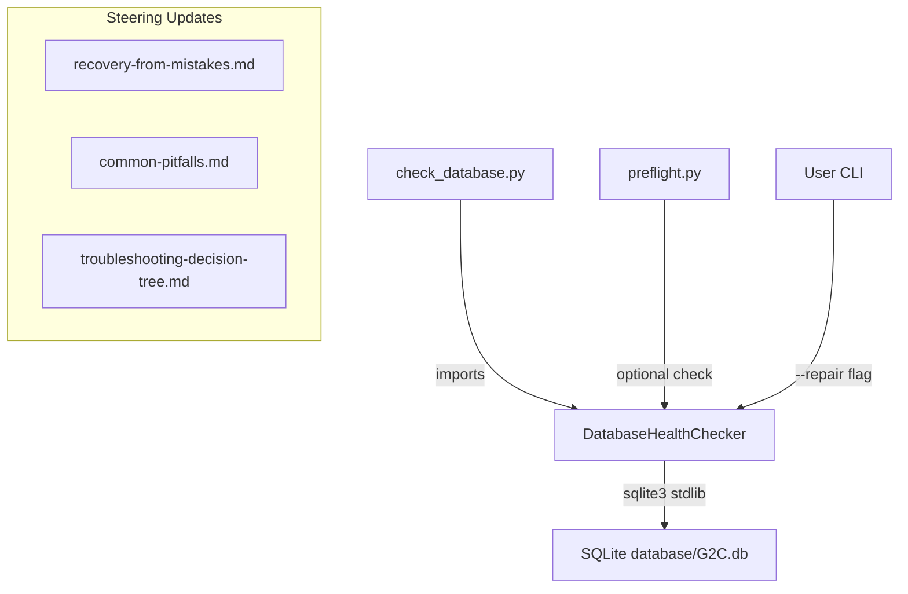

# Design: Database Corruption Recovery

## Overview

This feature adds documentation and tooling for detecting and recovering from database corruption during Senzing bootcamp data loading (Module 6). The primary deliverable is a `scripts/check_database.py` health-check script that validates SQLite database integrity, with integration into the existing `preflight.py` runner. Supporting documentation updates cover recovery procedures in steering files (`recovery-from-mistakes.md`, `common-pitfalls.md`, `troubleshooting-decision-tree.md`).

The design targets SQLite as the primary database (the bootcamp default at `database/G2C.db`) with documented PostgreSQL recovery guidance. All scripting follows the project's stdlib-only Python 3.11+ conventions.

## Architecture



The architecture follows the existing `preflight.py` pattern:
- A standalone script (`check_database.py`) with its own CLI via argparse
- Reuses the `CheckResult` dataclass from `preflight.py` for consistent reporting
- Integrates into `preflight.py`'s `CheckRunner` as an optional check (only runs when a database file exists)
- The `--repair` flag triggers automatic recovery attempts (WAL checkpoint, vacuum) before reporting status

## Components and Interfaces

### 1. `scripts/check_database.py` — Main Script

**Public interface:**

```python
def main(argv: list[str] | None = None) -> int:
    """CLI entry point. Returns 0 on healthy, 1 on failure."""

@dataclasses.dataclass
class DatabaseCheckResult:
    """Result of a single database health check."""
    name: str
    status: str          # "pass" | "warn" | "fail"
    message: str
    fix: str | None = None
    fixed: bool = False

@dataclasses.dataclass  
class DatabaseHealthReport:
    """Collection of all database check results."""
    checks: list[DatabaseCheckResult]
    db_path: str
    
    @property
    def verdict(self) -> str: ...

class DatabaseHealthChecker:
    """Runs health checks against a SQLite database."""
    
    def __init__(self, db_path: str, repair: bool = False) -> None: ...
    
    def check_file_exists(self) -> DatabaseCheckResult: ...
    def check_connection(self) -> DatabaseCheckResult: ...
    def check_integrity(self) -> DatabaseCheckResult: ...
    def check_entity_count(self) -> DatabaseCheckResult: ...
    def attempt_repair(self) -> list[DatabaseCheckResult]: ...
    def run_all(self) -> DatabaseHealthReport: ...
```

**CLI arguments:**
- `--db-path` (default: `database/G2C.db`) — path to the SQLite database
- `--repair` — attempt automatic recovery before reporting
- `--json` — output as JSON for programmatic consumption

### 2. Integration with `preflight.py`

A new check function added to `preflight.py`:

```python
def check_database() -> list[CheckResult]:
    """Optional database health check — runs only when database file exists."""
```

This function:
- Checks if `database/G2C.db` exists; if not, returns an empty list (skip)
- If the file exists, runs connection + integrity checks
- Returns `CheckResult` instances compatible with the existing report format
- Added to `CheckRunner.CHECK_SEQUENCE` as the last entry

### 3. Steering File Updates

| File | Change |
|------|--------|
| `recovery-from-mistakes.md` | New "Database Recovery" section (item 6+) covering SQLite and PostgreSQL scenarios |
| `common-pitfalls.md` | New "Database Issues" section in the pitfalls table |
| `troubleshooting-decision-tree.md` | New "Section G: Database Corruption" branch |

## Data Models

### DatabaseCheckResult

```python
@dataclasses.dataclass
class DatabaseCheckResult:
    """A single database health check outcome."""
    name: str            # e.g., "File exists", "Integrity check", "Entity count"
    status: str          # "pass" | "warn" | "fail"
    message: str         # Human-readable description
    fix: str | None = None   # Suggested fix action
    fixed: bool = False      # True if --repair resolved the issue
```

### DatabaseHealthReport

```python
@dataclasses.dataclass
class DatabaseHealthReport:
    """Aggregated database health report."""
    checks: list[DatabaseCheckResult]
    db_path: str
    
    @property
    def verdict(self) -> str:
        """'FAIL' if any fail, 'WARN' if any warn, else 'PASS'."""
        if any(c.status == "fail" for c in self.checks):
            return "FAIL"
        if any(c.status == "warn" for c in self.checks):
            return "WARN"
        return "PASS"
    
    @property
    def pass_count(self) -> int: ...
    @property
    def warn_count(self) -> int: ...
    @property
    def fail_count(self) -> int: ...
```

### Health Check Sequence

The checker runs these checks in order:
1. **File exists** — `os.path.isfile(db_path)`
2. **Can connect** — `sqlite3.connect(db_path)` succeeds
3. **Integrity check** — `PRAGMA integrity_check` returns "ok"
4. **Entity count > 0** — `SELECT COUNT(*) FROM RES_ENT_OKEY` (or similar Senzing table) returns > 0

If `--repair` is set, before reporting failures the checker attempts:
1. **WAL checkpoint** — `PRAGMA wal_checkpoint(TRUNCATE)`
2. **Vacuum** — `VACUUM`
3. Re-runs the failing checks to see if repair resolved them

## Correctness Properties

*A property is a characteristic or behavior that should hold true across all valid executions of a system — essentially, a formal statement about what the system should do. Properties serve as the bridge between human-readable specifications and machine-verifiable correctness guarantees.*

### Property 1: Corruption detection

*For any* byte sequence written to a file that is not a valid SQLite database, the `DatabaseHealthChecker` SHALL report a failure status (either at the connection check or integrity check stage).

**Validates: Requirements 5, 10**

### Property 2: Integrity check interpretation

*For any* string returned by `PRAGMA integrity_check`, if the string equals "ok" the integrity check SHALL report "pass"; for any other string value, it SHALL report "fail".

**Validates: Requirements 5, 3**

### Property 3: Entity count threshold

*For any* non-negative integer returned as the entity count from the database, if the count is greater than zero the entity count check SHALL report "pass"; if the count equals zero it SHALL report "warn" or "fail".

**Validates: Requirements 5**

### Property 4: Repair then re-check

*For any* database state where the initial integrity or WAL check fails, when `--repair` is enabled the checker SHALL attempt WAL checkpoint and vacuum, then re-evaluate the failing checks. The final report SHALL reflect the post-repair status (pass if repair succeeded, fail if it did not).

**Validates: Requirements 6**

## Error Handling

| Scenario | Behavior |
|----------|----------|
| Database file missing | `check_file_exists` returns fail with fix suggesting to re-run the loading program |
| Database file is not SQLite (random bytes) | `check_connection` returns fail with fix suggesting rebuild |
| `PRAGMA integrity_check` returns errors | `check_integrity` returns fail with fix suggesting `--repair` or rebuild |
| Entity count query fails (table doesn't exist) | `check_entity_count` returns warn (database may be freshly initialized) |
| Entity count is zero | `check_entity_count` returns warn with fix suggesting data may not have loaded |
| `--repair` WAL checkpoint fails | Report the failure, suggest manual rebuild |
| `--repair` vacuum fails (disk full) | Report the failure, suggest freeing disk space |
| Permission denied on database file | `check_connection` returns fail with fix about file permissions |
| Database locked by another process | `check_connection` returns fail with fix about closing other processes |
| Preflight integration: no database file | `check_database()` returns empty list (check is skipped silently) |

All errors are caught and converted to `DatabaseCheckResult` instances — the script never raises unhandled exceptions to the user.

## Testing Strategy

### Property-Based Tests (Hypothesis)

The feature is suitable for property-based testing because the health checker has clear input/output behavior with meaningful input variation (different file contents, different PRAGMA responses, different count values).

**Library:** Hypothesis (already used in the project)
**Configuration:** `@settings(max_examples=100)` per property test
**Tag format:** `Feature: database-corruption-recovery, Property N: <title>`

| Property | Strategy | What varies |
|----------|----------|-------------|
| 1: Corruption detection | Generate random byte sequences (1–1000 bytes), write to temp file, run checker | File content |
| 2: Integrity check interpretation | Generate arbitrary text strings, mock PRAGMA response | PRAGMA response string |
| 3: Entity count threshold | Generate non-negative integers (0–10000) | Count value |
| 4: Repair then re-check | Generate combinations of initial check pass/fail states with repair enabled | Initial state + repair outcome |

### Unit Tests (pytest)

| Test | What it verifies |
|------|-----------------|
| Missing database file → fail | Requirement 10 (missing database) |
| Healthy database → all pass | Requirement 10 (healthy database) |
| `--repair` triggers WAL checkpoint + vacuum | Requirement 6 |
| `--json` produces valid JSON output | CLI interface |
| Preflight integration: file exists → check runs | Requirement 7 |
| Preflight integration: file absent → check skipped | Requirement 7 |
| CLI `--db-path` overrides default path | CLI interface |

### Test File Location

`senzing-bootcamp/tests/test_check_database.py` — follows existing naming convention.

### Mocking Strategy

- `sqlite3.connect` — mocked to simulate connection failures and integrity responses
- `os.path.isfile` — mocked to control file existence
- Temp files with random content — used for corruption detection property tests
- No external dependencies or network calls needed

