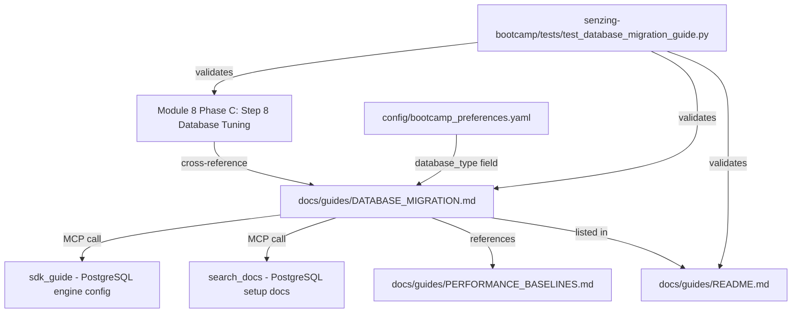

# Design: SQLite to PostgreSQL Database Migration Guide

## Overview

This feature adds a comprehensive database migration guide (`docs/guides/DATABASE_MIGRATION.md`) to the senzing-bootcamp power, covering the full SQLite → PostgreSQL migration path. The guide integrates into Module 8 (Performance Testing) as an optional step when performance testing reveals SQLite bottlenecks, and connects to the existing `PERFORMANCE_BASELINES.md` guide which already documents the SQLite vs PostgreSQL comparison.

The guide is a static markdown document with embedded MCP tool agent instruction blocks. It does not introduce new scripts or runtime logic — it is a documentation artifact that ships as part of the distributed power.

### Design Decisions

1. **Guide placement in `docs/guides/`** — Follows the project's file placement convention for user-facing guides. The guide is reference documentation, not a steering file (which would be agent-facing).
2. **No re-mapping requirement** — The guide explicitly instructs users to re-load from their existing Senzing JSON files (produced in Module 5/6), avoiding the complexity of re-mapping raw data.
3. **MCP tool blocks for dynamic content** — PostgreSQL-specific engine configuration and setup instructions come from the Senzing MCP server via `sdk_guide` and `search_docs` calls, ensuring content stays current across Senzing versions.
4. **Cross-reference from Module 8 Phase C** — The natural insertion point is Step 8 (Database Tuning) in `module-08-phaseC-optimization.md`, which already recommends PostgreSQL migration when SQLite throughput is insufficient.
5. **Schema extension via documentation** — The `database_type` field in `bootcamp_preferences.yaml` is documented in the guide itself and validated by tests, following the same pattern as `deployment_target` and `cloud_provider`.

## Architecture



The migration guide is a leaf document — it is referenced by Module 8 steering but does not itself load or trigger other steering files. It contains agent instruction blocks that the Kiro agent executes when a user follows the guide interactively.

## Components and Interfaces

### 1. Migration Guide Document

**Path:** `senzing-bootcamp/docs/guides/DATABASE_MIGRATION.md`

**Sections:**
1. **Overview** — Why migrate, when to migrate, what this guide covers
2. **Prerequisites** — PostgreSQL installed, running, accessible; existing Senzing JSON files available
3. **Why Migrate** — SQLite limitations vs PostgreSQL advantages (detailed comparison)
4. **Step 1: Create PostgreSQL Database** — Database creation, user setup, permissions
5. **Step 2: Initialize Senzing Schema** — Agent instruction block calling `sdk_guide(topic='configure', language='<chosen_language>')` for PostgreSQL engine configuration
6. **Step 3: Re-load Data** — Re-run loading program against PostgreSQL using existing JSON files; agent instruction block calling `search_docs(query='PostgreSQL database setup', version='current')`
7. **Step 4: Verify Migration** — Record counts, entity resolution validation, query comparison
8. **Rollback** — SQLite database remains intact; how to revert if migration fails
9. **Update Preferences** — Persist `database_type: postgresql` to `config/bootcamp_preferences.yaml`
10. **Related Resources** — Links to PERFORMANCE_BASELINES.md, Module 8 steering, MCP tools

### 2. Module 8 Cross-Reference

**File modified:** `senzing-bootcamp/steering/module-08-phaseC-optimization.md`

**Change:** Add a callout in Step 8 (Database Tuning) under the SQLite section, directing users to the migration guide when SQLite performance is insufficient:

```markdown
> **Optional:** If SQLite throughput is insufficient for your data volume, see
> [DATABASE_MIGRATION.md](../../docs/guides/DATABASE_MIGRATION.md) for a
> step-by-step migration to PostgreSQL.
```

### 3. Guides README Entry

**File modified:** `senzing-bootcamp/docs/guides/README.md`

**Change:** Add an entry in the "Reference Documentation" section:

```markdown
**[DATABASE_MIGRATION.md](DATABASE_MIGRATION.md)**

- Step-by-step SQLite to PostgreSQL migration for Senzing
- Prerequisites, schema initialization, data re-loading, verification
- Rollback path if migration fails
- MCP tool integration for current PostgreSQL configuration guidance
```

### 4. Preferences Schema Extension

**Field:** `database_type` in `config/bootcamp_preferences.yaml`

**Valid values:** `sqlite` (default), `postgresql`

**Behavior:** The guide instructs the agent to update this field after successful migration. Scripts that read preferences (e.g., `validate_module.py`, `repair_progress.py`) can use this field to determine the active database backend.

### 5. Test Suite

**Path:** `senzing-bootcamp/tests/test_database_migration_guide.py`

**Test class:** `TestDatabaseMigrationGuide`

**Validates:**
- Guide file exists at expected path
- All required sections present (prerequisites, database creation, schema init, re-loading, verification, rollback)
- MCP tool references present (`sdk_guide`, `search_docs`)
- No re-mapping instructions (negative check)
- Rollback section mentions SQLite preservation
- Cross-reference exists in Module 8 Phase C steering
- Entry exists in guides README
- Guide mentions `database_type` preference field

## Data Models

### bootcamp_preferences.yaml Schema Extension

```yaml
# Existing fields (unchanged):
language: python          # User's chosen language
track: core_bootcamp      # Selected track
deployment_target: aws    # Deployment target (Module 8+)
cloud_provider: aws       # Cloud provider
hooks_installed: [...]    # Installed hook IDs

# New field:
database_type: sqlite     # Active database backend: sqlite | postgresql
```

The `database_type` field defaults to `sqlite` (the bootcamp default). After successful PostgreSQL migration, the guide instructs the agent to update it to `postgresql`. This field is informational — it does not gate module progression but informs performance guidance and troubleshooting.

### DATABASE_MIGRATION.md Frontmatter

The guide does not use YAML frontmatter (guides in `docs/guides/` don't have frontmatter — only steering files do). It follows the same format as existing guides like `PERFORMANCE_BASELINES.md`.

## Error Handling

### Migration Failures

The guide documents these failure scenarios and their resolutions:

| Failure Point | Symptom | Resolution |
|---|---|---|
| PostgreSQL not running | Connection refused | Start PostgreSQL service, verify port |
| Permission denied | Auth error on CREATE DATABASE | Check pg_hba.conf, verify user permissions |
| Schema initialization fails | SQL errors during init | Verify Senzing version compatibility via MCP |
| Loading fails | Engine errors during re-load | Check connection string, verify schema, consult `explain_error_code` |
| Partial load | Some records loaded, then error | Re-run loading (Senzing handles duplicates) |

### Rollback Strategy

The rollback path is simple because:
1. The original SQLite database (`database/G2C.db`) is never modified during migration
2. To rollback: revert `database_type` in preferences to `sqlite`, and the original database is immediately usable
3. The PostgreSQL database can be dropped without affecting the SQLite state

## Testing Strategy

### Why Property-Based Testing Does Not Apply

This feature creates static documentation (a markdown guide), adds cross-references between existing files, and extends a YAML schema with a new field. There are no pure functions, no algorithmic logic, and no meaningful input variation. The acceptance criteria are all structural checks on fixed files.

The appropriate testing approach is **example-based structural validation** — the same pattern used by `test_entity_resolution_intro_structure.py` and `test_mcp_tool_decision_tree.py` in this project.

### Test Approach

**Framework:** pytest (no Hypothesis needed — fixed inputs, structural assertions)

**Test file:** `senzing-bootcamp/tests/test_database_migration_guide.py`

**Test class:** `TestDatabaseMigrationGuide`

**Test methods:**

| Test | Validates | Strategy |
|---|---|---|
| `test_guide_file_exists` | Req 1 | Assert file exists at expected path |
| `test_required_sections_present` | Req 2 | Extract `## ` headings, verify all required sections covered |
| `test_sqlite_limitations_explained` | Req 3 | Case-insensitive substring checks for key terms (single-writer, performance, concurrent) |
| `test_postgresql_advantages_explained` | Req 3 | Case-insensitive substring checks for PostgreSQL benefits |
| `test_sdk_guide_mcp_reference` | Req 4 | Verify `sdk_guide` with `configure` topic appears in guide |
| `test_search_docs_mcp_reference` | Req 5 | Verify `search_docs` with PostgreSQL query appears in guide |
| `test_module8_cross_reference` | Req 6 | Read Phase C file, verify it references DATABASE_MIGRATION |
| `test_guides_readme_entry` | Req 7 | Read README.md, verify DATABASE_MIGRATION entry exists |
| `test_no_remapping_instructions` | Req 8 | Verify guide does NOT instruct re-mapping; DOES mention re-loading from JSON |
| `test_rollback_section_present` | Req 9 | Verify rollback section exists and mentions SQLite preservation |
| `test_database_type_preference_documented` | Req 10 | Verify guide mentions `database_type` field and valid values |

### Test Conventions

Following project patterns:
- Class-based organization (`class TestDatabaseMigrationGuide:`)
- Path constants at module level using `Path(__file__).resolve()`
- Descriptive assertion messages referencing requirement numbers
- No external dependencies (stdlib `pathlib`, `re` only)
- Each test method documents which requirement it validates via docstring

---

**Last Updated:** 2026-05-14
