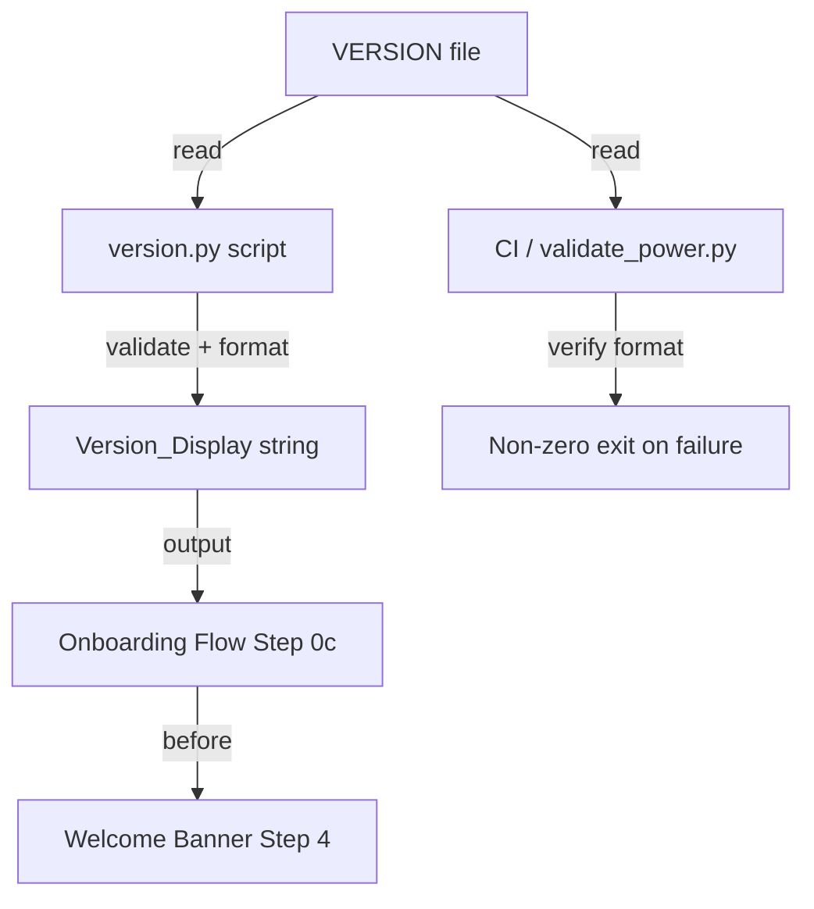

# Design Document: Display Version on Start

## Overview

This feature adds version display to the Senzing Bootcamp Power's onboarding flow. When a bootcamper starts the bootcamp, the power's version (Semantic Versioning format) is shown as the first line of output — before the welcome banner — giving immediate visibility into which version is running.

The design follows the project's existing patterns: a Python stdlib-only script for version reading/validation, a plain-text version source file at a fixed path, and integration into the onboarding steering file. The version is stored in exactly one place and read by both the onboarding flow and CI/scripting tools.

## Architecture



**Key design decisions:**

1. **Plain-text VERSION file** — A single file containing only the version string (e.g., `0.1.0`). No JSON/YAML wrapper needed since the content is a single value. This is the simplest format parseable by Python stdlib (`open().read().strip()`), shell scripts (`cat`), and any other tooling.

2. **Fixed path**: `senzing-bootcamp/VERSION` — At the power's root directory, following common open-source conventions. Scripts locate it relative to the power root without searching.

3. **Dedicated `version.py` script** — Follows the project's script pattern (`main()` + argparse). Provides both a library interface (importable functions) and a CLI interface for scripting/CI use.

4. **Onboarding integration via steering** — The onboarding-flow.md gets a new Step 0c (between Setup Preamble and MCP Health Check) that instructs the agent to read and display the version.

## Components and Interfaces

### 1. Version Source File (`senzing-bootcamp/VERSION`)

A plain-text file containing exactly one line: the version string in `MAJOR.MINOR.PATCH` format.

```text
0.1.0
```

- No trailing newline requirement (stripped on read)
- No comments, no metadata, no other content
- Single authoritative source for the version

### 2. Version Script (`senzing-bootcamp/scripts/version.py`)

Public interface:

```python
# --- Data ---
VERSION_FILE_PATH: Path  # Absolute path to senzing-bootcamp/VERSION

# --- Functions ---
def read_version(version_file: Path | None = None) -> str:
    """Read and validate the version string from the VERSION file.

    Args:
        version_file: Path to the VERSION file. Defaults to VERSION_FILE_PATH.

    Returns:
        The validated version string (e.g., "0.1.0").

    Raises:
        VersionError: If the file is missing, unreadable, or contains
            an invalid version string.
    """

def validate_version(value: str) -> str:
    """Validate that a string is strict MAJOR.MINOR.PATCH semver.

    Args:
        value: The string to validate.

    Returns:
        The validated version string (unchanged).

    Raises:
        VersionError: If the string does not conform to strict semver.
            The error message includes the invalid value verbatim.
    """

def format_version_display(version: str) -> str:
    """Format the version string for display to the bootcamper.

    Args:
        version: A validated MAJOR.MINOR.PATCH string.

    Returns:
        Formatted string: "Senzing Bootcamp Power v{version}"
    """

def parse_version(version: str) -> tuple[int, int, int]:
    """Parse a validated version string into its integer components.

    Args:
        version: A validated MAJOR.MINOR.PATCH string.

    Returns:
        Tuple of (major, minor, patch) integers.
    """

def format_version(major: int, minor: int, patch: int) -> str:
    """Format integer components back into a version string.

    Args:
        major: Major version number (non-negative).
        minor: Minor version number (non-negative).
        patch: Patch version number (non-negative).

    Returns:
        String in "MAJOR.MINOR.PATCH" format.
    """

class VersionError(Exception):
    """Raised when the version cannot be read or is invalid."""
```

**CLI interface:**

```text
usage: version.py [-h] [--file PATH] [--format {raw,display}]

Read and display the Senzing Bootcamp Power version.

options:
  -h, --help            show this help message and exit
  --file PATH           Path to VERSION file (default: auto-detect)
  --format {raw,display}
                        Output format: 'raw' for just the version string,
                        'display' for the full display format (default: raw)
```

- Exit code 0: success, prints version to stdout
- Exit code 1: failure, prints error to stderr with file path and failure description

### 3. Onboarding Flow Integration

A new **Step 0c** is inserted into `onboarding-flow.md` between the existing Step 0b (MCP Health Check) and Step 1 (Directory Structure):

```markdown
## 0c. Version Display

Read the power version from `senzing-bootcamp/VERSION` using the `version.py` script's logic and display it to the bootcamper:

```text
Senzing Bootcamp Power v0.1.0
```

If the version file cannot be read or contains an invalid version, display:

```text
⚠️ Could not determine power version.
```

Then continue with the onboarding sequence — do NOT block on version errors.
```

### 4. CI Integration

The existing `validate_power.py` script gains a version validation check that:
1. Reads `senzing-bootcamp/VERSION`
2. Validates the format using `version.py`'s `validate_version()` function
3. Fails the CI run (non-zero exit) if the version is missing or malformed

## Data Models

### Version String

| Field | Type | Constraints |
|-------|------|-------------|
| major | int | 0 ≤ major ≤ 99 (practical range for display) |
| minor | int | 0 ≤ minor ≤ 99 |
| patch | int | 0 ≤ patch ≤ 99 |

**Validation regex:** `^(0|[1-9][0-9]*)\\.(0|[1-9][0-9]*)\\.(0|[1-9][0-9]*)$`

This regex enforces:
- No leading zeros (except the value `0` itself)
- No pre-release identifiers (`-alpha`, `-rc.1`)
- No build metadata (`+build.123`)
- Exactly three dot-separated components

### VersionError

| Field | Type | Description |
|-------|------|-------------|
| message | str | Human-readable error description |
| file_path | Path | None | Path that was attempted (None if not file-related) |
| invalid_value | str | None | The invalid string that failed validation (included verbatim) |

## Correctness Properties

*A property is a characteristic or behavior that should hold true across all valid executions of a system — essentially, a formal statement about what the system should do. Properties serve as the bridge between human-readable specifications and machine-verifiable correctness guarantees.*

### Property 1: Version String Round-Trip

*For any* three integers (major, minor, patch) each in the range 0–99, formatting them as a version string and then parsing that string back into components SHALL produce the original integers.

**Validates: Requirements 3.4**

### Property 2: Display Format Correctness

*For any* valid version string (MAJOR.MINOR.PATCH with components 0–99 and no leading zeros), the display format function SHALL produce a string equal to `"Senzing Bootcamp Power v"` concatenated with the input version string.

**Validates: Requirements 2.2**

### Property 3: Invalid Version Rejection

*For any* string that does not match strict `MAJOR.MINOR.PATCH` format — including strings with leading zeros, pre-release identifiers, build metadata, extra characters, or wrong structure — the validator SHALL reject it by raising a VersionError.

**Validates: Requirements 3.1, 3.3**

### Property 4: Error Message Contains Invalid Value

*For any* invalid version string that is rejected by the validator, the error message SHALL contain the invalid input string verbatim as a substring.

**Validates: Requirements 3.2**

### Property 5: Malformed Content Produces Error Not Default

*For any* string that is not a valid version (including empty strings, whitespace-only, and random text), attempting to read it as a version SHALL raise a VersionError rather than returning a default, empty, or fallback value.

**Validates: Requirements 1.4**

### Property 6: Script and Display Paths Produce Identical Version

*For any* valid version string written to the VERSION file, reading it via `read_version()` and formatting with `format_version_display()` SHALL produce a display string whose version substring is byte-for-byte identical to the raw string obtained by `read_version()`.

**Validates: Requirements 4.2**

### Property 7: Script Exits Non-Zero on Invalid Input

*For any* malformed version file content (non-semver strings, empty content, binary data), invoking the script's `main()` function SHALL result in a non-zero exit code and an error message printed to stderr that includes the file path.

**Validates: Requirements 4.5**

## Error Handling

| Scenario | Behavior | User Impact |
|----------|----------|-------------|
| VERSION file missing | `VersionError` raised with file path | Onboarding shows "⚠️ Could not determine power version." and continues |
| VERSION file unreadable (permissions) | `VersionError` raised with file path and OS error | Same graceful degradation |
| VERSION file contains invalid format | `VersionError` raised with invalid value verbatim | Same graceful degradation |
| VERSION file contains pre-release/build metadata | `VersionError` raised with invalid value | Same graceful degradation |
| VERSION file contains extra whitespace | Stripped before validation — whitespace around the version is tolerated | No impact — version displays correctly |

**Design principle:** Version display errors never block the onboarding sequence. The version is informational — a missing or broken version file should not prevent a bootcamper from starting the bootcamp.

**Script/CI behavior:** When invoked as a CLI tool (by CI or maintainer scripts), errors result in non-zero exit codes and descriptive stderr messages. This is the appropriate behavior for automated tooling where failures should be surfaced.

## Testing Strategy

### Property-Based Tests (Hypothesis)

The feature is well-suited for property-based testing because:
- Version parsing/formatting are pure functions with clear input/output behavior
- The input space (version strings, invalid strings) is large and varied
- Universal properties (round-trip, format correctness) hold across all valid inputs
- Tests are cheap to run (pure string operations, no I/O in the hot path)

**Library:** Hypothesis (already used in the project)
**Configuration:** Minimum 100 examples per property (`@settings(max_examples=100)`)
**Tag format:** `Feature: display-version-on-start, Property {N}: {title}`

**Test file:** `senzing-bootcamp/tests/test_version_properties.py`

Each correctness property (1–7) maps to a single property-based test class.

### Unit Tests (Example-Based)

**Test file:** `senzing-bootcamp/tests/test_version_unit.py`

| Test | Validates |
|------|-----------|
| `test_read_version_from_default_path` | Req 1.3 — reads without consulting other files |
| `test_version_file_missing_raises_error` | Req 2.4 — missing file error handling |
| `test_version_file_empty_raises_error` | Req 1.4 — empty file is not a default |
| `test_valid_versions_accepted` | Req 3.1 — known-good examples pass |
| `test_leading_zeros_rejected` | Req 3.1 — "01.2.3" rejected |
| `test_prerelease_rejected` | Req 3.3 — "1.2.3-alpha" rejected |
| `test_build_metadata_rejected` | Req 3.3 — "1.2.3+build" rejected |
| `test_cli_raw_format` | Req 4.1 — CLI outputs raw version |
| `test_cli_display_format` | Req 2.2 — CLI outputs display format |
| `test_cli_missing_file_exit_code` | Req 4.5 — non-zero exit |
| `test_onboarding_flow_has_version_step` | Req 2.1 — version before welcome banner |
| `test_version_step_is_automatic` | Req 2.3 — no user interaction required |

### Smoke Tests

| Test | Validates |
|------|-----------|
| `test_version_file_exists_at_fixed_path` | Req 4.4 — file at expected location |
| `test_version_file_is_plain_text` | Req 4.3 — stdlib-parseable format |
| `test_current_version_is_valid` | Req 1.2 — actual VERSION file content is valid |
| `test_no_duplicate_version_definitions` | Req 1.1 — single authoritative source |
