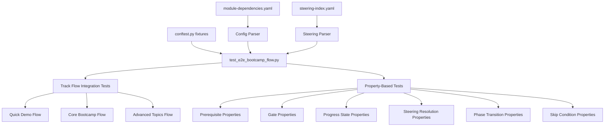

# Design Document: End-to-End Bootcamp Flow Test

## Overview

This feature implements a comprehensive integration test suite that simulates complete bootcamp runs through all three tracks (Quick Demo, Core Bootcamp, Advanced Topics). The tests exercise the full module lifecycle — prerequisite checking, gate evaluation, progress state management, steering file resolution, phase transitions, and skip conditions — as a cohesive flow rather than isolated unit behaviors.

The test suite is entirely configuration-driven: it reads `module-dependencies.yaml` and `steering-index.yaml` at runtime, so new modules, gates, or phases are automatically covered without code changes.

### Design Decisions

1. **Configuration-driven over hardcoded**: All module lists, prerequisites, gates, and steering mappings are parsed from YAML at test time. This ensures the tests stay in sync with the bootcamp definition.
2. **Isolated filesystem per test**: Each test uses `tmp_path` to create an isolated project root with synthetic artifacts, avoiding interference between tests and with the real project.
3. **Reuse existing parsers**: The test reuses the `parse_steering_index` function from `test_module_transition_properties.py` and the minimal YAML parsing pattern established in the codebase (no PyYAML dependency).
4. **Property tests for universal invariants, integration tests for track flows**: Track-level end-to-end walks are integration tests (fixed inputs). Universal properties (prerequisites, gates, steering resolution) use Hypothesis.

## Architecture



The test file is structured as a single module (`test_e2e_bootcamp_flow.py`) containing:
- A config parser section that loads both YAML files at module level
- Hypothesis strategies derived from the parsed config
- Integration test classes for track-level flows
- Property test classes for universal invariants

## Components and Interfaces

### Config Parser (`_parse_module_dependencies`)

Parses `module-dependencies.yaml` using a minimal line-based YAML parser (no PyYAML). Returns a dataclass:

```python
@dataclass
class BootcampConfig:
    modules: dict[int, ModuleConfig]      # module_num -> config
    tracks: dict[str, TrackConfig]        # track_key -> config
    gates: dict[str, GateConfig]          # "N->M" -> config

@dataclass
class ModuleConfig:
    name: str
    requires: list[int]
    skip_if: str | None

@dataclass
class TrackConfig:
    name: str
    modules: list[int]

@dataclass
class GateConfig:
    source: int
    target: int
    requires: list[str]
```

### Steering Parser (`_parse_steering_index`)

Reuses the `parse_steering_index` pattern from `test_module_transition_properties.py`. Returns a dict mapping module numbers to either a filename string (single-phase) or a dict with `root` and `phases` keys.

### Artifact Factory (`_create_module_artifacts`)

A helper function that creates the filesystem artifacts required by `validate_module.py` for a given module number. Uses the same paths checked by the validators in `validate_module.py`.

```python
def _create_module_artifacts(root: Path, module_num: int) -> None:
    """Create all artifacts that validate_module.py checks for module_num."""
```

### Progress Manager (`_ProgressManager`)

A thin wrapper around `progress_utils.py` functions, scoped to a test's `tmp_path`:

```python
class _ProgressManager:
    def __init__(self, root: Path): ...
    def complete_module(self, module_num: int, track_modules: list[int]) -> None: ...
    def read(self) -> dict: ...
    def write(self, data: dict) -> None: ...
```

### Gate Evaluator (`_evaluate_gate`)

Checks whether a gate transition is allowed by verifying the source module's artifacts exist:

```python
def _evaluate_gate(root: Path, gate_key: str, config: BootcampConfig) -> bool:
    """Return True if the gate transition is allowed (source artifacts present)."""
```

### Steering Resolver (`_resolve_steering`)

Maps a module number and optional phase to a steering file path:

```python
def _resolve_steering(
    module_num: int,
    phase: str | None,
    steering_index: dict,
) -> str:
    """Return the steering file path for the given module and phase."""
```

## Data Models

### Progress State (JSON schema)

```python
@dataclass
class ProgressState:
    modules_completed: list[int]
    current_module: int
    current_step: int | str | None
    language: str
    database_type: str
    data_sources: list[str]
    step_history: dict[str, dict]
```

### Module Artifacts Map

A constant dict mapping module numbers to the list of filesystem paths that `validate_module.py` checks:

```python
MODULE_ARTIFACTS: dict[int, list[str]] = {
    1: ["docs/business_problem.md"],
    2: ["database/G2C.db", "config/bootcamp_preferences.yaml"],
    3: ["src/quickstart_demo/demo_example.py", "src/quickstart_demo/sample_data_example.json"],
    4: ["data/raw/example.csv", "docs/data_source_locations.md"],
    5: ["docs/data_source_evaluation.md", "src/transform/transform.py", "data/transformed/output.jsonl"],
    6: ["src/load/loader.py", "database/G2C.db", "docs/loading_strategy.md"],
    7: ["src/query/query.py", "docs/results_validation.md"],
    8: ["docs/performance_requirements.md", "docs/benchmark_environment.md", "tests/performance/bench.py", "docs/performance_report.md"],
    9: ["docs/security_compliance.md", "src/security/auth.py", "docs/security_checklist.md"],
    10: ["src/monitoring/health.py", "docs/runbooks/runbook.md", "docs/monitoring_setup.md"],
    11: ["Dockerfile", "docs/deployment_plan.md"],
}
```

## Correctness Properties

*A property is a characteristic or behavior that should hold true across all valid executions of a system — essentially, a formal statement about what the system should do. Properties serve as the bridge between human-readable specifications and machine-verifiable correctness guarantees.*

### Property 1: Progress State Round-Trip

*For any* valid progress state object (with modules_completed as a subset of [1..11], current_module in [1..11], current_step as 1, and valid step_history), writing it to `bootcamp_progress.json` and reading it back SHALL produce an identical object.

**Validates: Requirements 4.5**

### Property 2: Prerequisite Enforcement (Negative)

*For any* module with a non-empty `requires` list (drawn from `module-dependencies.yaml`), attempting validation in a project root that lacks the prerequisite modules' artifacts SHALL produce at least one validation failure.

**Validates: Requirements 2.1, 2.3**

### Property 3: Prerequisite Satisfaction (Positive)

*For any* module (drawn from `module-dependencies.yaml`), when all prerequisite modules' artifacts are present in the project root, the module's validator SHALL report success.

**Validates: Requirements 2.2**

### Property 4: Gate Evaluation Correctness

*For any* gate defined in `module-dependencies.yaml`, the gate SHALL allow transition if and only if the source module's artifacts are present. Without artifacts, the gate SHALL report the transition as blocked.

**Validates: Requirements 3.1, 3.2, 3.3**

### Property 5: Progress State Update on Transition

*For any* track and any valid position within that track, completing the current module SHALL: (a) add the module number to `modules_completed`, (b) update `current_module` to the next module in the track, and (c) reset `current_step` to 1.

**Validates: Requirements 4.1, 4.2, 4.3**

### Property 6: Steering Resolution Correctness

*For any* module defined in `steering-index.yaml` and any valid phase within that module, the steering resolver SHALL return the correct non-empty file path matching the index definition.

**Validates: Requirements 5.1, 5.2, 5.4**

### Property 7: Steering File Existence

*For any* steering file path referenced in `steering-index.yaml` (across all modules and phases), the file SHALL exist on disk in the steering directory.

**Validates: Requirements 5.3, 6.4**

### Property 8: Phase Step Range Contiguity

*For any* multi-phase module, the step ranges across its phases SHALL be contiguous (phase N's end + 1 equals phase N+1's start) and non-overlapping.

**Validates: Requirements 6.3**

### Property 9: Phase Traversal Order

*For any* multi-phase module and any non-final phase within it, advancing to the next phase SHALL yield the steering file for the subsequent phase as defined in `steering-index.yaml`.

**Validates: Requirements 6.1, 6.2**

### Property 10: Skip Condition Evaluation

*For any* module with a non-null `skip_if` value, skipping that module SHALL allow the track to proceed to the next module without the skipped module's artifacts being present. For any module with a null `skip_if`, the module SHALL NOT be bypassable.

**Validates: Requirements 7.1, 7.2, 7.3, 7.4**

## Error Handling

| Scenario | Behavior |
|----------|----------|
| `module-dependencies.yaml` missing or malformed | Test collection fails with `FileNotFoundError` or `ValueError` containing a descriptive message |
| `steering-index.yaml` missing or malformed | Test collection fails with `FileNotFoundError` or `ValueError` containing a descriptive message |
| Module number not in config | `KeyError` raised with the invalid module number |
| Steering file referenced but missing from disk | `FileNotFoundError` with the missing path |
| Progress file cannot be written (permissions) | `OSError` propagated — tests use `tmp_path` so this shouldn't occur |
| Invalid progress state (schema violation) | `validate_progress_schema` returns non-empty error list |

## Testing Strategy

### Property-Based Tests (Hypothesis)

Each correctness property maps to a single Hypothesis test with `@settings(max_examples=100)`. The test file uses:
- `hypothesis.strategies.sampled_from` for drawing module numbers, gate keys, and track names from the parsed config
- Custom composite strategies for generating valid progress states
- `tmp_path` fixtures for isolated filesystem operations

**Library**: Hypothesis (already in use across the test suite)
**Configuration**: `@settings(max_examples=100)` per property test
**Tagging**: Each test docstring includes `Feature: end-to-end-bootcamp-flow-test, Property N: <title>`

### Integration Tests

Three integration tests (one per track) that walk through the complete module sequence:
1. Create artifacts for each module in order
2. Validate each module passes after artifact creation
3. Verify gate transitions between modules
4. Verify progress state at each step
5. Verify steering file resolution at each module/phase

### Unit Tests

- Parser error handling (malformed YAML)
- Edge cases: empty tracks, module with no prerequisites, first module in track

### Test Organization

All tests live in a single file: `senzing-bootcamp/tests/test_e2e_bootcamp_flow.py`

Classes:
- `TestTrackFlowIntegration` — track-level end-to-end walks
- `TestPrerequisiteProperties` — Properties 2, 3
- `TestGateProperties` — Property 4
- `TestProgressStateProperties` — Properties 1, 5
- `TestSteeringResolutionProperties` — Properties 6, 7
- `TestPhaseTransitionProperties` — Properties 8, 9
- `TestSkipConditionProperties` — Property 10
- `TestConfigParsing` — smoke tests and error handling edge cases
