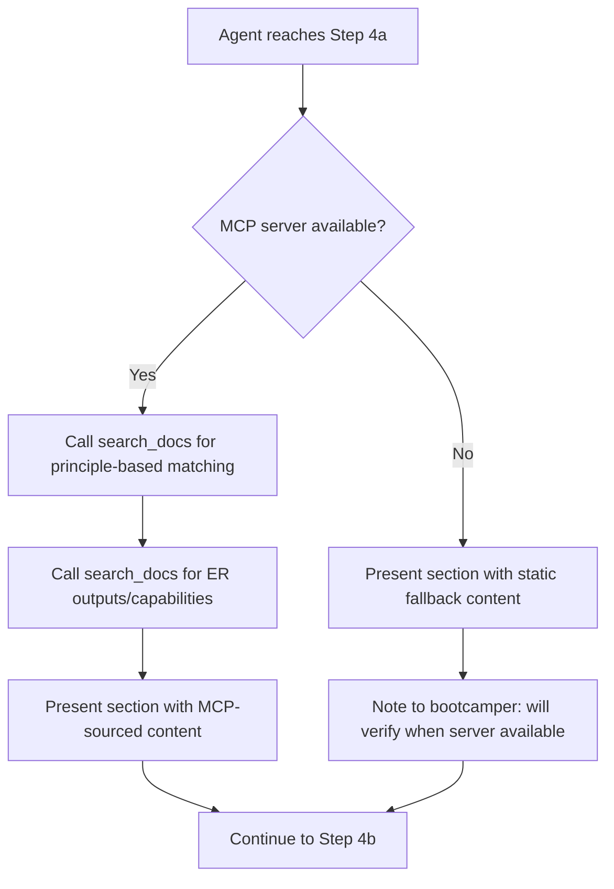

# Design Document

## Overview

This feature adds a conceptual entity resolution section to Step 4 (Bootcamp Introduction) of `senzing-bootcamp/steering/onboarding-flow.md`. The section is inserted after the module overview table and before Step 4b (Verbosity Preference). It builds a mental model around three pillars: why matching records across systems is hard, how Senzing handles it automatically, and what entity resolution produces.

The implementation modifies two existing files — no new scripts, modules, or steering files are created:

1. **`senzing-bootcamp/steering/onboarding-flow.md`** — Insert the new conceptual sub-step (Step 4a) between the existing overview content and Step 4b.
2. **`senzing-bootcamp/steering/steering-index.yaml`** — Update the `token_count` for `onboarding-flow.md` to reflect the added content.

All Senzing-specific claims in the new section are sourced at runtime via `search_docs` from the Senzing MCP server. The steering file embeds agent instructions to call `search_docs` before presenting the section, with a static fallback if the MCP server is unavailable.

## Architecture

### Insertion Point

The new content sits within the existing Step 4 hierarchy. The current structure is:

```text
## 4. Bootcamp Introduction
   ├── Welcome banner
   ├── Overview (module table, mock data, licensing, tracks, glossary)
   ├── ### 4b. Verbosity Preference
   └── ### 4c. Comprehension Check
```

After modification:

```text
## 4. Bootcamp Introduction
   ├── Welcome banner
   ├── Overview (module table, mock data, licensing, tracks, glossary)
   ├── ### 4a. What Is Entity Resolution?        ← NEW
   ├── ### 4b. Verbosity Preference               (unchanged)
   └── ### 4c. Comprehension Check                 (unchanged)
```

Step 4a is a sub-step heading at the `###` level, consistent with 4b and 4c. It is **not** a mandatory gate — the bootcamper reads it and moves on.

### Content Flow Within Step 4a



### Three-Part Structure

The section is organized into three clearly labeled parts:

1. **Why matching is hard** — Data quality variance, name variations, address changes, format inconsistencies, typos, and the false-positive problem (similar records ≠ same entity).
2. **How Senzing handles it** — Principle-based matching using frequency, exclusivity, and stability. Preconfigured for people and organizations. No rules to write, no models to train.
3. **What ER produces** — Matched entities, cross-source relationships, and deduplication, framed in business value terms.

## Components and Interfaces

### Modified Files

| File | Change | Purpose |
|------|--------|---------|
| `senzing-bootcamp/steering/onboarding-flow.md` | Insert `### 4a. What Is Entity Resolution?` block | Add conceptual section to onboarding |
| `senzing-bootcamp/steering/steering-index.yaml` | Update `onboarding-flow.md` token_count and recalculate `total_tokens` | Keep token budget accurate |

### Agent Instructions Block

The new section includes an agent instruction block (not shown to the bootcamper) that directs the agent to:

1. Call `search_docs` with a query about Senzing's principle-based entity resolution approach.
2. Call `search_docs` with a query about entity resolution outputs and capabilities.
3. Use the retrieved content to fill in Senzing-specific claims when presenting the section.
4. If MCP is unavailable, use the static content in the steering file and note the fallback.

This instruction block follows the same pattern used elsewhere in the onboarding flow (e.g., Step 2 Language Selection calls `get_capabilities`).

### Markdown Structure of the New Section

```markdown
### 4a. What Is Entity Resolution?

[Agent instruction block — call search_docs before presenting]

**Why matching records is hard**
[Short paragraphs or bullets covering challenges]
[Concrete example: "John Smith" / "J. Smith" / "Jonathan Smith"]
[False positive problem: father/son same name same address]

**How Senzing handles it**
[Principle-based matching — frequency, exclusivity, stability]
[Concrete example: SSN exclusive vs DOB shared]
[Preconfigured — no rules, no training]

**What entity resolution produces**
[Matched entities, cross-source relationships, deduplication]
[Business value framing]
```

### Glossary Alignment

Terms used in the section that are already defined in `docs/guides/GLOSSARY.md`:

- Entity resolution
- Entity
- Cross-source match
- Data source
- Feature
- Record

Terms that need inline explanation (not in glossary):

- Principle-based matching — explained in context as part of Pillar 2
- Frequency, exclusivity, stability — explained with examples in Pillar 2

No new glossary entries are required. The section references the glossary path for bootcampers who want deeper definitions.

## Data Models

No new data models are introduced. The only structured data change is updating two numeric fields in `steering-index.yaml`:

| Field | Current Value | New Value |
|-------|---------------|-----------|
| `file_metadata.onboarding-flow.md.token_count` | 3620 | Recalculated after edit using `measure_steering.py` |
| `budget.total_tokens` | 87710 | Recalculated: old total − old count + new count |

The `size_category` for `onboarding-flow.md` remains `large` (it is already large at 3620 tokens and will grow).

## Error Handling

### MCP Server Unavailability

The steering file includes a fallback path: if `search_docs` calls fail or the MCP server is unreachable, the agent presents the conceptual section using the static content embedded directly in the steering file. The agent notes to the bootcamper that it will verify Senzing-specific details when the server becomes available.

This follows the same pattern as `mcp-offline-fallback.md` which already exists in the steering directory.

### Validation Failures

If the modified `onboarding-flow.md` fails `validate_commonmark.py`:

- The CI pipeline catches it. Common issues: missing blank lines around headings (MD022), missing blank lines around lists (MD032), unspecified code block languages (MD040).
- The markdown must comply with the `.markdownlint.json` config (MD013/line-length disabled, MD033/inline-HTML disabled, MD041/first-line-heading disabled).

If the modified `steering-index.yaml` fails `validate_power.py`:

- The validator checks that every `.md` file in `steering/` has a `file_metadata` entry with integer `token_count` and valid `size_category`. Since we are updating an existing entry (not adding a new file), the risk is limited to a typo in the count value.

## Testing Strategy

### Why Property-Based Testing Does Not Apply

This feature modifies a markdown steering file and a YAML configuration file. There are no pure functions, parsers, serializers, or business logic with input/output behavior being created. The "outputs" are static prose and a numeric token count. PBT requires universally quantified properties over varying inputs — there is no meaningful input space here.

### Validation Approach

Testing relies on the existing CI validation pipeline:

1. **CommonMark compliance** — Run `validate_commonmark.py` to verify the modified `onboarding-flow.md` passes markdownlint with the project's `.markdownlint.json` config.
2. **Power integrity** — Run `validate_power.py` to verify `steering-index.yaml` has valid `token_count` (integer) and `size_category` for `onboarding-flow.md`.
3. **Token count accuracy** — Run `measure_steering.py --check` to verify the token count in `steering-index.yaml` matches the actual file content (calculated as `round(len(content) / 4)`).
4. **Manual review** — Verify the section reads well, covers all three pillars, uses terms consistent with the glossary, and does not duplicate existing Step 4 content.

### Specific Checks

| Check | Tool | What It Validates |
|-------|------|-------------------|
| Markdown syntax | `validate_commonmark.py` | Blank lines around headings/lists, code block languages, no broken markdown |
| YAML integrity | `validate_power.py` | `token_count` is integer, `size_category` is valid, entry exists |
| Token budget | `measure_steering.py --check` | Stored count matches calculated count |
| Content accuracy | Manual review | Three pillars covered, MCP instruction present, no hardcoded claims, glossary terms used correctly |
| Flow continuity | Manual review | Section fits between overview and 4b without disrupting pacing |
