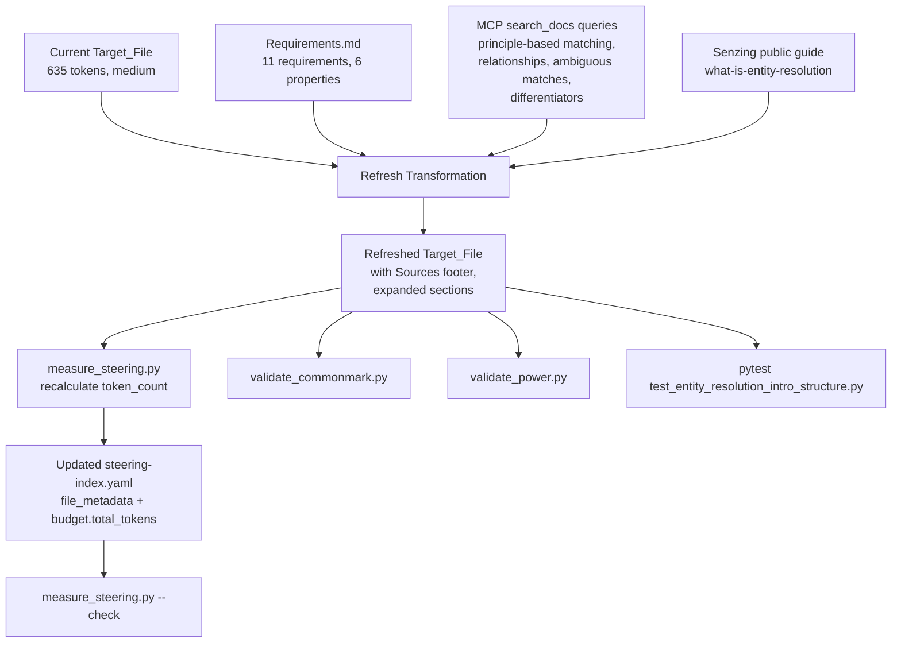

# Design Document

## Overview

This feature refreshes the steering file
`senzing-bootcamp/steering/entity-resolution-intro.md` (the Target_File) so
that its treatment of entity resolution reflects what Senzing itself
publishes at <https://senzing.com/what-is-entity-resolution/> and in its
MCP-indexed documentation (`search_docs` on `mcp.senzing.com`). The refresh
keeps the file a manual-inclusion steering snippet loaded from
`onboarding-flow.md` at Step 4a, and keeps it well inside the `medium` token
budget (under 2000 tokens, per `measure_steering.py`'s thresholds).

The work is a **content transformation** of two existing artifacts plus one
new small structural test. No scripts, hooks, modules, or steering files are
created.

Files changed:

1. `senzing-bootcamp/steering/entity-resolution-intro.md` — content refresh
   (new sections, expanded conceptual coverage, Sources footer, updated
   agent-instruction comment).
2. `senzing-bootcamp/steering/steering-index.yaml` — `token_count` and
   `size_category` for `entity-resolution-intro.md` rerun through
   `measure_steering.py`; the `budget.total_tokens` field is recalculated.

File added:

3. `senzing-bootcamp/tests/test_entity_resolution_intro_structure.py` — a
   small structural pytest module asserting the six correctness properties
   stated in `requirements.md` against the Target_File and the loader
   reference in `onboarding-flow.md`.

All Senzing-specific claims in the refreshed body are sourced at authoring
time from MCP `search_docs` and the Senzing public guide, and are cited in a
`## Sources` footer so they remain re-verifiable.

## Architecture

### Transformation Pipeline

The refresh is a one-shot authoring transformation executed by the agent,
not a runtime pipeline. Conceptually:



The agent is the executor. The agent reads existing content, queries MCP
for authoritative Senzing material, reconciles it with the public guide,
drafts the new body, runs `measure_steering.py` to update the index, and
runs the validators plus the new structural test.

### Runtime Behavior (Unchanged)

At runtime the Target_File is loaded via `#[[file:]]` from Step 4a of
`onboarding-flow.md`. Only the body content changes; the load mechanism,
inclusion directive, and neighboring Step 4 structure are preserved.

```mermaid
flowchart LR
    OF[onboarding-flow.md<br/>Step 4a] -- "#[[file:...]]" --> TF[entity-resolution-intro.md]
    TF -- "agent-instruction comment" --> MCP[MCP search_docs<br/>(optional, pre-render)]
    MCP --> Render[Agent renders section<br/>to Bootcamper]
    TF -- "if MCP unavailable" --> Render
    MCP -. "fallback path" .-> MOF[mcp-offline-fallback.md]
```

### Inputs and Outputs

| Input | Role | Source |
|-------|------|--------|
| Current Target_File | Baseline content, non-regression floor | `senzing-bootcamp/steering/entity-resolution-intro.md` |
| Requirements.md | Acceptance criteria + 6 properties | `.kiro/specs/entity-resolution-intro-refresh/requirements.md` |
| MCP `search_docs` results | Primary source for Senzing-specific claims | `mcp.senzing.com` |
| Senzing public guide | Secondary source, reconciliation baseline | <https://senzing.com/what-is-entity-resolution/> |
| Neighboring steering files | Terminology consistency (`DATA_SOURCE`, Senzing Entity Specification, casing) | `senzing-bootcamp/steering/*.md` |

| Output | Destination |
|--------|-------------|
| Refreshed Target_File body | `senzing-bootcamp/steering/entity-resolution-intro.md` |
| Updated token_count + size_category | `senzing-bootcamp/steering/steering-index.yaml` |
| Recalculated `budget.total_tokens` | `senzing-bootcamp/steering/steering-index.yaml` |
| Structural invariant test | `senzing-bootcamp/tests/test_entity_resolution_intro_structure.py` |

## Components and Interfaces

### Refreshed Target_File Structure

The refreshed Target_File preserves all integration scaffolding from the
current file and adds expanded conceptual sections. Structure, top to
bottom:

```markdown
---
inclusion: manual
---

# What Is Entity Resolution?

Loaded via `#[[file:]]` from `onboarding-flow.md` during Step 4a.

<!-- AGENT INSTRUCTION — not shown to the bootcamper.
Before presenting this section, call `search_docs` from the Senzing MCP server:
1. search_docs("Senzing principle-based entity resolution approach")
2. search_docs("entity resolution relationships disclosed discovered")
3. search_docs("entity resolution ambiguous match possible match")
4. search_docs("Senzing differentiators real-time explainability attribution")
Use retrieved content to fill in Senzing-specific claims. If MCP unavailable,
present static content as-is and note you'll verify later. See
mcp-offline-fallback.md.
-->

## What entity resolution is
## Why matching records is hard
## How entity resolution works
## How Senzing handles it
## Relationships and ambiguous matches
## What entity resolution produces
## Sources
```

The six body headings (between the title and the Sources footer) map
one-to-one to the six conceptual areas required by Requirement 10.2.

### Section-by-Section Outline

Each section is kept short (target: 60 – 150 words) so the total file stays
under the `medium` threshold of 2000 tokens.

#### `## What entity resolution is`

Defines ER as determining when different records refer to the same
real-world entity, when they refer to different entities, and when they are
related (Req 2.1). Notes multiple entity types — people and organizations
both (Req 2.2). Frames ER as underlying accurate counting ("is this one
person or three?") (Req 2.3) and distinguishes it from fuzzy matching by
emphasizing that ER must tell similar records apart as well as match them
(Req 2.4).

#### `## Why matching records is hard`

Bulleted list of at least four concrete challenges: name variations,
address changes over time, format inconsistencies (phone / date formats),
and data entry errors (Req 3.1). Ends with the two failure modes:
false-negative (treating one person as two; lose the 360-degree view)
(Req 3.2) and false-positive via father/son same name and address (Req 3.3).
Closes by stating simplistic or purely fuzzy matching cannot reliably
distinguish these cases (Req 3.4).

#### `## How entity resolution works`

Vendor-neutral conceptual pipeline: ingestion and standardization;
candidate selection (blocking / indexing); comparison and scoring;
classification (match / no match / possible match); entity clustering
(Req 4.1). Explicitly calls out that **no SDK calls, code, or
implementation specifics** belong here (Req 4.2). Notes that the most
capable engines compare each inbound record against everything already
known about an entity, not only pairwise (Req 4.3).

#### `## How Senzing handles it`

Principle-based matching, not hand-coded rules or trained ML (Req 5.1).
Three attribute behaviors with one concrete example each (Req 5.2, 5.3):

- **Frequency** — common name = weak evidence; rare name = strong.
- **Exclusivity** — SSN typically exclusive to one person; phone is not.
- **Stability** — date of birth stable; address changes over time.

Then states Senzing comes preconfigured for people and organizations, so
the Bootcamper can load and resolve data without writing rules or training
a model (Req 5.4). Also adds the Senzing differentiators at a conceptual
level (Req 8): real-time / continuous (8.1), no training or fine-tuning
(8.2), full attribution and explainability — "why matched" and "why not
matched" (8.3), and scales from a laptop to billions of records (8.4).
Marketing numerics (customer counts, deployment sizes) are deliberately
omitted; the section points to docs.senzing.com / MCP for current figures
(Req 8.5).

#### `## Relationships and ambiguous matches`

Introduces relationship awareness — capable ER systems track connections
between resolved entities, not only whether records match (Req 6.1).
Distinguishes disclosed relationships ("Person A is the CEO of Company B",
explicitly stated) from discovered relationships (detected through shared
attributes — common address, shared phone number) (Req 6.2). Defines
**ambiguous match** inline on first use (Req 11.5) as a record that could
legitimately belong to more than one entity, and explains that arbitrarily
resolving such a record creates an invisible false positive (Req 6.3).
States that a well-designed engine flags the case as "possible match"
rather than forcing an arbitrary merge (Req 6.4).

#### `## What entity resolution produces`

Three outputs framed in business-value terms (Req 7.1, 7.2):

- **Matched entities** — a 360-degree customer view / "golden record".
- **Cross-source relationships** — e.g., the vendor in procurement is the
  supplier in the ERP.
- **Deduplication** — duplicate records within and across sources
  collapsed.

Names at least two representative use case areas that depend on ER: fraud
detection, compliance / KYC, customer 360, investigations (Req 7.3).
Closes with a single sentence connecting these outputs to the rest of the
bootcamp — producing, querying, and operationalizing them is what later
modules teach (Req 7.4).

#### `## Sources`

Short footer, renders as:

```markdown
## Sources

- Senzing, *What Is Entity Resolution?* — <https://senzing.com/what-is-entity-resolution/>
- Senzing MCP documentation (`search_docs` tool on `mcp.senzing.com`) —
  queried at authoring time for principle-based matching, relationship
  awareness, ambiguous matches, and Senzing differentiators.
```

This satisfies Req 9.2 (the two citations that Property 3 grep-checks for)
and supports Req 11.5 (inline definition of any newly introduced term).

### Preserved Integration Points (Non-Negotiable)

These elements in the current file **must survive unchanged** through the
refresh; the structural test in the Testing Strategy section below asserts
each one:

| Element | Location | Requirement |
|---------|----------|-------------|
| YAML frontmatter `inclusion: manual` | Top of file | Req 1.2 |
| Top-level `# What Is Entity Resolution?` heading | Line after frontmatter | Req 1.3 |
| Step 4a loader note (`Loaded via \`#[[file:]]\` from onboarding-flow.md during Step 4a.`) | Line after top heading | Req 1.4 |
| Agent-instruction HTML comment block (updated query list) | Before first `##` | Req 9.4 |
| Reference `#[[file:senzing-bootcamp/steering/entity-resolution-intro.md]]` in `onboarding-flow.md` | Step 4a | Req 1.5 |

### Source-Grounding Plan

**Primary source: MCP `search_docs`.** All Senzing-specific factual claims
go through the MCP server first. The planned query set (matching the
agent-instruction comment in the refreshed file):

| # | Query | Fills content for |
|---|-------|-------------------|
| 1 | `Senzing principle-based entity resolution approach` | §How Senzing handles it — principles, no rules, no training |
| 2 | `entity resolution relationships disclosed discovered` | §Relationships and ambiguous matches — disclosed vs discovered |
| 3 | `entity resolution ambiguous match possible match` | §Relationships and ambiguous matches — ambiguous match definition, possible match classification |
| 4 | `Senzing differentiators real-time explainability attribution` | §How Senzing handles it — Req 8 differentiators |
| 5 | `entity resolution pipeline standardization blocking scoring clustering` | §How entity resolution works — vendor-neutral pipeline |

**Secondary / reconciliation source: Senzing public guide** at
<https://senzing.com/what-is-entity-resolution/>. Used for:

- General ER concepts (definition, hard-matching framing, outputs) when MCP
  content is sparse or reiterative.
- Cross-checking that MCP and the public guide are consistent — if they
  disagree, prefer MCP (authoritative product documentation) and note the
  divergence in the PR description.

**Citation rule.** No Senzing-specific claim enters the body without
passing through at least one of these two sources (Req 9.1, 9.3). The
`## Sources` footer makes the sources discoverable inline; individual
paragraphs do not need per-claim footnotes (the file is deliberately short
and scannable — Req 10.1).

**Training-data discipline.** The agent must not add Senzing-specific
facts from its training data. If MCP is reachable at authoring time, the
agent uses MCP content. If MCP is unreachable at authoring time, the
agent falls back to the public guide and marks the affected sentences in
the PR description for later MCP re-verification (Req 9.3, 9.5).

### Integration Plan

**Preserving the loader reference.** The existing line in
`onboarding-flow.md`:

```markdown
# [[file:senzing-bootcamp/steering/entity-resolution-intro.md]]
```

is not modified. The refresh only changes the *contents* of the referenced
file. Property 1 in the Testing Strategy section asserts this invariant.

**Preserving the manual inclusion directive.** The YAML frontmatter stays
exactly `inclusion: manual` — no keywords, no file-match patterns,
nothing that would cause the Target_File to auto-load into every session.
This is critical because the file is meant to be context only during
Step 4a.

**Terminology alignment.** The refreshed body uses the same casing and
phrasing as neighboring steering files (Req 11.4):

- `DATA_SOURCE` (all caps, as used in `onboarding-flow.md` Step 4 overview
  and `module-04-data-collection.md`).
- *Senzing Entity Specification* (title case, as used in
  `onboarding-flow.md` and the glossary).
- *entity resolution* (lowercase except at sentence start, matching the
  rest of the corpus).
- *principle-based matching* (lowercase, hyphenated, matching the current
  file).

Any term newly introduced by the refresh and not already present in
`docs/guides/GLOSSARY.md` is defined inline on first use (Req 11.5). The
only candidate is **ambiguous match**, which is defined inline in
§Relationships and ambiguous matches.

**No duplication with Step 4 overview.** The module overview table,
licensing details, and mock-data callouts stay in `onboarding-flow.md`
Step 4; the Target_File does not restate them (Req 10.5).

**No new gates.** The refreshed file does not introduce 👉 pointing
questions, 🛑 STOP directives, or checkpoint prompts (Req 10.4). It is a
read-through interstitial.

### Steering Index Update Plan

After the body edit is complete, the agent runs:

```bash
python senzing-bootcamp/scripts/measure_steering.py
```

This rescans every `.md` file in `senzing-bootcamp/steering/`, recomputes
`token_count` as `round(len(content) / 4)`, reclassifies each file into
small / medium / large using the fixed thresholds in
`measure_steering.classify_size` (small &lt; 500 ≤ medium ≤ 2000 &lt;
large), and rewrites the `file_metadata:` and `budget:` sections of
`steering-index.yaml` in place. Existing higher-level YAML (module table,
keywords, languages, deployment) is preserved byte-for-byte because
`measure_steering.update_index` truncates only from `file_metadata:`
onward.

Then the agent verifies with:

```bash
python senzing-bootcamp/scripts/measure_steering.py --check
```

This must report "All token counts are within 10% tolerance" — which is
the contract Property 2 below relies on (Req 1.6, Req 11.3).

**Size category expectation.** The current `token_count` is 635 (medium).
The refresh adds four new section headings plus modest prose expansion.
A conservative budget is roughly 1200 – 1700 tokens, comfortably inside
the medium band (500 – 2000). If the refreshed body exceeds 2000 tokens,
the file would flip to `large`, violating Req 10.3; the design deliberately
allocates ~60 – 150 words per section to stay well under that ceiling.

## Data Models

No new schemas are introduced. The only structured-data change is within
the existing `file_metadata` and `budget` sections of
`steering-index.yaml`.

### Existing `steering-index.yaml` fragment (before)

```yaml
file_metadata:
  entity-resolution-intro.md:
    token_count: 635
    size_category: medium
...
budget:
  total_tokens: 111721
  reference_window: 200000
  warn_threshold_pct: 60
  critical_threshold_pct: 80
  split_threshold_tokens: 5000
```

### After `measure_steering.py` rerun

```yaml
file_metadata:
  entity-resolution-intro.md:
    token_count: <recalculated>   # expected range: 1200-1700
    size_category: medium          # must remain medium (Req 10.3)
...
budget:
  total_tokens: <recalculated>    # old_total - 635 + <new_count>
  reference_window: 200000
  warn_threshold_pct: 60
  critical_threshold_pct: 80
  split_threshold_tokens: 5000
```

The exact `token_count` and `total_tokens` values are produced by the
script, not hand-edited. The design constrains only the bounds:
`size_category` must remain `medium` and `token_count` must be strictly
less than 2000.

## Error Handling

### MCP Server Unavailable at Authoring Time

If `search_docs` calls fail while the agent is drafting the refresh, the
agent falls back to the Senzing public guide as the single source for
that section, marks the affected sentences in the PR description, and
schedules a re-verification task for when MCP is reachable. This mirrors
the pattern documented in `senzing-bootcamp/steering/mcp-offline-fallback.md`.

If the agent cannot reach *either* MCP or the public guide, the refresh
stops. The agent reports the blocker rather than substituting training-data
content (Req 9.3).

### MCP Server Unavailable at Runtime

When the Bootcamper hits Step 4a and MCP is unreachable, the agent
presents the Target_File body as-is (the static content is already
sourced from MCP at authoring time) and notes to the Bootcamper that
live Senzing details can be re-verified later. This behavior is already
specified in the existing agent-instruction HTML comment at the top of
the file; the refresh preserves and updates the comment (Req 9.5).

### CommonMark Validation Failures

`validate_commonmark.py` runs `markdownlint` with the repo's
`.markdownlint.json`. Common failure modes and remediation:

| Symptom | Cause | Fix |
|---------|-------|-----|
| MD022 | Missing blank line around a heading | Ensure blank line before and after every `##` heading. |
| MD032 | Missing blank line around a list | Ensure blank line before and after every bullet block. |
| MD040 | Fenced code block missing language | Every `` ``` `` block in the Sources footer uses a language hint (or plain prose lists, not code blocks). |
| MD024 | Duplicate heading text | The six `##` headings in the refreshed file are all distinct (verified in the structural test). |

### Token Budget Overrun

If `measure_steering.py --check` reports that
`entity-resolution-intro.md` has shifted out of the `medium` band (Req
10.3), the agent must tighten the prose (prefer bullet lists over
paragraphs, cut adjectives, collapse redundant examples) and rerun
`measure_steering.py` before committing. The 2000-token ceiling is the
hard boundary because crossing it flips the file to `large` and breaks
Req 10.3.

### Marketing Drift

Senzing's public-facing page periodically introduces specific customer
counts, deployment sizes, or product names that may be rebranded. The
refreshed body deliberately avoids such numerics and proper-noun product
names (Req 8.5), pointing Bootcampers to docs.senzing.com / MCP for
current figures. This reduces the maintenance rate for the Target_File
and is enforced by manual review rather than by an automated check.

### Breaking the `onboarding-flow.md` Reference

The greatest integration risk is accidentally renaming or moving the
Target_File, which would silently strand the `#[[file:]]` loader. The
refresh does not rename or move the file; Property 1 in the structural
test asserts the reference still resolves. `validate_power.py` also
catches broken cross-references across the power.

## Testing Strategy

### Why Property-Based Testing Does Not Apply

This feature refreshes a markdown document and updates a YAML metadata
entry. There are no pure functions, parsers, serializers, or algorithms
with universally quantified input/output behavior being introduced. The
"outputs" are static prose and a numeric token count. Hypothesis-style
PBT requires a meaningful generated input space; here the input is a
single file.

Consistent with the sister spec
`.kiro/specs/entity-resolution-conceptual-intro/design.md`, the
Correctness Properties section is omitted from this design. The six
correctness properties stated in `requirements.md` are **structural
invariants** over the refreshed artifact; they map cleanly onto existing
validators plus one small pytest structural module.

### Validation Layers

Four layers, all run in CI:

| # | Tool | What It Validates | Config |
|---|------|-------------------|--------|
| 1 | `validate_commonmark.py` | CommonMark / markdownlint compliance of the refreshed Target_File | `.markdownlint.json` at repo root and `senzing-bootcamp/.markdownlint.json` |
| 2 | `validate_power.py` | `steering-index.yaml` has a valid `file_metadata` entry for `entity-resolution-intro.md` with integer `token_count` and valid `size_category`; cross-references in the power resolve | — |
| 3 | `measure_steering.py --check` | Stored `token_count` matches calculated count within 10% tolerance | `senzing-bootcamp/steering/steering-index.yaml` |
| 4 | `pytest senzing-bootcamp/tests/test_entity_resolution_intro_structure.py` | Six structural invariants from requirements.md | — |

### New Test Module

**File:** `senzing-bootcamp/tests/test_entity_resolution_intro_structure.py`

Following the repo's Python conventions:

- stdlib only (`pathlib`, `re`, `sys`), no PyYAML — the minimal frontmatter
  parse is a regex.
- Class-based organization: `class TestEntityResolutionIntroStructure:`.
- Example-based assertions, not Hypothesis — the input is a single fixed
  file, so `@given` would add noise without coverage.
- Each test docstring references the requirement + property it validates.

### Mapping: Correctness Properties → Validators / Tests

#### Property 1 — Integration Invariant (Onboarding Reference Preserved)

*Requirements 1.1, 1.2, 1.5.*

**Checked by:** new test `test_onboarding_loader_resolves` +
`validate_power.py` cross-reference check.

The test reads `senzing-bootcamp/steering/onboarding-flow.md`, asserts the
line `# [[file:senzing-bootcamp/steering/entity-resolution-intro.md]]`
(with or without the leading `#`, matching the current form) is present
exactly once, then opens the referenced file and asserts its YAML
frontmatter contains `inclusion: manual`.

#### Property 2 — Token Budget Invariant (Steering_Index Consistency)

*Requirements 1.6, 10.3, 11.3.*

**Checked by:** `measure_steering.py --check` (existing CI step) + new
test `test_token_count_in_medium_band`.

The existing `--check` invocation covers the consistency half of the
property. The new test additionally asserts that the recorded
`size_category` for `entity-resolution-intro.md` is exactly `medium` and
the `token_count` is strictly less than 2000, which Req 10.3 requires
but `--check` does not enforce directly.

#### Property 3 — Source Attribution Invariant

*Requirements 9.2, 9.4.*

**Checked by:** new test `test_sources_footer_present`.

Reads the Target_File and asserts:

- At least one occurrence of the substring
  `senzing.com/what-is-entity-resolution`.
- At least one occurrence of the substring `search_docs`.
- A `## Sources` heading exists.

Grep-level assertions, not prose analysis — future edits that delete
either citation fail the test immediately.

#### Property 4 — Section Coverage Invariant

*Requirement 10.2.*

**Checked by:** new test `test_six_conceptual_sections_present`.

Extracts all `^##` headings from the Target_File (excluding `## Sources`)
and asserts each of the six required conceptual areas is covered by at
least one heading. The match is by a short keyword set per area, not exact
heading text, so minor wording improvements in future edits do not break
the test:

| Conceptual area (Req 10.2) | Keyword match set |
|----------------------------|-------------------|
| What entity resolution is | `{"what", "is"}` in a heading containing `entity resolution` |
| Why matching is hard (false-positive / false-negative framing) | heading containing `hard` or `matching records` |
| How ER works at a high level | heading containing `how` and (`works` or `entity resolution works`) |
| Senzing's principle-based approach | heading containing `Senzing` |
| Relationship awareness and ambiguous matches | heading containing `relationship` or `ambiguous` |
| What ER produces | heading containing `produces` or `outputs` |

#### Property 5 — Idempotent Refresh

*Rationale only in requirements.md; no direct acceptance criterion.*

**Checked by:** new test `test_measure_steering_rerun_is_idempotent`.

The test reads the current `steering-index.yaml`, invokes
`measure_steering.update_index(...)` programmatically against the current
Target_File contents, and asserts the re-emitted file is byte-identical
to the original (whitespace-tolerant). Because the hand-authored content
is fixed, a second run of the full refresh transformation over the same
inputs would produce the same body and therefore the same token count,
satisfying the `f(f(x)) = f(x)` property.

This test is the closest practical proxy for the "re-running the refresh
workflow produces no content-meaningful changes" statement in the
requirements — the authoring step itself is manual, so the test covers
the automated tail of the pipeline (token measurement + index update).

#### Property 6 — No Regression of Existing Core Content

*Implicit requirement; protects against accidental deletion.*

**Checked by:** new test `test_no_regression_of_core_content`.

Asserts the refreshed Target_File still contains (case-insensitively, as
substring matches within any paragraph):

- Each of the three principle-based behavior labels: `frequency`,
  `exclusivity`, `stability`.
- Each of the three ER outputs: `matched entities`, `cross-source
  relationships` (or equivalent wording — a permissive alternative is
  `cross-source` + `relationship`), `deduplication`.

The test uses six independent assertions so a future edit that drops any
single item fails with a clear message.

### Test Location and Repo Convention

The new module lives under `senzing-bootcamp/tests/` (not the repo-level
`tests/`) because it validates content shipped as part of the bootcamp
power. This matches the location of `test_steering_structure_properties.py`
and every other steering-file test in the repo.

The module follows the `sys.path` shim pattern used by peer tests so that
`measure_steering` can be imported directly:

```python
_SCRIPTS_DIR = str(Path(__file__).resolve().parent.parent / "scripts")
if _SCRIPTS_DIR not in sys.path:
    sys.path.insert(0, _SCRIPTS_DIR)
```

### Manual Review Checklist (Complementary)

Automated checks catch structural drift but not prose quality. A short
reviewer checklist, documented in the PR description, covers:

- Prose is scannable in under two minutes (Req 10.1).
- No hardcoded customer counts / deployment sizes / current-Senzing
  marketing numerics (Req 8.5).
- Terminology matches neighboring steering files for `DATA_SOURCE`,
  Senzing Entity Specification, etc. (Req 11.4).
- No duplication of Step 4 overview content from `onboarding-flow.md`
  (Req 10.5).
- No new 👉 / 🛑 gates or checkpoint prompts (Req 10.4).

## Risks and Mitigations

| Risk | Likelihood | Impact | Mitigation |
|------|------------|--------|------------|
| MCP unavailable at authoring time | Medium | High (blocks Senzing-specific claims) | Fall back to Senzing public guide; mark affected sentences for later MCP re-verification (Req 9.5). If both sources unreachable, stop — do not substitute training-data content (Req 9.3). |
| Marketing drift (Senzing rebrands a feature or updates numerics) | Medium | Low | Body deliberately omits numerics and proper-noun product names (Req 8.5); `## Sources` footer points to the authoritative live pages so re-verification is cheap. |
| Token budget overrun flips file to `large` | Low | Medium | Sections kept short by design (60 – 150 words each); `measure_steering.py --check` in CI catches drift; new test asserts `size_category == medium`. |
| Breaking the `onboarding-flow.md` loader reference | Very low | High (Step 4a silently renders nothing) | Refresh does not rename or move the Target_File; new `test_onboarding_loader_resolves` asserts the reference resolves; `validate_power.py` cross-reference check is a second line of defense. |
| Prose drift contradicts MCP content in a later edit | Medium | Medium | `## Sources` footer keeps provenance explicit; `test_sources_footer_present` guarantees the citations cannot be silently removed. |
| Terminology divergence from neighboring steering files | Medium | Low | Manual reviewer checklist + use of the existing glossary in `docs/guides/GLOSSARY.md`; inline definition for any newly introduced term (Req 11.5). |
| CommonMark warnings introduced by bullet + heading spacing | Medium | Low (CI catches) | `validate_commonmark.py` runs in CI; design explicitly lists MD022 / MD032 / MD040 / MD024 as the failure modes to watch. |
| Non-regression of core content (frequency / exclusivity / stability; three outputs) | Low | Medium | `test_no_regression_of_core_content` asserts each item is still present after any future edit. |
| Hypothesis / flaky test — none expected | N/A | N/A | All new tests are deterministic example-based assertions; no Hypothesis strategies are used. |

## Sources for This Design

- Current Target_File content and layout:
  `senzing-bootcamp/steering/entity-resolution-intro.md`.
- Requirements baseline:
  `.kiro/specs/entity-resolution-intro-refresh/requirements.md`.
- Precedent design (related feature, conceptual sibling):
  `.kiro/specs/entity-resolution-conceptual-intro/design.md`.
- Token measurement contract: `senzing-bootcamp/scripts/measure_steering.py`
  (in particular `classify_size` thresholds and `update_index` behavior).
- Validator contracts: `senzing-bootcamp/scripts/validate_commonmark.py`,
  `senzing-bootcamp/scripts/validate_power.py`.
- Structural-test precedent:
  `senzing-bootcamp/tests/test_steering_structure_properties.py` (class
  layout, sys.path shim, regex invariants).
- MCP offline behavior:
  `senzing-bootcamp/steering/mcp-offline-fallback.md`.
- Step 4a loader reference:
  `senzing-bootcamp/steering/onboarding-flow.md` (Step 4a).
