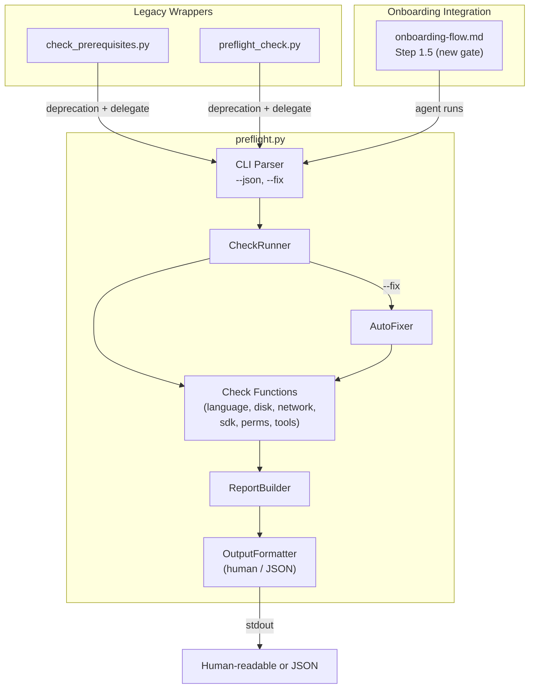

# Design Document: Environment Verification

## Overview

This feature consolidates two overlapping environment-check scripts (`check_prerequisites.py` and `preflight_check.py`) into a single `senzing-bootcamp/scripts/preflight.py`. The new script performs all environment checks (language runtimes, disk space, network connectivity, Senzing SDK availability, write permissions, required tools), produces a structured pass/warn/fail report, supports `--json` for programmatic consumption and `--fix` for auto-remediation, and integrates into the onboarding flow as a mandatory gate before track selection.

The design prioritizes:
- **Single responsibility**: one script, one entry point, one report format
- **Testability**: pure-function check logic separated from I/O, enabling property-based testing of the report model
- **Cross-platform**: Linux, macOS, Windows — stdlib only
- **Backward compatibility**: legacy scripts delegate to the new one with deprecation warnings

## Architecture



The architecture separates concerns into:
1. **Data model layer** — `CheckResult`, `PreflightReport` as plain dataclasses
2. **Check functions** — each returns a `CheckResult`, pure except for the system queries they wrap
3. **CheckRunner** — orchestrates checks by category, optionally runs auto-fix before reporting
4. **OutputFormatter** — renders the report as human-readable text or JSON
5. **Legacy wrappers** — thin shims that print a deprecation warning and call `preflight.main()`

## Components and Interfaces

### CheckResult (dataclass)

```python
@dataclasses.dataclass
class CheckResult:
    name: str           # e.g. "Python runtime"
    category: str       # e.g. "Language Runtimes"
    status: str         # "pass" | "warn" | "fail"
    message: str        # human-readable detail
    fix: str | None     # Fix_Instruction or None
    fixed: bool = False # True if --fix resolved this
```

### PreflightReport (dataclass)

```python
@dataclasses.dataclass
class PreflightReport:
    checks: list[CheckResult]

    @property
    def pass_count(self) -> int: ...
    @property
    def warn_count(self) -> int: ...
    @property
    def fail_count(self) -> int: ...
    @property
    def verdict(self) -> str:
        """'FAIL' if any fail, 'WARN' if any warn, else 'PASS'."""
```

### Check Functions

Each check function has the signature `def check_<name>() -> list[CheckResult]` and is grouped by category:

| Function | Category | Checks |
|---|---|---|
| `check_language_runtimes()` | Language Runtimes | Python, Java, .NET, Rust, Node.js; pip if Python found |
| `check_disk_space()` | Disk Space | `shutil.disk_usage` ≥ 10 GB |
| `check_network()` | Network | HTTPS socket to `mcp.senzing.com:443`, 5s timeout |
| `check_senzing_sdk()` | Senzing SDK | subprocess import of `senzing`, version ≥ 4.0 |
| `check_write_permissions()` | Permissions | create/remove temp dir in cwd |
| `check_required_tools()` | Core Tools | git, curl; zip/unzip on non-Windows |
| `check_directories()` | Project Structure | expected project dirs exist |

### CheckRunner

```python
class CheckRunner:
    def run(self, fix: bool = False) -> PreflightReport:
        """Execute all checks. If fix=True, attempt auto-fix then re-check."""
```

### AutoFixer

```python
class AutoFixer:
    FIXABLE_DIRS = ["data/raw", "data/transformed", "database", "src",
                    "scripts", "docs", "backups", "licenses"]

    def try_fix(self, result: CheckResult) -> CheckResult | None:
        """Attempt to fix a failing check. Returns updated result or None."""
```

Only directory creation is auto-fixable. The fixer creates missing directories with `os.makedirs(exist_ok=True)` — safe and idempotent.

### OutputFormatter

```python
class OutputFormatter:
    @staticmethod
    def to_human(report: PreflightReport) -> str:
        """Render colored, grouped, human-readable report."""

    @staticmethod
    def to_json(report: PreflightReport) -> str:
        """Render report as a single JSON object."""
```

### CLI Entry Point

```python
def main(argv: list[str] | None = None) -> int:
    """Parse args, run checks, format output, return exit code."""
```

Accepts `--json` and `--fix` flags via `argparse`. Returns 0 for PASS/WARN, 1 for FAIL.

### Legacy Wrappers

Both `check_prerequisites.py` and `preflight_check.py` are replaced with thin shims:

```python
#!/usr/bin/env python3
"""DEPRECATED: Use preflight.py instead."""
import sys, os, subprocess
print("⚠️  This script is deprecated. Use preflight.py instead.", file=sys.stderr)
sys.exit(subprocess.call([sys.executable, os.path.join(os.path.dirname(__file__), "preflight.py")] + sys.argv[1:]))
```

## Data Models

### CheckResult JSON Representation

When `--json` is used, each `CheckResult` serializes to:

```json
{
  "name": "Python runtime",
  "category": "Language Runtimes",
  "status": "pass",
  "message": "Python 3.12.3",
  "fix": null,
  "fixed": false
}
```

The `fixed` field is only meaningful when `--fix` was used; it defaults to `false`.

### PreflightReport JSON Representation

```json
{
  "checks": [ ... ],
  "summary": {
    "pass_count": 8,
    "warn_count": 1,
    "fail_count": 0,
    "verdict": "WARN"
  }
}
```

### Verdict Derivation

| Condition | Verdict | Exit Code |
|---|---|---|
| Any check has status `fail` | FAIL | 1 |
| No fails, any check has status `warn` | WARN | 0 |
| All checks pass | PASS | 0 |

## Correctness Properties

*A property is a characteristic or behavior that should hold true across all valid executions of a system — essentially, a formal statement about what the system should do. Properties serve as the bridge between human-readable specifications and machine-verifiable correctness guarantees.*

### Property 1: Language runtime detection produces correct status per environment

*For any* subset of available language runtimes (Python, Java, .NET, Rust, Node.js) and pip availability, the language runtime check SHALL produce a pass CheckResult for each detected runtime with its version, a fail CheckResult when no runtimes are found, and a warn CheckResult for missing pip when Python is present.

**Validates: Requirements 2.1, 2.2, 2.3, 2.4**

### Property 2: Disk space threshold determines check status

*For any* non-negative disk space value, the disk space check SHALL produce a pass CheckResult when the value is ≥ 10 GB and a warn CheckResult when the value is < 10 GB.

**Validates: Requirements 3.2, 3.3**

### Property 3: Senzing SDK version threshold determines check status

*For any* importable Senzing SDK version string, the SDK check SHALL produce a pass CheckResult when the version is ≥ 4.0 and a warn CheckResult when the version is < 4.0.

**Validates: Requirements 5.2, 5.3**

### Property 4: Required tool presence determines check status

*For any* subset of required tools (git, curl, and zip/unzip on non-Windows), the tools check SHALL produce a pass CheckResult for each present tool and a fail CheckResult with a Fix_Instruction for each missing tool.

**Validates: Requirements 7.1, 7.2, 7.3**

### Property 5: Human-readable report rendering is complete

*For any* list of CheckResults with arbitrary names, categories, statuses, messages, and fix instructions, the human-readable formatter SHALL produce output that contains every category heading, every check name and message, and every Fix_Instruction for warn/fail results indented below the check line.

**Validates: Requirements 8.2, 8.3, 8.4**

### Property 6: Report verdict and exit code are consistent with check statuses

*For any* PreflightReport, the summary pass/warn/fail counts SHALL equal the actual counts of each status in the checks list, the verdict SHALL be FAIL if any check is fail, WARN if any check is warn and none fail, and PASS otherwise, and the exit code SHALL be 1 for FAIL and 0 for PASS or WARN.

**Validates: Requirements 8.5, 8.6, 8.7**

### Property 7: JSON output round-trip and structural completeness

*For any* PreflightReport (optionally with `fixed` flags set), serializing to JSON with `to_json` and parsing with `json.loads` SHALL produce a valid dictionary containing a `checks` array where each element has `name`, `category`, `status`, `message`, `fix`, and `fixed` fields, and a `summary` object with `pass_count`, `warn_count`, `fail_count`, and `verdict` fields matching the report's computed values.

**Validates: Requirements 9.1, 9.2, 9.3, 9.4, 9.5, 10.6**

## Error Handling

| Scenario | Behavior |
|---|---|
| `shutil.disk_usage` raises | Produce warn CheckResult; do not crash |
| Network socket timeout/error | Produce warn CheckResult with offline guidance |
| Senzing SDK import fails in subprocess | Produce warn CheckResult; note Module 2 covers install |
| No Python runtime for SDK check | Skip SDK check; produce warn noting Python required |
| `os.makedirs` fails during `--fix` | Retain original fail/warn; append error reason to fix instruction |
| Temp dir creation fails (permissions) | Produce fail CheckResult with ownership/permissions guidance |
| `subprocess.run` timeout for version detection | Return "unknown" version; do not crash |
| Invalid CLI arguments | `argparse` prints usage and exits with code 2 |

All check functions catch exceptions internally and convert them to appropriate CheckResult statuses. The script never crashes with an unhandled exception during normal operation.

## Testing Strategy

### Property-Based Tests (Hypothesis)

The project already uses Hypothesis for PBT (see `test_pbt_checkpointing.py`). The same pattern applies here.

**Library**: [Hypothesis](https://hypothesis.readthedocs.io/) (Python)
**Minimum iterations**: 100 per property
**Tag format**: `Feature: environment-verification, Property {N}: {title}`

Each of the 7 correctness properties maps to a single property-based test class. Key strategies:

- `CheckResult` generator: random name, category from fixed set, status from `{pass, warn, fail}`, random message, optional fix string, optional fixed bool
- `PreflightReport` generator: list of 1-20 random CheckResults
- Runtime availability generator: random subset of `{python, java, dotnet, rustc, node}` with optional pip
- Disk space generator: `st.floats(min_value=0, max_value=100)` in GB
- Version string generator: `st.tuples(st.integers(1,5), st.integers(0,20))` mapped to `"X.Y"`

Mocking approach: check functions that query the system (`shutil.which`, `shutil.disk_usage`, `subprocess.run`, `socket`) are mocked at the function boundary to keep tests fast and deterministic.

### Unit Tests (pytest)

Unit tests cover specific examples and edge cases not suited for PBT:

- Banner text appears in human output (Req 8.1)
- Network check uses correct host/port/timeout (Req 4.1, 4.2, 4.3)
- SDK check skipped when no Python (Req 5.5)
- Write permissions check pass/fail (Req 6.1, 6.2, 6.3)
- `--fix` failure retains original status (Req 10.4)
- zip/unzip checked only on non-Windows (Req 7.4)
- Legacy script delegation and deprecation warning (Req 12.2, 12.3)
- `--json` combined with `--fix` includes `fixed` field (Req 10.6)

### Test File Location

`senzing-bootcamp/scripts/test_preflight.py` — follows existing convention alongside `test_progress_utils.py` and `test_pbt_checkpointing.py`.

