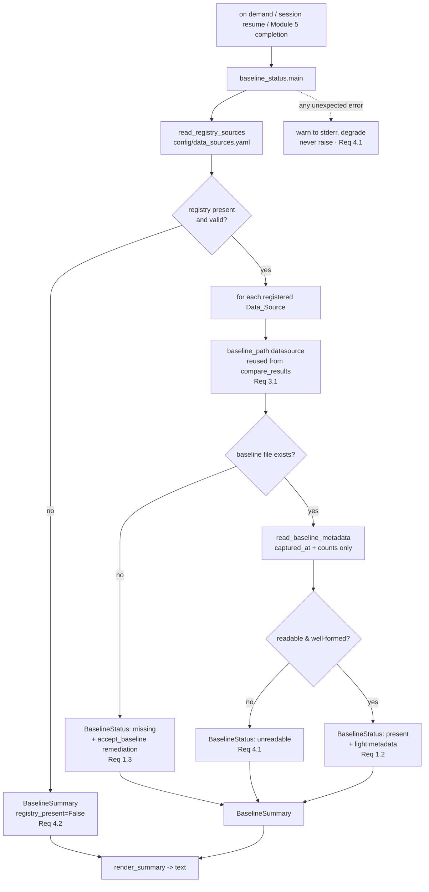

# Design Document

## Overview

Module 5 Phase 3 (`module-05-phase3-test-load.md`) produces ER-baseline files
(`config/er_baseline_{datasource}.json`) via the mapping-regression machinery
(`mapping-regression-testing`). A baseline is created the first time a data source is
test-loaded (Phase 3 step 24b) and can be re-accepted after a mapping change (step 24d) by copying
`config/er_current_{datasource}.json` over the baseline — the code path exposed as
`compare_results.accept_baseline()`. Each baseline is an `ERStatistics` JSON object carrying the
datasource name, entity/record/match/relationship counts, and a `captured_at` timestamp.

These baselines give later runs their regression coverage, but nothing summarizes them. A source's
baseline lives in one JSON file, its registration lives in `config/data_sources.yaml`, and the two
are only ever correlated inside the Phase 3 flow for one source at a time. A bootcamper — or the
agent resuming a session — has no single view answering "which of my registered data sources have an
accepted ER baseline, and which are still uncovered?"

This feature adds a **Baseline_Status_Summary**: a stdlib-only, **read-only** script
(`senzing-bootcamp/scripts/baseline_status.py`) that derives the registered `Data_Sources` from the
existing registry, checks each one for a baseline using the existing `baseline_path()` convention,
reads a little metadata from each present baseline (acceptance timestamp and counts, never the full
contents), marks the sources that are missing one (noting the existing `accept_baseline` path to
create it), and returns a summary the steering can render on demand and at natural checkpoints. It
reuses the existing baseline path/metadata conventions and the existing registry parser rather than
introducing any new format, location, or dependency.

### Design Goals

- Give a single, at-a-glance answer to "which registered data sources have an ER baseline and which
  are missing one," with just enough metadata to be useful (Requirements 1.1, 1.2, 1.3).
- Be strictly **read-only**: never create, modify, or delete a baseline, the registry, or any other
  file (Requirement 2.3).
- Reuse the existing machinery — `compare_results.baseline_path()` for location and the
  `ERStatistics` shape for metadata, and `data_sources.parse_registry_yaml` for the source list —
  rather than defining anything new (Requirements 3.1, 3.2).
- Python 3.11+ standard library only, following the standard script pattern (Requirement 3.3).
- Never raise on missing or malformed inputs: a bad baseline degrades to "missing/unreadable" for
  that one source, and a missing registry degrades to "no sources registered" (Requirements 4.1,
  4.2).
- Be available on demand as a script/command, and cheap enough to surface at session resume and
  Module 5 completion (Requirements 2.1, 2.2).

### Non-Goals

- Creating or accepting baselines. Baseline creation stays entirely in the Phase 3 flow via
  `accept_baseline`; this feature only *reports* and points at that path (Requirement 2.3).
- Defining a new baseline schema or storage location, or a new registry format. It reads what
  `mapping-regression-testing` and `data-source-registry` already write (Requirements 3.1, 3.2).
- Comparing baselines against current results or assessing ER quality — that is
  `compare_results.py`'s job. This summary only reports *presence* and light metadata.
- Enforcing coverage or blocking any workflow. The summary is advisory; surfacing at resume /
  Module 5 completion is a *MAY* (Requirement 2.2).

## Architecture

`baseline_status.py` is a new stdlib-only script following the standard pattern (shebang,
`from __future__ import annotations`, dataclasses, `argparse`, `main(argv=None)`, exit 0/1). It
imports two existing scripts by `sys.path` (scripts are not a package): `data_sources` for the
registry parser and dataclasses, and `compare_results` for the canonical `baseline_path()`.

The flow is a pure read pipeline: resolve the registered sources → for each source, probe its
baseline file and read light metadata → assemble a `BaselineSummary` → render. Every filesystem
touch is a read; the script opens no file for writing.



### Invocation & surfacing

- **On demand (Requirement 2.1):** `python3 senzing-bootcamp/scripts/baseline_status.py`, run from
  the workspace so the relative `config/...` paths resolve exactly as they do for
  `compare_results.py` and `data_sources.py`.
- **At checkpoints (Requirement 2.2, MAY):** `session-resume.md` (an `inclusion: auto` steering
  file) and Module 5 Phase 3 completion (`module-05-phase3-test-load.md`) may run the script and
  render its summary so missing baselines are visible at resume and at the end of the module. This
  is optional wiring in steering prose only — no hook, no per-write cost, and it never blocks the
  workflow.

## Components and Interfaces

### New script: `scripts/baseline_status.py`

Standard script layout; stdlib only. Reused imports are resolved via `sys.path` insertion of the
scripts directory (consistent with the existing test-import convention), because the scripts are not
an importable package.

```python
from __future__ import annotations

# Reused, unmodified:
from compare_results import baseline_path            # Req 3.1 — canonical location
from data_sources import (                           # Req 3.2 — registry source list
    parse_registry_yaml, apply_migrations, validate_registry, _dict_to_registry,
)
```

#### Dataclasses

```python
@dataclass
class BaselineStatus:
    """Per-source baseline coverage row."""
    data_source: str                 # registry key, e.g. "CUSTOMERS_CRM"
    present: bool                    # True iff a readable, well-formed baseline exists
    unreadable: bool = False         # True iff the file exists but could not be read/parsed
    # Light metadata — populated only when present (never the full file contents, Req 1.2):
    captured_at: str | None = None   # ERStatistics.captured_at (acceptance timestamp)
    record_count: int | None = None
    entity_count: int | None = None
    remediation: str | None = None   # how to create one, set when missing (Req 1.3)

@dataclass
class BaselineSummary:
    """The whole report."""
    registry_present: bool           # False -> "no sources registered" (Req 4.2)
    statuses: list[BaselineStatus]   # one row per registered Data_Source, registry order
```

#### Functions

- `read_registry_sources(registry_path: str = "config/data_sources.yaml", *, read_text=None) -> list[str] | None`
  — read and parse the registry using the existing parser chain
  (`parse_registry_yaml` → `apply_migrations` → `validate_registry` → `_dict_to_registry`) and
  return the registered `data_source` keys in registry order. Returns `None` when the registry file
  is absent, unreadable, unparseable, or invalid (Requirements 3.2, 4.2). The injectable
  `read_text` callable (defaulting to a UTF-8 file read that raises `FileNotFoundError` when absent)
  makes the function testable without touching disk.

- `read_baseline_metadata(path: Path, *, read_text=None) -> dict | None`
  — read a single baseline file and extract **only** the light metadata
  (`captured_at`, `record_count`, `entity_count`) from the `ERStatistics` JSON. Returns `None` if
  the file is missing, unreadable, not valid JSON, or not a JSON object — the caller turns `None`
  into a missing/unreadable status. Never raises (Requirements 1.2, 4.1). Missing individual fields
  degrade to `None` values rather than an error.

- `build_status(data_source: str, *, read_text=None) -> BaselineStatus`
  — compute `baseline_path(data_source)` (Requirement 3.1), probe it, and build the row: `present`
  with light metadata when the baseline reads cleanly (Requirement 1.2); `present=False` with a
  `remediation` string when absent (Requirement 1.3); `present=False, unreadable=True` when the file
  exists but cannot be read/parsed (Requirement 4.1).

- `build_summary(registry_path: str = "config/data_sources.yaml", *, read_text=None) -> BaselineSummary`
  — orchestrate: resolve sources, then one `build_status` per source in registry order. When
  `read_registry_sources` returns `None`, produce `BaselineSummary(registry_present=False,
  statuses=[])` (Requirement 4.2).

- `render_summary(summary: BaselineSummary) -> str`
  — format the summary as human-readable text: a header, then one line per source (present with its
  timestamp/counts, or `MISSING` with the remediation hint, or `UNREADABLE`), or a single
  "No data sources have been registered yet." line when `registry_present` is false. Presentation
  only; contains no I/O.

- `main(argv: list[str] | None = None) -> int`
  — CLI entry point. `--registry` overrides the registry path (default
  `config/data_sources.yaml`). Builds and prints the summary. Wrapped so any unexpected exception is
  logged to stderr and the process still returns without raising (Requirement 4.1). Returns 0 on a
  clean run (including the empty-registry and all-missing cases), 1 only on an internally handled
  error path.

### Reused interfaces (no modification)

- `compare_results.baseline_path(datasource) -> Path` — the single source of truth for baseline
  location (`config/er_baseline_{datasource.lower()}.json`). The summary calls it directly so the
  probed path can never drift from where Phase 3 writes (Requirement 3.1).
- `compare_results.accept_baseline(...)` — **not called**; referenced only in the `remediation`
  text as the documented way to create a missing baseline (Requirement 1.3, and read-only
  Requirement 2.3).
- `data_sources.parse_registry_yaml` / `apply_migrations` / `validate_registry` /
  `_dict_to_registry` — the existing registry reader chain; the summary consumes the resulting
  `Registry.sources[*].data_source` keys (Requirement 3.2).

## Data Models

### Inputs the summary reads

| Source | Path | Reader | What is read |
|---|---|---|---|
| Registry | `config/data_sources.yaml` | `parse_registry_yaml` → migrations → validate → `_dict_to_registry` | the set of registered `data_source` keys, in registry order |
| Baseline (per source) | `baseline_path(datasource)` = `config/er_baseline_{datasource_lower}.json` | tolerant JSON read | only `captured_at`, `record_count`, `entity_count` |

### ER baseline JSON shape (existing — `ERStatistics`)

Written by the Phase 3 flow / `accept_baseline`; **read but never written** here. The summary reads
only the three light fields; the remaining fields are deliberately left untouched to avoid dumping
full contents (Requirement 1.2):

```json
{
  "datasource": "CUSTOMERS_CRM",
  "entity_count": 812,
  "record_count": 1000,
  "match_count": 188,
  "possible_match_count": 12,
  "relationship_count": 34,
  "captured_at": "2025-07-01T10:00:00Z"
}
```

- `captured_at` is the "acceptance timestamp" surfaced by Requirement 1.2 (it is stamped when the
  statistics are captured and copied into place by `accept_baseline`).
- `record_count` and `entity_count` are the two counts surfaced for a quick coverage read; the
  other counts are intentionally not shown.

### Registry shape (existing — `data_sources.yaml`)

The minimal-YAML registry parsed by `data_sources.parse_registry_yaml` (no PyYAML). Only the source
keys are needed here:

```yaml
version: "2"
sources:
  CUSTOMERS_CRM:
    name: "Customer CRM Export"
    file_path: "data/raw/customers_crm.csv"
    format: csv
    # ... other registry fields are ignored by this feature ...
```

### Per-source status classification

For each registered `Data_Source`, exactly one outcome:

| Outcome | Condition | Row contents |
|---|---|---|
| **present** | `baseline_path` exists and reads as a JSON object | `present=True`, `captured_at` + `record_count` + `entity_count` (each may be `None` if absent in the file) |
| **missing** | `baseline_path` does not exist | `present=False`, `remediation` naming the `accept_baseline` path (Req 1.3) |
| **unreadable** | file exists but is unreadable / not valid JSON / not an object | `present=False, unreadable=True` (Req 4.1) |

### Read-only guarantee

The script opens files only for reading (registry and baselines) and computes paths via
`baseline_path`. It never opens a file for writing, never calls `accept_baseline`, and never
creates directories. The filesystem is therefore byte-for-byte identical before and after a run
(Requirement 2.3).

### Privacy & distribution safety

Test fixtures are synthetic only — no real PII, credentials, or connection strings — consistent with
the power-distribution safety rule (Requirement 5.2). The summary reports counts and a timestamp,
never row-level data.

## Correctness Properties

*A property is a characteristic or behavior that should hold true across all valid executions of a
system — essentially, a formal statement about what the system should do. Properties serve as the
bridge between human-readable specifications and machine-verifiable correctness guarantees.*

This feature IS suitable for property-based testing: the summary is pure read-and-transform
logic (parse a registry, probe files, extract light metadata, assemble rows) with universal
properties over a large input space of registries and baseline files. Each property below is
universally quantified and implemented as a single Hypothesis property test. Example counts come
from the active Hypothesis profile (`fast`=5 locally, `thorough`=100 in CI) — no inline
`max_examples` override.

### Property 1: Every registered source appears exactly once with a correct presence flag

*For any* registry of `Data_Sources` and *any* subset of those sources whose baseline files exist at
`baseline_path(datasource)`, `build_summary` produces exactly one `BaselineStatus` per registered
source, in registry order, and each row's `present` flag is true if and only if that source's
`baseline_path` file exists and reads as a JSON object. (Materializing baselines at
`baseline_path(datasource)` and driving rows from the parsed registry proves the location convention
and the registry-derived source list are used.)

**Validates: Requirements 1.1, 3.1, 3.2**

### Property 2: Present rows carry light metadata and never the full contents

*For any* baseline written as a valid `ERStatistics` JSON object, the `present` row for that source
carries `captured_at`, `record_count`, and `entity_count` equal to the file's values, and surfaces
none of the other baseline fields (`match_count`, `possible_match_count`, `relationship_count`) —
the light-metadata contract that avoids dumping full contents.

**Validates: Requirements 1.2**

### Property 3: Missing sources are marked and carry a remediation hint

*For any* registered `Data_Source` that has no baseline file, its row has `present` false and a
non-empty `remediation` string that references the existing `accept_baseline` path for creating one.

**Validates: Requirements 1.3**

### Property 4: The summary is read-only

*For any* registry and *any* mix of present, missing, and malformed baseline files, running the
summary leaves the workspace byte-for-byte unchanged — no file is created, modified, or deleted, and
`accept_baseline` is never invoked.

**Validates: Requirements 2.3**

### Property 5: Missing or malformed baselines degrade without raising

*For any* registered source whose baseline is missing, empty, non-JSON, JSON-but-not-an-object, or
unreadable, `build_summary` never raises, marks that source as missing or unreadable, and still
reports every other source correctly.

**Validates: Requirements 4.1**

### Property 6: A missing or invalid registry yields no sources and a clean result

*For any* absent, empty, or invalid registry content, `build_summary` returns
`registry_present` false with an empty `statuses` list, and `main` returns cleanly without raising.

**Validates: Requirements 4.2**

## Error Handling

The summary is **non-raising by contract** — a bad input degrades to a status, never a crash
(Requirements 4.1, 4.2).

| Failure mode | Handling |
|---|---|
| Registry file missing | `read_registry_sources` catches `FileNotFoundError` → returns `None` → `registry_present=False`, empty statuses (Req 4.2). |
| Registry unreadable / unparseable / invalid | Parser/migration/validation failure → `None` → `registry_present=False` (Req 4.2). Never propagates. |
| Baseline file missing | `Path.exists()` is false → row marked missing with remediation (Req 1.3). No read attempted. |
| Baseline unreadable (OSError) | Caught in `read_baseline_metadata` → `None` → row `unreadable=True` (Req 4.1). |
| Baseline not valid JSON / not an object | `json.JSONDecodeError` or type check → `None` → row `unreadable=True` (Req 4.1). |
| Baseline missing individual metadata fields | Absent field → `None` value in the row; still a valid `present` row (Req 1.2). |
| Any unexpected exception in `main` | Top-level guard logs a warning to stderr and returns without raising (Req 4.1). |

`main` returns 0 on any clean run — including the empty-registry and all-missing cases, which are
normal states, not errors — and 1 only on an internally handled error path. Because the script is
read-only, there is no write path to fail.

## Testing Strategy

Tests live in `senzing-bootcamp/tests/` (e.g. `test_baseline_status.py`), follow the project pattern
(pytest + Hypothesis, class-based `TestBaselineStatus`, `sys.path` import of the scripts directory),
and use **synthetic fixtures only** — no real PII, credentials, or connection strings
(Requirements 5.1, 5.2). Property tests draw their example count from the active Hypothesis profile;
do not hand-set `@settings(max_examples=...)` to restate the baseline.

### Property-based tests (Hypothesis)

One property test per correctness property above, each tagged:

`# Feature: er-baseline-status-summary, Property {number}: {property_text}`

Custom `st_`-prefixed strategies generate the inputs:

- `st_data_source_key()` — valid registry keys matching `^[A-Z][A-Z0-9_]*$`.
- `st_registry(sources)` — a minimal-YAML registry document (round-trippable through
  `parse_registry_yaml`) for a generated set of source keys, plus a chosen subset flagged as having
  a baseline.
- `st_er_statistics()` — synthetic `ERStatistics` objects (non-negative counts, ISO-ish
  `captured_at` strings) for Property 2.
- `st_malformed_baseline()` — adversarial baseline bytes for Property 5: empty, non-JSON, a JSON
  array or scalar (not an object), and a truncated object.

Properties map one-to-one to tests:
- P1 → completeness + presence flags (materialize baselines at `baseline_path`).
- P2 → light-metadata contract (present values match; other fields absent).
- P3 → missing rows carry remediation referencing `accept_baseline`.
- P4 → snapshot the temp workspace (file set + contents) before and after; assert identical and that
  no `accept_baseline`/write occurred (monkeypatch `accept_baseline` to fail if called).
- P5 → malformed/missing baselines never raise; correct missing/unreadable classification; other
  sources unaffected.
- P6 → absent/empty/invalid registry → `registry_present` false, empty statuses, clean `main`.

### Unit / example tests

Concrete examples pinning the exact scenarios Requirement 5.1 names, plus structural guardrails:

- **All sources have baselines** — every row `present` with the expected metadata.
- **Mix of present and missing** — correct per-row classification and remediation text.
- **Unreadable baseline** — a corrupt file yields an `unreadable` row while siblings stay correct.
- **Missing registry** — "No data sources have been registered yet." and a clean return
  (Requirement 4.2).
- **On-demand CLI (Req 2.1)** — `main([...])` against a temp workspace returns 0 and prints the
  rendered summary.
- **Stdlib-only guardrail (Req 3.3)** — assert the module's imports are limited to the standard
  library plus the sibling `compare_results` / `data_sources` scripts.
- **Rendering** — `render_summary` output includes a line per source and the correct
  present/missing/unreadable markers; no row-level data is emitted.
