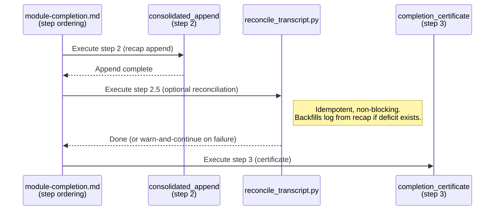

# Design Document: Experience Audit Remediation

## Overview

This design covers the actionable remediation of three discrepancies found during the Bootcamper-experience audit. Each discrepancy carries a **disposition** (remove, modify, or implement) that maps to a concrete set of file changes verified by existing CI tooling.

The design is intentionally minimal: all three requirements operate on existing files and scripts with well-understood semantics. No new runtime infrastructure, hooks, or per-write mechanisms are introduced — only edits to steering prose, catalog metadata, and an optional insertion of an existing idempotent script call at a well-defined completion boundary.

## Architecture

### Disposition-to-Action Mapping

Each disposition type maps to a deterministic class of file operations:

```mermaid
flowchart TD
    subgraph "Disposition: keep-as-superseded (Req 1, default)"
        A1[Verify spec-catalog.yaml chain] --> A2[Verify SPEC_CATALOG.md shows 'superseded']
        A2 --> A3[No file mutations — read-only check]
    end

    subgraph "Disposition: remove (Req 1, opt-in)"
        B1[Delete .kiro/specs/self-answering-questions-fix/]
        B2[Delete .kiro/specs/self-answering-prevention-v2/]
        B1 --> B3[Remove supersession entries from spec-catalog.yaml]
        B2 --> B3
        B3 --> B4[python3 generate_spec_catalog.py]
    end

    subgraph "Disposition: modify (Req 2)"
        C1[Edit qa-transcript.md — add guarantee boundary sentence]
        C2[Edit module-completion-artifacts.md — add recap-facing note]
        C1 --> C3[Re-sync steering-index.yaml token counts]
        C2 --> C3
        C3 --> C4[measure_steering.py --check exit 0]
        C4 --> C5[validate_commonmark.py exit 0]
    end

    subgraph "Disposition: implement optional (Req 2.3)"
        D1[Edit module-completion.md — insert reconcile_transcript.py call]
        D1 --> D2[Re-sync steering-index.yaml]
        D2 --> D3[measure_steering.py --check exit 0]
    end

    subgraph "Disposition: implement DONE (Req 3)"
        E1[Already implemented — no further action]
    end
```



### Invariants Preserved

1. **No per-write hook introduced.** Every change respects the hard constraint in `qa-transcript.md` and `session-log-hook-performance`.
2. **Idempotency.** `reconcile_transcript.py` (no-arg) is already idempotent; inserting it at a new boundary adds no new failure mode.
3. **Non-blocking.** The optional reconciliation call at module-completion is advisory (same as `capture_hook_safeguard`): failure logs a warning and proceeds.
4. **Deterministic catalog generation.** `generate_spec_catalog.py` produces byte-identical output for identical inputs; a `--check` mode detects drift.

## Components and Interfaces

### Affected Files

| File | Disposition | Change Type |
|------|-------------|-------------|
| `.kiro/spec-catalog.yaml` | remove (opt-in only) | Delete two `supersessions` entries |
| `.kiro/SPEC_CATALOG.md` | remove (opt-in only) | Regenerated (not hand-edited) |
| `.kiro/specs/self-answering-questions-fix/` | remove (opt-in only) | Delete directory tree |
| `.kiro/specs/self-answering-prevention-v2/` | remove (opt-in only) | Delete directory tree |
| `senzing-bootcamp/steering/qa-transcript.md` | modify | Append 1 sentence to "Cross-reference — guaranteed transcript" |
| `senzing-bootcamp/steering/module-completion-artifacts.md` | modify | Append a recap-facing guarantee note |
| `senzing-bootcamp/steering/module-completion.md` | implement (optional) | Insert step 2.5 `reconcile_transcript.py` |
| `senzing-bootcamp/steering/steering-index.yaml` | modify | Update `token_count` for edited files + budget total |

### Script Interfaces (all existing, no new scripts)

| Script | Invocation | Role |
|--------|-----------|------|
| `generate_spec_catalog.py` | `python3 ... [--check]` | Regenerate / validate SPEC_CATALOG.md |
| `measure_steering.py` | `python3 ... --check` | Validate steering-index.yaml token counts |
| `validate_commonmark.py` | `python3 ...` | Validate CommonMark compliance of steering |
| `reconcile_transcript.py` | `python3 ...` (no args) | Idempotent Q&A backfill from recap |

### Interaction Between Components



## Data Models

### spec-catalog.yaml Schema (existing)

The catalog metadata uses a simple YAML schema parsed by `generate_spec_catalog.py`:

```yaml
# status_overrides: mapping of <identifier> -> <status value>
# supersessions: list of { supersedes: <newer>, superseded: <older> }
# related: list of identifiers that are mutually related

supersessions:
  - supersedes: <newer-spec-identifier>
    superseded: <older-spec-identifier>

related:
  - <spec-identifier-a>
  - <spec-identifier-b>
```

**Constraint:** Every identifier referenced MUST resolve to an immediate subdirectory of `.kiro/specs/`. A dangling reference makes the generator exit 1. Physical removal (Req 1.3) must therefore delete both the directory AND the corresponding `supersessions` entries atomically.

### Steering Token Budget (existing)

`steering-index.yaml` stores per-file token counts and a budget total. The `measure_steering.py --check` mode validates:
- Each steering `.md` file's measured token count matches `steering-index.yaml`
- The budget total equals the sum of always-loaded file counts

Any edit to a steering `.md` file requires re-running `measure_steering.py` (update mode) to refresh counts, then `--check` to confirm consistency.

### ReconcilePlan (existing, from reconcile_transcript.py)

```python
@dataclass
class ReconcilePlan:
    shortfalls: list[ModuleShortfall]  # modules needing backfill
    is_noop: bool                      # True when counts are consistent
    recap_has_qr: bool                 # False -> preserve existing behavior

@dataclass
class ModuleShortfall:
    module: int
    missing_pairs: list[tuple[str, str]]  # (question, response)
```

The plan is computed by comparing logged `question` events in `config/session_log.jsonl` against QR pairs in `docs/bootcamp_recap.md`. `apply_plan` backfills only the deficit, making repeated invocations a no-op.

### Module-Completion Step Ordering (existing, extended)

Current fixed ordering:
1. `progress_update`
2. `consolidated_append`
3. `completion_certificate`
4. `capture_hook_safeguard`
5. `next_step_options`

Proposed (with optional Req 2.3):
1. `progress_update`
2. `consolidated_append`
3. **`transcript_reconciliation`** (new, optional — `reconcile_transcript.py`)
4. `completion_certificate`
5. `capture_hook_safeguard`
6. `next_step_options`

The new step sits after `consolidated_append` (which writes the recap section the reconciler reads from) and before `completion_certificate` (which is unrelated but benefits from a consistent log). It follows the same non-blocking rules as other steps: failure skips with a logged warning.

## Error Handling

### Physical Removal (Req 1.3, opt-in)

- **Dangling reference guard:** If directories are deleted but `spec-catalog.yaml` entries are not removed, `generate_spec_catalog.py` exits 1 with a clear error naming the dangling identifier. The tasks require atomic removal (directory + entries together).
- **Regeneration verification:** After any catalog edit, `generate_spec_catalog.py --check` must exit 0. If it exits 1, the SPEC_CATALOG.md is stale and must be regenerated.

### Steering Edits (Req 2)

- **Token count drift:** If a steering file is edited without re-syncing `steering-index.yaml`, `measure_steering.py --check` exits non-zero. CI catches this.
- **CommonMark violations:** `validate_commonmark.py` catches malformed Markdown in any steering file. Always run after any steering edit.

### Transcript Reconciliation (Req 2.3, optional)

- **Non-blocking:** `reconcile_transcript.py` already handles all failure modes internally (missing files, malformed JSONL, recap parse failures) by warning and returning gracefully. Inserting it at the module-completion boundary adds no new blocking failure.
- **Idempotency:** Running it when counts already agree is a no-op (zero log writes, zero side effects). Safe to call unconditionally at every module boundary.
- **No per-write coupling:** The call fires once per module completion (a natural boundary), not on file writes.

## Testing Strategy

### Verification Commands (CI and local)

All verification uses existing scripts with `--check` or validation modes:

```bash
# Catalog integrity
python3 senzing-bootcamp/scripts/generate_spec_catalog.py --check

# Steering token counts and budget
python3 senzing-bootcamp/scripts/measure_steering.py --check

# CommonMark compliance
python3 senzing-bootcamp/scripts/validate_commonmark.py
```

### Unit Tests (example-based)

- **Catalog generation:** `test_generate_spec_catalog.py` already covers supersession rendering, dangling-reference detection, and status derivation. No new tests needed for the "keep-as-superseded" path. If physical removal is implemented, add a test verifying that removing entries + directories keeps the generator happy.
- **Steering measurement:** `test_measure_steering.py` covers token-count drift detection.
- **Reconciliation:** The existing `reconcile_transcript.py` test suite covers plan computation, idempotency, and backfill logic.

### Property-Based Tests

Property-based testing is applicable to this feature for the reconciliation and catalog generation logic:

- **Reconciliation idempotency:** For any valid session log and recap document, running `reconcile_transcript.py` twice in succession should produce the same log state as running it once.
- **Catalog generation determinism:** For any valid `spec-catalog.yaml` and set of spec directories, `generate_spec_catalog.py` produces byte-identical output on repeated runs.
- **Supersession chain integrity:** For any valid supersession list in `spec-catalog.yaml`, every referenced identifier resolves to an existing spec directory.

These are formalized below in the Correctness Properties section.

## Correctness Properties

*A property is a characteristic or behavior that should hold true across all valid executions of a system — essentially, a formal statement about what the system should do. Properties serve as the bridge between human-readable specifications and machine-verifiable correctness guarantees.*

### Property 1: Reconciliation idempotency

*For any* valid session log and recap document (with zero or more QR pairs across one or more modules), applying the reconciliation plan and then recomputing a new plan should yield `is_noop == True` — i.e., the second invocation finds no deficit to backfill.

**Validates: Requirements 2.3**

### Property 2: Catalog generation determinism

*For any* valid set of spec directory records and catalog metadata (supersessions, related lists, status overrides), generating the spec index twice from the same inputs should produce byte-identical output.

**Validates: Requirements 1.1, 1.2, 1.3**

### Property 3: Supersession chain referential integrity

*For any* `spec-catalog.yaml` supersession list paired with a set of spec directory identifiers, every identifier referenced in a `supersedes` or `superseded` field must exist in the directory set — otherwise the generator must signal an error (exit 1).

**Validates: Requirements 1.1, 1.3**

### Property 4: Reconciliation deficit is non-negative and bounded

*For any* module, the deficit computed by `build_plan` equals `max(0, recap_pairs - logged_questions)` and the number of missing pairs backfilled never exceeds the recap's total QR pairs for that module.

**Validates: Requirements 2.3**

### Property 5: Token-count measurement round-trip

*For any* steering file content, measuring its token count and writing it to `steering-index.yaml`, then running `measure_steering.py --check`, should exit 0 — the stored value and the re-measured value agree.

**Validates: Requirements 2.1, 2.2**
