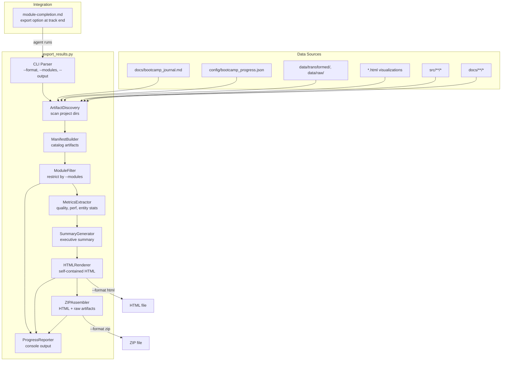

# Design Document: Export Results

## Overview

This feature adds `senzing-bootcamp/scripts/export_results.py` — a single Python script that bundles bootcamp artifacts into a self-contained HTML report or ZIP archive. The script discovers artifacts automatically (journal, progress data, quality scores, performance metrics, entity statistics, visualizations, source code), builds an internal manifest, generates an executive summary in plain language, and writes the output to a timestamped file.

The design prioritizes:
- **Zero dependencies**: stdlib-only (no third-party packages), matching existing script conventions
- **Testability**: pure-function logic for artifact discovery, manifest building, metric extraction, HTML rendering, and ZIP assembly — separated from filesystem I/O so each can be property-tested
- **Cross-platform**: Linux, macOS, Windows
- **Graceful degradation**: missing artifacts are skipped and noted, never fatal

## Architecture



The architecture separates concerns into:
1. **Data model layer** — `ArtifactEntry`, `ArtifactManifest`, `ExportMetrics` as plain dataclasses
2. **Discovery layer** — scans filesystem, returns raw artifact entries
3. **Manifest builder** — catalogs artifacts with module associations, types, sizes
4. **Module filter** — restricts manifest to requested modules
5. **Metrics extractor** — parses quality scores, performance data, entity stats from discovered files
6. **Summary generator** — produces plain-language executive summary from metrics
7. **HTML renderer** — generates self-contained HTML with inline CSS, TOC, and all sections
8. **ZIP assembler** — wraps HTML + raw files into organized archive
9. **Progress reporter** — prints discovery/generation progress to console

## Components and Interfaces

### ArtifactEntry (dataclass)

```python
@dataclasses.dataclass
class ArtifactEntry:
    path: str              # relative file path
    artifact_type: str     # "journal" | "progress" | "quality_report" | "performance_report"
                           # | "entity_stats" | "visualization" | "source_code"
                           # | "transformed_data" | "raw_data" | "documentation"
    module: int | None     # associated module number (1-12) or None
    file_size: int         # size in bytes
    description: str       # human-readable description
```

### ArtifactManifest (dataclass)

```python
@dataclasses.dataclass
class ArtifactManifest:
    artifacts: list[ArtifactEntry]
    scan_timestamp: str    # ISO 8601 UTC

    def by_type(self, artifact_type: str) -> list[ArtifactEntry]: ...
    def by_module(self, module: int) -> list[ArtifactEntry]: ...
    def total_size(self) -> int: ...
    def type_counts(self) -> dict[str, int]: ...
    def is_empty(self) -> bool: ...
```

### ExportMetrics (dataclass)

```python
@dataclasses.dataclass
class QualityScore:
    source_name: str
    overall: float              # 0-100
    completeness: float | None
    consistency: float | None
    format_compliance: float | None
    uniqueness: float | None

    @property
    def band(self) -> str:
        """'green' if >=80, 'yellow' if >=70, 'red' if <70."""

@dataclasses.dataclass
class PerformanceMetrics:
    loading_throughput_rps: float | None   # records per second
    query_response_ms: float | None        # avg query time in ms
    database_type: str | None              # "sqlite" | "postgresql"

@dataclasses.dataclass
class EntityStatistics:
    total_records: int | None
    total_entities: int | None
    match_count: int | None
    cross_source_matches: int | None
    duplicate_count: int | None

@dataclasses.dataclass
class ExportMetrics:
    quality_scores: list[QualityScore]
    performance: PerformanceMetrics | None
    entity_stats: EntityStatistics | None
```

### ProgressData (dataclass)

```python
@dataclasses.dataclass
class ProgressData:
    modules_completed: list[int]
    current_module: int | None
    language: str | None
    data_sources: list[str]
    track: str | None          # "A" | "B" | "C" | "D" | None
```

### ArtifactDiscovery

```python
class ArtifactDiscovery:
    def __init__(self, project_root: str): ...

    def scan(self) -> ArtifactManifest:
        """Scan project directory and return manifest of all discovered artifacts."""

    def _scan_journal(self) -> ArtifactEntry | None: ...
    def _scan_progress(self) -> ArtifactEntry | None: ...
    def _scan_data_files(self) -> list[ArtifactEntry]: ...
    def _scan_visualizations(self) -> list[ArtifactEntry]: ...
    def _scan_source_code(self, language: str | None) -> list[ArtifactEntry]: ...
    def _scan_docs(self) -> list[ArtifactEntry]: ...
```

### ModuleFilter

```python
class ModuleFilter:
    @staticmethod
    def filter(manifest: ArtifactManifest, modules: list[int] | None) -> ArtifactManifest:
        """Return a new manifest containing only artifacts for the specified modules.
        Artifacts with module=None (e.g., journal, progress) are always included.
        If modules is None, return the full manifest."""

    @staticmethod
    def validate_modules(modules: list[int]) -> tuple[list[int], list[int]]:
        """Return (valid_modules, invalid_modules) where valid are in 1-12 range."""
```

### MetricsExtractor

```python
class MetricsExtractor:
    @staticmethod
    def extract_quality_scores(doc_artifacts: list[ArtifactEntry],
                                file_reader: Callable[[str], str]) -> list[QualityScore]:
        """Parse quality score data from documentation artifacts."""

    @staticmethod
    def extract_performance(artifacts: list[ArtifactEntry],
                            file_reader: Callable[[str], str]) -> PerformanceMetrics | None:
        """Parse performance metrics from project artifacts."""

    @staticmethod
    def extract_entity_stats(artifacts: list[ArtifactEntry],
                             file_reader: Callable[[str], str]) -> EntityStatistics | None:
        """Parse entity resolution statistics from project artifacts."""
```

The `file_reader` callable parameter enables testing with in-memory content instead of real filesystem reads.

### SummaryGenerator

```python
class SummaryGenerator:
    @staticmethod
    def generate(progress: ProgressData, metrics: ExportMetrics,
                 manifest: ArtifactManifest) -> str:
        """Generate plain-language executive summary HTML fragment."""
```

The summary uses plain language, avoids Senzing jargon, and defines technical terms inline. It covers: track completed, modules finished, quality assessment bands, records processed, entities resolved, and key artifacts produced.

### HTMLRenderer

```python
class HTMLRenderer:
    VERSION = "1.0.0"

    def render(self, progress: ProgressData, metrics: ExportMetrics,
               manifest: ArtifactManifest, journal_html: str | None,
               modules_filter: list[int] | None) -> str:
        """Generate complete self-contained HTML report string."""

    def _render_head(self) -> str: ...
    def _render_toc(self, sections: list[str]) -> str: ...
    def _render_executive_summary(self, ...) -> str: ...
    def _render_module_table(self, progress: ProgressData) -> str: ...
    def _render_quality_section(self, scores: list[QualityScore]) -> str: ...
    def _render_performance_section(self, perf: PerformanceMetrics) -> str: ...
    def _render_entity_stats_section(self, stats: EntityStatistics) -> str: ...
    def _render_journal_section(self, journal_html: str) -> str: ...
    def _render_visualizations_section(self, viz_artifacts: list[ArtifactEntry]) -> str: ...
    def _render_footer(self) -> str: ...
```

### ZIPAssembler

```python
class ZIPAssembler:
    EXCLUDE_PATTERNS = ["__pycache__", "*.pyc", ".env", ".git",
                        "node_modules", "database/"]

    TYPE_TO_DIR = {
        "visualization": "artifacts/visualizations",
        "transformed_data": "artifacts/data",
        "raw_data": "artifacts/data",
        "source_code": "artifacts/source",
        "documentation": "artifacts/docs",
        "quality_report": "artifacts/docs",
        "performance_report": "artifacts/docs",
    }

    def assemble(self, html_content: str, manifest: ArtifactManifest,
                 output_path: str, file_reader: Callable[[str], bytes]) -> int:
        """Create ZIP archive. Returns total archive size in bytes."""

    @staticmethod
    def should_exclude(path: str) -> bool:
        """Check if a path matches exclusion patterns."""

    @staticmethod
    def build_manifest_json(manifest: ArtifactManifest) -> str:
        """Serialize manifest to JSON for inclusion in ZIP."""
```

### CLI Entry Point

```python
def main(argv: list[str] | None = None) -> int:
    """Parse args, discover artifacts, generate report, return exit code.
    Returns 0 on success, 1 if no artifacts found."""
```

Arguments:
- `--format {html,zip}` — output format (default: `html`)
- `--modules M1,M2,...` — comma-separated module numbers to include
- `--output PATH` — output file path (default: `exports/bootcamp_report_{timestamp}.{ext}`)

## Data Models

### ArtifactEntry Module Association

Artifacts are associated with modules based on their file path and type:

| Artifact Type | Source Path Pattern | Module(s) |
|---|---|---|
| journal | `docs/bootcamp_journal.md` | None (cross-module) |
| progress | `config/bootcamp_progress.json` | None (cross-module) |
| quality_report | `docs/data_source_evaluation.md`, `docs/*quality*` | 5 |
| performance_report | `docs/performance_report.md`, `docs/*performance*` | 9 |
| entity_stats | `docs/results_validation.md`, `docs/*entity*`, `docs/*resolution*` | 6, 7, 8 |
| visualization | `*.html` with graph/dashboard content | 8 |
| source_code | `src/**/*.{py,java,cs,rs,ts,js}` | Inferred from subdirectory |
| transformed_data | `data/transformed/*.jsonl` | 5, 6 |
| raw_data | `data/raw/*` | 4 |
| documentation | `docs/*.md` (other) | Inferred from content |

### Module-to-Source Directory Mapping

Source code module inference uses subdirectory names:

| Subdirectory Pattern | Module |
|---|---|
| `src/quickstart_demo/` | 3 |
| `src/transform/` | 5 |
| `src/load/` | 6 |
| `src/query/` | 8 |
| `tests/performance/` | 9 |
| `src/security/` | 10 |
| `src/monitoring/` | 11 |
| `src/deploy/` | 12 |

### Quality Score Band Derivation

| Score Range | Band | Display Color |
|---|---|---|
| ≥ 80 | green | `#2d8a4e` |
| 70–79 | yellow | `#b08800` |
| < 70 | red | `#cf222e` |

### HTML Report Section Order

1. Executive Summary (always present)
2. Module Completion Table (always present)
3. Quality Scores (omitted if no data)
4. Performance Metrics (omitted if no data)
5. Entity Resolution Statistics (omitted if no data)
6. Bootcamp Journal (omitted if no journal)
7. Visualizations (omitted if no visualizations)
8. Footer with timestamp and version

### ZIP Archive Structure

```
bootcamp_report_{timestamp}.zip
├── bootcamp_report.html
├── manifest.json
└── artifacts/
    ├── visualizations/
    ├── data/
    ├── source/
    └── docs/
```

### manifest.json Schema

```json
{
  "generated_at": "2025-01-15T10:30:00Z",
  "version": "1.0.0",
  "artifact_count": 15,
  "total_size_bytes": 1048576,
  "artifacts": [
    {
      "path": "artifacts/data/customers.jsonl",
      "original_path": "data/transformed/customers.jsonl",
      "artifact_type": "transformed_data",
      "module": 5,
      "file_size": 24576
    }
  ]
}
```


## Correctness Properties

*A property is a characteristic or behavior that should hold true across all valid executions of a system — essentially, a formal statement about what the system should do. Properties serve as the bridge between human-readable specifications and machine-verifiable correctness guarantees.*

### Property 1: Module number validation partitions correctly

*For any* list of integers, `ModuleFilter.validate_modules` SHALL return a `(valid, invalid)` tuple where every integer in `valid` is in the range 1–12, every integer in `invalid` is outside 1–12, and the union of `valid` and `invalid` equals the original list (preserving multiplicity).

**Validates: Requirements 1.6, 10.3**

### Property 2: Artifact discovery finds all matching files

*For any* project directory containing an arbitrary set of files in `data/transformed/`, `data/raw/`, `src/`, and `docs/`, the `ArtifactDiscovery.scan()` result SHALL contain an `ArtifactEntry` for every file that matches the expected patterns (language extension for source, `.jsonl` for transformed data, any file for raw data, `.md` for docs), and SHALL NOT contain entries for files that do not exist.

**Validates: Requirements 2.3, 2.5, 2.7**

### Property 3: Visualization detection is content-based

*For any* HTML file, `ArtifactDiscovery` SHALL classify it as a visualization artifact if and only if its content contains entity graph or dashboard markers (e.g., `d3`, `force`, `graph`, `dashboard`, `entity`, `svg`). Files without these markers SHALL NOT be classified as visualizations.

**Validates: Requirements 2.4**

### Property 4: Manifest entries have complete metadata

*For any* `ArtifactManifest`, every `ArtifactEntry` SHALL have a non-empty `path`, a valid `artifact_type` from the defined set, a non-negative `file_size`, and a non-empty `description`. The manifest's `type_counts()` SHALL equal the actual count of each type in the `artifacts` list, and `total_size()` SHALL equal the sum of all `file_size` values.

**Validates: Requirements 2.8**

### Property 5: Module completion table reflects progress state

*For any* `ProgressData` with an arbitrary `modules_completed` list (subset of 1–12), an optional `current_module`, and an optional `language`, the rendered module completion table SHALL contain exactly 12 rows, mark each module in `modules_completed` as "completed", mark `current_module` (if not in `modules_completed`) as "in progress", mark all others as "not started", display a progress percentage equal to `len(modules_completed) / 12 × 100`, and display the language if provided.

**Validates: Requirements 3.1, 3.2, 3.3, 3.4, 3.5**

### Property 6: Metric sections appear if and only if data exists

*For any* `ExportMetrics` where `quality_scores`, `performance`, and `entity_stats` may each be present or absent (None/empty), the rendered HTML SHALL contain the quality scores section if and only if `quality_scores` is non-empty, the performance section if and only if `performance` is not None, and the entity statistics section if and only if `entity_stats` is not None. When a section is present, it SHALL contain the corresponding metric values.

**Validates: Requirements 4.1, 4.2, 4.3, 4.4**

### Property 7: Executive summary contains required information

*For any* `ProgressData` with a track and completed modules, and any `ExportMetrics` and `ArtifactManifest`, the generated executive summary SHALL contain the track letter and module count. When quality scores are available, it SHALL contain the quality band. When entity statistics are available, it SHALL contain total records and total entities. The summary SHALL appear before the module completion table in the HTML output.

**Validates: Requirements 7.1, 7.2, 7.3, 7.4, 7.5**

### Property 8: HTML report is self-contained

*For any* rendered HTML report, the output SHALL contain a `<style>` tag with CSS rules and SHALL NOT contain any `<link rel="stylesheet">`, `<script src=">`, or `<link.*href=.*http` references to external resources.

**Validates: Requirements 8.1, 8.2**

### Property 9: Module filter returns correct artifact subset

*For any* `ArtifactManifest` and any subset of module numbers, `ModuleFilter.filter()` SHALL return a manifest containing exactly the artifacts whose `module` is in the specified set OR whose `module` is `None` (cross-module artifacts). The filtered manifest SHALL not contain artifacts from excluded modules. When the module list is `None`, the full manifest SHALL be returned unchanged.

**Validates: Requirements 10.1, 10.2**

### Property 10: ZIP archive contains correct structure

*For any* HTML content string and `ArtifactManifest`, the ZIP archive produced by `ZIPAssembler.assemble()` SHALL contain `bootcamp_report.html` at the root with the provided HTML content, a `manifest.json` that parses as valid JSON containing an entry for every non-excluded artifact, and each artifact file placed in the correct `artifacts/{type}/` subdirectory according to the `TYPE_TO_DIR` mapping.

**Validates: Requirements 9.1, 9.2, 9.3, 6.2**

### Property 11: ZIP exclusion patterns filter correctly

*For any* file path string, `ZIPAssembler.should_exclude()` SHALL return `True` if and only if the path contains a segment matching one of the defined exclusion patterns (`__pycache__`, `*.pyc`, `.env`, `.git`, `node_modules`, `database/`). Paths not matching any pattern SHALL return `False`.

**Validates: Requirements 9.4**

### Property 12: Graceful degradation on read errors

*For any* `ArtifactManifest` where a subset of artifacts raise `IOError`/`OSError` when read, the export process SHALL still produce a report containing all successfully-read artifacts, and the count of artifacts in the output SHALL equal the total minus the errored artifacts.

**Validates: Requirements 2.7, 12.6**

## Error Handling

| Scenario | Behavior |
|---|---|
| `config/bootcamp_progress.json` missing | Print warning, generate minimal report with discoverable artifacts |
| `config/bootcamp_progress.json` malformed JSON | Print warning, treat as missing progress data |
| `docs/bootcamp_journal.md` missing | Omit journal section, note absence |
| Individual artifact file unreadable | Log error, skip artifact, continue processing |
| No artifacts found in any category | Print warning, exit with code 1 (no empty reports) |
| Output directory does not exist | Create with `os.makedirs(exist_ok=True)` |
| Output file write fails (permissions) | Print error, exit with code 1 |
| `--modules` contains invalid numbers | Print warning per invalid number, ignore it, process valid ones |
| `--modules` contains only invalid numbers | Print warning, include all modules (fallback to default) |
| ZIP creation fails mid-write | Print error, clean up partial file, exit with code 1 |
| Very large artifact file | Include in manifest but cap embedded content in HTML; full file in ZIP |
| Markdown rendering of journal fails | Include raw markdown text as preformatted block |

All error handling follows the existing script convention: print human-readable messages to stderr, never crash with unhandled exceptions during normal operation.

## Testing Strategy

### Property-Based Tests (Hypothesis)

The project already uses Hypothesis for PBT (see `test_pbt_checkpointing.py`). The same pattern applies here.

**Library**: [Hypothesis](https://hypothesis.readthedocs.io/) (Python)
**Minimum iterations**: 100 per property
**Tag format**: `Feature: export-results, Property {N}: {title}`

Each of the 12 correctness properties maps to a single property-based test. Key strategies:

- `ArtifactEntry` generator: random path string, artifact_type from the defined set, module from `None | 1-12`, random file_size (0–10MB), random description
- `ArtifactManifest` generator: list of 0–30 random ArtifactEntries with ISO 8601 timestamp
- `ProgressData` generator: random subset of 1–12 for completed modules, optional current_module, random language from `{python, java, csharp, rust, typescript, None}`, random track from `{A, B, C, D, None}`
- `QualityScore` generator: random source name, overall 0–100, optional sub-scores 0–100
- `PerformanceMetrics` generator: optional throughput (0–10000), optional query time (0–5000), optional db type
- `EntityStatistics` generator: optional counts (0–1M)
- `ExportMetrics` generator: composite of above with optional None fields
- Module list generator: `st.lists(st.integers(-5, 20))` for testing validation

Mocking approach: `file_reader` callables are injected as parameters, enabling in-memory testing without filesystem I/O. For discovery tests, a mock filesystem (dict of path→content) is used.

### Unit Tests (pytest)

Unit tests cover specific examples and edge cases not suited for PBT:

- CLI argument parsing: `--format html`, `--format zip`, invalid format, `--output` path (Req 1.5, 1.7)
- Default output path contains timestamp in expected format (Req 1.7)
- Journal with multi-module structure preserves headings (Req 5.2)
- Journal absent → section omitted with note (Req 5.3)
- No visualizations → section omitted (Req 6.3)
- Semantic HTML elements present (`header`, `main`, `section`, `table`, `nav`) (Req 8.3)
- TOC contains anchor links for each section (Req 8.4)
- Footer contains timestamp and version (Req 8.5)
- ZIP creation reports file path and size (Req 9.5)
- No `--modules` → all artifacts included (Req 10.4)
- Modules with no artifacts noted in completion table (Req 10.5)
- Completion message format (Req 12.2)
- Missing progress file → warning + minimal report (Req 12.3)
- Empty project → warning + exit code 1 (Req 12.4)
- Output directory auto-created (Req 12.5)

### Test File Location

`senzing-bootcamp/scripts/test_export_results.py` — follows existing convention alongside `test_progress_utils.py` and `test_pbt_checkpointing.py`.
