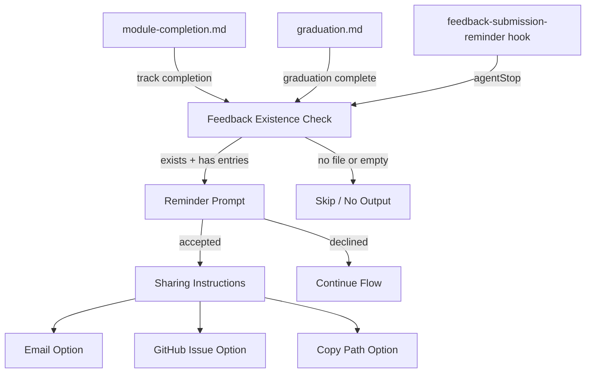

# Design Document: Feedback Submission Reminder

## Overview

This feature adds proactive, context-aware feedback submission reminders at two key moments in the Senzing Bootcamp: track completion and graduation. Currently, the only nudge to share feedback is a passive line ("Say 'bootcamp feedback' to share your experience") that neither checks whether feedback exists nor offers concrete sharing instructions.

The design modifies two existing steering files (`module-completion.md` and `graduation.md`), creates one new hook file (`feedback-submission-reminder.kiro.hook`), and registers the hook in the hook registry and steering index. All changes are additive — no existing behavior is removed, only augmented with conditional feedback detection and guided sharing instructions.

### Design Decisions

1. **Feedback detection via heading pattern match**: Rather than parsing the full markdown structure, the agent checks for `## Improvement:` headings below the `## Your Feedback` section. This is reliable because the feedback workflow always writes entries using this exact heading format.

2. **Session-level deduplication via conversation history**: The agent tracks whether a feedback reminder was already presented by scanning conversation history for the reminder emoji marker (`📋`). This avoids introducing external state files while keeping the logic simple.

3. **No automatic submission**: The design explicitly prevents the agent from sending emails or creating GitHub issues without bootcamper confirmation, consistent with the existing feedback workflow's local-only policy.

4. **Hook as safety net, not primary mechanism**: The `agentStop` hook serves as a fallback for cases where conversation flow skips the inline steering-file reminder. It produces minimal output (a one-liner) to avoid disrupting the agent-stop summary.

## Architecture

The feature touches three layers of the bootcamp system:



### Component Interaction Flow

1. **Track completion path**: `module-completion.md` → Path Completion Celebration → export offer → graduation offer → **feedback existence check** → conditional reminder → lessons-learned retrospective
2. **Graduation path**: `graduation.md` → Graduation Report → graduation complete message → **feedback existence check** → conditional reminder → existing "Say 'bootcamp feedback'" fallback
3. **Hook fallback path**: `agentStop` fires → hook checks conversation for track completion evidence → checks for feedback file → emits one-line reminder if both conditions met

## Components and Interfaces

### 1. Feedback Existence Check (shared logic)

Used by all three components (module-completion, graduation, hook). The agent performs these steps:

1. Check if `docs/feedback/SENZING_BOOTCAMP_POWER_FEEDBACK.md` exists
2. If it exists, read the file and look for at least one `## Improvement:` heading below the `## Your Feedback` section
3. Return a boolean: feedback entries exist (true) or not (false)

**Why `## Improvement:` heading?** The feedback workflow (Step 3) always formats entries with `## Improvement: [Brief title]`. The template file contains only the template block inside a fenced code block, so actual entries are distinguishable from the template by being real headings outside code fences.

### 2. Sharing Instructions Block (shared content)

When the bootcamper accepts the reminder, the agent presents three sharing options:

```markdown
**How would you like to share your feedback?**

1. **Email** — Send to support@senzing.com with subject "Senzing Bootcamp Power Feedback". I can format the content for easy copy-paste.
2. **GitHub Issue** — Create an issue on the senzing-bootcamp power repository. I can format it as a markdown-ready issue body.
3. **Copy path** — I'll show you the full file path so you can share it however you prefer.
```

For each option, the agent provides the relevant details but does **not** automatically send or create anything without explicit bootcamper confirmation.

### 3. Module-Completion Steering Update

**File**: `senzing-bootcamp/steering/module-completion.md`

**Change location**: Path Completion Celebration section, after the graduation offer sequence and before the lessons-learned load.

**Replaces**: The existing passive line `- Remind: "Say 'bootcamp feedback' to share your experience"`

**New content**: A "Feedback Submission Reminder" subsection containing:

- The feedback existence check logic
- Conditional reminder display
- Sharing instructions (if accepted)
- Non-blocking decline handling
- Fallback line for bootcampers without saved feedback: "Say 'bootcamp feedback' to share your experience"

### 4. Graduation Steering Update

**File**: `senzing-bootcamp/steering/graduation.md`

**Change location**: After the `🎓 Graduation complete!` message block, before the existing `Say "bootcamp feedback"` line.

**New content**: A feedback reminder block containing:

- The feedback existence check logic
- Deduplication check (skip if reminder was already shown during track completion in the same session)
- Conditional reminder display with sharing instructions
- The existing `Say "bootcamp feedback"` line is retained as a fallback

### 5. Feedback Submission Reminder Hook

**File**: `senzing-bootcamp/hooks/feedback-submission-reminder.kiro.hook`

**Type**: `agentStop` → `askAgent`

**Hook logic** (encoded in the prompt):

1. Scan conversation history for track completion evidence (path completion celebration messages or graduation completion messages)
2. If no track completion detected → produce no output
3. If track completion detected → check if the feedback reminder was already presented (look for `📋` marker in recent conversation)
4. If already presented → produce no output
5. If not presented → check if `docs/feedback/SENZING_BOOTCAMP_POWER_FEEDBACK.md` exists and contains entries
6. If feedback exists → emit: `📋 Reminder: You have bootcamp feedback saved. Say 'share feedback' to send it to the power author.`
7. If no feedback → produce no output

### 6. Hook Registry Update

**File**: `senzing-bootcamp/steering/hook-registry.md`

Add a new entry under "Critical Hooks" section:

**feedback-submission-reminder** (agentStop → askAgent)

- id: `feedback-submission-reminder`
- name: `Feedback Submission Reminder`
- description: `After track completion or graduation, checks for saved feedback and reminds the bootcamper to share it with the power author.`

### 7. Hook Categories Update

**File**: `senzing-bootcamp/hooks/hook-categories.yaml`

Add `feedback-submission-reminder` to the `critical` list.

### 8. Steering Index Update

**File**: `senzing-bootcamp/steering/steering-index.yaml`

- Update `module-completion.md` token count (will increase due to new feedback section)
- Update `graduation.md` token count (will increase due to new feedback section)
- Update `hook-registry.md` token count (will increase due to new hook entry)
- Add keyword mapping: `share feedback: feedback-workflow.md`

## Data Models

This feature does not introduce new data models or persistent state. It relies on:

1. **Existing file**: `docs/feedback/SENZING_BOOTCAMP_POWER_FEEDBACK.md` — read-only check for existence and content
2. **Conversation history**: Used for deduplication (checking if reminder was already shown) and track completion detection (in the hook)
3. **Existing config**: `config/bootcamp_progress.json` — not directly used by this feature, but referenced indirectly through the module-completion workflow's path completion detection

### Hook File Schema

The new hook file follows the established JSON schema:

```json
{
  "name": "Feedback Submission Reminder",
  "version": "1.0.0",
  "description": "After track completion or graduation, checks for saved feedback and reminds the bootcamper to share it with the power author.",
  "when": {
    "type": "agentStop"
  },
  "then": {
    "type": "askAgent",
    "prompt": "<prompt text>"
  }
}
```

## Error Handling

### Feedback File Missing or Unreadable

- If `docs/feedback/SENZING_BOOTCAMP_POWER_FEEDBACK.md` does not exist, the reminder is silently skipped. No error message is shown to the bootcamper.
- If the file exists but cannot be read (permissions, encoding issues), the agent treats it as "no feedback" and skips the reminder. This avoids blocking the completion flow.

### Malformed Feedback File

- If the file exists but has been manually edited to remove the `## Your Feedback` section or the `## Improvement:` heading pattern, the agent treats it as "no feedback entries" and skips the reminder.
- The agent does not attempt to repair or validate the feedback file structure — that is the feedback workflow's responsibility.

### Conversation History Unavailable

- If the hook cannot reliably scan conversation history for track completion evidence (e.g., conversation was compacted), it defaults to producing no output. False negatives (missing a reminder) are preferred over false positives (showing a reminder at the wrong time).

### Deduplication Edge Cases

- If the `📋` marker appears in conversation history from a previous session (not the current track completion), the agent may incorrectly skip the reminder. This is acceptable because the bootcamper can always trigger feedback sharing manually by saying "share feedback" or "bootcamp feedback."

### Sharing Instruction Failures

- The agent never automatically sends emails or creates GitHub issues. If the bootcamper asks the agent to perform these actions, the agent provides the formatted content and instructions but requires explicit confirmation before any external action.
- If the bootcamper's environment does not support clipboard operations, the "copy path" option falls back to simply displaying the absolute path as text.

## Testing Strategy

### Why Property-Based Testing Does Not Apply

This feature consists entirely of:

- **Steering file modifications** (markdown instructions for the AI agent)
- **Hook configuration** (a JSON file defining trigger conditions and prompt text)
- **Registry/index updates** (YAML and markdown metadata)

There are no pure functions, parsers, serializers, or algorithmic logic to test with property-based testing. The "feedback existence check" is an instruction for the agent to follow, not a code function with inputs and outputs. PBT requires code with meaningful input variation — this feature has none.

### Testing Approach

Testing for this feature focuses on **structural validation** and **integration verification**:

#### 1. Hook File Validation (unit tests)

- Verify `senzing-bootcamp/hooks/feedback-submission-reminder.kiro.hook` is valid JSON
- Verify the hook file contains required fields: `name`, `version`, `description`, `when.type`, `then.type`, `then.prompt`
- Verify `when.type` is `"agentStop"`
- Verify `then.type` is `"askAgent"`
- Verify the prompt contains key behavioral markers: feedback file path check, track completion detection, deduplication check, the `📋` emoji marker

These tests can be added to the existing `tests/` directory following the pattern of other hook validation tests.

#### 2. Hook Registry Consistency (integration tests)

- Verify `feedback-submission-reminder` appears in `hook-registry.md`
- Verify `feedback-submission-reminder` appears in `hook-categories.yaml` under `critical`
- Verify the hook file exists at the path specified in the registry
- Verify the hook's `name`, `description`, and `when.type` in the JSON file match the registry entry

These checks can be incorporated into the existing `sync_hook_registry.py --verify` CI step.

#### 3. Steering File Structure (integration tests)

- Verify `module-completion.md` contains the feedback existence check instructions in the Path Completion Celebration section
- Verify the feedback reminder appears after the graduation offer and before the lessons-learned load
- Verify `graduation.md` contains the feedback existence check instructions after the graduation complete message
- Verify the graduation feedback reminder appears before the existing "Say 'bootcamp feedback'" line
- Verify `steering-index.yaml` token counts are updated for modified files

#### 4. Content Correctness (manual review)

- Verify the sharing instructions include all three options (email, GitHub issue, copy path)
- Verify the email address is `support@senzing.com`
- Verify the non-blocking behavior instructions are clear (accept decline responses, don't re-prompt)
- Verify the deduplication instructions are unambiguous
- Verify the hook prompt correctly describes the no-output conditions

#### 5. CI Pipeline

The existing CI pipeline (`validate-power.yml`) already runs:

- `validate_power.py` — validates power structure
- `measure_steering.py --check` — validates token counts in `steering-index.yaml`
- `validate_commonmark.py` — validates markdown compliance
- `sync_hook_registry.py --verify` — validates hook registry consistency
- `pytest` — runs all tests

All new files and modifications will be validated by these existing checks. New unit tests for the hook file should be added to `senzing-bootcamp/tests/` following the existing test patterns.
