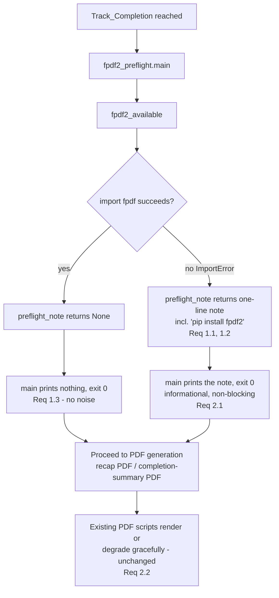

# Design Document

## Overview

The recap PDF (`generate_recap_pdf.py`) and the completion-summary PDF
(`generate_completion_summary.py`) both depend on the optional `fpdf2` package (`import fpdf`).
Each imports it *lazily* — never at module top level — and degrades gracefully when it is absent:
the Markdown deliverable is still produced and a `pip install fpdf2` hint is printed. But that hint
fires only *after* a PDF render is attempted (inside graduation `graduation.md` Step 0b.3 and
`generate_completion_summary.generate_pdf_with_fallback`). A bootcamper therefore discovers the
optional dependency was missing at the moment the PDF silently degrades — too late to have
installed it beforehand.

This feature adds a **Preflight_Note**: a single, non-blocking, informational line surfaced at
**Track_Completion**, *before* any PDF render is attempted. It appears **only** when `fpdf2` is not
importable, tells the bootcamper that installing `fpdf2` will produce a PDF (and that the Markdown
output is produced regardless), and includes the exact command `pip install fpdf2`. When `fpdf2` is
already importable the note is suppressed entirely, so there is no noise in the common case where
the PDF will succeed.

The behavior is implemented as a tiny stdlib-only helper module,
`senzing-bootcamp/scripts/fpdf2_preflight.py`, exposing two pure functions —
`fpdf2_available() -> bool` and `preflight_note() -> str | None` — plus a thin `main()` CLI that the
track-completion / graduation steering invokes before the PDF steps. Isolating the gating and the
note text in pure functions makes them unit- and property-testable without touching the PDF scripts
or requiring `fpdf2` to be installed. The helper **detects availability exactly as the PDF scripts
do** (attempting `import fpdf` and treating `ImportError` as "absent"), so the note never
contradicts the actual render outcome, and it **never** imports `fpdf` at module top level — keeping
`fpdf2` an optional, lazily-imported dependency per `python-conventions.md` and `tech.md`.

### Design Goals

- Set the `fpdf2` expectation **before** the PDF is attempted at Track_Completion, so a bootcamper
  can install the optional dependency in time to get a PDF.
- Emit the note **only** when `fpdf2` is absent — zero noise when the PDF will succeed.
- Keep `fpdf2` optional and lazy: detection uses a guarded `import fpdf` inside a function; the
  helper never imports `fpdf` at module top level and never becomes a hard dependency.
- Make the gating decision and the note text pure, side-effect-free functions so they are directly
  unit- and property-testable, with no `fpdf2` install required to test either branch.
- Detect availability the *same way* the scripts do, so the note can never contradict the render.
- Be strictly informational and non-blocking — never prompt, never pause, never raise.

### Non-Goals

- Changing the existing graceful-degradation behavior of the PDF scripts (Markdown still produced;
  the post-attempt `pip install fpdf2` hint remains the final fallback). See Requirement 2.2.
- Auto-installing `fpdf2` or invoking `pip` on the bootcamper's behalf (that is
  `generate_completion_summary.ensure_fpdf2`'s opt-in concern, unchanged here).
- Rendering, parsing, or otherwise altering the recap or completion-summary content.
- Adding any hook or per-write process. The note is surfaced only by the existing
  track-completion / graduation steering flow.

## Architecture

The Preflight_Note is produced by a new stdlib-only script,
`senzing-bootcamp/scripts/fpdf2_preflight.py`. The track-completion steering
(`module-completion-track.md`) and the graduation flow (`graduation.md`, immediately before the
Step 0b PDF generation) invoke it once, before any PDF render is attempted. The script prints the
one-line note **only** when `fpdf2` is unavailable and prints nothing (exit 0) when it is available.



### Ordering & Invocation

- The note runs **before** the recap PDF / completion-summary PDF is attempted (Requirement 3.1),
  aligning with the always-generate ordering that `track-completion-pdf-transcript` introduces. In
  the graduation flow this places the invocation immediately before Step 0b (Recap PDF Generation);
  in the general track-completion flow it precedes the completion-summary PDF offer.
- Invocation is via the track-completion / graduation steering only — never a hook and never a
  per-write process (consistent with the power's no-per-write-cost architecture).
- The step is **non-blocking**: `main` always exits 0, prints at most one line, and never prompts,
  so the celebration flow continues uninterrupted whether or not `fpdf2` is present.

## Components and Interfaces

### New script: `scripts/fpdf2_preflight.py`

Follows the standard script pattern (`python-conventions.md`): shebang,
`from __future__ import annotations`, module docstring with usage, stdlib only, `argparse`,
`main(argv=None)`, `if __name__ == "__main__"`, exit 0 on success. The module has **no top-level
`import fpdf`** — availability is probed inside `fpdf2_available` only.

```python
def fpdf2_available() -> bool:
    """Return True iff the optional fpdf2 dependency can be imported.

    Detects availability the same way the PDF scripts do — a guarded
    ``import fpdf`` treating ImportError as "absent" (Requirement 3.2). The
    import is performed inside the function so fpdf2 is never a top-level or
    hard dependency (Requirement 2.3).
    """


def preflight_note() -> str | None:
    """Return the one-line Preflight_Note, or None when no note is needed.

    Returns ``None`` when ``fpdf2_available()`` is True (Requirement 1.3 — no
    noise when the PDF will succeed). When fpdf2 is absent, returns a single
    informational line stating that installing fpdf2 enables the PDF, that the
    Markdown output is produced regardless, and containing the exact command
    ``pip install fpdf2`` (Requirements 1.1, 1.2).
    """


def main(argv: list[str] | None = None) -> int:
    """Print the Preflight_Note when fpdf2 is absent; print nothing otherwise.

    Non-blocking and informational: prints at most one line to stdout, never
    prompts or pauses, and always returns 0 (Requirement 2.1).
    """
```

Key details:

- **`fpdf2_available`** wraps `import fpdf` in `try/except ImportError`, mirroring
  `generate_completion_summary.ensure_fpdf2`'s detection and `render_pdf`/`render_completion_pdf`'s
  lazy `from fpdf import FPDF`. It returns `True` on success, `False` on `ImportError`
  (Requirement 3.2). The import is confined to the function body, so importing
  `fpdf2_preflight` never requires `fpdf2` (Requirement 2.3).
- **`preflight_note`** is a pure function of `fpdf2_available()`. When `fpdf2` is present it returns
  `None`; when absent it returns exactly one line (no embedded newline) that (a) states installing
  `fpdf2` enables the PDF, (b) states the Markdown output is produced regardless, and (c) contains
  the literal substring `pip install fpdf2` (Requirements 1.1, 1.2). The note text lives in a module
  constant so the tests and the note share a single source of truth.
- **`main`** calls `preflight_note()`; when it returns a string, prints that single line to stdout;
  when it returns `None`, prints nothing. It never reads stdin and always returns 0, so the
  track-completion flow is never blocked (Requirement 2.1).

### Reused interfaces (no modification)

- `generate_recap_pdf.render_pdf` and `generate_completion_summary.render_completion_pdf` /
  `ensure_fpdf2` / `generate_pdf_with_fallback` are **not modified**. Their lazy `import fpdf`,
  Markdown-preserving degradation, and post-attempt `pip install fpdf2` hint remain the final
  fallback (Requirement 2.2). The Preflight_Note is strictly additive and upstream of them.

### Steering wiring

- `steering/module-completion-track.md`: at Track_Completion, before the completion-summary PDF /
  export offer, run `python3 senzing-bootcamp/scripts/fpdf2_preflight.py`. If it prints a line,
  surface that line to the bootcamper; if it prints nothing, continue silently. It never blocks.
- `steering/graduation.md`: immediately before Step 0b (Recap PDF Generation), the same invocation
  precedes the PDF attempt so the heads-up is shown before rendering (Requirement 3.1).
- No external URLs are introduced in the steering (only the `pip install fpdf2` command string).

## Data Models

The helper is stateless; the "model" is the two-state availability of `fpdf2` and the corresponding
note outcome.

### Availability states

| `fpdf2` state | `import fpdf` outcome | `fpdf2_available()` | `preflight_note()` | `main` output | Requirement |
|---|---|---|---|---|---|
| Installed | succeeds | `True` | `None` | nothing (exit 0) | 1.3 |
| Not installed | raises `ImportError` | `False` | one-line note incl. `pip install fpdf2` | the note (exit 0) | 1.1, 1.2, 3.2 |

### Preflight_Note contract

When present, the note is a **single line** (no embedded newline) that satisfies all of:

- communicates that installing `fpdf2` enables the PDF (Requirement 1.1),
- communicates that the Markdown output is produced regardless (Requirement 1.1),
- contains the exact command substring `pip install fpdf2` (Requirement 1.2).

When `fpdf2` is available, there is no note — `preflight_note()` is `None` and `main` prints
nothing (Requirement 1.3).

## Correctness Properties

*A property is a characteristic or behavior that should hold true across all valid executions of a
system — essentially, a formal statement about what the system should do. Properties serve as the
bridge between human-readable specifications and machine-verifiable correctness guarantees.*

The gating decision, note content, and availability detection are pure logic over a controllable
input (the `import fpdf` outcome), so property-based testing applies. Each property below is
universally quantified and implemented as a single Hypothesis property test. Example counts come
from the active Hypothesis profile (`fast`=5 locally, `thorough`=100 in CI) — no inline
`max_examples` override. Availability is exercised by monkeypatching the `fpdf` import outcome as
the generated input.

### Property 1: A note is produced exactly when fpdf2 is unavailable

*For any* `fpdf2` availability state (importable or not), `preflight_note()` returns `None` when
`fpdf2` is importable and returns a single non-empty line when `fpdf2` is not importable — i.e. a
note is present if and only if `fpdf2` is unavailable, and `main` prints the note in the unavailable
case and prints nothing in the available case.

**Validates: Requirements 1.1, 1.3**

### Property 2: The absent-branch note states both facts and the exact install command

*For any* environment in which `fpdf2` is unavailable, the string returned by `preflight_note()` is
a single line (contains no newline) that communicates that installing `fpdf2` enables the PDF, that
the Markdown output is produced regardless, and contains the exact substring `pip install fpdf2`.

**Validates: Requirements 1.1, 1.2**

### Property 3: Availability detection agrees with the real import outcome

*For any* monkeypatched `import fpdf` outcome, `fpdf2_available()` returns `True` when `import fpdf`
would succeed and `False` when it raises `ImportError` — matching the detection used by the PDF
scripts (`ensure_fpdf2` / the lazy `from fpdf import FPDF`), so the note can never contradict the
actual render outcome.

**Validates: Requirements 3.2**

### Property 4: The helper is total and non-blocking across all import outcomes

*For any* `import fpdf` outcome (success or `ImportError`), `fpdf2_available()` returns a `bool`,
`preflight_note()` returns `str | None`, and `main()` returns `0` — each without prompting for
input, pausing, or raising — so the note is strictly informational and never blocks the
track-completion flow.

**Validates: Requirements 2.1**

## Error Handling

The helper is **non-blocking by contract** — Track_Completion never stalls on it (Requirement 2.1).

| Situation | Handling |
|---|---|
| `fpdf2` importable | `fpdf2_available()` returns `True`; `preflight_note()` returns `None`; `main` prints nothing and returns 0 (Req 1.3). |
| `fpdf2` absent (`ImportError`) | `fpdf2_available()` returns `False`; `preflight_note()` returns the one-line note incl. `pip install fpdf2`; `main` prints it and returns 0 (Req 1.1, 1.2). |
| Unexpected error while probing the import | Detection catches `ImportError` (the scripts' behavior); any other exception is not expected from a guarded import, but `main` still returns 0 without raising so the flow is never blocked (Req 2.1). |
| Steering invocation cannot run the script | The step is advisory; the steering treats a non-running preflight as "no note" and proceeds directly to the PDF step, whose own graceful degradation and post-attempt hint remain the final fallback (Req 2.2). |

`main` always returns 0 and prints at most one line. It never modifies files, never reads stdin, and
never touches the PDF scripts, so it cannot alter their existing degradation behavior
(Requirement 2.2).

## Testing Strategy

Tests live in `senzing-bootcamp/tests/` (e.g. `test_fpdf2_preflight_note.py`), follow the project
pattern (pytest + Hypothesis, class-based, `sys.path` import of `scripts/`), and property tests draw
their example count from the active Hypothesis profile (`fast`=5 locally, `thorough`=100 in CI) with
no inline `max_examples` override (Requirement 4.2). Fixtures are synthetic — no real data,
credentials, or PII.

### Availability control

Because the two branches must be tested without actually installing or uninstalling `fpdf2`, tests
control the `import fpdf` outcome by monkeypatching `sys.modules` / the import machinery:

- **Available**: insert a stub `fpdf` module into `sys.modules` so `import fpdf` succeeds.
- **Absent**: force `import fpdf` to raise `ImportError` (e.g. a `sys.meta_path` finder or
  `builtins.__import__` shim that rejects `fpdf`, or removing it from `sys.modules` when it is not
  installed) — the same technique the existing `test_generate_recap_pdf` degradation tests use.

### Property-based tests (Hypothesis)

Property-based testing IS appropriate here: the gating, content, detection, and totality logic is
pure and universally quantified over the `fpdf` import outcome. One property test per correctness
property, each tagged:

`# Feature: fpdf2-preflight-note, Property {number}: {property_text}`

- **Property 1** — gating: generate an availability flag; monkeypatch the import accordingly; assert
  `preflight_note()` is `None` iff available and a single non-empty line iff absent, and that
  `main`'s stdout is empty iff available.
- **Property 2** — content: over the absent branch, assert the note is a single line containing the
  two required facts and the exact substring `pip install fpdf2`.
- **Property 3** — detection: over generated import outcomes, assert `fpdf2_available()` equals
  whether `import fpdf` succeeds.
- **Property 4** — totality/non-blocking: over generated import outcomes (including a forced
  unexpected error), assert both functions return the right types and `main` returns 0 without
  raising and without reading stdin.

A small custom strategy (`st_availability()`) generates the availability/import-outcome inputs.

### Unit / example tests

Complement the properties with focused examples and guardrails:

- **Absent branch** (concrete): the note equals the module note constant and contains
  `pip install fpdf2`.
- **Present branch** (concrete): `preflight_note()` is `None`; `main` prints nothing, exit 0.
- **Lazy/optional import (Req 2.3)**: importing `fpdf2_preflight` succeeds while `fpdf` is
  unimportable, and the module source contains no top-level `import fpdf` (structural scan).
- **No-regression of PDF degradation (Req 2.2)**: the existing PDF-degradation tests remain green;
  the helper neither imports nor modifies `generate_recap_pdf` / `generate_completion_summary`.
- **Steering placement (Req 3.1)**: assert `graduation.md` invokes `fpdf2_preflight` immediately
  before Step 0b (Recap PDF Generation) and `module-completion-track.md` invokes it before the
  completion-summary / export offer.
