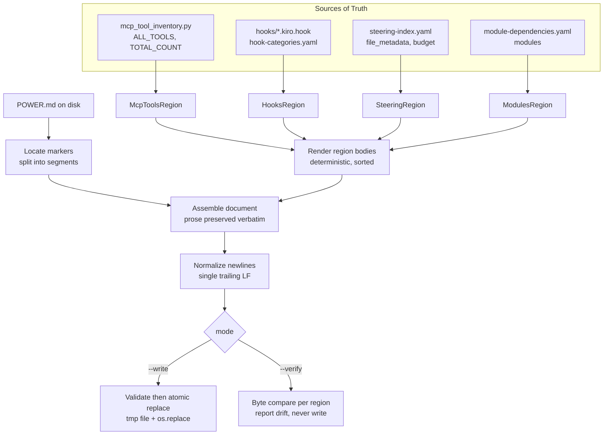

# Design Document

## Overview

`POWER.md` ships four volatile sections whose contents are derived from machine-readable
sources of truth but are currently maintained by hand: the MCP tool list, the hook list and
count, the steering file inventory, and the module overview. The CHANGELOG shows these sections
drift repeatedly (stale "Module 12" references, "~79 lines" vs "~101 lines", a 29-vs-actual hook
count, MCP tool inventory churn).

The repository already proves the cure for this class of bug twice over:

- **MCP tool inventory** — `scripts/mcp_tool_inventory.py` is the single source of truth
  (`ALL_TOOLS`, `TOTAL_COUNT`), and `check_mcp_tool_inventory()` in `validate_power.py` fails CI
  when `POWER.md` drifts from it.
- **Hook registry** — `scripts/sync_hook_registry.py` reads `hooks/*.kiro.hook` +
  `hooks/hook-categories.yaml` and regenerates `steering/hook-registry*.md` with a `--write`
  (default) / `--verify` CLI; CI runs `--verify` and fails on drift.

This feature **generalizes that proven pattern to all four volatile sections of `POWER.md`**.
A single deterministic generator (`scripts/generate_power_docs.py`) regenerates each section in
place between marker comments, preserves all hand-written prose byte-for-byte, and exposes a
`--verify` mode that the CI pipeline runs before the test step. The generator is stdlib-only
(PyYAML permitted where YAML is parsed, exactly as `validate_dependencies.py` does), produces
CommonMark-compliant Unix-newline output, and keeps the existing `check_mcp_tool_inventory()`
gate green.

### Design Goals

1. **No drift** — every volatile section is a function of a source of truth; `--verify` is the gate.
2. **Prose safety** — only content *between* a region's begin/end markers is ever rewritten; every
   other byte of `POWER.md` is preserved exactly.
3. **Determinism** — identical sources produce identical output, independent of environment,
   locale, timestamps, or filesystem enumeration order.
4. **Atomicity** — `POWER.md` is never left partially written; on any error it is byte-for-byte
   unchanged.
5. **Convention parity** — same CLI shape, default-to-`--write`, and CI wiring as
   `sync_hook_registry.py`.

## Architecture

### Key Design Decision: One Generator Script vs. a Documented Set

**Decision: ship a single script, `senzing-bootcamp/scripts/generate_power_docs.py`, with
`--write` (default) and `--verify` modes.**

Rationale:

- Requirements 8.1 and 8.2 mandate that **one invocation** regenerates (or verifies) *all*
  in-scope regions. A single script with a single pass over `POWER.md` satisfies this directly; a
  set of per-region scripts would force multiple invocations or a wrapper that re-implements the
  single-script behavior anyway.
- The marker-parsing, splice, atomic-write, newline-normalization, and CommonMark concerns are
  identical across regions and belong in one place. Each region differs only in *how it renders
  its rows* — a perfect fit for a small per-region renderer interface (see Components).
- It mirrors `sync_hook_registry.py`, which already generates multiple outputs from one script
  with one `--write`/`--verify` CLI. Maintainers get zero new conventions to learn.

The script reuses the established module shape (`from __future__ import annotations`, module
docstring with usage, `argparse`, `main(argv=None)`, `if __name__ == "__main__": main()`,
exit 0 success / non-zero failure).

### Data Flow



### Processing Pipeline (shared by both modes)

1. **Load sources** — read and parse each source of truth. Any read/parse failure aborts with a
   non-zero exit and a message naming the file and cause (Req 1.5); `POWER.md` is untouched.
2. **Render region bodies** — each region renderer produces a deterministic Markdown body string
   from its source. Source-level invariant violations (e.g. `TOTAL_COUNT` ≠ `len(ALL_TOOLS)`,
   a hook in categories with no file, a steering entry missing `token_count`) abort here.
3. **Read & segment `POWER.md`** — locate every region's begin/end markers, validating marker
   integrity (present, paired, ordered, unique). Any violation aborts; file untouched.
4. **Assemble** — replace each region's *body* with its freshly rendered body, leaving every
   segment outside the markers (and the markers themselves) byte-for-byte unchanged.
5. **Normalize** — convert `\r\n`/`\r` to `\n`, ensure exactly one trailing `\n`.
6. **Mode branch:**
   - **Write:** validate the assembled document (CommonMark + referenced-file existence), then
     write atomically via temp file + `os.replace`. No partial writes.
   - **Verify:** compare the would-be body of each region against the committed body, byte for
     byte; report each drifted/missing region and the regeneration command; exit 1 on any drift,
     0 when all match. Never touch disk.

## Components and Interfaces

All components live in `senzing-bootcamp/scripts/generate_power_docs.py`. Tests live in
`senzing-bootcamp/tests/`.

### Marker scheme

Each Generated_Region is delimited by a pair of CommonMark HTML comments carrying a stable region
identifier:

```text
<!-- BEGIN GENERATED: mcp-tools -->
... generated body ...
<!-- END GENERATED: mcp-tools -->
```

- HTML comments render to nothing, so the markers are invisible in the rendered `POWER.md`
  (Req 5.2) and survive markdownlint (`MD033` is disabled in `.markdownlint.json`).
- The region identifier (`mcp-tools`, `hooks`, `steering-files`, `modules`) is unique per region
  (Req 2.1) and is what `--verify`/`--write` use to re-locate the region on every run.
- Markers are matched with an anchored, whitespace-tolerant regex:
  `^<!--\s*BEGIN GENERATED:\s*(?P<id>[a-z0-9-]+)\s*-->\s*$` (and the `END` analogue). Markers are
  treated as **prose** — they are never rewritten, only the body *between* them is (Req 2.2, 2.3).

### `MarkerError` and region location

```python
@dataclass(frozen=True)
class RegionSpan:
    region_id: str
    begin_marker_end: int   # offset just after the begin marker line
    end_marker_start: int   # offset of the end marker line
    body: str               # current text strictly between the markers

def locate_regions(doc: str, expected_ids: set[str]) -> dict[str, RegionSpan]:
    """Find every Generated_Region. Raises MarkerError on any of:
    missing begin/end for an expected id, begin without matching end,
    end appearing before its begin, or a duplicated begin id."""
```

`locate_regions` enforces Req 2.4–2.7 by scanning all markers in order and validating pairing,
ordering, and uniqueness. Any violation raises `MarkerError(region_id, reason)`; the caller maps
it to a non-zero exit and leaves `POWER.md` unchanged.

### Region renderer interface

Each region is a small object exposing a stable identity and a pure render function:

```python
class Region(Protocol):
    region_id: str
    def render(self, sources: Sources) -> str:
        """Return the Markdown body for this region. Pure and deterministic:
        output depends only on `sources`, never on time/locale/fs order.
        Raises GeneratorError on source-level invariant violations."""
```

Concrete regions:

| Region class       | `region_id`     | Source of truth                                   | Requirements |
|--------------------|-----------------|---------------------------------------------------|--------------|
| `McpToolsRegion`   | `mcp-tools`     | `mcp_tool_inventory.ALL_TOOLS` / `TOTAL_COUNT`    | 1.1, 9       |
| `HooksRegion`      | `hooks`         | `hooks/*.kiro.hook` + `hook-categories.yaml`      | 1.2, 10      |
| `SteeringRegion`   | `steering-files`| `steering-index.yaml` (`file_metadata`, `budget`) | 1.3, 11      |
| `ModulesRegion`    | `modules`       | `config/module-dependencies.yaml` (`modules`)     | 1.4, 12      |

The driver iterates a fixed, ordered list of regions, so the set of regions and their processing
order are themselves deterministic.

### Top-level functions

```python
def load_sources(paths: SourcePaths) -> Sources: ...
def render_all(sources: Sources, regions: list[Region]) -> dict[str, str]: ...
def assemble(doc: str, spans: dict[str, RegionSpan], bodies: dict[str, str]) -> str: ...
def normalize_newlines(text: str) -> str: ...   # CRLF/CR -> LF, exactly one trailing LF
def write_atomic(path: Path, content: str) -> None:  # tmp in same dir + os.replace
def verify(doc: str, spans, bodies) -> VerifyResult: ...  # per-region byte compare, no I/O
def main(argv: list[str] | None = None) -> int: ...
```

### Region-by-region content rendering

**`mcp-tools` (Req 9).** Renders one bullet per tool in `ALL_TOOLS`, in `ALL_TOOLS` tuple order
(which is the live-server order and is fully deterministic — `get_capabilities` first). Each bullet
has the exact shape `` - `tool_name` — description `` so that `validate_power.py`'s
`_power_md_tool_bullets` regex (`^- \`([a-z_]+)\``) still extracts exactly the 13 names and
`check_mcp_tool_inventory()` stays green (Req 9.3).

Because `ALL_TOOLS` carries only names (no descriptions), descriptions come from a static
`TOOL_DESCRIPTIONS: dict[str, str]` presentation map embedded in the generator. This map is part of
the generator's *template*, not a competing source of truth: the **set of tools** is still derived
solely from `ALL_TOOLS`. The generator asserts `set(ALL_TOOLS) ⊆ TOOL_DESCRIPTIONS.keys()` and no
extra keys; a tool present in `ALL_TOOLS` without a description entry is a hard error. If
`TOTAL_COUNT != len(ALL_TOOLS)`, the generator reports both numbers and aborts (Req 9.4).
*(Alternative considered: emit names only. Rejected because it strips genuinely useful one-line tool
descriptions from shipped docs; the presentation-map approach keeps docs rich while keeping the
tool set source-derived and gated.)*

**`hooks` (Req 10).** Discovers `hooks/*.kiro.hook` via `sorted(glob(...))`, counts them, and
renders a count line plus one entry per hook. Critical hooks (listed under `critical:` in
`hook-categories.yaml`) are marked with `⭐`. Ordering: critical hooks first (alphabetical by
hook id), then the remainder (alphabetical) — a total order derived entirely from the source with
hook id as the deterministic tie-breaker. Cross-checks: every hook id named anywhere in
`hook-categories.yaml` must have a matching file (Req 10.4) and every discovered file must appear
in at least one category list (Req 10.5); either inconsistency names the offending hook and aborts.
The count rendered equals the number of discovered files (Req 10.2).

**`steering-files` (Req 11).** Renders a table with one row per entry in the `file_metadata` map of
`steering-index.yaml` (the authoritative per-file record), sorted alphabetically by filename. Each
row emits the filename, its `token_count`, and its `size_category` exactly as recorded. A footer
line emits `budget.total_tokens` verbatim (Req 11.4). A `file_metadata` entry missing `token_count`
or `size_category` names the file and the missing field and aborts (Req 11.5). Each listed steering
filename is checked to exist under `senzing-bootcamp/steering/`; a missing referenced file aborts
(Req 5.4).

**`modules` (Req 12).** Renders a table with one row per entry in the `modules` map of
`module-dependencies.yaml`, ordered by **module number ascending** (numeric sort, Req 12.3). Each
row emits the module number and `name` exactly as recorded (Req 12.2). A count line equals the
number of rows, which equals the number of modules in the source (Req 12.4). A module missing its
number or `name` names the offender and the missing field and aborts (Req 12.5). The descriptive
"What It Does / Why It Matters" narrative table already in `POWER.md` is **hand-written prose** and
stays outside this region — only the drift-prone number-to-name mapping and count are generated.

> **Module source confirmation:** `config/module-dependencies.yaml` is the module source of truth.
> Its `modules:` map is keyed by integer module number, and each value carries a `name` field
> (e.g. `1: {name: "Business Problem", ...}`). This supplies both the number and the title the
> module region needs, so no alternative source is required.

### Kiro `#[[file:...]]` compatibility (Req 5.3, 5.4)

The in-scope regions reference repository files **by display name in backticks** (e.g.
`` `agent-instructions.md` ``), not as Kiro file includes — a `#[[file:...]]` include would inline
the entire file into a table cell, which is not the intent. To satisfy Req 5.3 where any reference
*is* meant as an include, the generator provides a helper `kiro_include(repo_root, path)` that
emits `#[[file:<path-relative-to-repo-root>]]`. Regardless of representation, every referenced repo
file is checked for existence during rendering; a missing target names the path and aborts
(Req 5.4).

### CLI

```text
python3 senzing-bootcamp/scripts/generate_power_docs.py            # write (default)
python3 senzing-bootcamp/scripts/generate_power_docs.py --write    # explicit write
python3 senzing-bootcamp/scripts/generate_power_docs.py --verify   # verify, no writes
```

`--write` and `--verify` form a mutually exclusive group with `--write` defaulted (Req 8.3, 8.4),
matching `sync_hook_registry.py`. Unrecognized mode arguments are rejected by `argparse` with a
non-zero exit and a stderr message (Req 8.6, 6.7). Optional `--power-md` / source-path overrides
exist for testing, defaulting to the real repository paths.

## Data Models

```python
@dataclass(frozen=True)
class SourcePaths:
    power_md: Path
    hooks_dir: Path
    hook_categories: Path
    steering_index: Path
    module_deps: Path
    repo_root: Path

@dataclass(frozen=True)
class HookInfo:
    hook_id: str
    is_critical: bool

@dataclass(frozen=True)
class SteeringFileInfo:
    filename: str
    token_count: int
    size_category: str

@dataclass(frozen=True)
class ModuleInfo:
    number: int
    name: str

@dataclass(frozen=True)
class Sources:
    tools: tuple[str, ...]          # ALL_TOOLS, source order
    total_count: int                # TOTAL_COUNT
    hooks: tuple[HookInfo, ...]      # discovered + categorized
    steering: tuple[SteeringFileInfo, ...]
    steering_budget_total: int      # budget.total_tokens
    modules: tuple[ModuleInfo, ...]  # ascending by number

@dataclass(frozen=True)
class VerifyResult:
    drifted_region_ids: tuple[str, ...]
    missing_region_ids: tuple[str, ...]
    @property
    def ok(self) -> bool: ...
    @property
    def drift_count(self) -> int: ...

class GeneratorError(Exception):
    """Source-level invariant violation (bad/missing source data)."""

class MarkerError(Exception):
    """Marker integrity violation in POWER.md (missing/unpaired/misordered/duplicate)."""
```

YAML parsing uses PyYAML, imported where YAML is parsed, consistent with
`validate_dependencies.py` and explicitly permitted by Requirement 6.2. `mcp_tool_inventory` is
imported as a module via the established `sys.path` test/script convention so `ALL_TOOLS` and
`TOTAL_COUNT` are read directly rather than re-parsed.

## Correctness Properties

*A property is a characteristic or behavior that should hold true across all valid executions of a system — essentially, a formal statement about what the system should do. Properties serve as the bridge between human-readable specifications and machine-verifiable correctness guarantees.*

The generator is a deterministic, pure transformation over machine-readable sources plus the
on-disk `POWER.md`, which makes it an excellent fit for property-based testing: round-trips,
idempotence, invariants, and metamorphic relations are all directly expressible. The properties
below were derived from the acceptance-criteria prework; per-region content criteria and ordering
criteria were consolidated to remove redundancy. Each property is implemented by a single
property-based test (Hypothesis) running a minimum of 100 generated examples, using in-memory
fixtures and temporary directories so no real cloud or network access is involved.

Generators used by these properties produce synthetic *worlds*: a random but internally consistent
set of sources (tool list, hook files + categories, steering index, modules map) plus a `POWER.md`
skeleton containing the four marker pairs surrounded by arbitrary hand-written prose.

### Property 1: Write idempotency

*For any* valid set of sources and a `POWER.md` containing all expected markers, running Write_Mode
twice in succession against byte-for-byte identical sources produces a `POWER.md` after the second
run that is byte-for-byte identical to the `POWER.md` produced after the first run.

**Validates: Requirements 4.1, 8.1**

### Property 2: Write-then-verify round-trip is clean

*For any* valid set of sources and a `POWER.md` containing all expected markers, running Write_Mode
and then immediately running Verify_Mode against unchanged sources reports success and exits with
status 0.

**Validates: Requirements 3.1, 3.3, 4.2, 6.6, 8.2**

### Property 3: Prose preservation

*For any* `POWER.md` consisting of arbitrary hand-written prose surrounding the expected marker
pairs, running Write_Mode leaves every byte outside every Generated_Region (including the marker
comment lines themselves) exactly unchanged, mutating only the bodies strictly between begin and
end markers.

**Validates: Requirements 2.2, 2.3**

### Property 4: Determinism independent of environment and source order

*For any* valid set of sources, the rendered output of every Generated_Region is byte-for-byte
identical regardless of (a) the enumeration/iteration order in which the source entries are
presented (filesystem glob order, mapping insertion order), and (b) ambient environment such as the
current time, the active locale, or `LC_*`/`TZ` settings — output depends only on source content,
ordered by a total order with a deterministic tie-breaker.

**Validates: Requirements 4.4, 4.5, 9.2, 12.3**

### Property 5: Per-region content correctness

*For any* valid set of sources, each Generated_Region's rendered body is an exact, faithful function
of its source:
- **mcp-tools:** the set of tool names extracted from the region equals `set(ALL_TOOLS)` exactly
  (each tool exactly once, no omissions, no extras), and the rendered region keeps
  `check_mcp_tool_inventory()` reporting success.
- **hooks:** there is exactly one entry per discovered `*.kiro.hook` file, the stated count equals
  the number of discovered files, and exactly the hooks listed as critical are marked critical.
- **steering-files:** there is exactly one row per `file_metadata` entry, each row emits that file's
  recorded `token_count` and `size_category` unchanged, and the footer emits `budget.total_tokens`
  unchanged.
- **modules:** there is exactly one row per recorded module emitting its number and name unchanged,
  rows are in ascending module-number order, and the stated module count equals the number of
  recorded modules.

**Validates: Requirements 1.1, 1.2, 1.3, 1.4, 9.1, 9.3, 10.1, 10.2, 10.3, 11.1, 11.2, 11.3, 11.4, 12.1, 12.2, 12.3, 12.4**

### Property 6: Drift detection reports exactly the changed regions

*For any* written `POWER.md`, mutating the body of an arbitrary non-empty subset of Generated_Regions
(by altering bytes inside the markers, or by deleting a region the generator still produces) causes
Verify_Mode to report exactly that subset of region identifiers as drifted/missing, report a drift
count equal to the subset size, and exit with status 1.

**Validates: Requirements 3.1, 3.2, 3.7, 4.3**

### Property 7: Verify never mutates the filesystem

*For any* `POWER.md` (clean or drifted) and source set, running Verify_Mode creates, modifies, or
deletes no file on disk — every file's bytes and the directory contents are identical before and
after the run.

**Validates: Requirements 3.4**

### Property 8: Marker integrity violations abort without mutation

*For any* `POWER.md` whose markers are made invalid in any of the recognized ways — an expected
region's begin or end marker missing, a begin without a matching end, an end appearing before its
begin, or a duplicated begin identifier — running Write_Mode reports the affected region identifier,
leaves `POWER.md` byte-for-byte unchanged, and exits with a non-zero status.

**Validates: Requirements 2.4, 2.5, 2.6, 2.7**

### Property 9: No partial write on any error

*For any* error condition that aborts a Write_Mode run — an unreadable/unparseable source, a source
invariant violation (`TOTAL_COUNT` not equal to `len(ALL_TOOLS)`, a module or steering entry missing a
required field), a missing referenced file, or a would-be document that fails CommonMark validation —
the generator leaves `POWER.md` byte-for-byte unchanged, performs no partial write, and exits with a
non-zero status.

**Validates: Requirements 1.5, 1.6, 5.7, 9.4, 12.5**

### Property 10: Output newline normalization

*For any* valid set of sources and a `POWER.md` whose prose contains arbitrary line endings
(including CRLF and bare CR), the document written by Write_Mode contains no carriage-return
characters and terminates with exactly one trailing line-feed.

**Validates: Requirements 5.5, 5.6**

### Property 11: Written output is CommonMark-valid

*For any* valid set of sources, the `POWER.md` produced by Write_Mode passes `validate_commonmark.py`.

**Validates: Requirements 5.1**

## Error Handling

All error paths share two guarantees: (1) `POWER.md` is **never** left partially written — it is
either fully replaced (Write_Mode success) or byte-for-byte unchanged (any error, or any
Verify_Mode run); and (2) every failure prints a cause-identifying message to **stderr** and returns
a **non-zero** exit code from `main()`. Errors are surfaced as typed exceptions caught in `main()`
and translated to messages + exit codes; they are never allowed to escape as unhandled tracebacks
(Req 6.3, 6.7).

| Condition | Detection | Behavior | Exit | Requirements |
|---|---|---|---|---|
| Source file unreadable (I/O error) | `OSError` on read in `load_sources` | stderr names the file path and the OS cause; no write | non-zero | 1.5, 1.6 |
| Source file unparseable (bad YAML / import error) | `yaml.YAMLError` / import failure in `load_sources` | stderr names the file path and parse cause; no write | non-zero | 1.5, 1.6 |
| `TOTAL_COUNT` not equal to `len(ALL_TOOLS)` | `McpToolsRegion.render` invariant check | `GeneratorError`; stderr reports both `TOTAL_COUNT` and counted length; no write | non-zero | 9.4 |
| Tool in `ALL_TOOLS` lacking a description-map entry | `McpToolsRegion.render` | `GeneratorError`; stderr names the tool; no write | non-zero | 9.1 |
| Hook named in categories with no matching file | `HooksRegion.render` cross-check | `GeneratorError`; stderr names the hook id; no write | non-zero | 10.4 |
| Discovered hook file in no category list | `HooksRegion.render` cross-check | `GeneratorError`; stderr names the hook id; no write | non-zero | 10.5 |
| Steering entry missing `token_count`/`size_category` | `SteeringRegion.render` | `GeneratorError`; stderr names the file and missing field; no write | non-zero | 11.5 |
| Module missing `number`/`name` | `ModulesRegion.render` | `GeneratorError`; stderr names the module and missing field; no write | non-zero | 12.5 |
| Referenced repository file does not exist | existence check during render | `GeneratorError`; stderr names the missing path; no write | non-zero | 5.4 |
| Expected region marker missing | `locate_regions` | `MarkerError`; stderr names the region id; file unchanged | non-zero | 2.4 |
| Begin marker without matching end | `locate_regions` | `MarkerError`; stderr names the region id; file unchanged | non-zero | 2.5 |
| End marker before its begin | `locate_regions` | `MarkerError`; stderr names the region id; file unchanged | non-zero | 2.6 |
| Duplicate begin id | `locate_regions` | `MarkerError`; stderr names the duplicated id; file unchanged | non-zero | 2.7 |
| Assembled document fails CommonMark | validation step before atomic write | stderr reports the validation failure; no partial write | non-zero | 5.7 |
| `POWER.md` missing/unreadable in Verify_Mode | read attempt at start of verify | stderr reports POWER.md missing/unreadable; no file modified | non-zero | 3.6 |
| Drift detected in Verify_Mode | per-region byte comparison | stdout lists every drifted/missing region id, the drift count, and the exact `--write` regeneration command; no file modified | 1 | 3.2, 3.5, 3.7 |
| Invalid / unrecognized CLI argument | `argparse` | argparse prints usage/error to stderr | non-zero | 6.7, 8.6 |

**Atomicity mechanism.** Write_Mode renders all region bodies, segments and assembles the full
document, normalizes newlines, and validates CommonMark **entirely in memory** before touching disk.
Only after every check passes does it write to a temporary file in the same directory and `os.replace`
it over `POWER.md` (an atomic rename on the same filesystem). Any exception raised before the
`os.replace` therefore leaves the original `POWER.md` untouched, satisfying the no-partial-write
guarantees (Req 1.6, 2.4–2.7, 5.7, 9.4, 12.5). Verify_Mode does all of its work in memory and never
opens any file for writing (Req 3.4).

## Testing Strategy

Testing follows the established dual approach: example/unit tests pin down concrete behavior,
structural facts, and error messages, while property-based tests (Hypothesis) verify the universal
properties above across a wide input space. Tests live in `senzing-bootcamp/tests/` as `test_*.py`
modules (Req 6.4) and run under pytest with Hypothesis, matching the existing suite.

### Test layout

```text
senzing-bootcamp/tests/
  test_generate_power_docs_unit.py          # example/unit + smoke tests
  test_generate_power_docs_properties.py    # Hypothesis property tests (Properties 1-11)
  conftest.py                               # shared fixtures + source/world generators
```

A `make_world(...)` fixture/strategy builds a self-consistent in-memory world (tool list, hook files
+ categories, steering index, modules map) plus a `POWER.md` skeleton with the four marker pairs and
random surrounding prose, written under a `tmp_path` so write/verify operate on a throwaway copy.

### Unit and example tests

- **CLI/interface (Req 6.5, 6.6, 6.7, 8.3, 8.4, 8.6):** `main([])` defaults to write and returns 0;
  `main(['--verify'])` verifies only; `main(['--bogus'])` returns non-zero with a stderr message;
  `--write`/`--verify` are mutually exclusive.
- **Marker/format facts (Req 2.1, 5.2, 5.3):** markers match the HTML-comment regex and are unique
  per region; `kiro_include` emits `#[[file:<repo-relative-path>]]`.
- **Drift message (Req 3.5):** a forced drift prints the exact runnable `--write` command.
- **Verify missing POWER.md (Req 3.6):** removing/locking `POWER.md` yields non-zero + message and
  touches nothing.
- **Error-path examples (Req 9.4, 10.4, 10.5, 11.5, 12.5, 5.4, 1.5):** concrete malformed sources
  assert the specific message naming the offending file/field/id and a non-zero exit.
- **Smoke/structure (Req 6.1, 6.2, 6.4, 8.5):** the script exists at
  `senzing-bootcamp/scripts/generate_power_docs.py`; an AST import scan asserts only stdlib imports
  at module top level except `yaml`; `senzing-bootcamp/scripts/README.md` documents both the
  regenerate and verify invocations.

### Property-based tests

- One property-based test per property in the Correctness Properties section (Properties 1-11),
  each tagged with a comment of the form
  **`Feature: generated-power-docs, Property N: <property text>`** and configured for a minimum of
  100 examples (`@settings(max_examples=100)` or higher).
- A property-based testing library is used (Hypothesis); generators are **not** hand-rolled iteration
  loops — input diversity comes from Hypothesis strategies.
- Determinism (Property 4) is tested metamorphically: the same world is rendered twice with permuted
  source enumeration order and under mutated `os.environ` (`LC_ALL`, `TZ`) and monkeypatched
  `glob`/clock, asserting identical bytes.
- No-mutation properties (7, 8, 9) snapshot `POWER.md` bytes (and, for verify, the whole `tmp_path`
  tree) before the run and assert equality afterward.

### Integration / CI tests

PBT does not apply to the CI wiring itself (Req 7.x) — these are configuration facts verified by a
small test that parses `.github/workflows/validate-power.yml` and asserts:

- a Verify_Mode step (`generate_power_docs.py --verify`) exists in the `validate` job **before** the
  `pytest` run step (Req 7.1);
- the failing branch echoes the exact `--write` regeneration command as a `::error::` message,
  mirroring the existing `sync_hook_registry.py` wiring (Req 7.4);
- the job matrix is `['3.11','3.12','3.13']` with `fail-fast: false`, so each version reports
  independently (Req 7.5).

Cross-version execution (Req 6.3) is exercised by the CI matrix actually running the verify step and
the pytest suite on 3.11, 3.12, and 3.13.

### CI gate placement

The new verify step is inserted into the `validate` job immediately before the **Run tests** step,
adjacent to the existing `sync_hook_registry.py --verify` and `compose_hook_prompts.py --verify`
gates, using the same `|| { echo "..."; exit 1; }` pattern:

```yaml
      - name: Verify POWER.md generated regions are in sync
        run: |
          python senzing-bootcamp/scripts/generate_power_docs.py --verify || {
            echo "::error::POWER.md generated regions drifted. Run: python senzing-bootcamp/scripts/generate_power_docs.py --write"
            exit 1
          }
```
