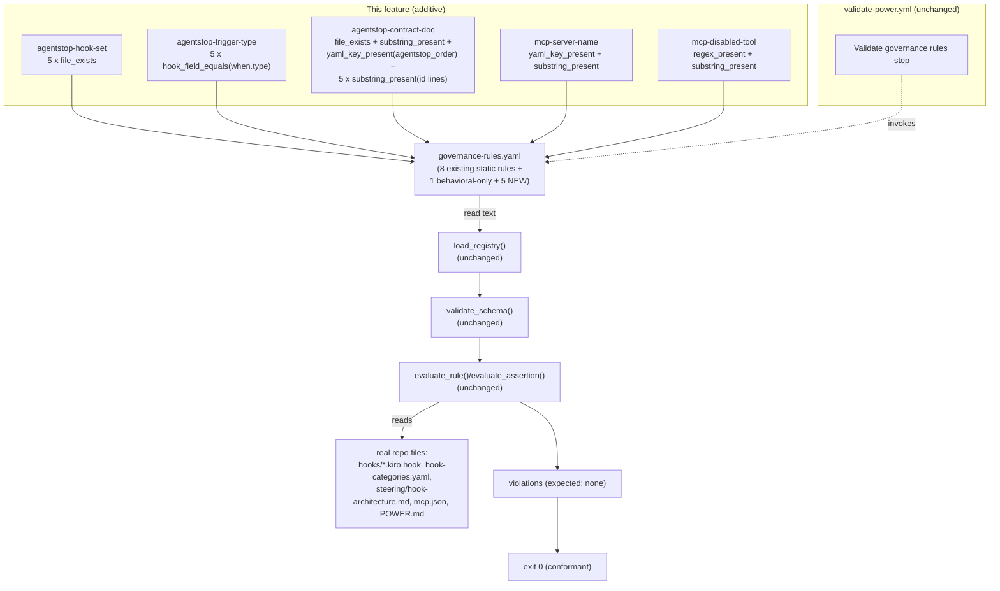

# Design Document

## Overview

The `governance-hook-and-mcp-coverage` feature is a **focused, additive extension** of the existing
`governance-rule-conformance` conformance layer. It adds five new Rule Entries to the canonical
registry — `senzing-bootcamp/config/governance-rules.yaml` — so that two coverage gaps the registry
does not currently describe are evaluated by the same stdlib-only validator and fail the same CI step
when they drift. It is a **verification-only, registry-data change**: it does not modify the validator
script, the assertion vocabulary, the CI workflow, or any enforcement point it references
(Requirements 7, 9, 10).

The two gaps it closes:

- **Gap 1 — the agentStop hook contract is not represented in the governance registry.** Exactly five
  hooks fire on `agentStop` (`ask-bootcamper`, `module-completion-celebration`, `module-recap-append`,
  `enforce-gate-on-stop`, `enforce-visualization-offers`). Their membership, trigger type, and the
  intended precedence are already documented in `senzing-bootcamp/steering/hook-architecture.md` and
  represented machine-readably by the `agentstop_order` mapping in
  `senzing-bootcamp/hooks/hook-categories.yaml`, and a repo-root test
  (`tests/test_agentstop_order_properties.py`) already asserts set-equality between the
  `agentstop_order` ids and the hooks whose `when.type` is `agentStop`. The remaining gap is that the
  **registry itself** carries no Rule Entry linking this contract to its enforcement points, so a
  silently added sixth hook, a removed or re-typed member, a deleted `hook-architecture.md`, or a
  missing `agentstop_order` mapping would not be caught by the conformance layer.

- **Gap 2 — MCP config drift between docs and `mcp.json` is not represented.** `mcp.json` is the
  single source of truth: it declares the server `senzing-mcp-server` and `disabledTools` equal to
  `["submit_feedback"]`. `POWER.md` documents both facts. No Rule Entry asserts that documentation
  stays consistent with the source of truth.

The change is intentionally small: five Rule Entries, written in the existing constrained YAML subset
using only the existing seven assertion types, every one of which holds against the real repository so
the shipped registry stays at exit 0 (Requirement 8). The only code-adjacent change outside the
registry is **test coverage** for the new entries (Requirement 11) plus one required update to an
existing test's hard-coded rule count (see Error Handling / Conformance).

### Key design decisions

| Decision | Choice | Rationale |
|---|---|---|
| Number of new Rule Entries | **Five** — one per item in Requirement 11.1 (`agentstop-hook-set`, `agentstop-trigger-type`, `agentstop-contract-doc`, `mcp-server-name`, `mcp-disabled-tool`) | Keeps each governing concern independently discoverable and independently fail-able in the registry, matching the existing one-rule-per-concern style. |
| Numeric agentStop order assertion (Req 4) | **Do NOT statically assert the integer order** | No existing assertion type can extract and compare ordered-integer fields across a list-of-mappings. Rely on `yaml_key_present` for `agentstop_order`, `substring_present` for each member id, documentation presence in `hook-architecture.md`, and the existing repo-root set-equality test. No new assertion type (Req 4.3, 4.4, 7.2). |
| MCP disabled-tool assertion type (Req 6.5) | **`regex_present` against the raw `mcp.json` text** | More robust to formatting and to legitimate addition of other disabled tools than `hook_field_equals` against the Python-repr-stringified list; still fails if `submit_feedback` is removed. See "Resolved design-phase decisions". |
| MCP server-name key check (Req 5.2) | **`yaml_key_present` with `key_path: mcpServers.senzing-mcp-server`** | The hyphenated key has no dots, so it is a single valid path segment; the dotted traversal resolves it directly against parsed JSON. See "Resolved design-phase decisions". |
| New category labels | `hook-architecture` (Gap 1) and the existing `mcp-integrity` (Gap 2) | Reuses the existing `mcp-integrity` category for the MCP entries; introduces one descriptive kebab-case category for the agentStop entries. `category` is a free, non-empty string in the schema, so no validator change is needed. |
| Assertion vocabulary | **Existing seven types only** | Both gaps are fully expressible with `file_exists`, `hook_field_equals`, `yaml_key_present`, `substring_present`, and `regex_present` (Req 7.1, 7.2). |
| Validator / CI changes | **None** | The "Validate governance rules" step already runs the validator over the whole registry, so the new entries are exercised with no workflow change (Req 9, 10). |

### Research findings that ground the design (no invented facts — Req 8.1)

Every string, path, and key below was read directly from the real repository:

- **Five agentStop hooks** — each of `senzing-bootcamp/hooks/{ask-bootcamper, module-completion-celebration, module-recap-append, enforce-gate-on-stop, enforce-visualization-offers}.kiro.hook` declares `"when": { "type": "agentStop" }`. `senzing-bootcamp/hooks/session-log-events.kiro.hook` declares `"when": { "type": "postToolUse", "toolTypes": ["write"] }` and is therefore **not** a member.
- **`agentstop_order` mapping** — `senzing-bootcamp/hooks/hook-categories.yaml` has a top-level `agentstop_order:` block sequence whose items are mappings, each with `id:`, `order:`, and `rationale:`. The exact id lines are `  - id: ask-bootcamper`, `  - id: module-recap-append`, `  - id: module-completion-celebration`, `  - id: enforce-gate-on-stop`, `  - id: enforce-visualization-offers`. (Note: the `critical`/`modules` sections list hooks as `- <id>` without the `id:` prefix, so `id: <hook>` substrings are unique to `agentstop_order`.)
- **Contract documentation** — `senzing-bootcamp/steering/hook-architecture.md` contains the literal sentence ``Exactly five hooks fire on `agentStop`.`` and the literal phrase `Their intended precedence, highest first, is:`, and lists each member id in its ordered precedence list.
- **MCP config** — `senzing-bootcamp/mcp.json` is valid JSON: `{ "mcpServers": { "senzing-mcp-server": { ..., "disabledTools": ["submit_feedback"] } } }`.
- **Power documentation** — `senzing-bootcamp/POWER.md` contains the literal strings `senzing-mcp-server` (server-name section) and `submit_feedback` (disabled-tool note and tool list).
- **Validator behavior** — `hook_field_equals` parses the file with `json.loads`, traverses the dotted `key_path`, and compares `str(value) == assertion.value`. `yaml_key_present` parses JSON with `json.loads` (falling back to a line-based scan for non-JSON) and checks dotted-path existence. `regex_present` runs `re.search(pattern, text)` over the raw file text. `file_exists` checks the path on disk. `substring_present` checks Python `in` membership.

## Architecture

There is no new runtime component. The architecture is the existing one-direction data flow of the
conformance layer; this feature only enlarges the registry node that feeds it.



The validator, its CLI, its schema, its assertion evaluator, and the CI step are all untouched. The
new Rule Entries are ordinary registry data that the existing pipeline parses, schema-validates, and
evaluates exactly like the eight seed rules.

## Components and Interfaces

This feature has no Python interface of its own — it reuses the validator's existing public surface
(`load_registry`, `validate_schema`, `evaluate_assertion`, `evaluate_rule`, `run`, `main`) without
modification. The "interface" it introduces is the **registry-data contract** for the five new
entries: each is a Rule Entry mapping in the constrained YAML subset, and each assertion uses one of
the seven supported types with exactly the parameters that type requires.

| Assertion type used | Required params | Where used in this feature |
|---|---|---|
| `file_exists` | `file` | Hook-set membership (5); contract-doc existence (1) |
| `hook_field_equals` | `file`, `key_path`, `value` | Trigger-type checks (5) |
| `yaml_key_present` | `file`, `key_path` | `agentstop_order` presence (1); MCP server-name key (1) |
| `substring_present` | `file`, `value` | Contract-doc anchors (2) + member-id lines (5); POWER.md server-name (1); POWER.md disabled-tool (1) |
| `regex_present` | `file`, `pattern` | MCP disabled-tool array (1) |

No new assertion type is introduced (Req 7.1, 7.2). The validator's `SUPPORTED_ASSERTION_TYPES`
mapping and parameter-requirement checks already accept every form above unchanged.

## Data Models

The data model is unchanged: the `RuleEntry` and `Assertion` dataclasses, the constrained YAML
subset, the repository-root `Path_Base`, and the double-quoted-scalar/escape-table value encoding all
remain as defined by `governance-rule-conformance`. The five new entries are appended to the existing
`rules:` block sequence, after the eight seed rules and before (or after) the behavioral-only block,
in the same two-space-indented, double-quoted-scalar style (Req 9.5).

### New Rule Entries (exact registry content)

The blocks below are the literal YAML to add. Patterns and values are double-quoted; regex
backslashes use the registry escape table (`\\s` decodes to `\s`, `\"` decodes to `"`, etc.),
matching the existing `hook-name-form` entry.

#### Gap 1 — Rule Entry 1: `agentstop-hook-set` (Requirement 1)

```yaml
  - id: "agentstop-hook-set"
    rule: "Exactly five hooks fire on agentStop; each of the five hook files must exist. session-log-events is postToolUse and is NOT a member."
    category: "hook-architecture"
    enforced_by:
      - "senzing-bootcamp/hooks/ask-bootcamper.kiro.hook"
      - "senzing-bootcamp/hooks/module-completion-celebration.kiro.hook"
      - "senzing-bootcamp/hooks/module-recap-append.kiro.hook"
      - "senzing-bootcamp/hooks/enforce-gate-on-stop.kiro.hook"
      - "senzing-bootcamp/hooks/enforce-visualization-offers.kiro.hook"
    assertions:
      - type: "file_exists"
        file: "senzing-bootcamp/hooks/ask-bootcamper.kiro.hook"
      - type: "file_exists"
        file: "senzing-bootcamp/hooks/module-completion-celebration.kiro.hook"
      - type: "file_exists"
        file: "senzing-bootcamp/hooks/module-recap-append.kiro.hook"
      - type: "file_exists"
        file: "senzing-bootcamp/hooks/enforce-gate-on-stop.kiro.hook"
      - type: "file_exists"
        file: "senzing-bootcamp/hooks/enforce-visualization-offers.kiro.hook"
```

`session-log-events.kiro.hook` appears in neither `enforced_by` nor `assertions` (Req 1.3). All five
files exist, so every assertion holds (Req 1.4).

#### Gap 1 — Rule Entry 2: `agentstop-trigger-type` (Requirement 2)

```yaml
  - id: "agentstop-trigger-type"
    rule: "Each of the five agentStop hooks declares when.type equal to agentStop. session-log-events declares postToolUse and is excluded."
    category: "hook-architecture"
    enforced_by:
      - "senzing-bootcamp/hooks/ask-bootcamper.kiro.hook"
      - "senzing-bootcamp/hooks/module-completion-celebration.kiro.hook"
      - "senzing-bootcamp/hooks/module-recap-append.kiro.hook"
      - "senzing-bootcamp/hooks/enforce-gate-on-stop.kiro.hook"
      - "senzing-bootcamp/hooks/enforce-visualization-offers.kiro.hook"
    assertions:
      - type: "hook_field_equals"
        file: "senzing-bootcamp/hooks/ask-bootcamper.kiro.hook"
        key_path: "when.type"
        value: "agentStop"
      - type: "hook_field_equals"
        file: "senzing-bootcamp/hooks/module-completion-celebration.kiro.hook"
        key_path: "when.type"
        value: "agentStop"
      - type: "hook_field_equals"
        file: "senzing-bootcamp/hooks/module-recap-append.kiro.hook"
        key_path: "when.type"
        value: "agentStop"
      - type: "hook_field_equals"
        file: "senzing-bootcamp/hooks/enforce-gate-on-stop.kiro.hook"
        key_path: "when.type"
        value: "agentStop"
      - type: "hook_field_equals"
        file: "senzing-bootcamp/hooks/enforce-visualization-offers.kiro.hook"
        key_path: "when.type"
        value: "agentStop"
```

For each hook the validator loads the JSON, resolves `when` → `type` to the string `"agentStop"`, and
compares `str("agentStop") == "agentStop"` → holds (Req 2.1, 2.3). No assertion for
`session-log-events` expecting `agentStop` is added (Req 2.4).

#### Gap 1 — Rule Entry 3: `agentstop-contract-doc` (Requirement 3)

```yaml
  - id: "agentstop-contract-doc"
    rule: "The agentStop hook contract (five-member set and intended precedence) stays documented in hook-architecture.md and machine-represented by the agentstop_order mapping in hook-categories.yaml."
    category: "hook-architecture"
    enforced_by:
      - "senzing-bootcamp/steering/hook-architecture.md"
      - "senzing-bootcamp/hooks/hook-categories.yaml"
    assertions:
      - type: "file_exists"
        file: "senzing-bootcamp/steering/hook-architecture.md"
      - type: "substring_present"
        file: "senzing-bootcamp/steering/hook-architecture.md"
        value: "Exactly five hooks fire on `agentStop`."
      - type: "substring_present"
        file: "senzing-bootcamp/steering/hook-architecture.md"
        value: "Their intended precedence, highest first, is:"
      - type: "yaml_key_present"
        file: "senzing-bootcamp/hooks/hook-categories.yaml"
        key_path: "agentstop_order"
      - type: "substring_present"
        file: "senzing-bootcamp/hooks/hook-categories.yaml"
        value: "id: ask-bootcamper"
      - type: "substring_present"
        file: "senzing-bootcamp/hooks/hook-categories.yaml"
        value: "id: module-recap-append"
      - type: "substring_present"
        file: "senzing-bootcamp/hooks/hook-categories.yaml"
        value: "id: module-completion-celebration"
      - type: "substring_present"
        file: "senzing-bootcamp/hooks/hook-categories.yaml"
        value: "id: enforce-gate-on-stop"
      - type: "substring_present"
        file: "senzing-bootcamp/hooks/hook-categories.yaml"
        value: "id: enforce-visualization-offers"
```

- `file_exists` covers Req 3.1.
- The two `substring_present` anchors against `hook-architecture.md` confirm the five-member statement
  and the precedence statement (Req 3.2). Both anchors are exact strings read from the file; the
  membership anchor uses backticks around `agentStop` exactly as the file does, and neither anchor
  contains an em dash (the file's `## agentStop Hooks — …` heading was avoided in favor of the
  em-dash-free precedence sentence to keep the value robust to punctuation edits).
- `yaml_key_present` with `key_path: agentstop_order` confirms the order mapping exists (Req 3.3).
  `hook-categories.yaml` is not valid JSON, so the validator's line-based scan resolves the top-level
  `agentstop_order:` key.
- The five `substring_present` `id: <hook>` anchors confirm the mapping references each member
  (Req 3.4); these substrings are unique to the `agentstop_order` block.

All asserted files and strings exist, so every assertion holds (Req 3.5).

#### Gap 2 — Rule Entry 4: `mcp-server-name` (Requirement 5)

```yaml
  - id: "mcp-server-name"
    rule: "mcp.json is the single source of truth for the MCP server name senzing-mcp-server, and POWER.md documents the same server name."
    category: "mcp-integrity"
    enforced_by:
      - "senzing-bootcamp/mcp.json"
      - "senzing-bootcamp/POWER.md"
    assertions:
      - type: "yaml_key_present"
        file: "senzing-bootcamp/mcp.json"
        key_path: "mcpServers.senzing-mcp-server"
      - type: "substring_present"
        file: "senzing-bootcamp/POWER.md"
        value: "senzing-mcp-server"
```

`mcp.json` parses as JSON; the dotted path splits into the two segments `mcpServers` and
`senzing-mcp-server` (the hyphens are part of the single segment — see decision below), both of which
resolve, so the key is present (Req 5.2). `POWER.md` contains the literal `senzing-mcp-server`
(Req 5.3). Both hold (Req 5.4).

#### Gap 2 — Rule Entry 5: `mcp-disabled-tool` (Requirement 6)

```yaml
  - id: "mcp-disabled-tool"
    rule: "submit_feedback stays configured as a disabled tool in mcp.json, and POWER.md documents it as disabled."
    category: "mcp-integrity"
    enforced_by:
      - "senzing-bootcamp/mcp.json"
      - "senzing-bootcamp/POWER.md"
    assertions:
      - type: "regex_present"
        file: "senzing-bootcamp/mcp.json"
        pattern: "\"disabledTools\"\\s*:\\s*\\[[^\\]]*\"submit_feedback\""
      - type: "substring_present"
        file: "senzing-bootcamp/POWER.md"
        value: "submit_feedback"
```

The `regex_present` pattern decodes (via the registry escape table) to the Python regex
`"disabledTools"\s*:\s*\[[^\]]*"submit_feedback"`, which matches the `disabledTools` key, the array
opener, any non-`]` content, and the quoted `submit_feedback` token before the array closes — so it
matches the real `"disabledTools": ["submit_feedback"]` text (Req 6.2). `POWER.md` contains the
literal `submit_feedback` (Req 6.3). Both hold (Req 6.4). See the decision below for why
`regex_present` was chosen over `hook_field_equals`.

### Requirement → Rule Entry / assertion traceability

| Requirement clause | Rule Entry | Assertion(s) |
|---|---|---|
| 1.1 (entry exists, fields) | `agentstop-hook-set` | whole entry (`id`, `rule`, `category`, `enforced_by` (5), `assertions`) |
| 1.2 (five `file_exists`) | `agentstop-hook-set` | 5 × `file_exists` |
| 1.3 (exclude session-log-events) | `agentstop-hook-set` | absence from `enforced_by` and `assertions` |
| 1.4 (exit 0) | `agentstop-hook-set` | all five files exist |
| 2.1, 2.2 (trigger-type per member, by path) | `agentstop-trigger-type` | 5 × `hook_field_equals` (`when.type` = `agentStop`) |
| 2.3 (exit 0) | `agentstop-trigger-type` | each hook's `when.type` is `agentStop` |
| 2.4 (no session-log-events trigger assertion) | `agentstop-trigger-type` | session-log-events omitted |
| 3.1 (doc exists) | `agentstop-contract-doc` | `file_exists` (hook-architecture.md) |
| 3.2 (membership + precedence stated) | `agentstop-contract-doc` | 2 × `substring_present` (hook-architecture.md) |
| 3.3 (`agentstop_order` present) | `agentstop-contract-doc` | `yaml_key_present` (`agentstop_order`) |
| 3.4 (each member id referenced) | `agentstop-contract-doc` | 5 × `substring_present` (`id: <hook>`) |
| 3.5 (exit 0) | `agentstop-contract-doc` | all files and strings present |
| 4.1–4.4 (ordering decision) | — | satisfied by NOT asserting numeric order; see decision below |
| 5.1 (entry exists, fields) | `mcp-server-name` | whole entry |
| 5.2 (`yaml_key_present` mcp.json) | `mcp-server-name` | `yaml_key_present` (`mcpServers.senzing-mcp-server`) |
| 5.3 (POWER.md references name) | `mcp-server-name` | `substring_present` (`senzing-mcp-server`) |
| 5.4 (exit 0) | `mcp-server-name` | both hold |
| 6.1 (entry exists, fields) | `mcp-disabled-tool` | whole entry |
| 6.2, 6.5 (disabled-tool in mcp.json) | `mcp-disabled-tool` | `regex_present` (disabledTools array contains submit_feedback) |
| 6.3 (POWER.md references tool) | `mcp-disabled-tool` | `substring_present` (`submit_feedback`) |
| 6.4 (exit 0) | `mcp-disabled-tool` | both hold |
| 7.1, 7.2 (existing seven types only) | all five | only `file_exists`, `hook_field_equals`, `yaml_key_present`, `substring_present`, `regex_present` used |
| 8.1, 8.4 (real facts, unique ids) | all five | grounded strings; five new ids unique across registry |
| 9.1, 9.2, 9.5 (additive, references, YAML subset) | all five | appended to existing `rules:`, references existing files, double-quoted scalars + 2-space indent |

### Resolved design-phase decisions

**Requirement 4 — numeric agentStop order is NOT statically asserted.** The `agentstop_order` mapping
stores the precedence as integer `order:` fields inside a block sequence of mappings. None of the
seven assertion types can express "the `order` integers are contiguous `1..5` in this sequence":
`yaml_key_present` only checks key existence; `hook_field_equals` operates on JSON and compares a
single terminal scalar stringified with `str()` (it cannot iterate list items or compare an ordering);
`substring_present`/`regex_present` match text but cannot evaluate ordered-integer relationships over
a list-of-mappings. Per Requirement 4.3 and 4.4, the feature therefore relies on
**documentation-presence** assertions for the intended order (the precedence sentence in
`hook-architecture.md` plus the `agentstop_order` mapping presence and the five member-id anchors in
`hook-categories.yaml`) and on the **existing repo-root set-equality test**
`tests/test_agentstop_order_properties.py`, which already asserts that the set of `agentstop_order`
ids equals the set of `agentStop` hooks. **No new assertion type is introduced** (Req 4.4, 7.2).

**Requirement 6.5 — `regex_present` chosen over `hook_field_equals` for the disabled-tool check.**
Both are existing types and both hold against the current repo, but they differ in robustness:

- `hook_field_equals` with `key_path: mcpServers.senzing-mcp-server.disabledTools` would compare
  `str(["submit_feedback"])`, i.e. the Python list repr `"['submit_feedback']"`, against the
  assertion `value`. The registry would have to encode `value: "['submit_feedback']"` — single quotes,
  internal spacing, and brackets baked in. This is brittle: it encodes Python's `repr` formatting into
  the registry, and it is an **exact whole-list match**, so adding a second legitimate disabled tool
  (e.g. `["submit_feedback", "other"]` → `"['submit_feedback', 'other']"`) would fail the assertion
  even though `submit_feedback` is still disabled. That over-strictness contradicts the intent of
  Requirement 6 ("`submit_feedback` *remains* configured as a disabled tool").
- `regex_present` with `"disabledTools"\s*:\s*\[[^\]]*"submit_feedback"` matches the raw file text:
  it requires the `disabledTools` key, the array opener, and the quoted `submit_feedback` token
  **before the array closes** (the `[^\]]*` cannot cross a `]`, so a match inside a different array
  such as `autoApprove` is impossible). This is robust to whitespace and formatting changes and to the
  addition of other disabled tools, while still failing if `submit_feedback` is removed from
  `disabledTools`. It is therefore the more robust and intent-faithful option, and it is the choice
  this design adopts. (This mirrors how the existing `hook-name-form` rule already uses
  `regex_present` against raw hook text.)

**Requirement 5.2 — the hyphenated key is a single dotted-path segment.** `key_path:
mcpServers.senzing-mcp-server` splits on `.` into exactly two segments, `mcpServers` and
`senzing-mcp-server`. The hyphens in `senzing-mcp-server` are ordinary characters within one segment
(there are no dots inside the key), so the traversal walks `data["mcpServers"]["senzing-mcp-server"]`
correctly. `mcp.json` is valid JSON, so `yaml_key_present` resolves it via `json.loads` + dotted
traversal (no line-based fallback needed), and the key is present.

## Property-Based Testing Applicability

This feature deliberately omits a Correctness Properties section because property-based testing does
not apply to it. The change is purely **additive registry configuration data** (five declarative Rule
Entries) layered on top of a validator whose logic is not modified. There is no new pure function or
input/output transformation here over which to state a "for all inputs X, property P(X)" claim:

- The validator's parser, schema checker, assertion evaluator, exit-code logic, and reporting are
  unchanged and are already covered by the 15 property tests in
  `test_governance_rules_properties.py` from the `governance-rule-conformance` feature. Re-asserting
  those would duplicate existing coverage (Requirement 11.2 explicitly forbids duplicating the
  validator's behavioral property tests).
- What this feature adds is verified against **fixed artifacts** — the shipped registry and the real
  repository files — not a varying input space. The correct test shape is therefore example/presence
  and conformance checks, not generated-input properties.

This matches the workflow guidance that configuration data and additive registry entries are not
suitable for PBT. The testing approach is detailed in the Testing Strategy section below.

## Error Handling

### Conformance contract

The conformance contract is that the shipped registry, including the five new entries, evaluates to
**exit 0 with zero violations** over the real repository, keeping the existing conformance test green
(Requirement 8). The error-handling story is inherited unchanged from the validator; the relevant
points for this feature are:

- **Every new assertion holds against the real repo.** Each referenced path exists, each
  `hook_field_equals` resolves to the literal `agentStop`, each `substring_present`/`regex_present`
  anchor is present in the named file, and each `yaml_key_present` path resolves. So `evaluate_rule`
  returns no violations for the five new entries, and `run` keeps `exit_code == 0` (Req 8.2, 10.2).
- **All five entries are statically checkable.** None set `static_checkable: false`, so each is
  evaluated (none are skipped) and each contributes to the rules-checked count.
- **Schema validity.** Every new entry has a unique, non-empty `id` (none collide with the existing
  `pointer-prefix`, `mcp-first`, `rule-06-license-mcp`, `rule-15-module3-visualization-gate`,
  `hook-name-form`, `feedback-file-path`, `frontmatter-inclusion`, `graduation-completion-summary`, or
  `no-ambiguous-yes-no`), a non-empty `rule` and `category`, a non-empty `enforced_by`, and a
  non-empty `assertions` list whose every assertion carries the parameters its type requires
  (Req 8.4). So `validate_schema` reports no schema violations and does not halt.
- **YAML-subset conformance.** All scalar `value`/`pattern` fields are double-quoted, indentation is
  two spaces per level, and all `file` paths are repository-root-relative — so the existing stdlib
  parser reads the entries unchanged (Req 9.5).

**Required existing-test update (rule count).** Adding five statically-checkable entries raises the
validator's rules-checked count from 8 to 13. One existing test in
`senzing-bootcamp/tests/test_governance_rules_validator.py` hard-codes the literal assertion
`"Rule Entries checked: 8"` for the `main([])`-over-real-repo case; this literal must be updated to
`"Rule Entries checked: 13"` so `pytest` stays green (Requirement 10.3). This is a test-data update
only — it does **not** modify the validator script. The conformance test in
`test_governance_rules_conformance.py` does not hard-code a count (it asserts exit 0 / no violations),
so it stays green automatically and transitively covers the new entries. The seed-id presence test
uses `in`-membership (not set equality), so it continues to pass unchanged.

**No validator or CI change (Req 7.3, 9, 10).** The validator script
`senzing-bootcamp/scripts/validate_governance_rules.py` is not modified, and the
`.github/workflows/validate-power.yml` "Validate governance rules" step already runs the validator
over the whole registry — so the new entries are exercised by the existing step with no workflow
change. If any new assertion ever fails in CI, the validator exits 1 and the existing step fails the
build (Req 10.4).

## Testing Strategy

The feature is tested with **example/presence tests** (the new entries are present in the shipped
registry by `id`) and a **conformance check** (the validator exits 0 over the real repository with the
new entries present), reusing the existing conformance pattern rather than duplicating the validator's
own behavioral property tests (Requirement 11.2). No property-based tests are added, for the reasons
given in the Correctness Properties section; Requirement 11's property-test conventions apply only
"where a property test is added," and none is.

### Test files

| File | Status | Focus |
|---|---|---|
| `senzing-bootcamp/tests/test_governance_hook_and_mcp_coverage.py` | **new** | Presence of the five new rule ids in the shipped registry; conformance of the new entries over the real repo. |
| `senzing-bootcamp/tests/test_governance_rules_validator.py` | **edit** | Update the hard-coded `"Rule Entries checked: 8"` literal to `"Rule Entries checked: 13"` (rule-count drift from the five additions). |
| `senzing-bootcamp/tests/test_governance_rules_conformance.py` | unchanged | Already asserts exit 0 / no violations over the full real registry; transitively covers the new entries (the "reuse" half of Req 11.2). |

### New test file contents

`test_governance_hook_and_mcp_coverage.py` follows the repository test conventions
(`from __future__ import annotations`, type hints with `X | None` and `list[str]`, class-based
organization, scripts imported via `sys.path` insertion of the `scripts/` directory), and uses the
Python standard library only — no Hypothesis is needed because no property test is added (Req 11.3,
11.5).

- **`TestNewRuleEntriesPresent`** (Requirement 11.1, 8.4): load the shipped
  `governance-rules.yaml` via `load_registry`, collect the entry ids, and assert that each of
  `agentstop-hook-set`, `agentstop-trigger-type`, `agentstop-contract-doc`, `mcp-server-name`, and
  `mcp-disabled-tool` is present. A companion check asserts that all registry ids are unique (the five
  new ids do not collide with any existing id).
- **`TestNewRuleEntriesConformant`** (Requirement 11.2): call `run(shipped_registry, repo_root)` over
  the real checkout, assert `result.exit_code == 0` and `result.completed is True`, and assert that no
  collected violation's `rule_id` is one of the five new ids. Reusing `run` (the same entry point the
  conformance test uses) verifies the new entries hold against the real repo without re-testing the
  validator's parsing/evaluation internals.

### Verification commands

Run after editing the registry and tests (single-execution, no watch mode):

```bash
python senzing-bootcamp/scripts/validate_governance_rules.py
python -m pytest senzing-bootcamp/tests/test_governance_hook_and_mcp_coverage.py \
    senzing-bootcamp/tests/test_governance_rules_validator.py \
    senzing-bootcamp/tests/test_governance_rules_conformance.py
```

The first command must print `Governance rule conformance: PASS`, `Rule Entries checked: 13`,
`Violations found: 0`, and exit 0. The pytest run must pass, confirming the new entries are present,
conformant, and that the rule-count literal was updated.
