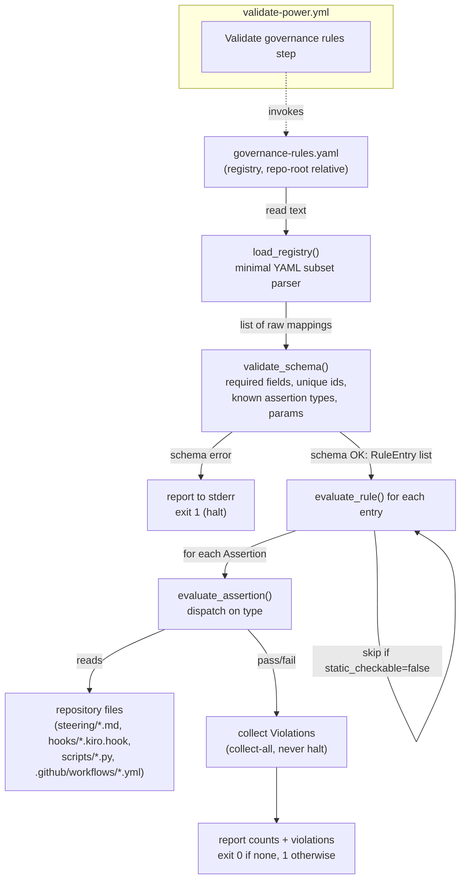

# Design Document

## Overview

The governance-rule-conformance feature adds a machine-checkable conformance layer that ties each high-level governing rule of the Senzing Bootcamp Power to the file(s), hook(s), and marker(s) that enforce it, and fails CI when that linkage breaks. It is a **verification layer only** — it does not move, duplicate, or modify any existing enforcement logic (Requirement 1.4).

The feature has four parts:

1. A canonical **registry** — `senzing-bootcamp/config/governance-rules.yaml` — enumerating each governing rule with a stable `id`, the rule text, a `category`, the enforcement points (`enforced_by`), and one or more checkable `assertions`.
2. A **validator** — `senzing-bootcamp/scripts/validate_governance_rules.py`, stdlib-only — that loads the registry, validates its schema, evaluates every assertion against the real repository files, and reports any rule whose enforcement assertion fails.
3. **CI wiring** in `.github/workflows/validate-power.yml` that runs the validator alongside the existing validation steps.
4. **Tests** in `senzing-bootcamp/tests/` (pytest + Hypothesis) covering the validator behavior, the assertion vocabulary, schema validation, violation reporting, and a conformance test that the shipped registry passes the validator.

### Key design decisions

| Decision | Choice | Rationale |
|---|---|---|
| Registry parser | Purpose-built, line-based stdlib parser for a constrained YAML subset | Matches the repo convention (`sync_hook_registry.py`, `measure_steering.py` use custom parsers); satisfies the stdlib-only constraint (Req 6.1); PyYAML is forbidden outside `validate_dependencies.py` (tech.md, python-conventions.md). |
| Assertion value encoding | Require **double-quoted scalar** values for all assertion params; decode a small, explicit escape set | The trickiest part of a custom parser is regex backslashes and the 👉 emoji. Double-quoting plus a fixed escape table makes parsing unambiguous and round-trippable. |
| Relationship to `validate_behavior_rules.py` | **Separate** script (`validate_governance_rules.py`) | Avoids coupling a broad declarative registry to a narrow content-scanner; the two have different shapes and lifecycles (Req 9.4). The overlap on the 👉 rule is documented, not merged. |
| Path resolution base | **Repository root** | Enforcement points span both `senzing-bootcamp/**` and `.github/workflows/**`; a single repo-root base keeps every path uniform and is documented in the registry header (Req 2.7). |
| Behavioral-only rules | Recorded as entries with `static_checkable: false` and no `assertions`; validator skips them | Makes the coverage boundary explicit and discoverable in the registry itself (Req 8.2, 8.3). |

### Research findings that shaped the design

Reading the real enforcement points confirmed the seed facts the registry asserts against (Req 7.9 — no invented facts):

- **👉 pointer rule** lives in `steering/agent-behavior-rules.md` ("## Rule 4: Consistent Pointer Indicator", "Prefix every input-requiring prompt with 👉") and is reinforced in `steering/agent-instructions.md` ("Prefix input-required questions with 👉").
- **MCP-First Invariant** is a literal heading "### MCP-First Invariant" in `steering/agent-instructions.md`.
- **Rule 6 (license → MCP)** consultation appears as `search_docs(` calls in the license-insufficient paths: `module-01-business-problem.md` Step 6d and `module-02-sdk-setup.md` Steps 5a and 5c.
- **Rule 15 (Module 3 Step 9 gate)** is enforced two ways: `NON_SKIPPABLE_GATES = {"3.9"}` in `scripts/validate_mandatory_gates.py`, and the absence of a "CONDITION B" escape hatch in `hooks/gate-module3-visualization.kiro.hook` (it has only CONDITION A).
- **Hook-name rule**: every `*.kiro.hook` `name` field begins with `to ` (verified across all 31 hook files, e.g. "to wait for your answer", "to verify SDK setup").
- **Feedback-file-path rule**: `docs/feedback/SENZING_BOOTCAMP_POWER_FEEDBACK.md` is referenced in `steering/feedback-workflow.md`.
- **Frontmatter inclusion**: `agent-instructions.md` and `module-transitions.md` declare `inclusion: always`; `agent-behavior-rules.md` declares `inclusion: auto`; module steering files declare `inclusion: manual`.
- **Graduation completion-summary**: `steering/completion-summary-offer.md` states the summary is "always" generated and that declining skips "only the PDF render"; `graduation.md` echoes the always-generate contract.

## Architecture

The validator is a single stdlib-only Python module orchestrated by `main()`. It runs as one CI step. Data flows in one direction: registry text → parsed mappings → typed dataclasses → schema validation → per-assertion evaluation against repository files → violations → report + exit code.



### Component responsibilities

- **`load_registry(path)`** — read and parse the registry text into a list of raw rule mappings using the minimal YAML subset parser. Raises a typed load error if the file is missing, unreadable, or not parseable (Req 4.7).
- **`validate_schema(raw_entries)`** — convert raw mappings into `RuleEntry`/`Assertion` dataclasses while collecting schema violations (missing fields, duplicate ids, unsupported assertion types, malformed assertions). Schema problems halt before content evaluation (Req 2.8/2.9, 3.9/3.10).
- **`evaluate_assertion(assertion, repo_root)`** — evaluate one assertion against the filesystem, returning `None` on pass or a `Violation` on fail. Pure dispatch on `assertion.type`.
- **`evaluate_rule(entry, repo_root)`** — evaluate all assertions of one rule, skipping behavioral-only rules; returns a list of `Violation`.
- **`run(registry_path, repo_root)`** — orchestrates load → schema → evaluate-all; returns a structured result `(rules_checked, violations, exit_code)`.
- **`main(argv=None)`** — argparse CLI, path resolution, reporting, `sys.exit`.

### Separation from existing validators (Requirement 9)

| Validator | What it does | Relationship |
|---|---|---|
| `validate_power.py` | Power integrity | Unchanged; complemented. |
| `validate_mandatory_gates.py` | Cross-references ⛔ gates against progress checkpoints | Unchanged; this feature *references* it (asserts `"3.9"` is in `NON_SKIPPABLE_GATES`). |
| `sync_hook_registry.py` | Regenerates hook registry markdown from hook JSON | Unchanged; complemented. |
| `validate_behavior_rules.py` | Scans steering content for 4 behavioral anti-patterns (pause language, ambiguous questions, etc.) | **Overlaps** on the 👉 pointer rule. This feature stays a **separate** script (Req 9.4). `validate_behavior_rules.py` answers "does steering content avoid runtime anti-patterns?"; governance-rule-conformance answers "is each governing rule still wired to its declared enforcement point?". For the 👉 overlap, the registry adds an **independent** `substring_present` assertion against `agent-behavior-rules.md` rather than delegating to or duplicating the behavior-rules scanner — keeping the registry self-contained and the two checks decoupled. The overlap is documented in the registry header comment so maintainers see it. |

## Components and Interfaces

### CLI

```text
usage: validate_governance_rules.py [-h] [--registry REGISTRY] [--repo-root REPO_ROOT]

Validate that each governing rule in governance-rules.yaml is wired to its
enforcement point(s).

options:
  -h, --help            show this help message and exit
  --registry REGISTRY   Path to governance-rules.yaml
                        (default: <repo_root>/senzing-bootcamp/config/governance-rules.yaml)
  --repo-root REPO_ROOT
                        Base directory for resolving enforced_by and assertion
                        file paths (default: repository root inferred from script location)
```

Path resolution mirrors the repo convention used in `validate_mandatory_gates.py` and `sync_hook_registry.py`: the repository root is inferred from the script location (`Path(__file__).resolve().parent.parent.parent`), and both `--registry` and `--repo-root` can override for tests.

### Function signatures

```python
def load_registry(path: Path) -> list[dict]: ...
def validate_schema(raw_entries: list[dict]) -> tuple[list[RuleEntry], list[Violation]]: ...
def evaluate_assertion(assertion: Assertion, repo_root: Path) -> Violation | None: ...
def evaluate_rule(entry: RuleEntry, repo_root: Path) -> list[Violation]: ...
def run(registry_path: Path, repo_root: Path) -> RunResult: ...
def main(argv: list[str] | None = None) -> int: ...
```

### Assertion evaluator dispatch

`evaluate_assertion` dispatches on `assertion.type`. The seven supported types and their required parameters (Requirement 3):

| Type | Required params | Pass condition |
|---|---|---|
| `substring_present` | `file`, `value` | `value` occurs in the file's text |
| `substring_absent` | `file`, `value` | `value` does **not** occur in the file's text |
| `regex_present` | `file`, `pattern` | `re.search(pattern, text)` matches |
| `regex_absent` | `file`, `pattern` | `re.search(pattern, text)` does **not** match |
| `file_exists` | `file` | the file exists on disk |
| `hook_field_equals` | `file`, `key_path`, `value` | `json.load(file)` traversed by dotted `key_path` equals `value` |
| `yaml_key_present` | `file`, `key_path` | dotted `key_path` resolves to a present key in the YAML/JSON file |

**Missing-file rule (Req 4.5):** for every type except `file_exists`, if the target file does not exist, the assertion fails and the missing file is reported as the cause.

**`key_path` syntax:** a dotted path of segments, e.g. `then.type` or `when.toolTypes`. Traversal walks nested mappings segment by segment. For `hook_field_equals`, the terminal value is compared as a string to the assertion's `value` (JSON scalars are stringified for comparison; this matches the simple `name`/`then.type`-style fields the seed rules target). For `yaml_key_present`, the check is existence of the final segment, not its value. Numeric list indices are out of scope for v1 (no seed rule needs them).

## Data Models

### Registry file format (`senzing-bootcamp/config/governance-rules.yaml`)

The registry is a YAML document with a header comment block documenting the path-resolution base (Req 2.7) and the behavioral-rule convention, followed by a top-level `rules:` list of Rule Entries.

**Path base:** every `file` in `enforced_by` and in `assertions` is resolved **relative to the repository root** (documented in the header comment).

**Constrained YAML subset (what the parser accepts):**

- One top-level key: `rules:` whose value is a block-sequence (`- ` items).
- Each list item is a mapping of scalar keys to either:
  - a **double-quoted string scalar** (`id`, `rule`, `category`, `type`, `value`, `pattern`, `file`, `key_path`), or
  - a **bare boolean** (`static_checkable: true|false`), or
  - a nested block-sequence of scalars (`enforced_by:`), or
  - a nested block-sequence of mappings (`assertions:`).
- Comments (`#`) and blank lines are ignored.
- Indentation is two spaces per level (matching the repo's other YAML configs).

**Value encoding (the critical part — regex backslashes and the 👉 emoji):**

All assertion `value` and `pattern` scalars **must be double-quoted**, and the parser decodes a fixed escape table inside double quotes:

| Escape in registry | Decodes to |
|---|---|
| `\\` | single backslash |
| `\"` | double quote |
| `\n` | newline |
| `\t` | tab |
| `\uXXXX` | Unicode code point (used for the pointer emoji as a surrogate pair, or written literally) |

Rationale: a regex like `"name":\s*"to\s` contains backslashes that a naive YAML reader would mangle. Requiring double-quoted scalars with an explicit, minimal escape table makes the bytes unambiguous: the parser reads to the closing unescaped quote, then runs the escape table. The 👉 emoji may be written **literally** (the file is UTF-8 and Python reads it as text) — quoting is still required so the parser treats it as a scalar, but no escaping of the emoji itself is needed. Authors who prefer ASCII-only source may instead write the `\uXXXX` form. Patterns are stored verbatim after escape-decoding and handed directly to `re.search`, so a registry pattern for a word boundary becomes the corresponding Python pattern after decoding.

This subset is intentionally narrower than full YAML — no anchors, flow collections, multi-line scalars, or unquoted strings for assertion values — which is exactly what keeps a stdlib line-based parser correct and small, consistent with `_parse_simple_yaml` in `sync_hook_registry.py`.

#### Annotated example (3 seed rules)

```yaml
# governance-rules.yaml
# ---------------------------------------------------------------------------
# Canonical registry of Senzing Bootcamp governing rules and their enforcement.
#
# PATH BASE: every `file:` below (in enforced_by and assertions) is resolved
#            RELATIVE TO THE REPOSITORY ROOT (the directory containing
#            `senzing-bootcamp/` and `.github/`).
#
# ASSERTION VALUES: `value` and `pattern` MUST be double-quoted. Inside quotes,
#            the escapes \\  \"  \n  \t  \uXXXX are decoded. Regex patterns are
#            passed verbatim to Python's re.search after decoding.
#
# BEHAVIORAL-ONLY RULES: entries with `static_checkable: false` carry no
#            assertions and are skipped by the validator (see Requirement 8).
#
# OVERLAP NOTE: the `pointer-prefix` rule also overlaps validate_behavior_rules.py
#            (Rule 4). This registry asserts it independently; it does not call
#            that script. See design Requirement 9 mapping.
# ---------------------------------------------------------------------------
rules:
  - id: "pointer-prefix"
    rule: "ALWAYS prefix bootcamper input-requiring prompts with the pointer indicator (👉)."
    category: "conversation-protocol"
    enforced_by:
      - "senzing-bootcamp/steering/agent-behavior-rules.md"
      - "senzing-bootcamp/steering/agent-instructions.md"
    assertions:
      # The behavior-rules file must state the pointer requirement.
      - type: "substring_present"
        file: "senzing-bootcamp/steering/agent-behavior-rules.md"
        value: "Prefix every input-requiring prompt with 👉"
      # agent-instructions reinforces it.
      - type: "substring_present"
        file: "senzing-bootcamp/steering/agent-instructions.md"
        value: "👉"

  - id: "mcp-first"
    rule: "MCP-First Invariant: all Senzing facts come from MCP tool calls, never training data."
    category: "mcp-integrity"
    enforced_by:
      - "senzing-bootcamp/steering/agent-instructions.md"
    assertions:
      - type: "substring_present"
        file: "senzing-bootcamp/steering/agent-instructions.md"
        value: "MCP-First Invariant"

  - id: "rule-15-module3-visualization-gate"
    rule: "Module 3 Step 9 visualization gate is unconditional — no skip escape hatch."
    category: "mandatory-gate"
    enforced_by:
      - "senzing-bootcamp/scripts/validate_mandatory_gates.py"
      - "senzing-bootcamp/hooks/gate-module3-visualization.kiro.hook"
    assertions:
      # The non-skippable gate set must contain "3.9".
      - type: "regex_present"
        file: "senzing-bootcamp/scripts/validate_mandatory_gates.py"
        pattern: "NON_SKIPPABLE_GATES\\s*=\\s*\\{\"3\\.9\"\\}"
      # The contradicting escape hatch must be ABSENT from the hook.
      - type: "substring_absent"
        file: "senzing-bootcamp/hooks/gate-module3-visualization.kiro.hook"
        value: "CONDITION B"
```

### Dataclasses

```python
@dataclass(frozen=True)
class Assertion:
    """A single declarative, checkable condition attached to a Rule Entry."""
    type: str                     # one of the 7 supported assertion types
    file: str | None = None       # repo-root-relative target file
    value: str | None = None      # substring / hook field value (decoded)
    pattern: str | None = None    # regex pattern (decoded, verbatim for re.search)
    key_path: str | None = None   # dotted path for hook_field_equals / yaml_key_present


@dataclass(frozen=True)
class RuleEntry:
    """One governing rule and its enforcement linkage."""
    id: str
    rule: str
    category: str
    enforced_by: list[str]
    assertions: list[Assertion]
    static_checkable: bool = True   # False => behavioral-only, no assertions, skipped


@dataclass(frozen=True)
class Violation:
    """A reported failure: a schema problem or a failing content assertion."""
    rule_id: str                  # "" for top-level schema errors with no id
    kind: str                     # "schema" | "content"
    detail: str                   # human-readable cause
    assertion: Assertion | None = None   # the failing assertion (content violations)
    file: str | None = None       # file path involved, when applicable


@dataclass(frozen=True)
class RunResult:
    """Aggregate outcome of a validator run."""
    rules_checked: int
    violations: list[Violation]
    completed: bool               # True only if evaluation ran to completion
    exit_code: int                # 0 iff schema valid AND no violations AND no internal error
```

## Correctness Properties

*A property is a characteristic or behavior that should hold true across all valid executions of a system — essentially, a formal statement about what the system should do. Properties serve as the bridge between human-readable specifications and machine-verifiable correctness guarantees.*

The validator is built from pure functions (a parser, an oracle-comparable assertion evaluator, schema validation, and exit-code logic) over a large input space, so property-based testing applies. The properties below are the distinct, non-redundant set derived from the prework analysis (logically complementary criteria such as present/absent and the several exit-code clauses were consolidated).

### Property 1: Parser round-trip preserves structure (including regex and emoji)

*For any* list of well-formed Rule Entries (with arbitrary ids, categories, enforced_by lists, and assertions whose `value`/`pattern` may contain backslashes, double quotes, newlines, and the 👉 emoji), rendering the entries to the registry YAML subset and then calling `load_registry` followed by `validate_schema` yields RuleEntry/Assertion structures equal to the originals.

**Validates: Requirements 4.1**

### Property 2: Schema requires every required field

*For any* generated Rule Entry, if any required field (`id`, `rule`, `category`, `enforced_by`, `assertions`) is missing or empty (including an empty `enforced_by` or empty `assertions` list), then `validate_schema` reports a schema violation for that entry and the run exits with status code 1; if all required fields are present and non-empty, no required-field schema violation is reported for that entry.

**Validates: Requirements 2.1, 2.3, 2.4, 2.5, 2.6, 2.8**

### Property 3: Duplicate ids are rejected

*For any* generated list of Rule Entries, `validate_schema` reports a duplicate-id violation and the run exits with status code 1 if and only if two or more entries share the same `id`.

**Validates: Requirements 2.2, 2.9**

### Property 4: Substring assertions agree with the membership oracle

*For any* file text and any candidate substring, a `substring_present` assertion passes if and only if the substring occurs in the file text, and a `substring_absent` assertion passes if and only if it does not — matching Python's `in` operator on the file contents.

**Validates: Requirements 3.1, 3.2**

### Property 5: Regex assertions agree with the re.search oracle

*For any* file text and any valid regular expression, a `regex_present` assertion passes if and only if `re.search(pattern, text)` matches, and a `regex_absent` assertion passes if and only if it does not.

**Validates: Requirements 3.3, 3.4**

### Property 6: file_exists matches filesystem reality

*For any* path, a `file_exists` assertion passes if and only if a file exists at that path (resolved against the repo root).

**Validates: Requirements 3.5**

### Property 7: hook_field_equals matches dotted JSON traversal

*For any* JSON object and any dotted `key_path`, a `hook_field_equals` assertion passes if and only if traversing the object by the path segments resolves to a value whose string form equals the assertion's `value`.

**Validates: Requirements 3.6**

### Property 8: yaml_key_present matches dotted key existence

*For any* mapping and any dotted `key_path`, a `yaml_key_present` assertion passes if and only if every segment resolves and the final key is present in the mapping.

**Validates: Requirements 3.7**

### Property 9: Unsupported assertion type halts at schema stage

*For any* registry containing at least one assertion whose `type` is not in the supported set, the validator reports an unsupported-assertion-type schema violation, does not proceed to content evaluation, and exits with status code 1 — even when other schema or content problems are also present.

**Validates: Requirements 3.9**

### Property 10: Missing required parameter is a malformed-assertion violation

*For any* assertion whose `type` is supported but is missing a parameter required by that type, `validate_schema` reports a malformed-assertion violation and the run exits with status code 1.

**Validates: Requirements 3.10**

### Property 11: Missing target file fails non-existence-tolerant assertions

*For any* assertion whose type is not `file_exists`, if the target file does not exist, the assertion fails and the resulting violation names the missing file as the cause.

**Validates: Requirements 4.5**

### Property 12: Structurally valid registries are evaluated completely (collect-all)

*For any* structurally valid registry in which exactly *k* content assertions are arranged to fail (scattered across rules, with behavioral-only `static_checkable: false` entries interspersed), a single run evaluates every assertion of every statically-checkable rule, skips the behavioral-only entries without failing on them, and collects exactly *k* content violations without stopping at the first failure.

**Validates: Requirements 4.2, 4.6, 8.2, 8.4**

### Property 13: Canonical exit-code contract

*For any* registry, the validator exits with status code 0 if and only if the registry is structurally valid AND every evaluated assertion holds AND no internal evaluation error occurred; in every other case (a load/schema error, a malformed/unsupported assertion, at least one content violation, or an internal error) it exits with status code 1. This also covers acceptance criterion 4.4a (the consolidated exit-0 condition).

**Validates: Requirements 4.3, 4.4, 6.4, 11.2**

### Property 14: Violation reporting is complete and on stderr

*For any* run that ends in failure with one or more violations, each violation is rendered as a separate entry on standard error, and every content violation's text includes the failing rule's `id`, the failing assertion's type and parameters, and the file path involved.

**Validates: Requirements 5.1, 5.2, 5.3, 5.4, 5.6, 11.5**

### Property 15: Completion counts are emitted only on full completion

*For any* run, the completion counts (number of Rule Entries checked and number of Violations found) appear in the output if and only if the run evaluated all statically-checkable rules to completion; a run aborted by a schema-level error does not emit the completion counts.

**Validates: Requirements 5.5**

## Error Handling

The validator distinguishes three error classes, each with a defined behavior and exit code.

| Class | Examples | Behavior | Exit |
|---|---|---|---|
| **Load error** | Registry file missing, unreadable, or not parseable (unterminated quote, bad indentation, non-`rules` top key) | Report the load error to stderr; do not attempt evaluation; no completion counts | 1 (Req 4.7) |
| **Schema error (halt)** | Missing required field, empty required field, duplicate id, unsupported assertion type, missing required assertion param | Collected during `validate_schema`; reported to stderr; **halt before content evaluation**; no completion counts emitted | 1 (Req 2.8, 2.9, 3.9, 3.10, 5.5) |
| **Content violation (collect-all)** | A `substring_present` value absent, a `regex_present` non-match, a missing target file, a `hook_field_equals` mismatch | Evaluate every assertion of every statically-checkable rule, collect all violations, report each separately to stderr, then emit completion counts | 1 (Req 4.4, 4.6, 5.4, 5.5) |
| **Success** | Schema valid, all assertions hold, no internal error | Report success and completion counts to stdout | 0 (Req 4.3, 4.4a) |

Design choices:

- **Schema errors halt; content violations collect-all.** This split (Req 4.6 vs Req 2/3) means one run surfaces every broken rule→enforcement link at once, while a structurally broken registry fails fast with a clear schema message rather than producing noisy downstream errors.
- **Unsupported type takes precedence and halts even amid other errors** (Req 3.9): `validate_schema` detects unsupported types first and returns before any content evaluation begins.
- **Internal evaluation errors** (e.g., an invalid regex that raises `re.error`, or malformed JSON in a hook file during `hook_field_equals`) are caught and converted into a content violation describing the cause, and force exit 1 — they never crash the run (Req 4.4a "no internal error" clause).
- **Missing files** for non-`file_exists` assertions are treated as assertion failures, not load errors, and name the file (Req 4.5).
- **Stream discipline**: violations and error details go to **stderr**; success messages and completion counts go to **stdout** (Req 5.6). Completion counts are emitted only after a full evaluation pass (Req 5.5).

## Testing Strategy

### Dual approach

- **Property tests (Hypothesis)** verify the 15 universal properties above across generated inputs — they carry the bulk of correctness coverage for the parser, the assertion evaluator, schema validation, exit codes, and reporting.
- **Unit / example tests (pytest)** cover concrete edge cases and error conditions that are not input-varying: load errors (Req 4.7), the CLI surface (`main([])`, `main(["--registry", ...])`), and stream routing specifics.
- **Integration / smoke tests** cover the shipped artifact: the conformance test (Req 11.8) and the seed-rule presence checks (Req 7), plus one-shot convention checks (script exists, naming, shebang/`__future__`/`main`, no external endpoint, CI step present).

### Test files (in `senzing-bootcamp/tests/`)

| File | Focus |
|---|---|
| `test_governance_rules_properties.py` | Hypothesis property tests for Properties 1–15 (parser round-trip, assertion oracle agreement, schema, exit codes, reporting, collect-all, behavioral-skip). |
| `test_governance_rules_schema.py` | Example-based schema cases: missing each field, duplicate id, unsupported type, malformed assertion (Req 11.4). |
| `test_governance_rules_validator.py` | CLI/`main` behavior, load errors (Req 4.7), stderr routing, completion-count gating (example form), seed-rule id presence (Req 7). |
| `test_governance_rules_conformance.py` | Conformance: run the validator over the real repo with the shipped `governance-rules.yaml`; assert exit 0 (Req 11.8, 7.9). |

### Assertion-type test matrix (pass + fail each — Req 11.3)

| Type | Pass case | Fail case |
|---|---|---|
| `substring_present` | value is a true substring of text | value not in text |
| `substring_absent` | value not in text | value is a substring |
| `regex_present` | pattern matches | pattern does not match |
| `regex_absent` | pattern does not match | pattern matches |
| `file_exists` | temp file created | random missing path |
| `hook_field_equals` | path resolves to expected value | path resolves to a different value / missing path |
| `yaml_key_present` | final key present | final key absent |

Properties 4–8 cover this matrix universally (both polarities) via oracle comparison; the matrix is also exercised as concrete examples for readability.

### Property-based testing configuration

- **Library**: Hypothesis (already a CI dependency per tech.md). The validator itself is stdlib-only; Hypothesis is a *test-only* dependency, consistent with the repo's other property suites.
- **Iterations**: each property test is decorated with `@settings(max_examples=20)` per the repo convention (python-conventions.md). Although the general PBT guidance is 100+ iterations, this repository's established standard for power tests is `max_examples=20`; we follow the repository standard.
- **Conventions** (python-conventions.md, Req 11.6):
  - `from __future__ import annotations`, type hints using `X | None` and `list[str]`.
  - Class-based organization (`class TestGovernanceRuleProperties:`).
  - Hypothesis strategies prefixed `st_` (e.g. `st_rule_entry()`, `st_assertion()`, `st_registry()`, `st_dotted_json()`).
  - Scripts imported via `sys.path` insertion of the `scripts/` directory (scripts are not packages).
- **Requirement tagging** (Req 11.7): every property test documents the requirements and the design property it validates, in the tag form:

  ```python
  # Feature: governance-rule-conformance, Property 13: Canonical exit-code contract
  # Validates: Requirements 4.4a, 6.4, 11.2
  ```

### Strategy sketch

```python
@st.composite
def st_assertion(draw) -> dict:
    """Generate a well-formed assertion dict for one of the 7 types,
    including values with backslashes, quotes, and the pointer emoji."""
    ...

@st.composite
def st_rule_entry(draw, *, static_checkable: bool = True) -> dict:
    """Generate a Rule Entry; when static_checkable is False, omit assertions."""
    ...

@st.composite
def st_registry(draw) -> list[dict]:
    """Generate a list of Rule Entries with unique ids (duplicates injected
    deliberately in the duplicate-id property)."""
    ...
```

## Requirements Mapping

Each requirement (1–11) and where it is addressed in this design.

| Requirement | Addressed in |
|---|---|
| **1.1** Registry at fixed path | Overview (part 1); Data Models (registry path); smoke test in `test_governance_rules_validator.py` |
| **1.2** Single enumerating artifact | Overview; registry header comment |
| **1.3** YAML + kebab-case filename | Data Models (registry format); filename `governance-rules.yaml` |
| **1.4** References enforcement, no relocation/modification | Overview ("verification layer only"); Architecture (separation table) |
| **1.5** Registry is the update locus | Overview; registry is the single declarative source |
| **2.1** Required fields per entry | Data Models (`RuleEntry`); Property 2 |
| **2.2** id non-empty + unique | Property 3 |
| **2.3** rule text | `RuleEntry.rule`; Property 2 |
| **2.4** category non-empty | `RuleEntry.category`; Property 2 |
| **2.5** enforced_by list >=1 | `RuleEntry.enforced_by`; Property 2 |
| **2.6** assertions list >=1 | `RuleEntry.assertions`; Property 2 |
| **2.7** Documented path base | Data Models (registry header comment, repo-root base); Key decisions table |
| **2.8** Missing field -> schema violation + exit 1 | Error Handling (schema halt); Property 2 |
| **2.9** Duplicate id -> violation + exit 1 | Error Handling (schema halt); Property 3 |
| **3.1–3.7** Seven assertion types | Assertion evaluator dispatch table; Properties 4–8 |
| **3.8** Stdlib-only vocabulary | Key decisions (parser); Testing (stdlib-only); validator imports |
| **3.9** Unsupported type halts + exit 1 (even with other errors) | Error Handling (precedence/halt); Property 9 |
| **3.10** Missing param -> malformed violation + exit 1 | Error Handling; Property 10 |
| **4.1** Load/parse stdlib only | Components (`load_registry`); Property 1 |
| **4.2** Evaluate every assertion | Components (`evaluate_rule`); Property 12 |
| **4.3** All hold -> success + exit 0 | Error Handling (success); Property 13 |
| **4.4** >=1 fails -> report + exit 1 | Error Handling (content); Properties 13, 14 |
| **4.4a** Exit 0 iff valid+all-hold+no-error | `RunResult.exit_code`; Property 13 |
| **4.5** Missing file (non file_exists) fails + named | Assertion dispatch (missing-file rule); Property 11 |
| **4.6** Valid -> evaluate all (collect-all) | Error Handling (collect-all); Property 12 |
| **4.7** Missing/unreadable/unparseable -> load error + exit 1 | Error Handling (load error); example tests |
| **4.8** main(argv=None) + argparse | CLI section; `main` signature; smoke test |
| **5.1** Message includes rule id | Property 14; `Violation.rule_id` |
| **5.2** Message includes failing assertion | Property 14; `Violation.assertion` |
| **5.3** Content violation includes file path | Property 14; `Violation.file` |
| **5.4** Multiple violations listed separately | Property 14 |
| **5.5** Counts only on full completion | Error Handling; `RunResult.completed`; Property 15 |
| **5.6** Violations to stderr | Error Handling (stream discipline); Property 14 |
| **6.1** Python 3.11+, stdlib only | Key decisions; Non-functional; validator imports |
| **6.2** Named/located correctly | Overview (part 2); smoke test |
| **6.3** Repo script pattern | CLI/`main`; dataclasses; smoke test (shebang/`__future__`/`main`) |
| **6.4** Exit 0/1 | Property 13 |
| **6.5** No MCP URL outside mcp.json | Security (no external endpoint in script); smoke test |
| **6.6** CI duration acceptable | Architecture (single linear pass over a small registry) |
| **6.7** Within senzing-bootcamp/ structure | Overview; file placement |
| **7.1–7.8** Eight seed rule entries | Seed Registry Content (below); conformance + presence tests |
| **7.9** Real paths/markers, no invented facts | Research findings; conformance test (Req 11.8) |
| **8.1** Classify behavioral-only out of scope | Out-of-Scope Behavioral Rules (below) |
| **8.2** Recorded as not-statically-checkable | `static_checkable: false` entries; Property 12 |
| **8.3** Distinction discoverable | Registry header + behavioral-only entries |
| **8.4** Validator skips behavioral-only | `evaluate_rule` skip; Property 12 |
| **9.1** Complements existing validators | Architecture (separation table) |
| **9.2** Documents difference from behavior-rules | Separation table |
| **9.3** Notes 👉 overlap | Separation table; registry header OVERLAP NOTE |
| **9.4** Decide extend vs separate | Key decisions: **separate** script |
| **10.1–10.4** CI wiring | CI Wiring (below) |
| **11.1–11.8** Test coverage | Testing Strategy; Properties 1–15; conformance test |

## Seed Registry Content (Requirement 7)

The shipped `governance-rules.yaml` is seeded with eight statically-checkable rule entries. Every path and marker below was verified against the real repository (Req 7.9).

| # | Rule id | Req | enforced_by | Assertion(s) |
|---|---|---|---|---|
| 1 | `pointer-prefix` | 7.1 | `steering/agent-behavior-rules.md`, `steering/agent-instructions.md` | `substring_present` "Prefix every input-requiring prompt with 👉" in `agent-behavior-rules.md`; `substring_present` "👉" in `agent-instructions.md` |
| 2 | `mcp-first` | 7.2 | `steering/agent-instructions.md` | `substring_present` "MCP-First Invariant" in `agent-instructions.md` |
| 3 | `rule-06-license-mcp` | 7.3 | `steering/module-01-business-problem.md`, `steering/module-02-sdk-setup.md` | `substring_present` "search_docs(" in `module-01-business-problem.md` (Step 6d path); `substring_present` "search_docs(" in `module-02-sdk-setup.md` (Steps 5a/5c paths) |
| 4 | `rule-15-module3-visualization-gate` | 7.4 | `scripts/validate_mandatory_gates.py`, `hooks/gate-module3-visualization.kiro.hook` | `regex_present` for `NON_SKIPPABLE_GATES = {"3.9"}` in `validate_mandatory_gates.py`; `substring_absent` "CONDITION B" in `gate-module3-visualization.kiro.hook` |
| 5 | `hook-name-form` | 7.5 | all `hooks/*.kiro.hook` files | one `regex_present` assertion **per hook file**, pattern matching a `name` field whose value begins with `to ` (see expression note below) |
| 6 | `feedback-file-path` | 7.6 | `steering/feedback-workflow.md` | `substring_present` "docs/feedback/SENZING_BOOTCAMP_POWER_FEEDBACK.md" |
| 7 | `frontmatter-inclusion` | 7.7 | `steering/agent-instructions.md`, `steering/module-transitions.md`, `steering/agent-behavior-rules.md`, representative module file | `regex_present` for `inclusion: always` in `agent-instructions.md` and `module-transitions.md`; `regex_present` for `inclusion: auto` in `agent-behavior-rules.md`; `regex_present` for `inclusion: manual` in `module-01-business-problem.md` |
| 8 | `graduation-completion-summary` | 7.8 | `steering/completion-summary-offer.md`, `steering/graduation.md` | `substring_present` of the always-generate contract in `completion-summary-offer.md` ("always" generate the summary document) and `substring_present` of the always-generated contract reference in `graduation.md`; `substring_absent` of any phrase making `docs/completion_summary.md` creation conditional on the bootcamper's answer (the decline path skips **only** the PDF render) |

### Expressing the hook-name "to (verb phrase)" rule (Req 7.5)

Chosen expression: **one rule entry whose `enforced_by` lists every `*.kiro.hook` file, with one `regex_present` assertion per hook file**, each matching the JSON `name` field whose value begins with `to ` followed by a verb.

Why this expression (vs alternatives):

- **vs a single glob/directory assertion**: the assertion vocabulary targets a *named file* per assertion (deterministic, no globbing in the evaluator), keeping `evaluate_assertion` simple and the parser constrained. Enumerating files in `enforced_by` and emitting one assertion each keeps every check explicit and individually reportable — a failing hook is named precisely in its violation (Req 5.3).
- **vs `hook_field_equals`**: `hook_field_equals` checks an *exact* value, but the rule is a *form* ("to " + verb phrase), not a fixed string. `regex_present` against the raw JSON text captures the form. Using `regex_present` on the `name` line (rather than parsing JSON) also keeps the assertion uniform with the other text-based checks.
- This makes the rule self-maintaining in spirit: when a hook is added, the maintainer adds it to this entry's `enforced_by` and one assertion — the same registry-is-the-update-locus principle as Req 1.5. (A future enhancement could add a directory-glob assertion type, but it is out of scope for v1.)

## Out-of-Scope Behavioral Rules (Requirement 8)

Rules whose conformance can only be observed in a live agent conversation (e.g., "never ask an ambiguous yes/no question", "acknowledge the bootcamper's response before proceeding", "honor explicit continuation requests") are **Behavioral-Only Rules**. They are recorded in the registry as entries with `static_checkable: false` and **no `assertions`**:

```yaml
  - id: "no-ambiguous-yes-no"
    rule: "Never ask an ambiguous yes/no question; each question has one meaning for yes and one for no."
    category: "behavioral-only"
    enforced_by:
      - "senzing-bootcamp/steering/agent-behavior-rules.md"
    static_checkable: false
    assertions: []
```

The validator skips these entries (Property 12 / Req 8.4): they are parsed, counted as present in the registry for discoverability, but produce no assertions to evaluate and therefore can never cause a failure. This makes the coverage boundary explicit and discoverable directly in the registry (Req 8.3), alongside the header comment that documents the convention. Note these entries are still subject to required-field schema checks (`id`, `rule`, `category`, `enforced_by`); only `assertions` is permitted to be empty when `static_checkable` is `false`.

## CI Wiring (Requirement 10)

A new step is added to `.github/workflows/validate-power.yml`, placed immediately after the "Validate mandatory gates" step (it is conceptually adjacent — both check governing-rule enforcement) and before the "Validate YAML schemas" step, keeping all governance/validation steps grouped before lint and tests:

```yaml
      - name: Validate mandatory gates
        run: python senzing-bootcamp/scripts/validate_mandatory_gates.py
      - name: Validate governance rules
        run: python senzing-bootcamp/scripts/validate_governance_rules.py
      - name: Validate YAML schemas
        run: python senzing-bootcamp/scripts/validate_yaml_schemas.py
```

Because the workflow runs each `run:` step with the default shell, a non-zero exit from the validator fails the step and therefore the job (Req 10.3); exit 0 lets the job continue (Req 10.4). The step sits alongside the existing validation steps (`validate_power.py`, `measure_steering.py --check`, `validate_commonmark.py`, `sync_hook_registry.py --verify`) as required by Req 10.2, and runs the validator with default paths so it resolves the shipped registry and the repo root automatically.
