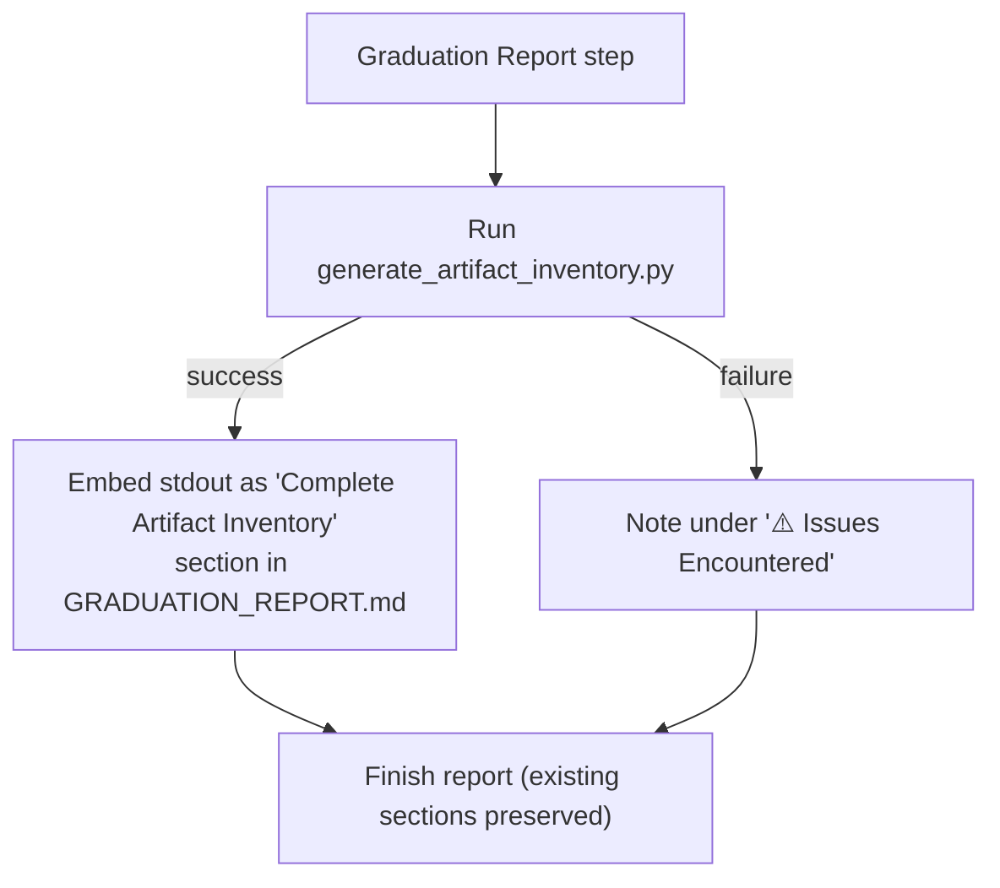

# Design Document: Graduation Artifact Inventory

## Overview

This feature makes the "Complete Artifact Inventory" a standard, repeatable part of the
graduation report. Today `production/GRADUATION_REPORT.md` only enumerates the files copied
into `production/` during Step 1. This feature adds a section that lists **every** artifact
created for the bootcamper across all completed modules/phases — grouped by phase, each with a
short why-it-matters note and a carry-forward / leave-behind classification — derived from the
bootcamper's actual progress and the files present in their project.

The design follows the same pattern as the `graduation-certificate` feature:

1. **Python CLI script** (`senzing-bootcamp/scripts/generate_artifact_inventory.py`) — reads
   `config/bootcamp_progress.json`, scans the bootcamper's project against a known artifact
   catalog, and emits a Markdown "Complete Artifact Inventory" section to stdout (or a file).
2. **Steering edit** (`senzing-bootcamp/steering/graduation.md`) — the "Graduation Report" step
   runs the script and embeds its output into `GRADUATION_REPORT.md`, non-blocking.

The script follows project conventions: stdlib-only, `from __future__ import annotations`,
dataclass models, `argparse` CLI with `main(argv=None)`, exit code 0/1, Google-style docstrings.

The design prioritizes:
- **Derived, not hardcoded** — entries come from `modules_completed` + on-disk file existence,
  not a fixed list that ignores what was produced (Req 1.2, 2.3).
- **Reliable and non-blocking** — the script never crashes on bad input and always emits the
  inventory heading; the steering treats failures like the existing always-generate guarantee
  (Req 4.1–4.3).
- **Single source for the artifact catalog** — the in-code catalog mirrors
  `config/module-artifacts.yaml` (`produces` paths) and enriches it with why-it-matters notes
  and classifications; a guard test prevents drift.

## Architecture

```text
config/bootcamp_progress.json ──┐
                                ├─▶ load progress ─▶ resolve catalog ─▶ scan disk ─▶ group ─▶ render
ARTIFACT_CATALOG (in-code) ─────┘                                          │                    │
project files on disk ─────────────────────────────────────────────────────┘                  ▼
                                                                          stdout / --output: Markdown section
```

The script is a single-file CLI tool with a small pipeline:

1. **Load** — Parse `bootcamp_progress.json` for `modules_completed` (graceful degradation: if
   missing/malformed, treat as empty and flag the inventory as possibly incomplete).
2. **Resolve catalog** — Start from the static `ARTIFACT_CATALOG`. Each entry maps a path to
   a phase, an owning module (or `None` for bootcamp-wide records), a why-it-matters note, and a
   classification.
3. **Scan disk** — For each catalog entry, check existence under `--project-root`. Include only
   artifacts that actually exist (Req 1.3, 2.3). Directories count as present when they exist and
   contain at least one file.
4. **Group** — Bucket present artifacts by phase, in canonical phase order (Req 2.1).
5. **Render** — Emit the `## Complete Artifact Inventory` section with one sub-section per
   non-empty phase group, each artifact rendered as `path` + why-it-matters note + classification.

### Steering integration (graduation.md)



The inventory section is placed **after** the existing files-generated / files-excluded tables and
**before** Next Steps, so it complements rather than duplicates or contradicts them (Req 1.4, 4.4).

## Components and Interfaces

### Catalog

```python
@dataclass(frozen=True)
class CatalogArtifact:
    """A known bootcamp artifact and its inventory metadata.

    Attributes:
        path: Project-relative path or directory the bootcamp produces.
        kind: "file" or "dir".
        phase: Phase grouping label for the inventory.
        module: Owning module number, or None for bootcamp-wide records.
        classification: "carry-forward" or "leave-behind".
        why_it_matters: Short note on the artifact's purpose and ongoing use.
    """
    path: str
    kind: str
    phase: str
    module: int | None
    classification: str
    why_it_matters: str
```

`PHASE_ORDER: list[str]` defines canonical phase ordering. `ARTIFACT_CATALOG: list[CatalogArtifact]`
is the static catalog. Representative entries (full catalog lives in the script):

| Path | Phase | Module | Class | Why it matters (abbreviated) |
|---|---|---|---|---|
| `docs/business_problem.md` | Discovery & Data Collection | 1 | carry-forward | Defines the ER problem and scope you set out to solve. |
| `config/data_sources.yaml` | Discovery & Data Collection | 1 | carry-forward | Registry of sources you resolve; drives mapping and loading. |
| `data/raw/` | Discovery & Data Collection | 4 | leave-behind | Unprocessed source data; bootcamp input, excluded from production. |
| `database/G2C.db` | Setup & Verification | 2 | leave-behind | SQLite eval database; replace with a production datastore. |
| `config/engine_config.json` | Setup & Verification | 2 | carry-forward | Senzing engine config; repoint at production DB/license. |
| `config/bootcamp_preferences.yaml` | Setup & Verification | 2 | leave-behind | Records your language/style choices; bootcamp-only. |
| `src/system_verification/` | Setup & Verification | 3 | carry-forward | Verification scripts + web service scaffolding; reusable checks. |
| `data/transformed/` | Mapping & Processing | 5 | carry-forward | Senzing-ready mapped data; copied into production. |
| `src/load/` | Mapping & Processing | 6 | carry-forward | Loading programs; production code. |
| `src/query/` | Querying & Visualization | 7 | carry-forward | Query programs and visualizations; production code. |
| `tests/performance/` | Production Readiness | 8 | carry-forward | Performance/benchmark tests. |
| `docs/security_checklist.md` | Production Readiness | 9 | carry-forward | Security assessment checklist to work through. |
| `monitoring/` | Production Readiness | 10 | leave-behind | Monitoring config; review before production. |
| `docs/deployment_plan.md` | Production Readiness | 11 | carry-forward | Deployment plan document. |
| `docs/bootcamp_recap.md` | Bootcamp Records | None | leave-behind | Narrative recap; your learning record. |
| `docs/bootcamp_journal.md` | Bootcamp Records | None | leave-behind | Module-by-module journal; learning record. |
| `config/bootcamp_progress.json` | Bootcamp Records | None | leave-behind | Tracks completed modules; bootcamp-only state. |
| `docs/completion_summary.md` | Bootcamp Records | None | leave-behind | Completion summary of the bootcamp. |
| `docs/graduation/graduation_certificate.md` | Bootcamp Records | None | leave-behind | Your graduation certificate keepsake. |

The catalog's module→path entries mirror `config/module-artifacts.yaml`. The `module=None`
"Bootcamp Records" entries are bootcamp-wide artifacts produced by completion/graduation flows,
not by a single module's `produces` block.

### Loaders

```python
def load_modules_completed(path: Path) -> tuple[list[int], bool]:
    """Read modules_completed from bootcamp_progress.json.

    Args:
        path: Path to the progress JSON file.

    Returns:
        (modules_completed, complete) where complete is False when the file is
        missing or unreadable (signals a possibly-incomplete inventory).
    """
    ...
```

### Resolution and scanning

```python
def artifact_exists(root: Path, art: CatalogArtifact) -> bool:
    """Return True when the artifact is present under root.

    Files must be regular files; directories must exist and be non-empty.
    """
    ...

def collect_present_artifacts(
    root: Path, catalog: list[CatalogArtifact]
) -> list[CatalogArtifact]:
    """Return catalog entries whose target exists on disk, preserving catalog order."""
    ...
```

Inclusion is **existence-based**: a present file is proof it was produced, satisfying Req 2.3 and
avoiding fabrication for incomplete modules (Req 2.2, 2.3). `modules_completed` is used to decide
whether to emit the optional "expected but not produced" note (see `--show-missing`) and never to
invent entries.

### Renderer

```python
def render_inventory(
    present: list[CatalogArtifact],
    *,
    progress_complete: bool,
    modules_completed: list[int],
    show_missing: bool,
) -> str:
    """Render the '## Complete Artifact Inventory' Markdown section.

    Groups present artifacts by phase in PHASE_ORDER, one sub-section per
    non-empty phase. Each artifact line includes its path, a why-it-matters
    note, and a (carry-forward) / (bootcamp record) tag. When progress_complete
    is False, prepends a note that the inventory may be incomplete.

    Returns:
        Markdown string that always begins with the section heading.
    """
    ...
```

Each artifact line is rendered consistently, e.g.:

```markdown
### Mapping & Processing
- `data/transformed/` — Senzing-ready mapped data; copied into production. _(carry-forward)_
- `src/load/` — Loading programs; production code. _(carry-forward)_
```

Carry-forward artifacts are tagged `_(carry-forward)_`; leave-behind/record artifacts are tagged
`_(bootcamp record)_` and their notes describe a learning/record purpose (Req 3.2, 3.3).

### CLI entry point

```python
def parse_args(argv: list[str] | None = None) -> argparse.Namespace:
    """Parse CLI arguments.

    Arguments:
        --progress-file: Path to progress JSON (default: config/bootcamp_progress.json)
        --project-root:  Root to scan for artifacts (default: .)
        --output:        Output file (default: stdout)
        --show-missing:  Note expected-but-absent artifacts of completed modules
    """
    ...

def main(argv: list[str] | None = None) -> int:
    """Entry point. Always emits the inventory section; returns 0 on success, 1 on error."""
    ...
```

## Data Models

```python
@dataclass(frozen=True)
class CatalogArtifact:
    path: str
    kind: str               # "file" | "dir"
    phase: str
    module: int | None
    classification: str     # "carry-forward" | "leave-behind"
    why_it_matters: str
```

`modules_completed: list[int]` and the boolean `progress_complete` flow through the pipeline as
plain values; no other persistent models are needed.

## Error Handling

| Condition | Behavior |
|---|---|
| `config/bootcamp_progress.json` missing | Treat `modules_completed` as empty, set `progress_complete=False`, render inventory of whatever files exist with an incompleteness note (Req 4.2) |
| Progress file malformed JSON | Same as missing — no crash (Req 4.2) |
| `--project-root` unreadable / a specific path errors during scan | Skip that artifact, continue; never abort the whole inventory (Req 4.3) |
| Catalog phase produces nothing on disk | Omit that phase group (no empty sections) |
| Any unexpected exception | Caught at top level in `main()`; print to stderr, exit 1 — the steering then records the issue and still finishes the report (Req 4.3) |
| Output file not writable | Print to stderr, exit 1 (steering falls back to noting the issue) |

## Steering File Integration

`senzing-bootcamp/steering/graduation.md` — the "Graduation Report" section gains an inventory
sub-step:

```markdown
Generate the Complete Artifact Inventory:
  Run `python3 senzing-bootcamp/scripts/generate_artifact_inventory.py`.
  Embed its output as a "Complete Artifact Inventory" section in GRADUATION_REPORT.md,
  placed after the files-excluded table and before Next Steps.
  This section is non-blocking: if the script fails, record it under
  "⚠️ Issues Encountered" and still produce the rest of the report.
  Do not duplicate or contradict the files-generated/files-excluded tables.
```

The existing report content (timestamp, track, modules finished, language, database type, the two
tables, next steps) is preserved (Req 1.4). `scripts/README.md` and
`docs/guides/SCRIPT_REFERENCE.md` gain a one-line entry for the new script.

## Testing Strategy

### PBT Applicability Assessment

This feature **is suitable for property-based testing**. Unlike the steering-only
`graduation-workflow` spec, the inventory logic is deterministic application code (catalog
resolution, existence-based filtering, grouping, rendering) with clear input/output properties.
The script half follows the `graduation-certificate` precedent and is tested with pytest +
Hypothesis. The steering integration is verified manually/by review.

**Unit tests** cover:
- Argument parsing defaults and overrides.
- `load_modules_completed` with valid / missing / malformed JSON.
- `artifact_exists` for files, empty dirs, non-empty dirs, and absent paths.
- Rendering format (heading present, phase sub-headings, classification tags).
- **Catalog drift guard**: every `path:` under `modules:` in `config/module-artifacts.yaml`
  appears in `ARTIFACT_CATALOG` (parsed by extracting `path:` lines, no PyYAML).

**Property-based tests** (Hypothesis, `@settings(max_examples=...)`) cover the properties below.
Strategies (`st_modules_completed()`, `st_present_paths()`, etc.) generate random completed-module
sets and random subsets of catalog paths materialized in a temp project root.

### Validation Checklist

- [ ] Script is stdlib-only with `main(argv=None)` and exit codes 0/1.
- [ ] Inventory always starts with the `## Complete Artifact Inventory` heading.
- [ ] Only on-disk artifacts are listed; absent ones are omitted.
- [ ] Every listed artifact has a path, a why-it-matters note, and a classification tag.
- [ ] Artifacts are grouped by phase in canonical order.
- [ ] Missing/malformed progress produces an inventory with an incompleteness note, not a crash.
- [ ] `graduation.md` runs the script and embeds output after the files tables, before Next Steps.
- [ ] Inventory step is non-blocking and recorded under "⚠️ Issues Encountered" on failure.
- [ ] `scripts/README.md` and `SCRIPT_REFERENCE.md` list the new script.

## Correctness Properties

*A property is a characteristic or behavior that should hold true across all valid executions of
a system — essentially, a formal statement about what the system should do.*

### Property 1: Only existing artifacts are listed

*For any* set of completed modules and any subset of catalog paths materialized on disk, the
rendered inventory SHALL list every materialized catalog artifact and SHALL NOT list any catalog
artifact whose path does not exist under the project root.

**Validates: Requirements 1.3, 2.3**

### Property 2: Every listed artifact is fully annotated

*For any* rendered inventory, every artifact line SHALL contain the artifact's path, a non-empty
why-it-matters note, and a classification tag.

**Validates: Requirements 3.1, 3.4**

### Property 3: Classification matches artifact role

*For any* listed artifact, an artifact whose catalog classification is `carry-forward` SHALL be
tagged as a carry-forward artifact, and an artifact whose classification is `leave-behind`
(e.g., `config/bootcamp_progress.json`, `docs/bootcamp_journal.md`) SHALL be tagged as a
learning/record artifact.

**Validates: Requirements 3.2, 3.3**

### Property 4: Artifacts are grouped by phase

*For any* rendered inventory with at least one present artifact, every listed artifact SHALL
appear under exactly one phase sub-heading, phase sub-headings SHALL appear in canonical
`PHASE_ORDER`, and no empty phase group SHALL be rendered.

**Validates: Requirements 2.1, 2.2**

### Property 5: No fabrication for incomplete modules

*For any* set of completed modules, the inventory SHALL contain no artifact that is absent from
disk, regardless of which modules are or are not completed; nothing is invented for modules that
were not completed.

**Validates: Requirements 2.2, 2.3**

### Property 6: Robust, non-blocking generation

*For any* progress-file content (valid, missing, malformed JSON, empty, or binary), `main()` SHALL
NOT raise an unhandled exception, SHALL always emit output beginning with the
`## Complete Artifact Inventory` heading, and SHALL include an incompleteness note when progress
data is missing or unreadable.

**Validates: Requirements 4.1, 4.2, 4.3**

### Property 7: Inventory never duplicates the production-subset tables

*For any* rendered inventory, the section SHALL be a standalone "Complete Artifact Inventory"
section and SHALL NOT itself emit the files-generated or files-excluded tables, so embedding it in
the report cannot duplicate or contradict those tables.

**Validates: Requirements 1.4, 4.4**
