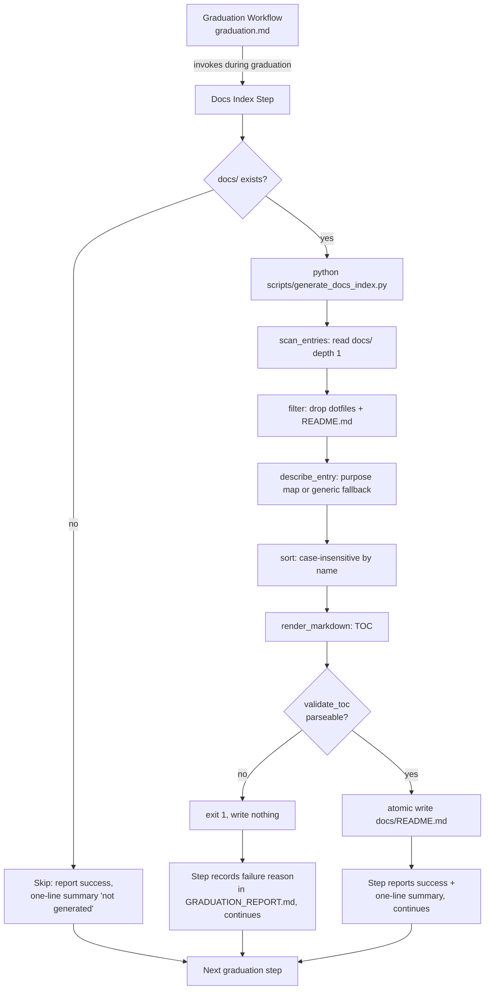

# Design Document

## Overview

This feature adds a non-blocking graduation step that generates `docs/README.md` — a Markdown table of contents describing every top-level file and immediate subdirectory under the bootcamper's `docs/` directory at graduation time. The index makes the documentation set self-describing for handoff: instead of opening files one by one, a reader (or a teammate the bootcamper shares the project with) sees a single page naming each artifact with a one-line purpose.

The work has two parts:

1. **Generator rework** — A standard-library Python script under `senzing-bootcamp/scripts/` that enumerates the *actual* top-level contents of `docs/` (depth 1 only), describes each entry, and writes a deterministic, fully regenerated `docs/README.md`. A generator named `generate_docs_index.py` already exists from the earlier `docs-file-placement` bugfix, but its semantics differ from this feature's requirements (it walks recursively, indexes Markdown files only, groups nested files by subdirectory, and derives descriptions from file headings). This feature reworks that generator to match the new requirements: depth-1 enumeration of *all* entries, subdirectories as single non-recursive entries, dot-entry exclusion, a predefined purpose map with a generic fallback, a visual indicator that distinguishes subdirectories from files, case-insensitive deterministic ordering, and atomic writes that never leave a malformed file. The existing test module is updated to match the new behavior.

2. **Graduation integration** — A new step in `senzing-bootcamp/steering/graduation.md` that invokes the generator, follows the same non-blocking contract as the existing recap-PDF and transcript steps (a failure logs a warning and graduation continues, recording the reason in `production/GRADUATION_REPORT.md`), skips cleanly with a success status when `docs/` is absent, and reports a one-line summary on completion.

### Design Decisions and Rationale

- **Rework the existing generator rather than add a second script.** Two scripts both writing `docs/README.md` with conflicting semantics would be a maintenance hazard and could produce contradictory output depending on which ran last. The earlier generator's deterministic-output and (newly added) atomic-write strengths are preserved while its enumeration and description semantics are replaced to satisfy Requirements 2 and 3. *Existing `docs-file-placement` tests that assert the old recursive/Markdown-only/grouped behavior are updated to assert the new behavior.*
- **Depth-1 enumeration only.** Requirement 2 is explicit that subdirectories are single entries and nested files are not enumerated separately. This keeps the index short and stable, and avoids the index churning whenever a subdirectory's internal contents change.
- **Predefined purpose map keyed by entry name, with a generic fallback.** Known bootcamp artifacts get curated one-line descriptions; anything unrecognized still gets a non-empty generic description (Requirement 3.3) so no entry is ever description-less. This keeps the index accurate as the artifact set evolves without failing on unknown names.
- **Atomic write + pre-write validation.** The rendered Markdown is validated as a parseable table of contents *before* it replaces any existing file, and the replace is atomic (temp file then `os.replace`). This satisfies Requirement 1.4 (never leave a partial or malformed `docs/README.md`).
- **Non-blocking, agent-orchestrated step.** Consistent with every other generation step in `graduation.md`, the workflow step interprets the script's exit code and output, records failures in the graduation report, and always proceeds.

## Architecture

The feature spans a steering-orchestrated workflow step and a pure-logic Python script. The script is deterministic and side-effecting only at the final atomic write; all enumeration, description, ordering, rendering, and validation are pure functions over the directory listing.



### Component responsibilities

- **Graduation workflow step (`graduation.md`)** — Orchestration only. Decides whether `docs/` exists, invokes the script, interprets exit code and stdout, emits the success message and one-line summary, and records any failure reason in the graduation report. It never halts graduation.
- **`generate_docs_index.py`** — All index logic: enumerate top-level entries, exclude the index file and dot-entries, describe each entry, sort deterministically, render Markdown, validate the rendered TOC, and atomically write `docs/README.md`. Pure functions are independently testable; the only I/O boundary is reading the directory listing and the final atomic write.

## Components and Interfaces

### `generate_docs_index.py` (reworked)

Standard-library only, following the project script pattern (shebang, module docstring, `from __future__ import annotations`, dataclasses, `argparse`, `main(argv=None)`, exit 0 success / 1 error).

```python
DEFAULT_DOCS_ROOT = Path("docs")
INDEX_FILENAME = "README.md"
MAX_DESCRIPTION_LEN = 120
SUBDIR_INDICATOR = "/"  # trailing slash appended to subdirectory entry names

@dataclass(frozen=True)
class DocsEntry:
    """A single top-level entry in the docs index."""
    name: str           # bare entry name as it appears in docs/ (e.g. "mapping" or "recap.md")
    is_dir: bool        # True for a subdirectory entry, False for a regular file
    description: str    # one-line purpose, 1..120 chars, never empty

def scan_entries(docs_root: Path) -> list[DocsEntry]:
    """Enumerate top-level (depth 1) entries under docs_root.

    Includes each regular file and each immediate subdirectory; excludes the
    index file itself, any dot-prefixed entry, and anything nested below depth 1.
    Returns entries sorted case-insensitively by name.
    """

def describe_entry(name: str, is_dir: bool) -> str:
    """Return a 1..120 char one-line purpose for an entry.

    Looks up a predefined description by entry name; falls back to a non-empty
    generic description when the name is unknown. Never returns an empty string.
    """

def render_markdown(entries: list[DocsEntry]) -> str:
    """Render entries as a deterministic Markdown table of contents.

    Subdirectory entries carry the visual indicator (trailing '/'); file entries
    do not. Output is terminated by a single trailing newline.
    """

def validate_toc(markdown: str, entries: list[DocsEntry]) -> bool:
    """Return whether rendered Markdown parses as a valid table of contents.

    Confirms every entry appears exactly once as a list item with exactly one
    single-line description of 1..120 chars, and that no extra entries appear.
    """

def generate_index(docs_root: Path) -> str:
    """Full pipeline: scan -> describe -> sort -> render. Returns Markdown."""

def write_index_atomically(docs_root: Path, markdown: str) -> Path:
    """Validate then atomically write docs/README.md (temp file + os.replace).

    Raises on validation failure or write failure without leaving a partial or
    malformed README.md in place.
    """

def main(argv: list[str] | None = None) -> int:
    """CLI entry. Exit 0 on success (including skip), 1 on error."""
```

**CLI surface**

| Argument | Default | Behavior |
|---|---|---|
| `--docs-root <dir>` | `docs` | Directory to index. |
| `--check` | off | Report drift without writing; exit non-zero when the on-disk index differs from a fresh generation. |

**Exit / output contract** (consumed by the graduation step):

- `docs/` missing or not a directory → print a one-line summary that the index was not generated, exit `0` (skip is a success, Requirement 4.2).
- Successful write → print `Wrote docs index: docs/README.md` (success message identifying the location) followed by the one-line summary (Requirement 4.4, 4.5).
- Validation or write failure → print the failure reason to stderr, exit `1`, leave no partial/malformed `docs/README.md` (Requirement 1.4).

### Predefined purpose map

A module-level dict maps known entry names to curated one-line purposes, e.g.:

| Entry name | Purpose (one line) |
|---|---|
| `bootcamp_recap.md` | Narrative recap of the completed bootcamp journey. |
| `bootcamp_journal.md` | Chronological journal of bootcamp work and decisions. |
| `completion_summary.md` | Summary of completion status and key outcomes. |
| `business_problem.md` | Statement of the business problem being solved. |
| `data_source_evaluation.md` | Evaluation notes for candidate data sources. |
| `mapping/` (dir) | Data source mapping artifacts. |
| `progress/` (dir) | Progress tracking and dashboards. |
| `visualizations/` (dir) | Generated charts and entity visualizations. |
| `reference/` (dir) | Reference material and specifications. |
| `feedback/` (dir) | Feedback templates and submissions. |

Names not in the map receive a generic non-empty description (for files: "Bootcamp documentation file."; for subdirectories: "Bootcamp documentation directory.") so Requirement 3.3 always holds. Subdirectory lookups are keyed by bare name; the visual indicator is applied during rendering, not stored in the map key.

### Graduation workflow step (`graduation.md`)

A new **Docs Index Generation** step is added, placed after the Q&A transcript generation (Step 0b.4) and before Step 1, alongside the other documentation-generation steps. It follows the established non-blocking pattern:

1. If `docs/` does not exist, report that the index was not generated and proceed (success — Requirement 4.2; 4.3 means no confirmation prompt when it does exist).
2. Otherwise run `python scripts/generate_docs_index.py`.
3. On exit 0 with a `Wrote docs index:` line, report `📑 Docs index generated at docs/README.md` then the one-line summary (Requirement 4.4, 4.5).
4. On any failure (exit 1, or success message present but the one-line summary cannot be reported — Requirement 4.6), record the failure reason in `production/GRADUATION_REPORT.md` under "⚠️ Issues Encountered" and proceed (Requirement 4.1).

## Data Models

**`DocsEntry`** — the in-memory representation of one indexed entry.

| Field | Type | Constraints |
|---|---|---|
| `name` | `str` | Bare entry name as listed in `docs/`; never starts with `.`; never equals `README.md`. |
| `is_dir` | `bool` | `True` → subdirectory (rendered with the visual indicator), `False` → regular file. |
| `description` | `str` | One line (no newlines), length 1–120 inclusive, never empty. |

**Enumeration domain** — the set of indexable entries for a given `docs/` directory is exactly:

```
{ e in listdir(docs/) :
    e is a regular file or an immediate subdirectory (depth 1)
    AND not e.name.startswith('.')
    AND e.name != 'README.md' }
```

ordered by `name.lower()` (ties broken by `name`), producing a total deterministic order.

**Rendered document** — Markdown beginning with a top-level heading, followed by one list item per entry. Each list item contains the entry name (with trailing `/` for subdirectories) and exactly one single-line description. Example shape:

```markdown
# Documentation Index

- **bootcamp_recap.md** — Narrative recap of the completed bootcamp journey.
- **feedback/** — Feedback templates and submissions.
- **mapping/** — Data source mapping artifacts.
```

## Correctness Properties

*A property is a characteristic or behavior that should hold true across all valid executions of a system — essentially, a formal statement about what the system should do. Properties serve as the bridge between human-readable specifications and machine-verifiable correctness guarantees.*

The properties below are derived from the prework analysis. Several acceptance criteria were consolidated: the enumeration rules (2.1–2.5) collapse into one completeness/soundness property; the exclusion rules (2.6, 2.8) into one; and the description rules (3.1, 3.3) into one well-formedness property. Workflow-orchestration criteria (4.1, 4.3, 4.6) are non-blocking behaviors verified by reviewing the `graduation.md` step rather than by property tests, and several concrete output/location criteria (1.1, 4.2, 4.4, 4.5) are covered by example unit tests in the Testing Strategy.

### Property 1: Enumeration matches the eligible top-level entries

*For any* `docs/` directory tree, the set of entry names produced by the generator equals exactly the set of eligible top-level entries — every depth-1 regular file and every immediate subdirectory (each subdirectory counted exactly once, with its contents not recursed into and never listed as separate entries).

**Validates: Requirements 2.1, 2.2, 2.3, 2.4, 2.5**

### Property 2: The index file and dot-prefixed entries are always excluded

*For any* `docs/` directory tree — including one that already contains a `docs/README.md` and arbitrary dot-prefixed files or directories — no entry whose name is `README.md` and no entry whose name begins with `.` ever appears in the generated index.

**Validates: Requirements 2.6, 2.8**

### Property 3: Entry order is deterministic and case-insensitive

*For any* `docs/` directory tree, the entries are listed in case-insensitive alphabetical order by name, and regenerating the index from identical `docs/` contents (regardless of filesystem iteration or creation order) produces byte-identical output.

**Validates: Requirements 2.7**

### Property 4: Regeneration fully replaces prior content and is idempotent

*For any* `docs/` directory tree and *any* pre-existing `docs/README.md` content, after generation the file content equals a fresh `generate_index(docs_root)` (so no content unique to the prior file survives), and generating a second time produces byte-identical output.

**Validates: Requirements 1.2**

### Property 5: Rendered index round-trips as a valid Markdown table of contents

*For any* `docs/` directory tree, the rendered Markdown parses as a table of contents whose listed entries are exactly the enumerated entries — parsing the rendered output back into a set of entry names returns the same set that was rendered, and `validate_toc` accepts the rendered output.

**Validates: Requirements 1.3, 1.4**

### Property 6: Every entry has exactly one well-formed description

*For any* `docs/` directory tree, every listed entry shows its name together with exactly one purpose description rendered on a single line of 1 to 120 characters — including entries with names that have no predefined purpose, which receive a non-empty generic description within the same bounds.

**Validates: Requirements 3.1, 3.3**

### Property 7: Subdirectories carry a visual indicator that files never carry

*For any* `docs/` directory tree, every subdirectory entry renders with the consistent visual indicator (a trailing `/`) and every file entry renders without it, so each entry is unambiguously identifiable as a file or a subdirectory.

**Validates: Requirements 3.2**

## Error Handling

The generator and the graduation step together ensure that index generation is reliable and non-blocking.

- **Missing or non-directory `docs/`** (Requirement 4.2): `scan`/`main` detect that `docs/` does not exist or is not a directory, print a one-line summary that the index was not generated, and exit `0`. Skipping is a success — graduation proceeds with no error and no confirmation prompt (Requirement 4.3).
- **Invalid/unparseable Markdown** (Requirement 1.4): `write_index_atomically` calls `validate_toc` on the rendered Markdown *before* touching the existing file. If validation fails, it raises, `main` prints the reason to stderr and exits `1`, and no `docs/README.md` is written or modified.
- **Atomic write** (Requirement 1.4): the validated Markdown is written to a temporary file in the docs directory and then moved into place with `os.replace`, which is atomic on a single filesystem. A failure mid-write leaves any existing `docs/README.md` untouched and removes the temp file; the result is never partial or malformed.
- **Unreadable directory / OS errors**: I/O errors during enumeration or write are caught, reported as the failure reason, and surfaced as exit `1` so the workflow step can record them.
- **Workflow-level non-blocking contract** (Requirements 4.1, 4.6): the graduation step interprets the script's exit code and output. On any failure — non-zero exit, or a generated index whose one-line summary cannot be reported — it records the failure reason in `production/GRADUATION_REPORT.md` under "⚠️ Issues Encountered" and proceeds to the next step. Graduation is never halted by this step.

## Testing Strategy

Testing uses the project's standard stack: **pytest** for unit/example tests and **Hypothesis** for property-based tests, following `python-conventions.md`. Tests live in `senzing-bootcamp/tests/test_generate_docs_index.py`, importing the script via the documented `sys.path` insertion. The existing `docs-file-placement` tests in that module are updated to assert the new depth-1 / all-entries / purpose-map behavior.

### Property-based tests

PBT is appropriate here because the core of the feature is a pure transformation from a directory listing to a Markdown document, with universal invariants (completeness, exclusion, ordering, round-trip, well-formedness). Each property from the Correctness Properties section is implemented as a **single** Hypothesis property test.

- Use a Hypothesis strategy that builds a temporary `docs/` tree: a set of top-level file names and subdirectory names (mixing known purpose-map names, unknown random names, dot-prefixed names, an optional pre-existing `README.md`, and varied casing), with subdirectories optionally populated with nested files. Materialize the tree under a `tmp_path`, run the generator, and assert the property.
- Example counts come from the active Hypothesis profile baseline (`fast`=10 locally, `thorough`=100 in CI); do **not** hand-set `@settings(max_examples=...)` to restate the baseline. The thorough profile satisfies the ≥100-iteration expectation in CI.
- Strategies are prefixed `st_` (e.g. `st_docs_tree()`), and each property test is tagged with a comment in the form **Feature: graduation-docs-index, Property {number}: {property_text}** and documents the requirements it validates.

| Property | Test focus |
|---|---|
| Property 1 | Enumerated entry-name set equals the eligible depth-1 set; nested files never appear; each subdir appears once. |
| Property 2 | `README.md` and dot-prefixed entries never appear, even when present on disk. |
| Property 3 | Order equals `sorted(names, key=str.lower)`; identical contents produce byte-identical output. |
| Property 4 | Output over arbitrary stale `README.md` equals fresh generation; second run is byte-identical. |
| Property 5 | Parse(render(tree)) entry set == rendered entry set; `validate_toc` accepts the output. |
| Property 6 | Every entry (known and unknown names) has exactly one single-line description, length 1–120. |
| Property 7 | Every subdir entry has the trailing-`/` indicator; no file entry does. |

### Unit / example tests

Concrete scenarios and the orchestration-output contract are covered with example-based tests:

- **Output location** (Requirement 1.1): generating over a populated `docs/` writes `docs/README.md` at the docs root.
- **Skip when `docs/` is absent** (Requirement 4.2): `main` with a non-existent `--docs-root` exits `0` and prints a "not generated" summary.
- **Success output ordering** (Requirements 4.4, 4.5): on success, stdout contains the success message naming `docs/README.md` before the one-line summary.
- **No partial file on validation failure** (Requirement 1.4): with `validate_toc` forced to reject (or a simulated write failure), assert any pre-existing `docs/README.md` is unchanged and no temp/malformed file remains.
- **`--check` drift detection**: in-sync index exits `0`; stale or missing index exits `1`.

### Workflow review (not automated tests)

Requirements 4.1, 4.3, and 4.6 describe agent-orchestrated, non-blocking behavior in `graduation.md`. These are verified by reviewing the new step's wording against the established non-blocking pattern (warn-and-continue, record the reason in `GRADUATION_REPORT.md`, no confirmation prompt when `docs/` exists), consistent with how the recap-PDF and transcript steps are specified.
