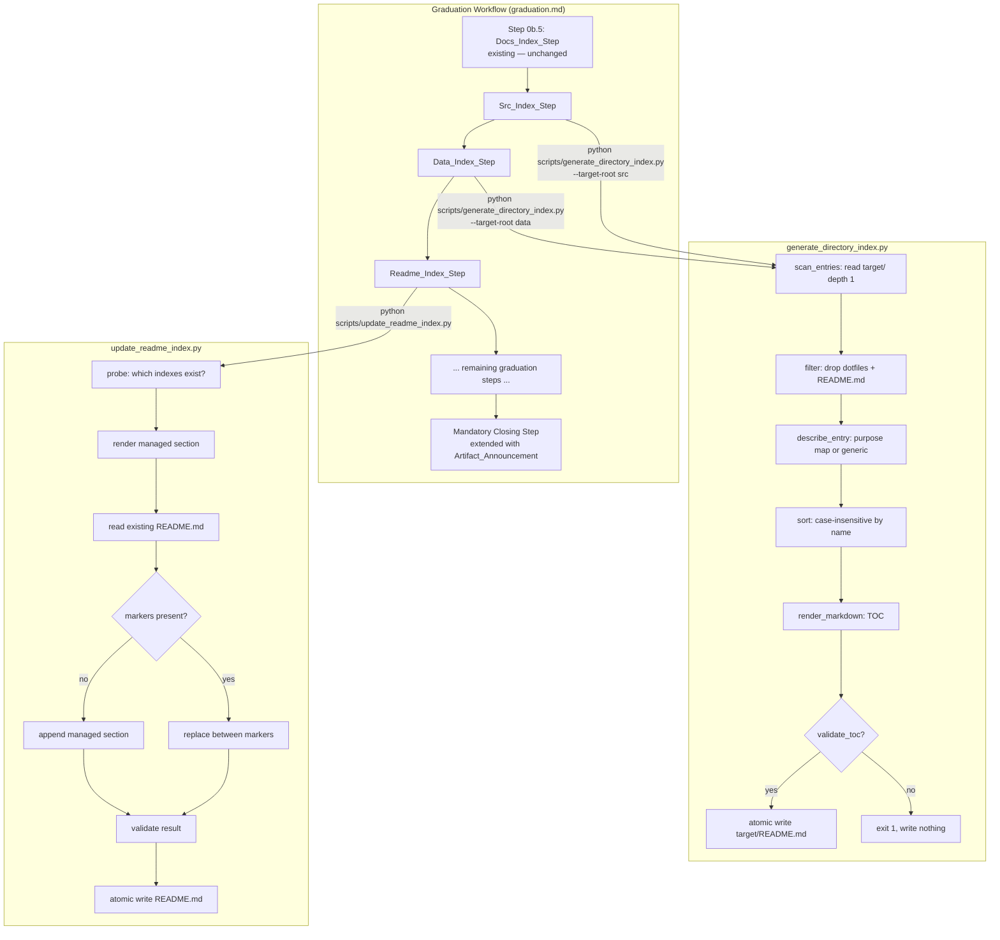

# Design Document

## Overview

This feature enriches the graduation workflow with navigable, shareable project documentation by adding four new capabilities:

1. **Source and data directory indexes** — A shared `generate_directory_index.py` script under `senzing-bootcamp/scripts/` that generates `src/README.md` or `data/README.md` (selected via `--target-root`) as a deterministic, depth-1 Markdown table of contents. It mirrors the architecture of the existing `generate_docs_index.py`: enumerate actual disk contents, describe each entry with a purpose map or generic fallback, sort case-insensitively, validate, and write atomically. A single script serves both directories because the enumeration/render logic is identical — only the purpose map and target path differ.

2. **Top-level README managed-section update** — A separate `update_readme_index.py` script that inserts or replaces a managed section in the top-level `README.md`, linking to whichever per-directory indexes (`docs/README.md`, `src/README.md`, `data/README.md`) exist at run time. It preserves all README content outside the managed section's HTML-comment markers. This is a separate script because its behavior (scoped in-place edit preserving surrounding content) is fundamentally different from full-file replacement.

3. **Graduation step integration** — New non-blocking steps in `senzing-bootcamp/steering/graduation.md` (Src_Index_Step, Data_Index_Step, Readme_Index_Step) ordered after the existing Docs_Index_Step so that the top-level README references indexes that already exist, plus an Artifact_Announcement_Step extension to the mandatory closing step.

4. **Artifact announcement** — An extension to the existing mandatory closing announcement that names the consolidated recap, recap PDF, per-directory indexes, and updated top-level README — reporting only artifacts confirmed to exist.

### Design Decisions and Rationale

- **One shared `generate_directory_index.py` parameterized by `--target-root`** rather than two separate scripts. The `src/` and `data/` generators share identical enumeration, rendering, and validation logic — only the purpose map differs. A `--target-root` argument selects the directory (and implicitly the purpose-map subset), mirroring how `generate_docs_index.py` accepts `--docs-root`. This eliminates code duplication and keeps the test surface unified.

- **A separate `update_readme_index.py` for the managed-section update.** The managed-section script must locate markers, preserve surrounding content, and do an in-place scoped edit — fundamentally different from the "scan directory → render full file" pattern of the index generators. Merging them would complicate both.

- **HTML-comment markers: `<!-- BEGIN GENERATED: bootcamp-index -->` / `<!-- END GENERATED: bootcamp-index -->`** — invisible in rendered Markdown, stable across regenerations, consistent with the project's existing `<!-- BEGIN GENERATED: example-coverage -->` pattern used by the coverage report.

- **Step ordering: Docs_Index_Step (existing) → Src_Index_Step → Data_Index_Step → Readme_Index_Step → ... → Artifact_Announcement_Step.** The top-level README step runs after all per-directory indexes exist so it can probe for their existence. The announcement runs last so it can confirm what was produced.

- **The Artifact_Announcement_Step extends the existing "Mandatory Closing Step"** rather than adding a new final step. This keeps the one-announcement contract and avoids a competing close.

- **Requirement 7 (recap PDF polish) adds no new scripts.** It sets presentation expectations on the recap PDF generation already handled by `guaranteed-graduation-artifacts` and `graduation-recap-pdf-resilience`. The design documents the expectation but delegates implementation.

## Architecture

The feature spans two Python scripts (pure logic + CLI), steering-file changes (workflow orchestration), and the top-level README integration.



### Component Responsibilities

| Component | Responsibility |
|-----------|---------------|
| `generate_directory_index.py` | All index logic for `src/` and `data/`: enumerate, filter, describe, sort, render, validate, atomic-write. Pure functions are independently testable; I/O is limited to reading the directory listing and the final atomic write. |
| `update_readme_index.py` | Managed-section logic: probe which per-directory indexes exist, render the section, locate/replace/append markers in the top-level README, validate CommonMark structure, atomic-write. |
| Graduation steps (steering) | Orchestration only: invoke scripts, interpret exit codes and stdout, emit user-facing messages, record failures in graduation report. Never halt graduation. |
| Artifact_Announcement (steering) | Confirm artifact existence, emit one-time announcement listing locations. |

## Components and Interfaces

### `generate_directory_index.py`

Standard-library only, following the project script pattern (shebang, module docstring, `from __future__ import annotations`, dataclasses, `argparse`, `main(argv=None)`, exit 0/1).

```python
#!/usr/bin/env python3
"""Generate a deterministic README.md index for a project directory (src/ or data/).

Enumerates the actual top-level contents of the target directory (depth 1 only):
every regular file and every immediate subdirectory, each as a single entry.
Dot-prefixed entries and the README.md index file itself are excluded. Each entry
gets a one-line purpose synopsis from a predefined purpose map, falling back to a
non-empty generic synopsis for unknown names. Entries are ordered
case-insensitively by name and rendered as a Markdown table of contents.

Usage:
    python3 generate_directory_index.py --target-root src
    python3 generate_directory_index.py --target-root data
    python3 generate_directory_index.py --target-root src --check
"""

from __future__ import annotations

import argparse
import os
import re
import sys
import tempfile
from dataclasses import dataclass
from pathlib import Path

INDEX_FILENAME = "README.md"
MAX_DESCRIPTION_LEN = 120
SUBDIR_INDICATOR = "/"

@dataclass(frozen=True)
class DirEntry:
    """A single top-level entry in the directory index.

    Attributes:
        name: Bare entry name (e.g. "transform" or "loader.py"); never
            starts with '.' and never equals "README.md".
        is_dir: True for a subdirectory, False for a regular file.
        description: One-line synopsis, 1..120 chars, never empty.
    """
    name: str
    is_dir: bool
    description: str

# Per-directory purpose maps
SRC_PURPOSE_MAP: dict[str, str] = {
    "transform": "Data transformation modules.",
    "load": "Entity loading modules.",
    "query": "Entity query and search modules.",
    "utils": "Shared utility functions.",
    "config": "Configuration management.",
    "quickstart_demo": "Quickstart demonstration code.",
    "main.py": "Application entry point.",
    "setup.py": "Package setup configuration.",
}

DATA_PURPOSE_MAP: dict[str, str] = {
    "raw": "Original unprocessed source files.",
    "transformed": "Cleaned and mapped data ready for loading.",
    "samples": "Sample data for testing and demonstration.",
    "output": "Generated output and reports.",
    "mappings": "Data source mapping configurations.",
}

GENERIC_FILE_DESCRIPTION = "Project file."
GENERIC_DIR_DESCRIPTION = "Project directory."

TOC_HEADING = "# Directory Index"

def scan_entries(target_root: Path) -> list[DirEntry]: ...
def describe_entry(name: str, is_dir: bool, purpose_map: dict[str, str]) -> str: ...
def render_markdown(entries: list[DirEntry]) -> str: ...
def validate_toc(markdown: str, entries: list[DirEntry]) -> bool: ...
def generate_index(target_root: Path, purpose_map: dict[str, str]) -> str: ...
def write_index_atomically(target_root: Path, markdown: str, purpose_map: dict[str, str]) -> Path: ...
def select_purpose_map(target_root: Path) -> dict[str, str]: ...
def main(argv: list[str] | None = None) -> int: ...
```

**CLI surface**

| Argument | Default | Behavior |
|----------|---------|----------|
| `--target-root <dir>` | (required) | Directory to index (`src` or `data`). |
| `--check` | off | Report drift without writing; exit non-zero when the on-disk index differs from a fresh generation. |

**Exit / output contract** (consumed by the graduation step):

- Target directory missing or not a directory → print one-line "not generated" summary, exit `0` (skip is success).
- Successful write → print `Wrote directory index: <path>` then one-line summary, exit `0`.
- Validation or write failure → print reason to stderr, exit `1`, leave no partial/malformed file.

**Purpose map selection**: `select_purpose_map` inspects the final component of the target-root path (`src` → `SRC_PURPOSE_MAP`, `data` → `DATA_PURPOSE_MAP`) and falls back to an empty map for unknown directories. The generic fallback descriptions ensure every entry always gets a non-empty synopsis regardless.

### `update_readme_index.py`

```python
#!/usr/bin/env python3
"""Update the top-level README.md with a managed index section.

Inserts or replaces a managed section bounded by HTML-comment markers that links
to the per-directory indexes (docs/README.md, src/README.md, data/README.md).
Only indexes confirmed to exist at their paths are included. Content outside the
markers is never modified.

Usage:
    python3 update_readme_index.py
    python3 update_readme_index.py --readme README.md --project-root .
    python3 update_readme_index.py --check
"""

from __future__ import annotations

import argparse
import os
import sys
import tempfile
from dataclasses import dataclass
from pathlib import Path

BEGIN_MARKER = "<!-- BEGIN GENERATED: bootcamp-index -->"
END_MARKER = "<!-- END GENERATED: bootcamp-index -->"

@dataclass(frozen=True)
class IndexRef:
    """A reference to a per-directory index in the managed section.

    Attributes:
        path: Relative path to the index file (e.g. "docs/README.md").
        description: One-line synopsis, 1..120 chars.
        exists: Whether the index file exists at probe time.
    """
    path: str
    description: str
    exists: bool

# Fixed references with their synopses
INDEX_REFS: list[tuple[str, str]] = [
    ("docs/README.md", "Documentation index — bootcamp artifacts, guides, and references."),
    ("src/README.md", "Source code index — modules, utilities, and application entry points."),
    ("data/README.md", "Data index — raw sources, transformations, and output files."),
]

def probe_indexes(project_root: Path) -> list[IndexRef]: ...
def render_managed_section(refs: list[IndexRef]) -> str: ...
def update_readme(readme_path: Path, managed_section: str) -> str: ...
def write_readme_atomically(readme_path: Path, content: str) -> None: ...
def main(argv: list[str] | None = None) -> int: ...
```

**CLI surface**

| Argument | Default | Behavior |
|----------|---------|----------|
| `--readme <path>` | `README.md` | Path to the top-level README. |
| `--project-root <dir>` | `.` | Root directory for probing per-directory indexes. |
| `--check` | off | Report drift without writing; exit non-zero when the on-disk README differs from a freshly generated one. |

**Exit / output contract**:

- Successful write → print `Updated README index: <path>` then one-line summary, exit `0`.
- README created (didn't exist) → print `Created README index: <path>`, exit `0`.
- Validation or write failure → print reason to stderr, exit `1`, leave original untouched.
- `--check` in sync → print "in sync", exit `0`.
- `--check` out of sync → print "out of sync" to stderr, exit `1`.

**Managed section rendering**: The rendered section has this shape:

```markdown
<!-- BEGIN GENERATED: bootcamp-index -->

## Project Index

- **[docs/README.md](docs/README.md)** — Documentation index — bootcamp artifacts, guides, and references.
- **[src/README.md](src/README.md)** — Source code index — modules, utilities, and application entry points.
- **[data/README.md](data/README.md)** — Data index — raw sources, transformations, and output files.

<!-- END GENERATED: bootcamp-index -->
```

Only entries whose index files exist at probe time are included. If no indexes exist, the section contains only the markers and heading with an empty list.

**Scoped-write algorithm**:

1. Read existing README content (or start with empty string if file doesn't exist).
2. If both markers are present: replace everything between them (exclusive of markers themselves) with the new managed-section body.
3. If markers are absent: append a newline + the full managed section (markers included) to the end.
4. Validate: the result contains exactly one begin marker and one end marker, begin precedes end.
5. Atomic write (tempfile + `os.replace`).

### Graduation Workflow Steps (steering changes)

**Step 0b.6: Src Index Generation** (new, after Step 0b.5 Docs Index)

Follows the identical non-blocking pattern as Step 0b.5:
1. If `src/` does not exist → report "📑 Source index not generated — no `src/` directory." and proceed.
2. Otherwise run `python senzing-bootcamp/scripts/run_bundled_script.py generate_directory_index.py --target-root src`.
3. On success → "📑 Source index generated at `src/README.md`." + one-line summary.
4. On failure → record in GRADUATION_REPORT.md, proceed.

**Step 0b.7: Data Index Generation** (new, after Src Index)

Same pattern with `--target-root data`.

**Step 0b.8: README Index Update** (new, after Data Index)

1. Run `python senzing-bootcamp/scripts/run_bundled_script.py update_readme_index.py`.
2. On success → "📑 Top-level README updated with project index."
3. On failure → record, proceed.

**Artifact_Announcement_Step** (extends existing Mandatory Closing Step):

After the enforced recap guarantee runs, and after the announcement of recap/transcript, add:
- Names `src/README.md`, `data/README.md`, `docs/README.md`, and the top-level `README.md` — but only those confirmed to exist.
- Names the consolidated recap at `docs/bootcamp_recap.md` (the single per-module recap + journal).
- Names the rendered recap (`docs/bootcamp_recap.pdf` or `.html`).
- Emitted exactly once as part of the existing closing announcement block.

## Data Models

### `DirEntry` (generate_directory_index.py)

| Field | Type | Constraints |
|-------|------|-------------|
| `name` | `str` | Bare entry name; never starts with `.`; never equals `README.md`. |
| `is_dir` | `bool` | `True` → subdirectory (rendered with trailing `/`), `False` → regular file. |
| `description` | `str` | One line, 1–120 chars inclusive, never empty. |

### `IndexRef` (update_readme_index.py)

| Field | Type | Constraints |
|-------|------|-------------|
| `path` | `str` | Relative path to per-directory index (e.g. `docs/README.md`). |
| `description` | `str` | One-line synopsis, 1–120 chars, never empty. |
| `exists` | `bool` | Whether the index file was confirmed to exist at probe time. |

### Enumeration domain

For `generate_directory_index.py`, the eligible entry set for a target directory is:

```
{ e in listdir(target_root/) :
    e is a regular file or an immediate subdirectory (depth 1)
    AND not e.name.startswith('.')
    AND e.name != 'README.md' }
```

ordered by `name.lower()` (ties broken by `name`), producing a total deterministic order.

### Managed section structure

```
<!-- BEGIN GENERATED: bootcamp-index -->
\n
## Project Index
\n
- **[<path>](<path>)** — <synopsis>
...
\n
<!-- END GENERATED: bootcamp-index -->
```

Only entries with `exists=True` appear as list items.

## Correctness Properties

*A property is a characteristic or behavior that should hold true across all valid executions of a system — essentially, a formal statement about what the system should do. Properties serve as the bridge between human-readable specifications and machine-verifiable correctness guarantees.*

The properties below cover both scripts. Properties 1–7 target `generate_directory_index.py` (directly mirroring the proven `graduation-docs-index` properties since the scripts share the same algorithmic structure). Properties 8–10 target `update_readme_index.py`.

### Property 1: Enumeration matches the eligible top-level entries

*For any* target directory tree, the set of entry names produced by the generator equals exactly the set of eligible top-level entries — every depth-1 regular file and every immediate subdirectory (each subdirectory counted exactly once, with its contents not recursed into and never listed as separate entries).

**Validates: Requirements 2.1, 2.2, 2.3, 2.4, 2.5**

### Property 2: The index file and dot-prefixed entries are always excluded

*For any* target directory tree — including one that already contains a `README.md` and arbitrary dot-prefixed files or directories — no entry whose name is `README.md` and no entry whose name begins with `.` ever appears in the generated index.

**Validates: Requirements 2.6, 2.8**

### Property 3: Entry order is deterministic and case-insensitive

*For any* target directory tree, the entries are listed in case-insensitive alphabetical order by name, and regenerating the index from identical target directory contents (regardless of filesystem iteration or creation order) produces byte-identical output.

**Validates: Requirements 2.7, 1.5**

### Property 4: Regeneration fully replaces prior content and is idempotent

*For any* target directory tree and *any* pre-existing `README.md` content, after generation the file content equals a fresh `generate_index(target_root)` (so no content unique to the prior file survives), and generating a second time produces byte-identical output.

**Validates: Requirements 1.3, 1.5**

### Property 5: Rendered index round-trips as a valid Markdown table of contents

*For any* target directory tree, the rendered Markdown parses as a table of contents whose listed entries are exactly the enumerated entries — parsing the rendered output back into a set of entry names returns the same set that was rendered, and `validate_toc` accepts the rendered output.

**Validates: Requirements 1.4, 1.6**

### Property 6: Every entry has exactly one well-formed description

*For any* target directory tree, every listed entry shows its name together with exactly one synopsis rendered on a single line of 1 to 120 characters — including entries with names that have no predefined purpose, which receive a non-empty generic synopsis within the same bounds.

**Validates: Requirements 3.1, 3.3**

### Property 7: Subdirectories carry a visual indicator that files never carry

*For any* target directory tree, every subdirectory entry renders with the consistent visual indicator (a trailing `/`) and every file entry renders without it, so each entry is unambiguously identifiable as a file or a subdirectory.

**Validates: Requirements 3.2**

### Property 8: Managed section lists exactly the existing per-directory indexes

*For any* combination of existing and non-existing per-directory index files (`docs/README.md`, `src/README.md`, `data/README.md`), the managed section in the top-level README contains an entry for each index that exists and omits entries for indexes that do not exist, with each included entry accompanied by a synopsis of 1 to 120 characters.

**Validates: Requirements 5.1, 5.2, 5.8**

### Property 9: Content outside markers is preserved (scoped-write)

*For any* pre-existing top-level README content — whether it already contains a managed section (markers present) or not (markers absent) — all content outside the managed section's begin and end markers is byte-identical after the update. When markers are absent, the pre-existing content appears unchanged as a prefix of the result with the managed section appended.

**Validates: Requirements 5.3, 5.4, 5.5**

### Property 10: README update is idempotent

*For any* state where the per-directory indexes and the managed section are unchanged between two consecutive runs, the `update_readme_index.py` script produces a byte-identical `README.md` on the second run.

**Validates: Requirements 5.7**

## Error Handling

Both scripts and the graduation steps follow the same non-blocking, atomic-write error model established by `generate_docs_index.py`:

### `generate_directory_index.py`

- **Missing or non-directory target root** (Req 4.2): `main` detects that the target does not exist or is not a directory, prints a one-line summary ("not generated"), exits `0`. Skipping is a success.
- **Invalid rendered Markdown** (Req 1.6): `validate_toc` rejects the output before any file is touched. `main` prints the reason to stderr, exits `1`, no file is written.
- **Atomic write failure** (Req 1.6, 10.4): validated Markdown is written to a temp file in the same directory and moved with `os.replace`. On failure mid-write, the temp file is removed, any existing `README.md` is untouched.
- **OS errors during scan**: caught, reported to stderr, exit `1`.

### `update_readme_index.py`

- **Missing README** (Req 5.6): the script creates a new `README.md` containing only the managed section.
- **Malformed markers** (e.g., begin without end, or end before begin): treated as "no valid managed section present" — appends a fresh managed section. On subsequent runs, the new markers are found and used.
- **Atomic write** (Req 5.9): same tempfile + `os.replace` pattern. Validation confirms exactly one begin marker preceding exactly one end marker in the result before writing.
- **Validation failure** (Req 5.9): original file is untouched, exit `1`.

### Graduation workflow (steering)

- **Non-blocking contract** (Req 4.1, 5.10, 9.4): each new step interprets the script's exit code. On any failure — non-zero exit, or unexpected output — it records the failure reason in `production/GRADUATION_REPORT.md` under "⚠️ Issues Encountered" and proceeds. Graduation is never halted by these steps.
- **No confirmation prompt** (Req 4.3): when the target directory exists, the step proceeds directly.
- **Announcement confirms existence** (Req 6.5): before naming an artifact, the announcement step confirms its path exists. Missing artifacts are silently omitted.

## Testing Strategy

Testing uses the project's standard stack: **pytest** for unit/example tests and **Hypothesis** for property-based tests, following `python-conventions.md`. Tests live in `senzing-bootcamp/tests/`, importing scripts via the documented `sys.path` insertion pattern. Test organization is class-based with strategies prefixed `st_`.

### Property-based tests

PBT is appropriate here because both scripts implement pure transformations from filesystem state to Markdown output, with universal invariants (completeness, exclusion, ordering, round-trip, well-formedness, scoped-write preservation). Each property from the Correctness Properties section is implemented as a single Hypothesis property test.

**Library**: Hypothesis (already in use for `test_generate_docs_index.py`).

**Configuration**: Example counts come from the active Hypothesis profile baseline (`fast`=5 locally, `thorough`=100 in CI); do not hand-set `@settings(max_examples=...)`. The thorough profile satisfies the ≥100-iteration requirement in CI.

**Tag format**: Each property test is tagged with a comment:
`Feature: graduation-enrichment, Property {number}: {property_text}`

#### `test_generate_directory_index.py`

Uses a Hypothesis strategy `st_target_tree()` that builds a temporary target directory: a set of top-level file names and subdirectory names (mixing known purpose-map names, unknown random names, dot-prefixed names, an optional pre-existing `README.md`, and varied casing), with subdirectories optionally populated with nested files.

| Property | Test focus |
|----------|-----------|
| Property 1 | Enumerated entry-name set equals the eligible depth-1 set; nested files never appear; each subdir once. |
| Property 2 | `README.md` and dot-prefixed entries never appear, even when present on disk. |
| Property 3 | Order equals `sorted(names, key=str.lower)`; identical contents produce byte-identical output. |
| Property 4 | Output over arbitrary stale `README.md` equals fresh generation; second run byte-identical. |
| Property 5 | Parse(render(tree)) entry set == rendered entry set; `validate_toc` accepts the output. |
| Property 6 | Every entry (known and unknown names) has exactly one single-line description, length 1–120. |
| Property 7 | Every subdir entry has the trailing-`/` indicator; no file entry does. |

#### `test_update_readme_index.py`

Uses Hypothesis strategies:
- `st_readme_content()` — generates arbitrary README Markdown content (with or without pre-existing markers).
- `st_index_existence()` — generates a boolean triple `(docs_exists, src_exists, data_exists)` to control which index files are materialized.

| Property | Test focus |
|----------|-----------|
| Property 8 | Managed section contains entries for exactly the indexes confirmed to exist; each has a 1–120 char synopsis; markers are present. |
| Property 9 | Content outside markers is byte-identical after update; when no markers existed, original is a prefix. |
| Property 10 | Running twice with unchanged state produces byte-identical output. |

### Unit / example tests

Concrete scenarios and CLI output contracts:

**`test_generate_directory_index.py`:**
- **Output location** (Req 1.1, 1.2): generating over populated `src/` and `data/` writes `README.md` at target root.
- **Skip when target absent** (Req 4.2): `main` with non-existent `--target-root` exits `0` with "not generated".
- **Success output ordering** (Req 4.4, 4.5): stdout has success message before one-line summary.
- **No partial file on validation failure** (Req 1.6): monkeypatch `validate_toc` to reject; verify original untouched and no temp files.
- **No partial file on write failure** (Req 10.4): monkeypatch `os.replace` to raise; verify original untouched.
- **`--check` drift detection** (Req 10.3): in-sync exits `0`; stale/missing exits `1`.
- **Purpose map selection**: `--target-root src` uses `SRC_PURPOSE_MAP`; `--target-root data` uses `DATA_PURPOSE_MAP`; unknown uses empty map.

**`test_update_readme_index.py`:**
- **Create when missing** (Req 5.6): no existing README → file created with managed section.
- **Append when no markers** (Req 5.5): existing content without markers → original preserved as prefix.
- **Replace between markers** (Req 5.4): existing managed section → only inner content replaced.
- **No partial file on failure** (Req 5.9): monkeypatch validation to reject; verify original untouched.
- **`--check` drift detection** (Req 10.3): in-sync exits `0`; out-of-sync exits `1`.
- **Omit missing indexes** (Req 5.8): only existing index files appear in managed section.

### Workflow review (not automated tests)

Requirements 4.1, 4.3, 5.10, 6.1–6.6, 7.1–7.4, 8.1–8.5, 9.1–9.4 describe agent-orchestrated, non-blocking behavior in `graduation.md`. These are verified by reviewing the new step wording against the established non-blocking pattern, consistent with how existing steps are specified.
