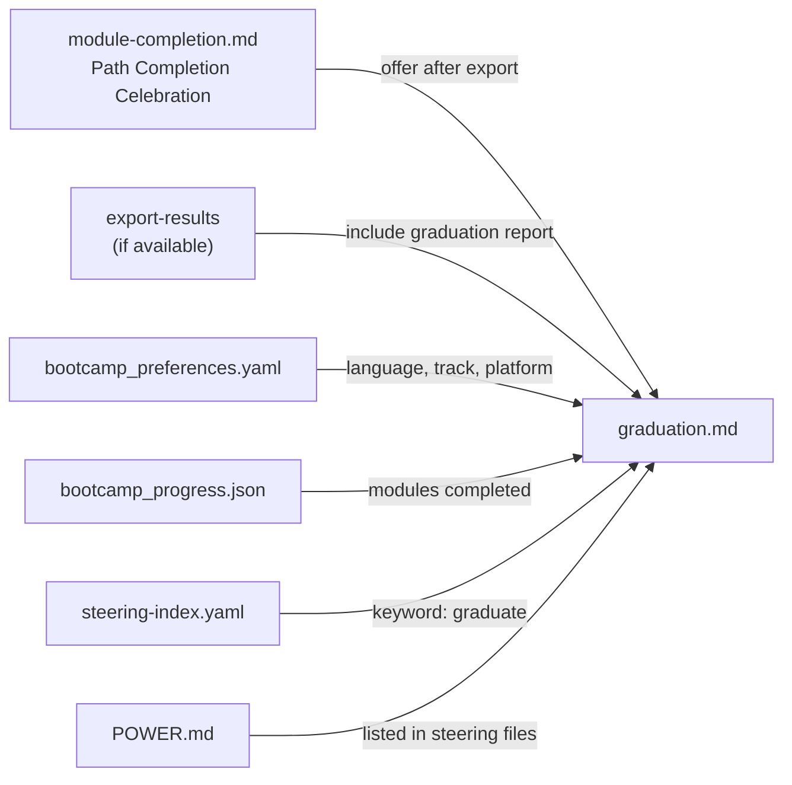

# Design Document: Graduation Workflow

## Overview

This feature adds `senzing-bootcamp/steering/graduation.md` — a manual-inclusion steering file that guides the agent through transitioning a bootcamp project into a production-ready codebase. The workflow triggers after track completion (integrated into `module-completion.md`) and walks the bootcamper through five sequential steps: generate a clean production project structure, create production configuration files, generate a production README, create a migration checklist, and optionally initialize a new git repository. A graduation report is generated at the end summarizing everything produced.

The design prioritizes:
- **Steering-file-driven**: No application code — the entire workflow is agent instructions in a steering file, consistent with `module-completion.md` and `lessons-learned.md`
- **Step-by-step confirmation**: Each step requires bootcamper approval before proceeding
- **Preference-aware**: Reads `config/bootcamp_preferences.yaml` and `config/bootcamp_progress.json` to tailor all generated artifacts to the bootcamper's language, database, track, and platform choices
- **Graceful degradation**: Missing preferences or progress data trigger sensible defaults with user prompts
- **Integration with existing flows**: Slots into the path completion celebration in `module-completion.md` and the export-results pipeline

## Architecture

### Steering File

```text
senzing-bootcamp/steering/
└── graduation.md    # Post-track graduation workflow (inclusion: manual)
```

Loaded manually by the agent when the bootcamper accepts the graduation offer at track completion, or when the bootcamper says "run graduation" or "graduate" at any time.

### Graduation Workflow Sequence

```mermaid
graph TD
    subgraph "Trigger"
        TC["Track Completion<br/>(module-completion.md)"]
        Manual["Manual trigger<br/>'run graduation' / 'graduate'"]
    end

    subgraph "Pre-checks"
        SkipCheck{"skip_graduation<br/>== true?"}
        Offer["🎓 Offer graduation workflow"]
        Accept{"Bootcamper<br/>accepts?"}
        Remember["Ask: remember this choice?"]
        LoadSteering["Load steering/graduation.md"]
        ReadPrefs["Read bootcamp_preferences.yaml<br/>+ bootcamp_progress.json"]
    end

    subgraph "Step 1: Production Structure"
        CheckDir{"production/<br/>exists?"}
        AskOverwrite["Ask: overwrite / merge / abort"]
        CopyFiles["Copy production-relevant files<br/>src/{transform,load,query,utils} → production/src/<br/>data/transformed/ → production/data/<br/>database/ → production/database/ (.gitkeep)<br/>dependency file → production/"]
        ExcludeScaffolding["Exclude bootcamp scaffolding<br/>progress, preferences, journal,<br/>samples, raw, quickstart_demo,<br/>logs, backups, monitoring, feedback"]
        SummaryCopied["Present copied/excluded summary"]
    end

    subgraph "Step 2: Production Configs"
        GenEnv["Generate .env.production<br/>(placeholders only)"]
        GenEnvExample["Generate .env.example<br/>(safe example values)"]
        GenDocker["Generate docker-compose.yml<br/>(SQLite or PostgreSQL)"]
        AskCI["Ask: which CI/CD platform?"]
        GenCI["Generate CI/CD pipeline file<br/>(GitHub Actions / Azure / GitLab)"]
        GenGitignore["Generate .gitignore<br/>(language-appropriate)"]
    end

    subgraph "Step 3: Production README"
        GenReadme["Generate production/README.md<br/>overview, prereqs, install,<br/>config, usage, structure, contributing"]
        ReviewReadme["Present README for review"]
    end

    subgraph "Step 4: Migration Checklist"
        GenChecklist["Generate MIGRATION_CHECKLIST.md<br/>Database, Security, Licensing,<br/>Performance, Data, Deployment"]
        CheckModules{"Modules 10-12<br/>completed?"}
        RefExisting["Reference existing security/<br/>monitoring/deployment artifacts"]
        FlagMissing["Flag uncovered areas<br/>with additional items"]
    end

    subgraph "Step 5: Git Init (Optional)"
        AskGit["Ask: initialize git repo?"]
        CheckGitAvail{"git available?"}
        GitInit["git init + initial commit"]
        SkipGit["Skip git initialization"]
    end

    subgraph "Graduation Report"
        GenReport["Generate GRADUATION_REPORT.md<br/>summary, files generated,<br/>files excluded, next steps"]
    end

    TC --> SkipCheck
    Manual --> LoadSteering
    SkipCheck -->|yes| Done["Skip — no offer"]
    SkipCheck -->|no| Offer
    Offer --> Accept
    Accept -->|yes| LoadSteering
    Accept -->|no| Remember
    Remember --> Done
    LoadSteering --> ReadPrefs
    ReadPrefs --> CheckDir
    CheckDir -->|yes| AskOverwrite
    CheckDir -->|no| CopyFiles
    AskOverwrite --> CopyFiles
    CopyFiles --> ExcludeScaffolding
    ExcludeScaffolding --> SummaryCopied
    SummaryCopied --> GenEnv
    GenEnv --> GenEnvExample
    GenEnvExample --> GenDocker
    GenDocker --> AskCI
    AskCI --> GenCI
    GenCI --> GenGitignore
    GenGitignore --> GenReadme
    GenReadme --> ReviewReadme
    ReviewReadme --> GenChecklist
    GenChecklist --> CheckModules
    CheckModules -->|yes| RefExisting
    CheckModules -->|no| FlagMissing
    RefExisting --> AskGit
    FlagMissing --> AskGit
    AskGit --> CheckGitAvail
    CheckGitAvail -->|yes| GitInit
    CheckGitAvail -->|no| SkipGit
    GitInit --> GenReport
    SkipGit --> GenReport
    GenReport --> Done2["🎓 Graduation complete"]
```



### Integration Points



## Components and Interfaces

### graduation.md Steering File

The steering file is the sole component. It contains structured agent instructions organized into sections:

**Frontmatter**: `inclusion: manual`

**Pre-checks Section**:
- Read `config/bootcamp_preferences.yaml` for language, track, platform, data sources
- Read `config/bootcamp_progress.json` for modules completed
- If either file is missing, prompt the bootcamper for language and database type, then proceed with defaults

**Step 1 — Production Project Structure**:
- Check if `production/` exists; if so, ask overwrite/merge/abort
- Copy rules (source → destination mapping)
- Exclusion rules (bootcamp scaffolding list)
- Present summary table of copied and excluded files
- Wait for confirmation before Step 2

**Step 2 — Production Configuration Files**:
- `.env.production` template with placeholder values
- `.env.example` template with safe example values and comments
- `docker-compose.yml` template (parameterized by database type)
- CI/CD pipeline template (ask platform, then generate)
- `.gitignore` template (parameterized by language)
- Wait for confirmation before Step 3

**Step 3 — Production README**:
- Section structure: overview, prerequisites, installation, configuration, usage, project structure, contributing
- Parameterized by language, database type, data sources
- No bootcamp-specific language
- Present for review, wait for confirmation before Step 4

**Step 4 — Migration Checklist**:
- Six sections: Database, Security, Licensing, Performance, Data, Deployment
- Conditional content based on whether Modules 10–12 were completed
- All items use `- [ ]` checkbox format
- Wait for confirmation before Step 5

**Step 5 — Git Repository Initialization (Optional)**:
- Ask bootcamper
- Check git availability
- Run `git init` + initial commit if accepted
- Skip gracefully if declined or git unavailable

**Graduation Report**:
- Always generated regardless of step errors
- Sections: Summary, Files Generated, Files Excluded, Next Steps
- Includes generation timestamp
- Notes any step failures

### module-completion.md Updates

The Path Completion Celebration section gains a graduation offer inserted after the export-results offer and before existing post-completion options:

```text
Path Completion Celebration:
  ...existing celebration...
  → Export offer (if export-results available)
  → Graduation offer (NEW — check skip_graduation first)
  → Existing post-completion options
```

### bootcamp_preferences.yaml Extension

New field:
```yaml
skip_graduation: false  # default
```

### steering-index.yaml Extension

New keyword entries:
```yaml
keywords:
  graduate: graduation.md
  graduation: graduation.md
```

## Data Models

### Production Directory Structure

The graduation workflow produces this structure:

```text
production/
├── src/
│   ├── transform/          # from src/transform/
│   ├── load/               # from src/load/
│   ├── query/              # from src/query/
│   └── utils/              # from src/utils/
├── data/                   # from data/transformed/
├── database/
│   └── .gitkeep            # empty placeholder
├── .env.production         # generated — placeholders only
├── .env.example            # generated — safe example values
├── docker-compose.yml      # generated — parameterized by DB type
├── .github/workflows/ci.yml  # or azure-pipelines.yml or .gitlab-ci.yml
├── .gitignore              # generated — language-appropriate
├── README.md               # generated — production documentation
├── MIGRATION_CHECKLIST.md  # generated — transition checklist
├── GRADUATION_REPORT.md    # generated — workflow summary
└── requirements.txt        # or pom.xml, Cargo.toml, package.json, *.csproj
```

### File Copy Rules

| Source | Destination | Condition |
|---|---|---|
| `src/transform/**` | `production/src/transform/` | Always |
| `src/load/**` | `production/src/load/` | Always |
| `src/query/**` | `production/src/query/` | Always |
| `src/utils/**` | `production/src/utils/` | Always |
| `data/transformed/**` | `production/data/` | Always |
| `database/` (structure only) | `production/database/.gitkeep` | Always |
| `requirements.txt` / `pom.xml` / `Cargo.toml` / `package.json` / `*.csproj` | `production/` | Whichever exists |

### Bootcamp Scaffolding Exclusion List

| Path | Reason |
|---|---|
| `config/bootcamp_progress.json` | Bootcamp tracking state |
| `config/bootcamp_preferences.yaml` | Bootcamp preferences |
| `docs/bootcamp_journal.md` | Learning journal |
| `data/samples/` | Sample datasets for demos |
| `data/raw/` | Unprocessed source data |
| `src/quickstart_demo/` | Module 3 demo code |
| `logs/` | Bootcamp session logs |
| `backups/` | Bootcamp backup snapshots |
| `monitoring/` (if bootcamp-only content) | Bootcamp monitoring setup |
| `docs/feedback/` | Bootcamp feedback files |

### Migration Checklist Conditional Logic

| Section | Modules 10–12 Completed (Path D) | Modules 10–12 Not Completed |
|---|---|---|
| Database | Standard items | Standard items |
| Security | Reference Module 10 artifacts | Flag: "Security hardening was not covered — review these items carefully" |
| Licensing | Standard items | Standard items |
| Performance | Reference Module 9 artifacts (if completed) | Standard items |
| Data | Standard items | Standard items |
| Deployment | Reference Module 12 artifacts | Flag: "Deployment packaging was not covered — complete these items before deploying" |

### CI/CD Platform Mapping

| Platform Choice | Generated File | Template Style |
|---|---|---|
| GitHub Actions (default) | `.github/workflows/ci.yml` | YAML workflow with lint/test/build/deploy jobs |
| Azure DevOps | `azure-pipelines.yml` | YAML pipeline with stages |
| GitLab CI | `.gitlab-ci.yml` | YAML pipeline with stages |

### Export-Results Integration

When the export-results script runs after graduation:

| Condition | Behavior |
|---|---|
| `production/GRADUATION_REPORT.md` exists | Include in HTML report as "Graduation" section after module sections |
| `--format zip` and `production/` exists | Include `production/` contents under `artifacts/production/` in ZIP |
| Graduation not completed | No graduation content in export |

## Error Handling

| Scenario | Behavior |
|---|---|
| `config/bootcamp_preferences.yaml` missing | Prompt bootcamper for language and database type; proceed with defaults |
| `config/bootcamp_progress.json` missing | Prompt bootcamper for track and completed modules; proceed with defaults |
| `production/` already exists | Ask: overwrite, merge, or abort |
| `production/` cannot be created (permissions) | Inform bootcamper, suggest alternative directory path |
| File copy fails for individual file | Log failure, skip file, continue with remaining files |
| Config file generation fails | Inform bootcamper, offer retry or skip |
| git not available on system | Inform bootcamper, skip git initialization |
| git init fails | Inform bootcamper, continue to graduation report |
| Source directory (e.g., `src/transform/`) does not exist | Skip silently — not all tracks produce all directories |
| Graduation report always generated | Even if individual steps had errors; errors noted in report |

## Testing Strategy

### PBT Applicability Assessment

This feature is **not suitable for property-based testing**. The graduation workflow is entirely steering-file-driven — the agent reads instructions from `graduation.md` and executes file operations, markdown generation, and shell commands. There is no application code with pure functions, input/output behavior, or algorithmic logic to test with PBT.

This is the same pattern as the `module-completion-workflow` spec, which is also steering-file-driven with no PBT.

### Manual / Agent Testing

Testing for this feature is manual and agent-driven:

1. **Steering file syntax**: Verify `graduation.md` has correct YAML frontmatter and well-structured agent instructions
2. **Integration verification**: Confirm `module-completion.md` includes the graduation offer in the correct position (after export, before post-completion options)
3. **Steering index**: Confirm `steering-index.yaml` includes `graduate` and `graduation` keywords
4. **POWER.md**: Confirm graduation steering file is listed in the Available Steering Files section
5. **End-to-end walkthrough**: Run the graduation workflow on a completed bootcamp project and verify all artifacts are generated correctly

### Validation Checklist

- [ ] `graduation.md` frontmatter has `inclusion: manual`
- [ ] All five steps are clearly delineated with wait-for-confirmation gates
- [ ] File copy rules match the requirements exactly
- [ ] Exclusion list matches the requirements exactly
- [ ] Migration checklist has conditional logic for Modules 10–12
- [ ] Production README contains no bootcamp-specific language
- [ ] `skip_graduation` preference is respected
- [ ] Manual trigger ("run graduation" / "graduate") works regardless of `skip_graduation`
- [ ] Graduation report is generated even when steps encounter errors
- [ ] Export-results integration points are documented for future implementation
