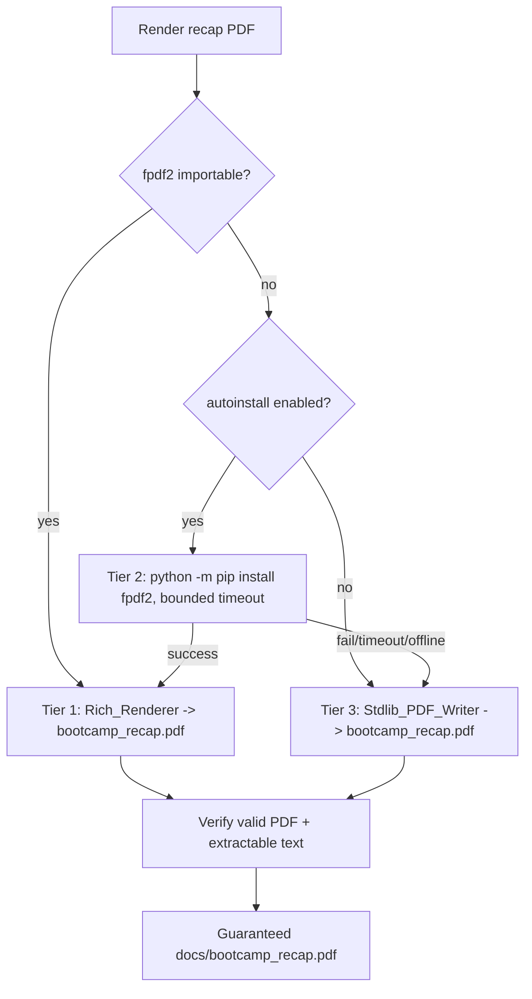

# Design Document

## Overview

Today the recap render path is two-tier: `fpdf2` present → professional PDF; `fpdf2` absent → HTML fallback + `pip install fpdf2` hint. That means a PDF is not guaranteed. This design makes `docs/bootcamp_recap.pdf` a hard guarantee via a **three-tier** strategy while keeping `fpdf2` optional and lazily imported:

1. **Tier 1 — Rich_Renderer:** `fpdf2` available → existing professional PDF (unchanged).
2. **Tier 2 — Fpdf2_Autoinstall:** `fpdf2` absent → best-effort `python -m pip install fpdf2` (guarded, timeout-bounded, opt-out) → then Tier 1.
3. **Tier 3 — Stdlib_PDF_Writer:** install impossible/declined/failed → a new stdlib-only PDF emitter produces a valid PDF from the same parsed recap.

The HTML output becomes a supplementary extra, never the substitute for the PDF. The `ensure_graduation_artifacts.py` orchestrator and its `--check` are updated to treat `docs/bootcamp_recap.pdf` as the guaranteed rendered-recap artifact.

## Architecture



### Files Touched / Added

| File | Change |
| --- | --- |
| `scripts/recap_pdf_minimal.py` (new) | Stdlib_PDF_Writer: emit a valid PDF 1.4 from the parsed `RecapDocument`. Stdlib-only. |
| `scripts/pdf_render_strategy.py` (new, or a function set) | Tier selection: import probe → autoinstall (guarded) → dispatch to rich or stdlib. Central place both generators and the orchestrator call. |
| `scripts/generate_recap_pdf.py` | Route through the tier strategy so a PDF is always produced; keep the Rich_Renderer as Tier 1. |
| `scripts/generate_recap_pdf_inline.py` | Same tiering for the inline fallback used by graduation. |
| `scripts/ensure_graduation_artifacts.py` | Guarantee `docs/bootcamp_recap.pdf` (not HTML) as the rendered-recap artifact; `--check` verifies the PDF; HTML becomes supplementary. |
| `scripts/fpdf2_preflight.py` | Update the preflight note to reflect that a PDF is guaranteed (autoinstall may run; stdlib fallback otherwise). |
| `steering/graduation.md`, `steering/module-completion-track.md` | Replace "degrades to HTML/Markdown when fpdf2 absent" language with the guaranteed-PDF tiered behavior; keep reconcile-then-render ordering and non-blocking posture. |
| Tests | Add stdlib-writer validity, tier-selection, and `--check` PDF-presence tests; update existing HTML-fallback expectations. |

### Design Decision: Keep `fpdf2` Optional; Add a Stdlib Emitter

The repository python-conventions rule requires `fpdf2` to stay optional and lazily imported. Autoinstall alone cannot guarantee a PDF (offline/locked-down environments), so the **guarantee rests on the Stdlib_PDF_Writer**, which needs no third-party packages. Autoinstall is an *enhancement* that upgrades Tier 3 → Tier 1 when the environment allows, not the guarantee itself. This satisfies both "always a PDF" and "fpdf2 stays optional".

### Design Decision: PDF 1.4 by Hand Is Small and Well-Understood

A minimal, valid PDF (fixed catalog/pages objects, one or more page content streams using a standard Type1 font like Helvetica, an xref table, and a trailer) is a few hundred lines of deterministic stdlib code. Text is drawn with `BT/Td/Tf/Tj/ET` operators. This is sufficient for headings, labeled subsections, and wrapped body text. It reuses the existing recap parser (`RecapDocument`, `RecapSection`) so content selection matches the rich path and nothing is dropped (tolerant raw-Markdown fallback preserved).

### Design Decision: Central Tier Strategy

Both `generate_recap_pdf.py` and `generate_recap_pdf_inline.py` (and the orchestrator) need identical tiering. Put the probe/autoinstall/dispatch logic in one place (`pdf_render_strategy.py`) so behavior is consistent and testable, and so the autoinstall guard/opt-out lives in exactly one location.

## Components and Interfaces

### `recap_pdf_minimal.py` (Stdlib_PDF_Writer)

```text
render_minimal_pdf(doc: RecapDocument, out_path: Path) -> None
```

- Stdlib-only (`struct`/`zlib` optional for stream compression; plain uncompressed streams acceptable).
- Emits title/cover line, then per module: `Module N: Name`, and the labeled subsections (Information Shared, Questions & Responses, Actions Taken, Journal), with simple line wrapping at a fixed column width.
- Multi-page: starts a new page when the vertical cursor overflows.
- Produces a byte string with a valid xref and `%%EOF` trailer.

### `pdf_render_strategy.py`

```text
ensure_recap_pdf(doc, out_path, *, allow_autoinstall: bool, timeout_s: int) -> str  # returns tier used: "rich"|"autoinstalled"|"stdlib"
```

- Probe: `import fpdf` in a try/except (lazy, never top-level).
- If absent and `allow_autoinstall`: run `python -m pip install fpdf2` via `subprocess` with `timeout_s`; re-probe once.
- Dispatch to the rich renderer (`recap_pdf_render`) or `recap_pdf_minimal`.
- `allow_autoinstall` resolved from env var `SENZING_BOOTCAMP_PDF_AUTOINSTALL` and/or a `config/bootcamp_preferences.yaml` key (opt-out); default enabled but always safe to fail.

### Orchestrator (`ensure_graduation_artifacts.py`) Changes

- The rendered-recap artifact is `docs/bootcamp_recap.pdf`. Regenerate when absent/empty/stale via the tier strategy.
- `--check` reports the rendered-recap artifact satisfied only when the `.pdf` exists and is a valid PDF (reuse `verify_rendered_pdf` / `extract_pdf_text`).
- HTML may still be emitted as an extra; it is no longer the substitute that satisfies the guarantee.
- Idempotency preserved: a valid existing PDF is left as-is.

## Data Models

Reuses the existing `RecapDocument` / `RecapSection` / `QRPair` models from `generate_recap_pdf.py`. No schema change. Output is the PDF byte stream.

## Error Handling

- **fpdf2 import fails:** caught; proceed to autoinstall or stdlib. Never raised.
- **Autoinstall fails/timeouts/offline/pip-missing:** caught; fall through to stdlib. Logged as the reason. Never blocks graduation (Req 3.2, 5.2).
- **Autoinstall disabled by opt-out:** skip straight to stdlib.
- **Stdlib writer error (unexpected):** as an absolute last resort, keep the existing HTML+Markdown outputs and record a warning — but this path should not occur for valid parsed input; tests exercise the stdlib writer to keep it robust. The guarantee target is the stdlib PDF; HTML is only a degenerate last resort, matching today's non-blocking posture.
- **Verification fails on produced PDF:** treat as regeneration-needed; the orchestrator will attempt regeneration at the next stopping point (idempotent, at most once per invocation to avoid loops).

## Testing Strategy

The stdlib writer and tier strategy have real logic → property-based and behavioral tests. Steering wording changes get content assertions.

### Property-Based / Behavioral Tests (`test_recap_pdf_minimal.py`, `test_pdf_render_strategy.py`)

- Strategy generating arbitrary `RecapDocument`s (varying module counts, subsection presence, unicode-ish text) → `render_minimal_pdf` always yields a PDF whose header is `%PDF-`, has a trailer, and whose extracted text contains each module name and subsection label (round-trip via `extract_pdf_text`).
- Tier selection (monkeypatched probe/subprocess):
  - fpdf2 present → returns "rich"; rich renderer invoked.
  - fpdf2 absent + autoinstall disabled → returns "stdlib"; no subprocess call.
  - fpdf2 absent + autoinstall enabled + install "fails" → returns "stdlib".
  - fpdf2 absent + autoinstall enabled + install "succeeds" (probe flips) → returns "autoinstalled"/"rich".
- Autoinstall never called more than once per invocation; timeout respected (mocked).

### Orchestrator Tests (extend `test_ensure_graduation_artifacts*`)

- With fpdf2 unavailable and autoinstall disabled, running the orchestrator produces `docs/bootcamp_recap.pdf` (valid) — not just HTML.
- `--check` returns unsatisfied when only HTML exists; satisfied when the valid PDF exists.
- Idempotency: a valid PDF is not rewritten/altered.

### Existing Tests to Update

- `test_generate_recap_pdf.py`, `test_generate_recap_pdf_inline*`, and any `ensure_graduation_artifacts` test that currently asserts an HTML fallback satisfies the rendered-recap guarantee — update to expect a guaranteed PDF.
- `fpdf2-preflight-note` / `graduation-recap-pdf-resilience` related tests — align messaging.

### Verification Approach

1. `HYPOTHESIS_PROFILE=thorough python -m pytest senzing-bootcamp/tests/test_recap_pdf_minimal.py test_pdf_render_strategy.py` and the orchestrator tests.
2. Run `python3 senzing-bootcamp/scripts/ensure_graduation_artifacts.py` in an environment with `fpdf2` uninstalled and autoinstall disabled → confirm a valid `docs/bootcamp_recap.pdf` (open it / `extract_pdf_text`).
3. Full suite `python -m pytest senzing-bootcamp/tests/ tests/`.
4. `validate_commonmark.py` on edited steering Markdown.

### What NOT to Test

- Do not re-test the professional design of the rich PDF (owned by `professional-recap-pdf` / `recap-pdf-professional-design`); only test that Tier 1 is still selected and invoked when fpdf2 is present.
- Do not perform real network installs in tests — autoinstall is always mocked.
