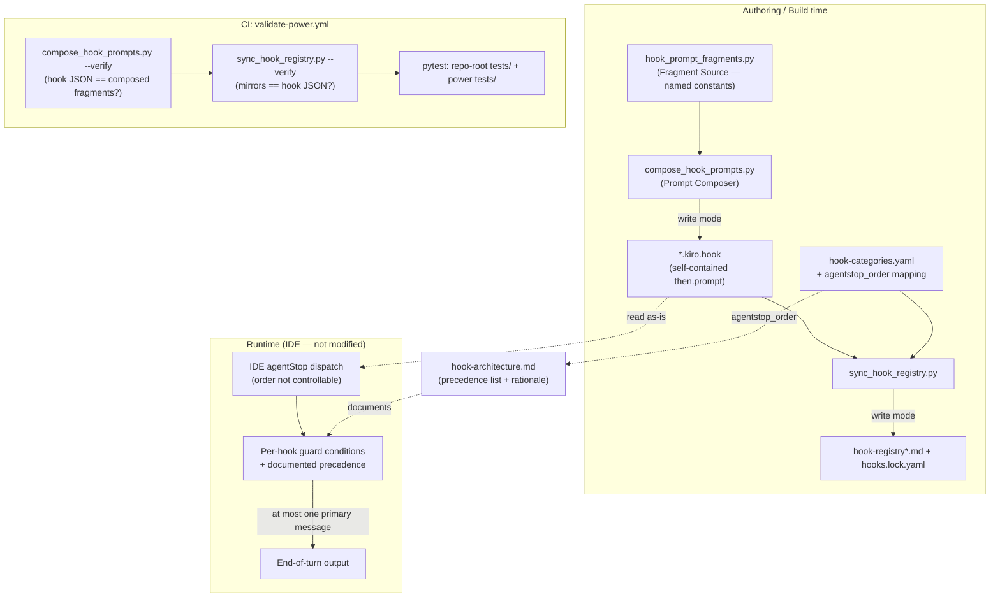

# Design Document

## Overview

This feature hardens the `senzing-bootcamp` Kiro Power hook architecture along three
independent-but-related themes. All three make hook behavior deterministic, maintainable, and
reliably present without changing the IDE's hook-execution engine or any hook's runtime behavior.

- **Theme A — agentStop hook ordering and documentation.** Five hooks fire on `agentStop`. The IDE
  decides the actual firing order; the power cannot control it. We therefore (1) record an
  authoritative precedence list and per-hook rationale in a steering document, (2) store the order
  in a machine-readable `agentstop_order` mapping inside `hook-categories.yaml`, and (3) document
  (and, where missing, add behavior-preserving guard text for) the question-pending silence rule so
  that at most one hook emits a primary end-of-turn message in any turn. This theme is
  documentation + guard-text + a new YAML mapping; it changes no hook's effective behavior.

- **Theme B — hook-prompt deduplication.** The Module 3 gate logic is duplicated nearly verbatim
  across three hook files (`gate-module3-visualization`, `enforce-mandatory-gate`,
  `enforce-gate-on-stop`). We introduce a build-time **fragment source** (a stdlib-only Python
  module of named string constants) and a sibling **prompt composer** script
  (`compose_hook_prompts.py`) that expands fragment references into the self-contained
  `then.prompt` strings the IDE reads at runtime. A `--verify` mode detects drift in CI. The
  composer's output must be **byte-identical** to the current on-disk prompts, so introducing it is a
  pure no-op refactor that `--verify` can prove.

- **Theme C — capture-hook install reliability.** `install_hooks.py` has a stale curated `HOOKS`
  list (references three consolidated hooks that no longer exist; omits several current hooks) and is
  interactive-only. We repair the list by deriving it from the actual hook files, designate
  `session-log-events`, `module-recap-append`, and `ask-bootcamper` as capture-critical, add
  non-interactive `--all`/`--essential` flags, document capture-critical coverage on both install
  paths, add a session-start warn-on-absence check, and add tests that fail if the curated list ever
  rots again.

### Grounded facts confirmed against the repository

- **Exactly five `agentStop` hooks.** `hooks.lock.yaml` confirms `when.type: agentStop` for
  `ask-bootcamper` (v4.0.0, critical), `enforce-gate-on-stop` (v1.0.0, module),
  `enforce-visualization-offers` (v2.0.0, module), `module-completion-celebration` (v1.0.0, module),
  and `module-recap-append` (v1.0.0, module). `session-log-events` is `postToolUse` with
  `toolTypes: ["write"]` — capture-critical but **not** an agentStop hook.
- **CONDITION B already removed.** A grep for `CONDITION B` across `senzing-bootcamp/hooks/*.kiro.hook`
  returns zero matches. The three gate hooks currently check only **CONDITION A**
  (`web_service.status == "passed"` AND `web_page.status == "passed"`). The composer must reproduce
  this current single-condition content byte-for-byte.
- **Two preToolUse write gate hooks must be preserved:** `gate-module3-visualization` and
  `enforce-mandatory-gate` (both `preToolUse`, `toolTypes: ["write"]`), plus `write-policy-gate`.
- **`install_hooks.py` staleness confirmed.** The `HOOKS` list and `ESSENTIAL` set reference
  `enforce-file-path-policies`, `enforce-single-question`, and `block-direct-sql` (all consolidated
  into `write-policy-gate`, no longer present as files) and omit current hooks including
  `write-policy-gate`, `session-log-events`, `module-recap-append`, `review-bootcamper-input`,
  `error-recovery-context`, and several module hooks. `main()` calls `input()` unconditionally.
- **`sync_hook_registry.py` parses `*.kiro.hook` into `HookEntry`, categorizes via
  `hook-categories.yaml`, and regenerates three mirror docs plus `hooks.lock.yaml`.** Its `--verify`
  mode already runs as a required CI step in `validate-power.yml`.

### Non-goals

- No change to the IDE hook-execution engine or its dispatch order (Req 4.1).
- No change to any hook's runtime behavior; Theme B is a byte-identical refactor (Req 8).
- No removal of any `preToolUse` write hook (Req 8.4, security steering).
- No new third-party dependency; everything is Python 3.11+ stdlib-only (Req 5.5).

## Architecture

The three themes touch three layers of the existing pipeline. The diagram below shows the
build/generation flow (left), the CI verification flow (center), and the runtime/IDE flow (right).



### Composer-before-sync ordering (Requirement 8.6 decision)

**Decision: implement fragment composition as a sibling script `compose_hook_prompts.py`, run
BEFORE `sync_hook_registry.py`.** Rationale:

1. **Single responsibility / clean layering.** `sync_hook_registry.py` already owns one
   transformation: *hook JSON → mirror docs + lockfile*. The composer owns a different
   transformation: *fragments → hook JSON*. Folding both into one script would couple two unrelated
   stages and complicate its already-large CLI. A sibling keeps each script's `main()` focused and
   its `--verify` semantics crisp.
2. **Correct data-flow direction.** The composer **writes** hook JSON; `sync_hook_registry` **reads**
   hook JSON to produce mirrors. So the pipeline is `compose --write` → `sync --write`. Putting the
   composer first means the mirrors are always generated from freshly composed hook JSON.
3. **Composable, independent `--verify` modes.** The two verifications check different invariants and
   compose cleanly as sequential CI steps:
   - `compose_hook_prompts.py --verify`: on-disk hook JSON `then.prompt` equals the string the
     composer would generate from the fragment source (Theme B drift).
   - `sync_hook_registry.py --verify`: on-disk mirror docs + lockfile equal what sync would generate
     from the hook JSON (existing registry drift).
   Running composer-verify first localizes failures: if hook JSON drifted from fragments, that fails
   first with a precise message; only if hook JSON is canonical does sync-verify then check the
   mirrors. Neither verify step writes files, so order does not affect correctness — only diagnostic
   clarity.

### Theme A architecture: determinism without engine control

Because the IDE controls firing order, determinism of *effective* behavior is achieved by two
mechanisms, both documented in a new steering file `hook-architecture.md`:

1. **Per-hook guard conditions** make each agentStop hook a silent no-op unless its specific state
   holds. The guards are mutually consistent so that, for any given progress state, at most one hook
   emits a *primary* end-of-turn message regardless of dispatch order (Req 4.3, 4.4).
2. **A documented precedence list** (stored machine-readably in `agentstop_order`) resolves the rare
   case where more than one hook would emit, and records which output wins (Req 1, 3).

## Components and Interfaces

### Theme A components

#### `agentstop_order` mapping (new section in `hook-categories.yaml`)

A machine-readable ordered list of exactly the five agentStop hook IDs with an integer `order` and a
short `rationale` string per hook. Read by tests and referenced from the steering doc.

```yaml
agentstop_order:
  - id: ask-bootcamper
    order: 1
    rationale: "Owns answer-processing and closing questions; absolute precedence per agent-instructions."
  - id: module-recap-append
    order: 2
    rationale: "Capture must run before celebration so the recap reflects the just-completed module."
  - id: module-completion-celebration
    order: 3
    rationale: "Celebrates a completed module; must yield to gate-violation output."
  - id: enforce-gate-on-stop
    order: 4
    rationale: "Mandatory-gate safety net; a gate violation outranks a celebration in the same turn."
  - id: enforce-visualization-offers
    order: 5
    rationale: "Lowest-stakes nudge; offers missed visualizations only when nothing higher fired."
```

**Invariant (Req 1.5):** the set of IDs under `agentstop_order` equals the set of hook IDs whose
`when.type` is `agentStop` in the hooks directory — no more, no less. This is asserted by a
repo-root test against the real hook files.

#### `hook-architecture.md` (new steering file)

A `manual`-inclusion steering document under `senzing-bootcamp/steering/` recording, per Theme A:

- The ordered precedence list of the five agentStop hooks (Req 1.1) and the intended precedence
  semantics (Req 1.2).
- A written rationale per hook position (Req 1.3), mirroring the `rationale` fields and pointing to
  `agentstop_order` in `hook-categories.yaml` as the machine-readable source (Req 1.4).
- The statement that `ask-bootcamper` is the closing-question owner and all other agentStop hooks
  defer closing-question emission to it; conflicts resolve in favor of `ask-bootcamper` (Req 2.2,
  2.3).
- The question-pending silence rule: while `config/.question_pending` exists (or the last assistant
  message has a pending 👉), every agentStop hook emits zero output (Req 2.1, 2.4).
- The precedence-resolution rule when multiple would emit, with the explicit example that a
  gate-violation from `enforce-gate-on-stop` outranks a celebration from
  `module-completion-celebration`, and that hooks never stack two separate end-of-turn messages
  (Req 3.1, 3.2, 3.3).
- The explicit assumption/non-goal that the power cannot control IDE firing order and does not modify
  the engine; determinism comes from guards + precedence (Req 4.1, 4.2).
- The capture-critical designation and both-paths coverage statement for Theme C (Req 10.1, 10.5).

The steering index (`steering-index.yaml`) gains an entry for this file with its token budget so
`measure_steering.py --check` stays green.

#### Per-hook guard-text expectations (behavior-preserving doc/guard additions)

Current guard state, confirmed from the hook JSON:

| Hook | Has question-pending guard today? | Action |
|---|---|---|
| `ask-bootcamper` | Yes — Phase 1 checks `config/.question_pending` does not exist; Sub-phases 2B/2C are the *only* paths that act while pending, and they process the answer or block advancement (never emit a competing closing message). | Document only. |
| `module-recap-append` | Implicit — only acts when `modules_completed` changed; a pending question and a module-completion boundary do not co-occur in practice, but there is no explicit `.question_pending` check. | Add explicit behavior-preserving guard sentence. |
| `module-completion-celebration` | Implicit — same boundary-detection guard as recap; no explicit `.question_pending` check. | Add explicit behavior-preserving guard sentence. |
| `enforce-gate-on-stop` | No explicit `.question_pending` check (guards on `current_module == 3` and `current_step >= 9`). | Add explicit behavior-preserving guard sentence. |
| `enforce-visualization-offers` | No explicit `.question_pending` check (guards on `current_module in {3,5,7,8}`). | Add explicit behavior-preserving guard sentence. |

The guard sentence added to the four hooks lacking an explicit check is a leading no-op clause, e.g.:

> If `config/.question_pending` exists, produce no output at all — defer to `ask-bootcamper`.

This is additive and behavior-preserving: it only *widens* the silence conditions these hooks already
satisfy in the pending state, and never changes output in any non-pending state. Because these four
hooks are not part of the Theme B fragment set, editing their prompts is a normal authored change;
adding the guard does change their bytes, so `sync_hook_registry.py --write` is re-run to refresh the
mirrors and `hooks.lock.yaml` versions are bumped accordingly.

> **Note on Theme A vs Theme B interaction.** `enforce-gate-on-stop` is *both* an agentStop hook
> (Theme A) *and* one of the three Module 3 gate hooks whose CONDITION A / ⛔ strings are extracted as
> fragments (Theme B). The composer composes its CONDITION A and ⛔ block from fragments; the
> agentStop-specific guard text (module/step gating + the new question-pending clause) remains hook-
> specific authored text in the composer's per-hook template. See Theme B fragment boundaries below.

### Theme B components

#### Fragment source: `senzing-bootcamp/scripts/hook_prompt_fragments.py`

**Decision (Req 5.5): a Python module of named string constants**, not a data file. Rationale:

- Stdlib-only and zero-parse: importing the module yields the fragments directly with no custom YAML/
  JSON parsing layer to maintain (the repo already hand-rolls minimal YAML parsers elsewhere; a
  Python module avoids adding another).
- Multi-line string literals preserve exact whitespace/newlines, which is essential for
  byte-identical composition.
- It is naturally importable by both the composer and the tests via the existing `sys.path` pattern.

Structure:

```python
from __future__ import annotations

# Each fragment is the EXACT substring shared across the Module 3 gate hooks.
FRAGMENTS: dict[str, str] = {
    "module3_condition_a": "...",        # CONDITION A checkpoint check block
    "module3_gate_on_stop_violation": "...",   # ⛔ MANDATORY GATE VIOLATION ... (enforce-gate-on-stop)
    "module3_block_completion": "...",   # ⛔ BLOCKED: Module 3 cannot be marked complete ...
    "module3_block_advancement": "...",  # ⛔ BLOCKED: Cannot advance past Step 9 ...
}
```

#### Fragment set extracted from the three gate hooks

The shared text is identified from the current on-disk prompts. Fragments are kept at the granularity
where text is **truly identical** across hooks; per-hook differences stay in per-hook templates.

1. **`module3_condition_a`** — the CONDITION A checkpoint check, identical across all three gate
   hooks:

   ```text
   CONDITION A — Step 9 checkpoints exist:
   - `module_3_verification.checks.web_service.status` equals `"passed"`
   - `module_3_verification.checks.web_page.status` equals `"passed"`
   ```

2. **`module3_gate_on_stop_violation`** — the ⛔ output string used by `enforce-gate-on-stop`
   (agentStop), beginning `⛔ MANDATORY GATE VIOLATION DETECTED: Step 9 ...`.

3. **`module3_block_completion`** — the ⛔ output string used by `gate-module3-visualization`
   (preToolUse), beginning `⛔ BLOCKED: Module 3 cannot be marked complete ...`.

4. **`module3_block_advancement`** — the ⛔ output string used by `enforce-mandatory-gate`
   (preToolUse), beginning `⛔ BLOCKED: Cannot advance past Step 9 ...`.

The three ⛔ strings are distinct texts today, so each is its own named fragment (Req 5.2). The
CONDITION A block is the one fragment shared verbatim by all three hooks (Req 5.1, 7.5). The
"is this a Module 3 completion / advance-past-9 write" CHECK clauses differ per hook
(completion-write vs advance-past-9 vs reached-or-passed-9 on stop), so they remain per-hook template
text rather than a shared fragment — extracting them would not be byte-identical and would violate
Req 7.5/8.1.

#### Composer: `senzing-bootcamp/scripts/compose_hook_prompts.py`

Follows the repository script pattern (shebang, `from __future__ import annotations`, module
docstring, dataclasses, `argparse`, `main(argv=None)`, exit 0/1).

Interface:

```python
def compose_prompt(template: str, fragments: dict[str, str]) -> str:
    """Expand all {{fragment:NAME}} markers in template using fragments.

    Raises:
        UnknownFragmentError: if a marker references a name absent from fragments.
    """

def compose_hook(hook_id: str, fragments: dict[str, str]) -> dict:
    """Return the full hook JSON dict with then.prompt fully expanded."""

def main(argv: list[str] | None = None) -> int:
    """CLI entry: --write (default) | --verify, --hooks-dir, --fragments. Returns 0/1."""
```

Composition model (Req 6.1, 6.2):

- The composer holds a **per-hook prompt template** for each of the three gate hooks. A template is
  the hook's full prompt with shared regions replaced by `{{fragment:NAME}}` markers; per-hook text
  (the CHECK clause, surrounding prose) stays literal in the template.
- `compose_prompt` replaces every `{{fragment:NAME}}` marker with `fragments[NAME]` verbatim
  (byte-identical), producing a self-contained string with no remaining markers (Req 6.2).
- **Write mode** (Req 6.3): for each gate hook, build the full hook dict (preserving `name`,
  `version`, `description`, and the entire `when` block unchanged — Req 8.2, 8.3) with the composed
  `then.prompt`, and write it to `<hooks-dir>/<hook_id>.kiro.hook` using the same JSON formatting the
  files currently use (2-space indent, `ensure_ascii=False`, trailing newline) so output is
  byte-identical to the canonical files.
- **Verify mode** (Req 7.1–7.3): compose in memory and compare against the on-disk file's exact
  bytes; collect every drifted hook; exit 1 listing each drifted hook id, else exit 0.
- **Unknown fragment** (Req 6.5): `compose_prompt` raises `UnknownFragmentError`; `main` catches it,
  prints `ERROR: unknown fragment '<name>' referenced by hook '<hook_id>'` to stderr, returns 1.

**Byte-identical no-op guarantee (Req 8.1, 8.5).** Before committing, the templates + fragments are
authored so that `compose_hook_prompts.py --write` reproduces the *current* on-disk gate hooks exactly
(verified by diffing against git HEAD). Thus introducing the composer changes no hook bytes; running
`--verify` immediately after passes, and the subsequent `sync_hook_registry.py --verify` also passes
because the hook JSON is unchanged.

#### Marker syntax choice

Markers use `{{fragment:NAME}}`. This token does not occur in any current hook prompt (verified by
search) and is unambiguous to scan for both expansion and "no unexpanded markers remain" assertions
(Req 6.2). The composer treats any residual `{{fragment:` substring in composed output as an error.

### Theme C components

#### Repaired `install_hooks.py`

Changes, all stdlib-only and preserving the existing interactive UX as the default:

1. **Derive the curated set from the hook files (Req 9.3, 9.5 — derivation adopted).** Replace the
   hand-maintained `HOOKS` list as the *source of truth* for which files exist with discovery from
   `power_hooks.glob("*.kiro.hook")` (the existing `discover_hooks` already does this). The hardcoded
   `HOOKS` becomes a **display-metadata table only** (filename → friendly description), and
   `discover_hooks` already falls back to a derived name for any file missing from it. To satisfy
   Req 9.4 (names follow the "to {verb phrase}" pattern matching the hook's `name` field), display
   names are read from each hook file's `name` field rather than from the hardcoded list, with the
   hardcoded description used only as supplementary text. The design records: **derivation is
   adopted** — the installed set is the glob of real files; metadata is a non-authoritative overlay.

2. **Remove all three consolidated hooks (Req 9.1).** Delete `enforce-file-path-policies`,
   `enforce-single-question`, and `block-direct-sql` entries from both the metadata table and
   `ESSENTIAL`.

3. **Add the current/missing hooks to metadata & essential (Req 9.2).** Ensure `write-policy-gate`,
   `session-log-events`, `module-recap-append`, `enforce-mandatory-gate`, and `enforce-gate-on-stop`
   have accurate display names (from their `name` field) and descriptions. The `ESSENTIAL` set is
   redefined as the **critical hooks from `hook-categories.yaml`** (`ask-bootcamper`,
   `code-style-check`, `commonmark-validation`, `review-bootcamper-input`, `write-policy-gate`) plus
   the capture-critical hooks (`session-log-events`, `module-recap-append`) — see capture-critical
   coverage below.

4. **Capture-critical designation (Req 10.1, 10.3).** `CAPTURE_CRITICAL = {"session-log-events",
   "module-recap-append", "ask-bootcamper"}`. Both the install-all path and the essential path
   install every member: install-all installs everything (superset), and `ESSENTIAL` is defined to
   include all three capture-critical hooks.

5. **Non-interactive flags (Req 11).** Add an `argparse` CLI with `main(argv=None)`:
   - `--all` installs every discovered hook without reading stdin (Req 11.1).
   - `--essential` installs only the essential set without reading stdin (Req 11.2).
   - When either flag is supplied, the code path never calls `input()` (Req 11.3); the interactive
     menu (current behavior) runs only when no flag is supplied (Req 11.6).
   - Successful non-interactive install returns/exits 0 (Req 11.4).
   - If `power_hooks` is missing under a non-interactive flag, print the missing directory to stderr
     and exit 1 (Req 11.5).

   The interactive `main()` body is refactored into a helper (`run_interactive(...)`) so the
   `input()` calls are reachable only from the no-flag branch.

#### Session-start warn-on-absence check (Req 10.4, 10.6)

Documented in `session-resume-phase2-setup-recovery.md` (the existing home of `hooks_installed`
handling) and cross-referenced from `agent-instructions.md`'s Hooks section. Behavior:

> At session start, after the `hooks_installed` check, inspect the bootcamper's `.kiro/hooks`
> directory. For each capture-critical hook (`session-log-events`, `module-recap-append`,
> `ask-bootcamper`) whose `<id>.kiro.hook` file is absent, warn the bootcamper which capture-critical
> hooks are missing and how to install them (createHook from the registry, or
> `python3 senzing-bootcamp/scripts/install_hooks.py --essential`). The warning is advisory and never
> blocks the session.

**Auto-installation decision (Req 10.6):** auto-creation of the capture-critical hooks is **adopted on
the createHook-from-registry path** — `ask-bootcamper` is already a critical hook created during
onboarding, and `module-recap-append` / `session-log-events` are added to the onboarding createHook
set so capture is present from session start (Req 10.2). The warn-on-absence behavior is provided
**regardless** of auto-installation, to catch cases where a bootcamper deleted a hook or skipped the
file-copy installer.

#### CI wiring (`.github/workflows/validate-power.yml`)

Add one step **before** the existing "Verify hook registry is in sync" step:

```yaml
- name: Verify composed hook prompts are in sync
  run: |
    python senzing-bootcamp/scripts/compose_hook_prompts.py --verify || {
      echo "::error::Composed hook prompts drifted. Run: python senzing-bootcamp/scripts/compose_hook_prompts.py --write"
      exit 1
    }
```

The existing `sync_hook_registry.py --verify` step is kept unchanged and runs after, matching the
composer-before-sync ordering (Req 7.4, 8.5). Both verify steps are non-writing and required.

## Data Models

### `HookEntry` (existing, reused from `sync_hook_registry.py`)

Parsed `.kiro.hook` representation: `hook_id`, `name`, `description`, `event_type`, `action_type`,
`prompt`, `file_patterns`, `tool_types`. Tests and the composer reuse this shape (or read raw JSON
directly) rather than introducing a parallel parser.

### `AgentStopOrderEntry` (new, conceptual — backed by `agentstop_order` YAML)

| Field | Type | Description |
|---|---|---|
| `id` | `str` | agentStop hook id; must be one of the five and have `when.type == agentStop`. |
| `order` | `int` | 1-based precedence rank; unique and contiguous 1..5. |
| `rationale` | `str` | One-sentence justification for this hook's position (Req 1.3). |

### Fragment source model

| Field | Type | Description |
|---|---|---|
| `FRAGMENTS` | `dict[str, str]` | Maps fragment name → exact shared prompt text. Sole authoritative location for each shared fragment (Req 5.3). |

Fragment names in scope: `module3_condition_a`, `module3_gate_on_stop_violation`,
`module3_block_completion`, `module3_block_advancement`.

### Composer template model

| Field | Type | Description |
|---|---|---|
| `HOOK_TEMPLATES` | `dict[str, str]` | Maps gate-hook id → its `then.prompt` template containing `{{fragment:NAME}}` markers and per-hook literal text. |
| `HOOK_METADATA` | `dict[str, dict]` | Maps gate-hook id → the static JSON fields to preserve (`name`, `version`, `description`, `when`). The composer reads these from the current files to guarantee `when`-block preservation (Req 8.3). |

### Installer data model (revised `install_hooks.py`)

| Field | Type | Description |
|---|---|---|
| `HOOK_METADATA` | `dict[str, tuple[str, str]]` | filename → (friendly description, ...) display overlay only; non-authoritative (Req 9.5). |
| `ESSENTIAL` | `set[str]` | Critical hooks (from `hook-categories.yaml`) ∪ capture-critical hooks. No consolidated hooks (Req 9.1, 9.2). |
| `CAPTURE_CRITICAL` | `set[str]` | `{session-log-events, module-recap-append, ask-bootcamper}` (Req 10.1). |
| installed set | derived | `power_hooks.glob("*.kiro.hook")` — the authoritative installed set (Req 9.3). |

## Correctness Properties

*A property is a characteristic or behavior that should hold true across all valid executions of a
system — essentially, a formal statement about what the system should do. Properties serve as the
bridge between human-readable specifications and machine-verifiable correctness guarantees.*

PBT applies to this feature because the core artifacts are pure transformations with universal
invariants: the prompt composer (fragment expansion, byte-identical reuse, drift detection, schema
preservation) and the installer's set logic (discovery completeness, membership, absence of stale
ids). The Theme A documentation/prose criteria and runtime LLM-behavior criteria are handled by
example/edge-case/smoke tests in the Testing Strategy rather than properties.

The properties below are the deduplicated set produced by the prework reflection. Property numbering
is sequential within this document.

### Property 1: agentstop_order lists exactly the agentStop hooks

*For any* `*.kiro.hook` file in the hooks directory, its id appears in the `agentstop_order` mapping
in `hook-categories.yaml` **if and only if** its `when.type` equals `agentStop`; consequently the set
of `agentstop_order` ids equals the set of agentStop hook ids (no more, no fewer).

**Validates: Requirements 1.5**

### Property 2: Every agentStop hook has a question-pending silence guard

*For any* hook whose `when.type` is `agentStop`, its `then.prompt` contains guard text that yields
zero output when `config/.question_pending` exists (a reference to `config/.question_pending` paired
with a no-output / defer-to-`ask-bootcamper` clause).

**Validates: Requirements 2.4**

### Property 3: Composition fully expands fragments and leaves no residual markers

*For any* hook prompt template and fragment set in which every `{{fragment:NAME}}` marker resolves to
a defined fragment, the composed prompt (a) contains the full text of each referenced fragment and
(b) contains no remaining `{{fragment:...}}` marker substring.

**Validates: Requirements 6.1, 6.2**

### Property 4: Shared fragments expand byte-identically across hooks

*For any* fragment referenced by two or more gate-hook templates, the text inlined for that fragment
is byte-identical in every hook's composed `then.prompt`.

**Validates: Requirements 7.5**

### Property 5: Unknown fragment references are reported and fail

*For any* marker name that is not defined in the fragment source, composing a template that
references it causes the composer to fail (exit code 1) and report the offending fragment name.

**Validates: Requirements 6.5**

### Property 6: Composition is a byte-identical no-op refactor

*For any* of the three Module 3 gate hooks (`gate-module3-visualization`, `enforce-mandatory-gate`,
`enforce-gate-on-stop`), the composer's generated file content equals the current on-disk
`.kiro.hook` content byte-for-byte; therefore `compose_hook_prompts.py --verify` exits 0 on the
canonical repository.

**Validates: Requirements 8.1, 7.2**

### Property 7: Any drift from the composed source is detected and reported

*For any* modification applied to a composed gate-hook's on-disk `then.prompt`, running
`compose_hook_prompts.py --verify` exits with code 1 and reports the drifted hook id.

**Validates: Requirements 7.3**

### Property 8: Composed hooks are schema-valid and preserve the `when` block

*For any* composed gate hook, the output is valid JSON containing the required fields `name`,
`version`, `when`, and `then`, and its `when` block (including `when.type` and any `toolTypes`
filter) is deep-equal to the original hook's `when` block.

**Validates: Requirements 8.2, 8.3**

### Property 9: Installer discovered set equals the hook-file set

*For any* directory of `*.kiro.hook` files, the installer's discovered hook set contains exactly one
entry per file and its filename set equals the set of `*.kiro.hook` filenames present in the
directory.

**Validates: Requirements 9.3, 12.1**

### Property 10: No consolidated hook is referenced by the installer

*For any* consolidated hook id in `{enforce-file-path-policies, enforce-single-question,
block-direct-sql}`, that id appears in neither the installer's curated metadata keys nor its
`ESSENTIAL` set.

**Validates: Requirements 9.1, 12.2**

### Property 11: Installer display names match each hook's `name` field

*For any* `*.kiro.hook` file, the installer's resolved display name for that hook equals the file's
`name` field, which follows the "to {verb phrase}" pattern.

**Validates: Requirements 9.4**

### Property 12: Capture-critical hooks are in both install sets

*For any* capture-critical hook in `{session-log-events, module-recap-append, ask-bootcamper}`, that
hook is a member of both the installer's install-all set and its essential set.

**Validates: Requirements 10.3, 12.3**

### Property 13: Non-interactive modes never read stdin and exit 0

*For any* valid hooks directory, invoking `main(["--all"])` or `main(["--essential"])` completes
without ever calling `input()` and returns exit code 0.

**Validates: Requirements 11.3, 11.4, 12.4**

### Property 14: Missing hooks directory under a non-interactive flag fails cleanly

*For any* non-existent power-hooks directory, invoking `main(["--all"])` or `main(["--essential"])`
returns exit code 1 and reports the missing directory path.

**Validates: Requirements 11.5**

## Error Handling

### Composer (`compose_hook_prompts.py`)

| Condition | Handling | Exit |
|---|---|---|
| Unknown fragment marker in a template | Raise `UnknownFragmentError`; `main` prints `ERROR: unknown fragment '<name>' referenced by hook '<hook_id>'` to stderr (Req 6.5). | 1 |
| Residual `{{fragment:` after expansion | Treated as a composition error; report the hook id and the residual marker. | 1 |
| `--verify` drift (on-disk != composed) | Print `FAIL: <hook_id> — composed prompt drifted. Run: ... --write` per drifted hook; continue checking all hooks before exiting so every drift is reported (Req 7.3). | 1 |
| Hooks directory missing | Print `ERROR: hooks directory not found: <path>` to stderr. | 1 |
| Hook file is invalid JSON | Print `ERROR: <file>: invalid JSON — <detail>`; do not partially write. | 1 |
| Write fails (OS error) | Print the OS error; leave already-written files in place but exit non-zero. | 1 |
| All composed match (verify) / all written (write) | Print a one-line success summary. | 0 |

The composer never mutates the `when` block, `name`, `version`, or `description` — only `then.prompt`
is composed (Req 8.2, 8.3). It follows the same JSON-formatting parameters as the existing files
(`indent=2`, `ensure_ascii=False`, trailing newline) so write output is byte-identical.

### Installer (`install_hooks.py`)

| Condition | Handling | Exit |
|---|---|---|
| `power_hooks` missing under `--all`/`--essential` | Print `ERROR: power hooks directory not found: <path>` to stderr; do not prompt (Req 11.5). | 1 |
| `power_hooks` missing in interactive mode | Existing behavior: warn and exit 1. | 1 |
| Source hook file not found during copy | Per-file warning (`⚠ <name>: source file not found`); continue with remaining hooks. | 0 |
| Destination already exists | Skip without overwriting (existing behavior); count as skipped. | 0 |
| Hook file unreadable when resolving `name` field | Fall back to the derived title-cased name; never crash. | 0 |
| Non-interactive flag with a valid directory | Install the selected set; print summary. | 0 |

### Theme A (documentation / config)

`agentstop_order` is validated by the repo-root property test (Property 1) and may be added to
`validate_yaml_schemas.py`. If the mapping and the real agentStop hook set diverge, the property test
fails in CI, which is the intended staleness tripwire. No runtime error handling is involved because
Theme A adds documentation, a YAML mapping, and behavior-preserving guard text only.

## Testing Strategy

### Dual approach

- **Property tests** verify the universal invariants above across many generated inputs (the
  composer's expansion/round-trip/error behavior and the installer's set logic).
- **Unit / example tests** verify concrete behaviors, doc-prose criteria, CLI contracts, and edge
  cases.
- **Integration / smoke tests** verify cross-script behavior (`sync --verify` after `compose --write`)
  and CI wiring.

### Test framework and conventions (Req 12.5)

- pytest + Hypothesis.
- Class-based organization (`class TestX:`).
- Hypothesis strategies prefixed with `st_` (e.g., `st_hook_id`, `st_fragment_name`,
  `st_unknown_marker`, `st_hook_dir`).
- `@settings(max_examples=20)` on property tests.
- `from __future__ import annotations` at the top of every test module.
- Modern type hints (`list[str]`, `X | None`).
- Scripts imported via the established `sys.path` insertion pattern (scripts are not packages).
- Each property-test class documents the requirements it validates and carries the tag comment:
  `# Feature: hook-architecture-improvements, Property {n}: {property text}`.

### Test placement (Req 12.6)

Per `structure.md`, tests validating **real hook files / real config** live in the repo-root
`tests/`; tests validating **script behavior** live in `senzing-bootcamp/tests/`.

| Test module | Location | Covers (properties / criteria) |
|---|---|---|
| `test_agentstop_order_properties.py` | `tests/` (reads real hooks + `hook-categories.yaml`) | P1 (1.5) |
| `test_agentstop_guard_text_properties.py` | `tests/` (reads real agentStop hook prompts) | P2 (2.4) |
| `test_hook_architecture_doc.py` | `tests/` (reads real steering doc) | 1.1–1.3, 2.2, 2.3, 3.1–3.3, 4.2, 8.6, 10.1, 10.5, 10.6 (examples) |
| `test_compose_hook_prompts_properties.py` | `senzing-bootcamp/tests/` (composer logic) | P3 (6.1/6.2), P5 (6.5), P8 (8.2/8.3) |
| `test_compose_hook_prompts_unit.py` | `senzing-bootcamp/tests/` | 6.3, 6.4 (CLI), 5.1, 5.2, 5.4, 5.5 |
| `test_compose_no_op_refactor.py` | `tests/` (composer output vs real on-disk hooks) | P4 (7.5), P6 (8.1/7.2), P7 (7.3) |
| `test_compose_sync_integration.py` | `senzing-bootcamp/tests/` | 8.5 (sync verify after compose) |
| `test_install_hooks_properties.py` | `senzing-bootcamp/tests/` (installer logic over temp dirs) | P9 (9.3/12.1), P13 (11.3/11.4/12.4), P14 (11.5) |
| `test_install_hooks_real_set_properties.py` | `tests/` (installer vs real hooks dir) | P10 (9.1/12.2), P11 (9.4), P12 (10.3/12.3) |
| `test_install_hooks_modes_unit.py` | `senzing-bootcamp/tests/` | 11.1, 11.2, 11.6 (modes), 9.2, 9.5 |
| `test_capture_critical_coverage.py` | `tests/` (steering + registry content) | 10.2, 10.4 (warn-on-absence doc) |
| `test_ci_compose_verify.py` | `tests/` (reads `validate-power.yml`) | 7.4 (CI step present) |

### Property test configuration

- Property tests run with `@settings(max_examples=20)` (repository convention; satisfies the
  "minimum iterations" intent while keeping CI fast for file-system-touching tests).
- Each property test references its design property number in a tag comment.
- Implement each correctness property with a single property-based test method (additional
  example/edge unit tests may complement it).

### Representative generators

- `st_unknown_marker()` — names not present in `FRAGMENTS` (for P5).
- `st_hook_dir()` — builds temp directories with random sets of `*.kiro.hook` filenames (for P9).
- `st_prompt_mutation()` — selects a composed file and applies a random text mutation (for P7).
- `st_template_with_markers()` — random templates containing a mix of literal text and valid
  `{{fragment:NAME}}` markers (for P3).

### Non-PBT verification

- **Doc-prose criteria** (Theme A 1.1–1.3, 2.2, 2.3, 3.x, 4.2; Theme C 10.x docs; 8.6, 9.5) →
  example assertions that the steering doc / design records the required statements.
- **Runtime LLM-behavior criteria** (2.1, 3.4, 4.3, 4.4, 10.2) → not mechanically unit-testable;
  covered indirectly by the guard-text property (P2) and the documented disjoint guard states. Noted
  as edge cases.
- **CLI / dependency contracts** (6.4, 5.5, 11.1, 11.2, 11.6) → smoke/example tests invoking
  `main(...)`.
- **CI wiring** (7.4, 8.5) → integration assertions over `validate-power.yml` and a compose→sync
  sequence.

## Requirements Mapping

| Req | Theme | Where addressed in this design |
|---|---|---|
| 1.1 | A | `hook-architecture.md` precedence list; `agentstop_order` mapping. Example test `test_hook_architecture_doc.py`. |
| 1.2 | A | `hook-architecture.md` precedence semantics. |
| 1.3 | A | `rationale` field per `agentstop_order` entry + doc rationale. |
| 1.4 | A | `agentstop_order` in `hook-categories.yaml` referenced from `hook-architecture.md`. |
| 1.5 | A | **Property 1** (set-equality with real agentStop hooks). |
| 2.1 | A | Documented silence rule; surrogate **Property 2** guard text (runtime behavior not directly testable). |
| 2.2 | A | `hook-architecture.md` closing-question ownership statement. |
| 2.3 | A | `hook-architecture.md` conflict-resolution toward `ask-bootcamper`. |
| 2.4 | A | **Property 2**; behavior-preserving guard text added to the four hooks lacking an explicit check. |
| 3.1 | A | `hook-architecture.md` single-winner precedence rule. |
| 3.2 | A | `hook-architecture.md` gate-violation > celebration (order 4 vs 3). |
| 3.3 | A | `hook-architecture.md` no-stacking rule. |
| 3.4 | A | Per-hook no-op default guard text (runtime; edge case). |
| 4.1 | A | Non-goal: no engine change (smoke). |
| 4.2 | A | `hook-architecture.md` cannot-control-order assumption. |
| 4.3 | A | Per-hook guard determinism; surrogate **Property 2** (edge case). |
| 4.4 | A | Documented mutually-consistent disjoint guard states (design invariant; edge case). |
| 5.1 | B | `hook_prompt_fragments.py` `module3_condition_a` (example test). |
| 5.2 | B | `hook_prompt_fragments.py` three ⛔ fragments (example test). |
| 5.3 | B | Single source: fragment text defined once; guaranteed operationally by **Property 4**. |
| 5.4 | B | Templates reference `{{fragment:NAME}}` markers (example test). |
| 5.5 | B | Stdlib-only Python module (smoke import test). |
| 6.1 | B | **Property 3** (full expansion). |
| 6.2 | B | **Property 3** (no residual markers). |
| 6.3 | B | Composer write mode (unit test against temp dir). |
| 6.4 | B | `main(argv=None)` + argparse + exit 0/1 (smoke test). |
| 6.5 | B | **Property 5** (unknown fragment → exit 1 + name). |
| 7.1 | B | `--verify` compares on-disk vs generated (unit test). |
| 7.2 | B | **Property 6** (verify exits 0 on canonical repo). |
| 7.3 | B | **Property 7** (drift → exit 1 + hook id). |
| 7.4 | B | New `validate-power.yml` step before sync-verify (integration test). |
| 7.5 | B | **Property 4** (byte-identical shared-fragment expansion). |
| 8.1 | B | **Property 6** (composed == canonical on-disk). |
| 8.2 | B | **Property 8** (valid JSON, required fields). |
| 8.3 | B | **Property 8** (`when` block preserved). |
| 8.4 | B | Preserve `gate-module3-visualization`, `enforce-mandatory-gate`, `write-policy-gate` (example test). |
| 8.5 | B | `sync_hook_registry.py --verify` exits 0 after compose (integration test). |
| 8.6 | B | Sibling-script decision recorded in Architecture (composer before sync). |
| 9.1 | C | **Property 10** (no consolidated hook referenced). |
| 9.2 | C | Repaired metadata includes the five current hooks (example test). |
| 9.3 | C | **Property 9** (discovered set == file set). |
| 9.4 | C | **Property 11** (display names == `name` field, "to {verb}"). |
| 9.5 | C | Derivation adopted (recorded in Theme C components); discovery drives the set. |
| 10.1 | C | `CAPTURE_CRITICAL` constant + `hook-architecture.md` designation (example test). |
| 10.2 | C | Onboarding createHook set includes capture-critical hooks (example test). |
| 10.3 | C | **Property 12** (capture-critical ⊆ all-set and essential-set). |
| 10.4 | C | Session-start warn-on-absence documented in `session-resume-phase2-setup-recovery.md` (example test). |
| 10.5 | C | Both-paths coverage statement in `hook-architecture.md`. |
| 10.6 | C | Auto-install decision recorded; warn-on-absence provided regardless. |
| 11.1 | C | `--all` flag (example test). |
| 11.2 | C | `--essential` flag (example test). |
| 11.3 | C | **Property 13** (never calls `input()`). |
| 11.4 | C | **Property 13** (exit 0). |
| 11.5 | C | **Property 14** (missing dir → exit 1 + path). |
| 11.6 | C | Interactive mode retained when no flag (example test). |
| 12.1 | C | **Property 9** (curated set == file set). |
| 12.2 | C | **Property 10** (no consolidated hooks). |
| 12.3 | C | **Property 12** (capture-critical in both sets). |
| 12.4 | C | **Property 13** (non-interactive without stdin, exit 0). |
| 12.5 | C | Test conventions enforced across all test modules (smoke/CI). |
| 12.6 | C | Placement: real-hook-file tests in repo-root `tests/`; script-behavior tests in `senzing-bootcamp/tests/`. |
