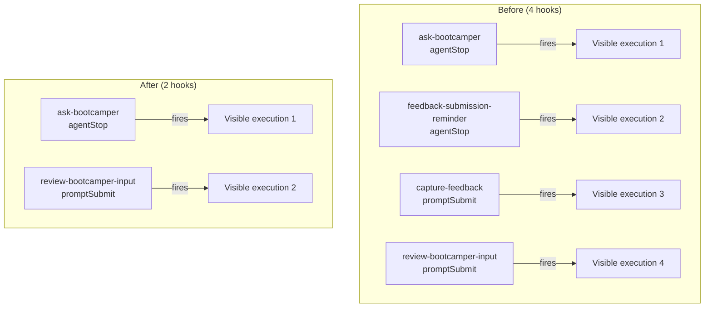

# Design Document: Hook Consolidation

## Overview

This feature consolidates four hooks (two `agentStop`, two `promptSubmit`) into two hooks to reduce visual noise in the bootcamper's conversation. The consolidation merges overlapping prompt logic while preserving all existing behavior.

**Current state (4 hooks, 2 visible firings per event type):**
- `ask-bootcamper.kiro.hook` (agentStop) — closing question + near-completion feedback nudge
- `feedback-submission-reminder.kiro.hook` (agentStop) — post-completion feedback submission reminder
- `capture-feedback.kiro.hook` (promptSubmit) — feedback trigger phrase detection
- `review-bootcamper-input.kiro.hook` (promptSubmit) — feedback trigger phrase detection + context capture

**Target state (2 hooks, 1 visible firing per event type):**
- `ask-bootcamper.kiro.hook` (agentStop) — closing question + near-completion nudge + post-completion submission reminder
- `review-bootcamper-input.kiro.hook` (promptSubmit) — unified feedback trigger detection + context capture + workflow initiation

The design is a prompt-level merge: both consolidated hooks combine the prompt text from their respective sources into a single `then.prompt` field. No new code modules or runtime logic are introduced — the change is purely to the static hook JSON files and their supporting documentation/tests.

## Architecture



The architecture remains unchanged — hooks are still JSON files in `senzing-bootcamp/hooks/` that map IDE events to agent prompts. The only structural change is fewer files and longer prompts in the surviving hooks.

### Affected Files

| File | Action | Rationale |
|------|--------|-----------|
| `senzing-bootcamp/hooks/ask-bootcamper.kiro.hook` | Modify | Append feedback-submission-reminder logic to prompt |
| `senzing-bootcamp/hooks/review-bootcamper-input.kiro.hook` | Keep as-is | Already contains the unified logic from both promptSubmit hooks |
| `senzing-bootcamp/hooks/feedback-submission-reminder.kiro.hook` | Delete | Logic merged into ask-bootcamper |
| `senzing-bootcamp/hooks/capture-feedback.kiro.hook` | Delete | Logic already duplicated in review-bootcamper-input |
| `senzing-bootcamp/hooks/hook-categories.yaml` | Modify | Remove deleted hook entries from critical list |
| `senzing-bootcamp/steering/hook-registry.md` | Modify | Remove 2 entries, update 2 descriptions, update count |
| `senzing-bootcamp/steering/onboarding-flow.md` | Modify | Remove 2 rows, update 2 failure impact messages |
| `tests/test_hook_prompt_standards.py` | Modify | Update EXPECTED_HOOK_COUNT from 25 to 23 |
| `senzing-bootcamp/tests/test_feedback_submission_reminder_hook.py` | Delete or repurpose | Hook file no longer exists |
| `senzing-bootcamp/tests/test_ask_bootcamper_hook.py` | Modify | Add assertions for feedback-reminder content |

## Components and Interfaces

### Consolidated agentStop Hook (`ask-bootcamper.kiro.hook`)

The merged prompt follows a two-phase decision tree:

```
Phase 1: Closing Question (existing logic)
├── Check silence conditions (.question_pending, 👉, trailing question)
├── If ANY condition fails → PRODUCE NO OUTPUT for this phase
├── Check no-op (no files changed) → skip recap
└── If all pass → produce recap + 👉 closing question
    └── If near track completion → append "say bootcamp feedback" nudge

Phase 2: Feedback Submission Reminder (merged from feedback-submission-reminder)
├── Check track completion (modules_completed in bootcamp_progress.json)
├── Check 📋 deduplication (not already shown in session)
├── Check feedback file exists with ## Improvement: headings
├── If ANY condition fails → PRODUCE NO OUTPUT for this phase
└── If all pass → append 📋 reminder with sharing options
```

**Key design decision:** Phase 2 operates independently of Phase 1. If Phase 1 is silenced (conditions not met) but Phase 2 conditions pass, the feedback reminder still fires as standalone output. This preserves the original behavior where `feedback-submission-reminder` could fire even when `ask-bootcamper` was silent.

### Consolidated promptSubmit Hook (`review-bootcamper-input.kiro.hook`)

The current `review-bootcamper-input.kiro.hook` already contains the complete unified logic from both `capture-feedback` and itself. The `capture-feedback` hook is a strict subset — its prompt is a simpler version of the same trigger-phrase detection. No prompt modification is needed for this hook; only the deletion of `capture-feedback.kiro.hook` and documentation updates.

### Hook JSON Structure (unchanged)

```json
{
  "name": "string",
  "version": "semver",
  "description": "string",
  "when": { "type": "agentStop | promptSubmit" },
  "then": { "type": "askAgent", "prompt": "string" }
}
```

## Data Models

No new data models are introduced. The existing hook JSON schema remains unchanged. The only data change is the content of the `then.prompt` field in `ask-bootcamper.kiro.hook`.

### Hook Categories YAML Update

```yaml
critical:
  - ask-bootcamper
  - review-bootcamper-input
  - code-style-check
  - commonmark-validation
  - enforce-feedback-path
  - enforce-working-directory
  - verify-senzing-facts
```

Removed from critical list: `capture-feedback`, `feedback-submission-reminder`.

## Correctness Properties

*A property is a characteristic or behavior that should hold true across all valid executions of a system — essentially, a formal statement about what the system should do. Properties serve as the bridge between human-readable specifications and machine-verifiable correctness guarantees.*

### Property 1: Silence-first default in agentStop hook

*For any* valid `ask-bootcamper.kiro.hook` file, the `then.prompt` field SHALL contain an explicit "produce no output" instruction as the dominant default before any conditional output logic, ensuring that silence is the baseline behavior regardless of what other logic is appended.

**Validates: Requirements 1.4, 7.1**

### Property 2: All six trigger phrases preserved in promptSubmit hook

*For any* case variation of the six feedback trigger phrases ("bootcamp feedback", "power feedback", "submit feedback", "provide feedback", "I have feedback", "report an issue"), the `review-bootcamper-input.kiro.hook` prompt SHALL contain all six phrases and instruct case-insensitive matching.

**Validates: Requirements 2.2, 7.4**

### Property 3: Hook file structural validity

*For any* `.kiro.hook` file in `senzing-bootcamp/hooks/`, the file SHALL parse as valid JSON containing all required keys (`name`, `version`, `description`, `when`, `then`) with `when.type` being a valid event type and `then.type` being `askAgent`.

**Validates: Requirements 1.5, 2.4, 6.2, 6.3**

## Error Handling

This feature modifies static configuration files (JSON hooks, Markdown docs, YAML). There is no runtime error handling to design. Errors are caught by:

1. **JSON parse errors** — Caught by existing `test_hook_prompt_standards.py` which validates all `.kiro.hook` files parse as valid JSON.
2. **Registry sync errors** — Caught by `sync_hook_registry.py --verify` in CI, which ensures the registry matches the actual hook files on disk.
3. **Missing hook files** — Caught by the hook count assertion (`EXPECTED_HOOK_COUNT = 23`) and by the registry sync script.
4. **Stale references** — Caught by tests that verify deleted hooks no longer appear in registry, onboarding-flow, or hook-categories.yaml.

### Rollback Strategy

If the consolidation causes unexpected issues:
1. Revert the commit (all changes are in a single atomic commit)
2. The original 4-hook state is fully recoverable from git history

## Testing Strategy

### Unit Tests (Example-based)

Example-based tests validate specific structural requirements:

| Test | Validates |
|------|-----------|
| Consolidated ask-bootcamper contains closing-question keywords | Req 1.1 |
| Consolidated ask-bootcamper contains feedback-reminder keywords | Req 1.1, 1.3 |
| Consolidated ask-bootcamper contains all three silence conditions | Req 1.2 |
| Consolidated ask-bootcamper contains 📋 deduplication | Req 7.2 |
| Consolidated ask-bootcamper contains near-completion nudge AND post-completion reminder | Req 7.3 |
| review-bootcamper-input contains all six trigger phrases | Req 2.2, 7.4 |
| review-bootcamper-input contains feedback-workflow.md reference | Req 7.5 |
| review-bootcamper-input contains "do not ask to re-explain" | Req 7.6 |
| feedback-submission-reminder.kiro.hook does NOT exist | Req 3.2 |
| capture-feedback.kiro.hook does NOT exist | Req 3.3 |
| hook-registry.md does NOT contain feedback-submission-reminder entry | Req 3.1, 4.3 |
| hook-registry.md does NOT contain capture-feedback entry | Req 3.1, 4.4 |
| hook-registry.md ask-bootcamper description mentions dual responsibility | Req 4.1 |
| hook-registry.md review-bootcamper-input description mentions unified responsibility | Req 4.2 |
| onboarding-flow.md does NOT contain feedback-submission-reminder row | Req 5.1 |
| onboarding-flow.md does NOT contain capture-feedback row | Req 5.2 |
| onboarding-flow.md ask-bootcamper failure impact updated | Req 5.3 |
| onboarding-flow.md review-bootcamper-input failure impact updated | Req 5.4 |
| EXPECTED_HOOK_COUNT is 23 | Req 6.1 |
| hook-categories.yaml does not list deleted hooks | Req 3.1 |

### Property-Based Tests (Hypothesis)

Property-based tests use Hypothesis with `@settings(max_examples=100)`:

| Property | Tag | Library |
|----------|-----|---------|
| Property 1: Silence-first default | `Feature: hook-consolidation, Property 1: Silence-first default in agentStop hook` | Hypothesis |
| Property 2: Trigger phrase preservation | `Feature: hook-consolidation, Property 2: All six trigger phrases preserved in promptSubmit hook` | Hypothesis |
| Property 3: Hook file structural validity | `Feature: hook-consolidation, Property 3: Hook file structural validity` | Hypothesis |

Each property test runs a minimum of 100 iterations using generated inputs (random substrings, case variations, JSON structures) to verify the properties hold universally.

### Integration Tests

| Test | Validates |
|------|-----------|
| `sync_hook_registry.py --verify` exits 0 | Req 4.6 |
| `pytest` full suite passes | Req 6.5 |

### Test File Changes

- **Delete**: `senzing-bootcamp/tests/test_feedback_submission_reminder_hook.py` (hook no longer exists)
- **Modify**: `senzing-bootcamp/tests/test_ask_bootcamper_hook.py` (add feedback-reminder assertions)
- **Modify**: `tests/test_hook_prompt_standards.py` (update EXPECTED_HOOK_COUNT to 23)
- **Create**: `senzing-bootcamp/tests/test_hook_consolidation.py` (new test file for consolidation-specific validations)
