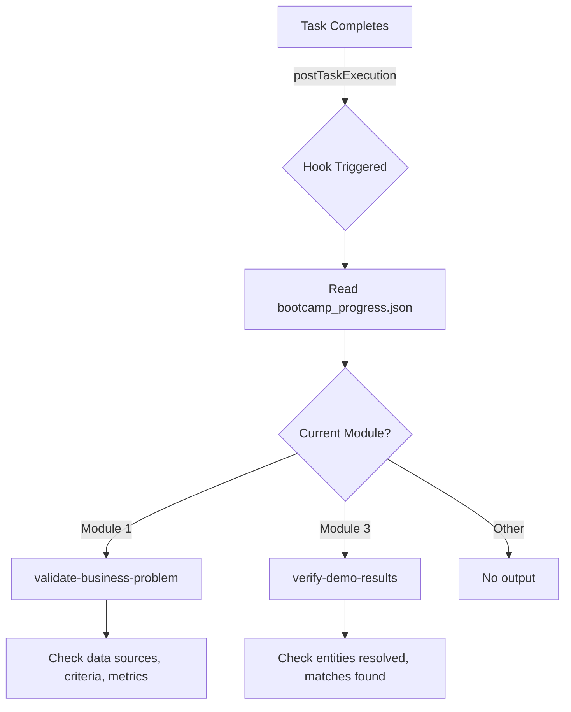

# Design Document: Hook Gaps Modules 1 and 3

## Overview

This feature fills the automation coverage gap in Modules 1 (Business Problem) and 3 (Quick Demo) by adding two new hooks — `validate-business-problem` and `verify-demo-results` — and registering them in `hook-categories.yaml`. After this change, every module (1–11) will have at least one hook, ensuring uniform phase-gate coverage across the bootcamp.

Both hooks use the `postTaskExecution` event type with `askAgent` action, following the same pattern as the existing `deployment-phase-gate` hook. They read `config/bootcamp_progress.json` to determine the current module and only act when the module matches, producing no output otherwise.

## Architecture

The hooks integrate into the existing hook infrastructure without architectural changes:



**Key design decisions:**

1. **postTaskExecution event type** — Chosen because validation should happen after task completion, not during file edits or tool use. This matches the `deployment-phase-gate` pattern.
2. **Module guard in prompt** — Each hook reads `config/bootcamp_progress.json` and checks `current_module` before acting. Non-matching modules produce no output, keeping the hook silent when irrelevant.
3. **askAgent action** — The hooks provide guidance and feedback rather than running commands, consistent with all other bootcamp hooks.

## Components and Interfaces

### Component 1: validate-business-problem.kiro.hook

**Location:** `senzing-bootcamp/hooks/validate-business-problem.kiro.hook`

**Interface (JSON schema):**
```json
{
  "name": "Validate Business Problem",
  "version": "1.0.0",
  "description": "...",
  "when": { "type": "postTaskExecution" },
  "then": { "type": "askAgent", "prompt": "..." }
}
```

**Prompt responsibilities:**
- Read `config/bootcamp_progress.json` and check `current_module`
- If module ≠ 1: produce no output
- If module = 1: verify data sources identified, matching criteria defined, success metrics documented
- Report incomplete fields with suggestions, or confirm readiness for Module 2

### Component 2: verify-demo-results.kiro.hook

**Location:** `senzing-bootcamp/hooks/verify-demo-results.kiro.hook`

**Interface (JSON schema):**
```json
{
  "name": "Verify Demo Results",
  "version": "1.0.0",
  "description": "...",
  "when": { "type": "postTaskExecution" },
  "then": { "type": "askAgent", "prompt": "..." }
}
```

**Prompt responsibilities:**
- Read `config/bootcamp_progress.json` and check `current_module`
- If module ≠ 3: produce no output
- If module = 3: verify entities were resolved and matches were found
- Report singleton-only results with diagnostic suggestions, or confirm demo success

### Component 3: hook-categories.yaml update

**Location:** `senzing-bootcamp/hooks/hook-categories.yaml`

**Change:** Add module `1` and `3` entries in numeric order:
```yaml
modules:
  1:
    - validate-business-problem
  2:
    - verify-sdk-setup
  3:
    - verify-demo-results
  4:
    - validate-data-files
  ...
```

### Component 4: hook-registry.md regeneration

After adding the hook files and categories, `sync_hook_registry.py --write` regenerates the registry to include both new hooks. The `EXPECTED_HOOK_COUNT` in `test_hook_prompt_standards.py` must be updated from 23 to 25.

## Data Models

### Hook File Schema (existing, no changes)

```json
{
  "name": "string (human-readable title)",
  "version": "string (semver)",
  "description": "string (one-line summary)",
  "when": {
    "type": "string (event type from VALID_EVENT_TYPES)",
    "patterns": ["string[] (optional, for file events)"],
    "toolTypes": ["string[] (optional, for tool events)"]
  },
  "then": {
    "type": "string ('askAgent' | 'runCommand')",
    "prompt": "string (required when then.type is 'askAgent')"
  }
}
```

### bootcamp_progress.json (existing, read-only)

```json
{
  "current_module": 1,
  "modules_completed": [],
  "...": "..."
}
```

The hooks read `current_module` to determine whether to activate. No writes to this file.

## Correctness Properties

*A property is a characteristic or behavior that should hold true across all valid executions of a system — essentially, a formal statement about what the system should do. Properties serve as the bridge between human-readable specifications and machine-verifiable correctness guarantees.*

### Property 1: All modules have hook coverage

*For any* module number in the range 1 through 11, the `hook-categories.yaml` file SHALL list at least one hook ID for that module.

**Validates: Requirements 7.1**

### Property 2: Category-to-file bidirectional consistency

*For any* hook ID listed in the `modules` section of `hook-categories.yaml`, a corresponding `.kiro.hook` file SHALL exist in `senzing-bootcamp/hooks/`.

**Validates: Requirements 7.3**

### Property 3: Hook structural validity

*For any* `.kiro.hook` file in `senzing-bootcamp/hooks/`, the file SHALL parse as valid JSON and contain all required fields (`name`, `version`, `description`, `when.type`, `then.type`, `then.prompt`), with `when.type` being a member of `VALID_EVENT_TYPES` and `then.type` being either "askAgent" or "runCommand".

**Validates: Requirements 4.2, 4.3, 4.4, 4.5**

## Error Handling

| Scenario | Handling |
|----------|----------|
| `bootcamp_progress.json` missing or unreadable | Hook prompt instructs agent to skip validation silently |
| `current_module` field missing from progress | Hook prompt instructs agent to produce no output |
| Module number doesn't match (not 1 or 3) | Hook produces no output — silent pass-through |
| Validation finds incomplete fields (Module 1) | Report which fields are missing, suggest addressing them |
| Demo produced no matches (Module 3) | Report singleton-only results, suggest diagnosis |

## Testing Strategy

### Property-Based Tests (Hypothesis)

Property-based testing is appropriate here because:
- Properties 1 and 2 are universal invariants over sets (module numbers, hook IDs)
- Property 3 is a universal structural invariant over all hook files
- The input space (hook files, category entries) benefits from exhaustive checking

**Library:** Hypothesis (Python)
**Configuration:** Minimum 100 iterations per property test
**Tag format:** `Feature: hook-gaps-modules-1-and-3, Property {N}: {title}`

Test file: `tests/test_hook_gaps_modules_1_and_3_properties.py`

### Example-Based Unit Tests (pytest)

Test file: `tests/test_hook_gaps_modules_1_and_3.py`

Covers:
- Specific field values for both hook files (name, version, when.type, then.type)
- Prompt content checks (references to bootcamp_progress.json, module guards, validation instructions)
- Categories file structure (module 1 and 3 entries present, numeric ordering preserved)
- Hook count verification (25 total after change)

### Integration Tests

- Run `sync_hook_registry.py --verify` to confirm registry stays in sync
- Run existing `test_hook_prompt_standards.py` to confirm new hooks pass all existing validation
