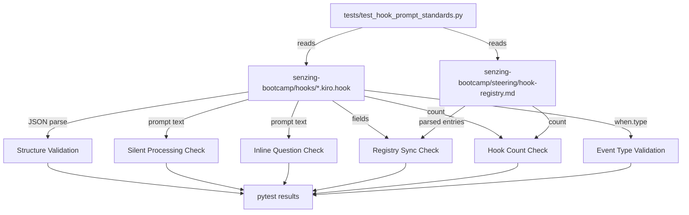

# Design Document: Hook Prompt Testing Framework

## Overview

The Senzing Bootcamp power distributes 18 `.kiro.hook` files that control agent behavior. Prompt wording bugs have been found in 6 of these hooks — missing silent-processing instructions, inline closing questions that conflict with the `ask-bootcamper` hook, and prompt text drifting out of sync with the hook registry. These bugs reach bootcampers before anyone notices.

This design adds `tests/test_hook_prompt_standards.py`, a pytest-based test suite that parses every `.kiro.hook` file and validates JSON structure, required fields, prompt quality patterns, and registry synchronization. The suite runs in CI so prompt regressions are caught before distribution.

### Key Design Decisions

1. **Single test module** — all hook validation lives in `tests/test_hook_prompt_standards.py`, consistent with the project's existing test layout (one file per concern).
2. **No new dependencies** — the test suite uses only `pytest`, `json`, `re`, and `pathlib`, all of which are already available in the project.
3. **Registry parsing via regex** — the hook registry is a markdown file with a consistent structure. Regex extraction is sufficient and avoids adding a markdown parser dependency.
4. **Parameterized tests** — each hook file is tested via `@pytest.mark.parametrize`, producing one test case per hook for clear failure identification.
5. **Constants for expected counts and valid event types** — the expected hook count (18) and valid event types are defined as module-level constants, making them easy to update if the bootcamp grows.

## Architecture



The test suite is a single pytest module with test classes organized by requirement:

| Test Class | Requirement | What It Validates |
|------------|-------------|-------------------|
| `TestJsonStructure` | Req 1 | Valid JSON, required fields, conditional fields, prompt length |
| `TestSilentProcessing` | Req 2 | Pass-through hooks contain silent-processing instructions |
| `TestNoInlineClosingQuestions` | Req 3 | Non-exempt hooks avoid closing questions |
| `TestRegistrySync` | Req 4 | Hook files and registry entries match |
| `TestHookCount` | Req 5 | Exactly 18 hooks in files and registry |
| `TestCiIntegration` | Req 6 | Clear failure messages, execution time |
| `TestEventTypeValidation` | Req 7 | All event types are recognized |

## Components and Interfaces

### 1. Hook File Loader

**Purpose:** Load and parse all `.kiro.hook` files from the hooks directory.

```python
HOOKS_DIR = Path("senzing-bootcamp/hooks")
REGISTRY_PATH = Path("senzing-bootcamp/steering/hook-registry.md")

EXPECTED_HOOK_COUNT = 18

VALID_EVENT_TYPES = {
    "promptSubmit", "preToolUse", "postToolUse",
    "fileEdited", "fileCreated", "fileDeleted",
    "agentStop", "userTriggered", "postTaskExecution", "preTaskExecution",
}

REQUIRED_FIELDS = ["name", "version", "description", "when.type", "then.type", "then.prompt"]

FILE_EVENT_TYPES = {"fileEdited", "fileCreated", "fileDeleted"}
TOOL_EVENT_TYPES = {"preToolUse", "postToolUse"}
PASS_THROUGH_EVENT_TYPES = {"preToolUse", "promptSubmit"}
EXEMPT_FROM_CLOSING_QUESTION = {"agentStop", "userTriggered"}
```

```python
def load_hook_files() -> list[tuple[str, dict]]:
    """Load all .kiro.hook files from the hooks directory.
    
    Returns:
        List of (filename, parsed_json_dict) tuples.
        Raises pytest.fail for files that are not valid JSON.
    """

def get_hook_files() -> list[Path]:
    """Return all .kiro.hook file paths in the hooks directory."""
```

### 2. Registry Parser

**Purpose:** Parse the hook registry markdown file to extract hook entries.

```python
@dataclass
class RegistryEntry:
    id: str             # e.g., "capture-feedback"
    name: str           # e.g., "Capture Bootcamp Feedback"
    description: str    # e.g., "Fires on every message submission..."

def parse_registry(registry_path: Path) -> list[RegistryEntry]:
    """Parse hook-registry.md and extract hook entries.
    
    Extracts id from `- id: \`{id}\`` lines,
    name from `- name: \`{name}\`` lines,
    description from `- description: \`{description}\`` lines.
    
    Returns:
        List of RegistryEntry objects.
    """
```

### 3. Prompt Pattern Matchers

**Purpose:** Regex patterns for detecting silent-processing instructions and inline closing questions.

```python
SILENT_PROCESSING_PATTERNS = [
    r"produce no output at all",
    r"do nothing",
    r"do not acknowledge.*do not explain.*do not print",
]

CLOSING_QUESTION_PATTERNS = [
    r"what would you like to do",
    r"what do you want to do next",
    r"would you like to continue",
    r"what.*next",
    r"would you like to",
]
```

The silent-processing check applies only to hooks with `when.type` in `PASS_THROUGH_EVENT_TYPES`. The closing-question check applies to all hooks except those with `when.type` in `EXEMPT_FROM_CLOSING_QUESTION`.

### 4. Field Validator

**Purpose:** Validate required fields and conditional fields based on event type.

```python
def validate_required_fields(hook_data: dict) -> list[str]:
    """Check that all REQUIRED_FIELDS are present.
    
    Uses dot-notation traversal: "when.type" checks hook_data["when"]["type"].
    
    Returns:
        List of missing field names (empty if all present).
    """

def validate_conditional_fields(hook_data: dict) -> list[str]:
    """Check conditional fields based on event type.
    
    - File events (fileEdited, fileCreated, fileDeleted): when.patterns must be a non-empty list
    - Tool events (preToolUse, postToolUse): when.toolTypes must be a non-empty list
    
    Returns:
        List of validation error messages (empty if all valid).
    """
```

## Data Models

### Hook File JSON Schema

```json
{
  "name": "string (required)",
  "version": "string (required)",
  "description": "string (required)",
  "when": {
    "type": "string (required, must be a valid Event_Type)",
    "patterns": ["string (required if type is fileEdited/fileCreated/fileDeleted)"],
    "toolTypes": ["string (required if type is preToolUse/postToolUse)"]
  },
  "then": {
    "type": "string (required, must be 'askAgent')",
    "prompt": "string (required, min 20 characters)"
  }
}
```

### Registry Entry (parsed from markdown)

```python
@dataclass
class RegistryEntry:
    id: str             # Hook identifier, matches filename stem
    name: str           # Display name
    description: str    # Hook description
```

### Test Parameterization

Each test that validates individual hooks is parameterized over the list of hook files:

```python
@pytest.fixture
def all_hooks() -> list[tuple[str, dict]]:
    """Return (filename, parsed_data) for every .kiro.hook file."""

@pytest.fixture
def registry_entries() -> list[RegistryEntry]:
    """Return parsed registry entries from hook-registry.md."""
```


## Correctness Properties

*A property is a characteristic or behavior that should hold true across all valid executions of a system — essentially, a formal statement about what the system should do. Properties serve as the bridge between human-readable specifications and machine-verifiable correctness guarantees.*

### Property 1: Required Fields Validation

*For any* JSON object representing a hook file, the required-fields validator shall report exactly the set of fields that are missing from `{name, version, description, when.type, then.type, then.prompt}` — reporting no false positives (fields that are present) and no false negatives (fields that are absent).

**Validates: Requirements 1.2**

### Property 2: Conditional Field Validation

*For any* hook JSON object with a valid event type, if the event type is a file event (`fileEdited`, `fileCreated`, `fileDeleted`) then `when.patterns` must be present and be a non-empty list, and if the event type is a tool event (`preToolUse`, `postToolUse`) then `when.toolTypes` must be present and be a non-empty list. For all other event types, neither conditional field is required.

**Validates: Requirements 1.3, 1.4**

### Property 3: Prompt Minimum Length Validation

*For any* string, the prompt length validator shall accept it if and only if it has at least 20 characters. Strings shorter than 20 characters (including empty strings) shall be rejected.

**Validates: Requirements 1.6**

### Property 4: Silent-Processing Detection

*For any* prompt string, the silent-processing detector shall return true if and only if the string contains at least one recognized silent-processing phrase (e.g., "produce no output at all", "do nothing"). Prompts without any such phrase shall return false.

**Validates: Requirements 2.1**

### Property 5: Closing-Question Exemption by Event Type

*For any* hook with a prompt containing an inline closing question, the test shall flag it as a failure if and only if the hook's event type is not in the exempt set (`agentStop`, `userTriggered`). Hooks with exempt event types shall pass regardless of prompt content.

**Validates: Requirements 3.1, 3.2, 3.3**

### Property 6: Bidirectional Registry-File Synchronization

*For any* set of registry hook ids and file hook ids, the sync checker shall report every id that exists in one set but not the other — no registry id without a file and no file id without a registry entry shall go unreported.

**Validates: Requirements 4.2, 4.3**

### Property 7: Registry Field Matching

*For any* hook that exists in both the registry and as a file, the sync checker shall report a mismatch if and only if the `name` or `description` fields differ between the two sources. Matching fields shall not be reported.

**Validates: Requirements 4.4, 4.5**

### Property 8: Event Type Validation

*For any* string, the event type validator shall accept it if and only if it is a member of the valid event types set (`promptSubmit`, `preToolUse`, `postToolUse`, `fileEdited`, `fileCreated`, `fileDeleted`, `agentStop`, `userTriggered`, `postTaskExecution`, `preTaskExecution`). All other strings shall be rejected.

**Validates: Requirements 7.1, 7.2**

## Error Handling

| Scenario | Handling |
|----------|----------|
| Hook file is not valid JSON | Test fails with message: `"{filename}" is not valid JSON: {parse_error}"` |
| Required field missing | Test fails with message: `"{filename}" missing required field: {field_name}` |
| Conditional field missing (patterns/toolTypes) | Test fails with message: `"{filename}" with event type "{type}" missing required field: {field_name}` |
| `then.type` is not `askAgent` | Test fails with message: `"{filename}" then.type is "{actual}", expected "askAgent"` |
| Prompt too short | Test fails with message: `"{filename}" prompt is {length} chars, minimum is 20` |
| Silent-processing instruction missing | Test fails with message: `"{filename}" (pass-through hook) missing silent-processing instruction in prompt` |
| Inline closing question found | Test fails with message: `"{filename}" contains inline closing question: "{matched_phrase}"` |
| Registry entry missing for hook file | Test fails with message: `Hook file "{filename}" has no corresponding entry in hook-registry.md` |
| Hook file missing for registry entry | Test fails with message: `Registry entry "{id}" has no corresponding file "{id}.kiro.hook"` |
| Name mismatch between file and registry | Test fails with message: `"{id}" name mismatch — file: "{file_name}", registry: "{registry_name}"` |
| Description mismatch between file and registry | Test fails with message: `"{id}" description mismatch — file: "{file_desc}", registry: "{registry_desc}"` |
| Hook count wrong | Test fails with message: `Expected {expected} hook files, found {actual}` |
| Invalid event type | Test fails with message: `"{filename}" has invalid event type: "{type}"` |
| Hook registry file not found | Test fails with message: `Hook registry not found at {path}` |
| Hooks directory not found | Test fails with message: `Hooks directory not found at {path}` |

## Testing Strategy

### Property-Based Tests (Hypothesis)

The feature is well-suited for property-based testing because the core validation functions (field checking, pattern matching, set comparison) are pure functions with clear input/output behavior and universal properties that hold across a wide input space.

**Library:** [Hypothesis](https://hypothesis.readthedocs.io/) (Python) — already used in the project (`.hypothesis/` directory present).

**Configuration:** Minimum 100 iterations per property test (`@settings(max_examples=100)`).

**Tag format:** `Feature: hook-prompt-testing-framework, Property {N}: {title}`

Each of the 8 correctness properties maps to a single property-based test:

| Property | Test Strategy |
|----------|---------------|
| P1: Required fields validation | Generate random dicts with subsets of required fields present/absent, verify validator reports exactly the missing fields |
| P2: Conditional field validation | Generate random hook dicts with various event types and presence/absence of patterns/toolTypes, verify correct conditional enforcement |
| P3: Prompt minimum length | Generate random strings of length 0–100, verify the validator accepts iff length ≥ 20 |
| P4: Silent-processing detection | Generate random strings, some containing silent-processing phrases, verify detection accuracy |
| P5: Closing-question exemption | Generate random (event_type, prompt) pairs with and without closing questions, verify exemption logic |
| P6: Bidirectional sync | Generate random pairs of id sets, verify all asymmetric differences are reported |
| P7: Registry field matching | Generate random (file_fields, registry_fields) pairs, verify mismatches are detected iff fields differ |
| P8: Event type validation | Generate random strings including valid event types, verify acceptance iff string is in the valid set |

### Example-Based Unit Tests

| Test | What it verifies |
|------|-----------------|
| All 18 hook files parse as valid JSON | Each real hook file loads without JSON errors (Req 1.1) |
| All hook files have required fields | Parameterized over real files (Req 1.2) |
| `then.type` is `askAgent` in all hooks | Parameterized over real files (Req 1.5) |
| Hook file count is 18 | `len(glob("*.kiro.hook")) == 18` (Req 5.1) |
| Registry entry count is 18 | `len(parse_registry()) == 18` (Req 5.2) |
| Valid event types constant has 10 entries | Verify VALID_EVENT_TYPES matches the spec (Req 7.1) |
| Real pass-through hooks have silent-processing | Parameterized over real preToolUse/promptSubmit hooks (Req 2.1) |
| Real non-exempt hooks have no closing questions | Parameterized over real non-agentStop/userTriggered hooks (Req 3.1) |
| Registry names match file names | Parameterized over all hooks present in both (Req 4.4) |
| Registry descriptions match file descriptions | Parameterized over all hooks present in both (Req 4.5) |

### Integration Tests

| Test | What it verifies |
|------|-----------------|
| Full test suite completes within 10 seconds | `pytest --timeout=10 tests/test_hook_prompt_standards.py` (Req 6.4) |
| Test suite produces non-zero exit on failure | Standard pytest behavior (Req 6.2) |
| Failure messages include hook filenames | Verify parameterized test ids contain hook names (Req 6.3) |
