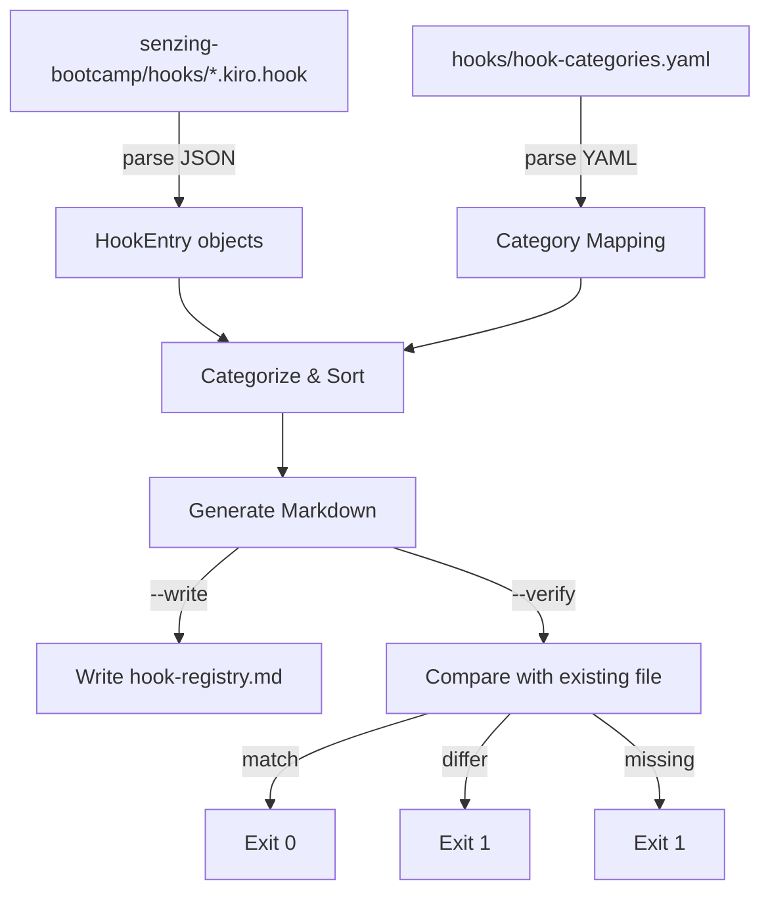

# Design Document: Hook Registry Source of Truth

## Overview

The bootcamp hooks are defined in individual `.kiro.hook` JSON files under `senzing-bootcamp/hooks/` and also documented in `senzing-bootcamp/steering/hook-registry.md`. These two sources have drifted out of sync multiple times, requiring manual fixes. This design makes the `.kiro.hook` files the single source of truth by creating `scripts/sync_hook_registry.py` — a Python script that generates `hook-registry.md` from the hook files. A `--verify` mode enables CI to catch drift before merging.

### Key Design Decisions

1. **Hook files are the source of truth** — the registry is a generated artifact. Developers edit hook files; the script regenerates the registry.
2. **Category mapping via YAML config** — a `senzing-bootcamp/hooks/hook-categories.yaml` file maps each Hook_ID to a category (Critical or Module) and optional module number. This avoids hardcoding categories in the script and makes the mapping easy to update.
3. **Single script, two modes** — `--write` (default) overwrites the registry; `--verify` compares without modifying. Same script serves local development and CI.
4. **No third-party dependencies** — the script uses only `json`, `pathlib`, `re`, `sys`, `argparse`, and a minimal YAML parser (or inline parsing for the simple `hook-categories.yaml` format). This keeps CI setup trivial.
5. **Deterministic output** — stable alphabetical sort within each section, Unix line endings, and consistent formatting ensure that regenerating from the same inputs always produces byte-identical output.

## Architecture



The script follows a pipeline: discover → parse → categorize → sort → generate → write/verify.

## Components and Interfaces

### 1. Data Structures

```python
@dataclass
class HookEntry:
    hook_id: str            # filename stem, e.g., "ask-bootcamper"
    name: str               # from JSON "name" field
    description: str        # from JSON "description" field
    event_type: str         # from JSON "when.type" field
    action_type: str        # from JSON "then.type" field
    prompt: str | None      # from JSON "then.prompt" field (optional)
    file_patterns: str | None   # from JSON "when.filePatterns" (optional)
    tool_types: str | None      # from JSON "when.toolTypes" (optional)

@dataclass
class CategoryMapping:
    hook_id: str
    category: str           # "critical" or "module"
    module_number: int | None   # module number for "module" category
```

### 2. Hook File Parser

```python
def discover_hook_files(hooks_dir: Path) -> list[Path]:
    """Return all *.kiro.hook file paths in the hooks directory, sorted by name."""

def parse_hook_file(hook_path: Path) -> HookEntry:
    """Parse a single .kiro.hook JSON file into a HookEntry.
    
    Extracts hook_id from filename stem, required fields (name, description,
    when.type, then.type), and optional fields (then.prompt, when.filePatterns,
    when.toolTypes).
    
    Raises:
        ValueError: If the file contains invalid JSON or is missing required fields.
    """

def parse_all_hooks(hooks_dir: Path) -> tuple[list[HookEntry], list[str]]:
    """Parse all hook files in the directory.
    
    Returns:
        Tuple of (successful_entries, error_messages).
        Error messages identify the filename and parse error.
    """
```

### 3. Category Configuration

```python
def load_category_mapping(config_path: Path) -> dict[str, CategoryMapping]:
    """Load hook-categories.yaml and return a dict mapping hook_id to CategoryMapping.
    
    Expected YAML format:
        critical:
          - ask-bootcamper
          - capture-feedback
        modules:
          3:
            - code-style-check
          5:
            - data-quality-check
    """

def categorize_hooks(hooks: list[HookEntry], 
                     mapping: dict[str, CategoryMapping]) -> tuple[list[HookEntry], dict[int, list[HookEntry]]]:
    """Split hooks into critical and module groups.
    
    Returns:
        Tuple of (critical_hooks_sorted_alpha, module_hooks_by_number_sorted).
        Hooks without a mapping default to module category with label "any module".
    """
```

### 4. Markdown Generator

```python
def format_hook_entry(entry: HookEntry) -> str:
    """Format a single hook entry as markdown.
    
    Produces:
        **hook-id** (eventType → actionType[, filePatterns: `pattern`][, toolTypes: `types`])
        
        Prompt text as paragraph.
        
        - id: `hook-id`
        - name: `Hook Name`
        - description: `Hook description text`
    """

def generate_registry(critical_hooks: list[HookEntry],
                      module_hooks: dict[int, list[HookEntry]],
                      total_count: int) -> str:
    """Generate the complete hook-registry.md content.
    
    Produces:
        ---
        inclusion: manual
        ---
        # Hook Registry
        
        [intro paragraph with total count]
        
        ## Critical Hooks
        [entries sorted alphabetically]
        
        ## Module Hooks
        [entries sorted by module number, then alphabetically within module]
    
    Line endings are normalized to Unix-style (\\n).
    """
```

### 5. Write/Verify Logic

```python
def write_registry(content: str, output_path: Path) -> None:
    """Write generated content to the registry file."""

def verify_registry(content: str, existing_path: Path) -> tuple[bool, str]:
    """Compare generated content against existing file.
    
    Returns:
        Tuple of (matches: bool, message: str).
        If file doesn't exist, returns (False, "Registry file missing").
        If content differs, returns (False, "Registry is out of sync").
        If content matches, returns (True, "Registry is up to date").
    """
```

### 6. CLI Entry Point

```python
def main() -> None:
    """CLI entry point.
    
    Flags:
        --write (default): Generate and write the registry.
        --verify: Compare generated content against existing file.
        --hooks-dir: Path to hooks directory (default: senzing-bootcamp/hooks/).
        --output: Path to output registry (default: senzing-bootcamp/steering/hook-registry.md).
        --categories: Path to category config (default: senzing-bootcamp/hooks/hook-categories.yaml).
    
    Exit codes:
        0: Success (write mode) or registry matches (verify mode).
        1: Errors during parsing, or registry out of sync (verify mode).
    """
```

## Data Models

### HookEntry

| Field | Type | Source | Required |
|-------|------|--------|----------|
| `hook_id` | `str` | Filename stem | Yes |
| `name` | `str` | JSON `name` | Yes |
| `description` | `str` | JSON `description` | Yes |
| `event_type` | `str` | JSON `when.type` | Yes |
| `action_type` | `str` | JSON `then.type` | Yes |
| `prompt` | `str \| None` | JSON `then.prompt` | No |
| `file_patterns` | `str \| None` | JSON `when.filePatterns` | No |
| `tool_types` | `str \| None` | JSON `when.toolTypes` | No |

### Hook File JSON Schema

```json
{
  "name": "string (required)",
  "description": "string (required)",
  "when": {
    "type": "string (required)",
    "filePatterns": "string (optional)",
    "toolTypes": "string (optional)"
  },
  "then": {
    "type": "string (required)",
    "prompt": "string (optional)"
  }
}
```

### hook-categories.yaml Schema

```yaml
critical:
  - hook-id-1
  - hook-id-2
modules:
  3:
    - hook-id-3
  5:
    - hook-id-4
    - hook-id-5
```

### Generated Registry Structure

```markdown
---
inclusion: manual
---
# Hook Registry

This registry documents all {N} hooks in the Senzing Bootcamp power. ...

## Critical Hooks

**hook-id** (eventType → actionType)

Prompt text.

- id: `hook-id`
- name: `Hook Name`
- description: `Description`

## Module Hooks

### Module 3

**hook-id** (eventType → actionType, filePatterns: `*.py`)

...
```

## Correctness Properties

*A property is a characteristic or behavior that should hold true across all valid executions of a system — essentially, a formal statement about what the system should do. Properties serve as the bridge between human-readable specifications and machine-verifiable correctness guarantees.*

### Property 1: Hook Field Extraction Completeness

*For any* valid hook JSON object containing `name`, `description`, `when.type`, and `then.type` fields (and optionally `then.prompt`, `when.filePatterns`, `when.toolTypes`), the parser shall extract all present fields into a `HookEntry` with no omissions, and the `hook_id` shall equal the filename stem.

**Validates: Requirements 1.2, 1.3, 1.4, 1.5**

### Property 2: Category Placement Correctness

*For any* set of hooks and a category mapping, every hook mapped to "Critical" shall appear in the Critical Hooks section, every hook mapped to "Module" with a module number shall appear under the correct module in the Module Hooks section, and every unmapped hook shall appear under "any module" in the Module Hooks section.

**Validates: Requirements 2.2, 2.3, 2.4**

### Property 3: Alphabetical Sort Within Sections

*For any* set of hooks within a single section (Critical or a specific module number), the generated entries shall be sorted alphabetically by Hook_ID.

**Validates: Requirements 3.3, 3.4**

### Property 4: Registry Frontmatter and Structure

*For any* generated registry output, the content shall begin with `---\ninclusion: manual\n---`, followed by `# Hook Registry`, and contain both `## Critical Hooks` and `## Module Hooks` section headings.

**Validates: Requirements 3.1, 3.2**

### Property 5: Hook Entry Format Correctness

*For any* `HookEntry`, the formatted markdown shall contain the bold Hook_ID, the parenthesized event flow (`eventType → actionType`), and a bullet list with `id`, `name`, and `description` fields. When `filePatterns` or `toolTypes` are present, they shall appear in the parenthesized event flow.

**Validates: Requirements 3.5, 3.6**

### Property 6: Deterministic Generation (Idempotence)

*For any* set of valid hook files and category mapping, generating the registry twice from the same inputs shall produce byte-identical output.

**Validates: Requirements 6.1**

### Property 7: Stable Sort Order Independence from Filesystem

*For any* set of hook files presented in any filesystem order, the generated registry shall produce the same output (alphabetical by Hook_ID within each section, modules sorted by number).

**Validates: Requirements 6.2**

### Property 8: Verify Mode Correctness

*For any* generated registry content and existing file content, the verify function shall return `True` if and only if the two are byte-identical. When the file does not exist, verify shall return `False`.

**Validates: Requirements 4.2, 4.3, 4.4, 4.5**

### Property 9: Unix Line Ending Normalization

*For any* generated registry output, the content shall contain only `\n` line endings and no `\r` characters.

**Validates: Requirements 6.3**

## Error Handling

| Scenario | Handling |
|----------|----------|
| Hook file contains invalid JSON | `parse_hook_file` raises `ValueError` with filename; `parse_all_hooks` collects the error message and skips the file (Req 1.6) |
| Hook file missing required field (`name`, `description`, `when.type`, `then.type`) | `parse_hook_file` raises `ValueError` identifying the missing field |
| `hook-categories.yaml` missing or unparseable | Script exits with code 1 and prints error message |
| Hook ID not found in category mapping | Hook defaults to Module category with "any module" label (Req 2.4) |
| Hooks directory does not exist | Script exits with code 1 and prints `ERROR: Hooks directory not found: {path}` |
| Registry file missing during `--verify` | Script exits with code 1 and prints message (Req 4.5) |
| Registry content differs during `--verify` | Script exits with code 1 and prints sync message (Req 4.4) |
| No `.kiro.hook` files found | Script generates a registry with zero entries and a count of 0 |

## Testing Strategy

### Property-Based Tests (Hypothesis)

The sync script's core functions (parsing, categorizing, sorting, formatting, comparing) are pure functions with clear input/output behavior, making them well-suited for property-based testing.

**Library:** [Hypothesis](https://hypothesis.readthedocs.io/) (Python) — already used in the project.

**Configuration:** Minimum 100 iterations per property test (`@settings(max_examples=100)`).

**Tag format:** `Feature: hook-registry-source-of-truth, Property {N}: {title}`

Each of the 9 correctness properties maps to a single property-based test:

| Property | Test Strategy |
|----------|---------------|
| P1: Field extraction | Generate random valid hook JSON dicts with required and optional fields, verify all fields are extracted correctly |
| P2: Category placement | Generate random hooks and category mappings, verify each hook appears in the correct section |
| P3: Alphabetical sort | Generate random sets of hook IDs, verify output is sorted alphabetically within each section |
| P4: Registry structure | Generate random hook data, verify output starts with frontmatter and contains required headings |
| P5: Entry format | Generate random HookEntry objects with optional fields, verify formatted markdown contains all required elements |
| P6: Deterministic generation | Generate random hook data, run generation twice, verify byte-identical output |
| P7: Sort order independence | Generate random hook data, shuffle input order, verify output is identical regardless of input order |
| P8: Verify mode | Generate random content pairs (some matching, some differing), verify comparison result |
| P9: Unix line endings | Generate random hook data, verify output contains only `\n` line endings |

### Example-Based Unit Tests

| Test | What it verifies |
|------|-----------------|
| Parse real `ask-bootcamper.kiro.hook` | Correct field extraction from a real hook file (Req 1.2) |
| Parse all 18 real hook files | All files parse without errors (Req 1.1) |
| Invalid JSON file is skipped with error | Create temp file with bad JSON, verify error message (Req 1.6) |
| Category mapping loads from real `hook-categories.yaml` | Correct mapping structure (Req 2.5) |
| Generated registry matches current `hook-registry.md` | `--verify` exits 0 on current state (Req 4.3) |
| `--write` mode creates file | Write to temp path, verify file exists (Req 4.1) |
| `--verify` on missing file exits 1 | Verify against non-existent path (Req 4.5) |
| Script uses only stdlib imports | Verify no third-party imports (Req 5.4) |

### Integration Tests

| Test | What it verifies |
|------|-----------------|
| End-to-end: generate from real hooks, verify matches existing registry | Full pipeline on real data |
| `python scripts/sync_hook_registry.py --verify` exits 0 | CI-equivalent check on current state |
| Regenerate twice, compare output | Determinism on real data (Req 6.1) |
