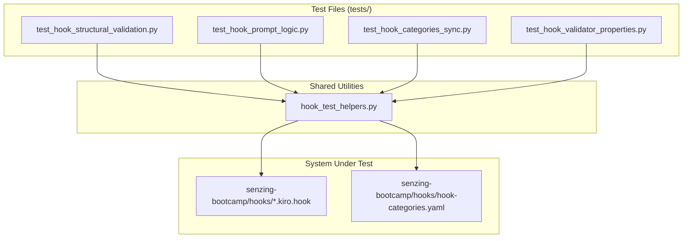

# Design Document: Hook Test Coverage

## Overview

This feature adds comprehensive test coverage for all 25 hooks in the senzing-bootcamp power. The current test suite (`test_hook_prompt_standards.py` and `test_hook_prompt_properties.py`) covers structural schema compliance and prompt patterns but has gaps: no semantic validation of critical hook prompts, no synchronization tests between `hook-categories.yaml` and hook files on disk, and no property-based tests for the structural validator itself.

The new tests are organized into four test files:
1. **Structural validation** — schema compliance for all 25 hooks
2. **Prompt logic** — semantic content verification for 7 critical hooks
3. **Categories synchronization** — bidirectional sync between YAML and disk
4. **Property-based validator tests** — Hypothesis-driven validation of the structural validator and version format logic

All tests use pytest + Hypothesis, Python 3.11+ stdlib only, and live in `tests/` at the repo root.

## Architecture



### Design Decisions

1. **Separate test files per concern** rather than one monolithic file. Each file maps to a requirement group, making it easy to run subsets and identify failures.

2. **Shared helper module** (`tests/hook_test_helpers.py`) extracts common utilities (hook loading, YAML parsing, validation functions) to avoid duplication across test files and enable property-based testing of the validators themselves.

3. **Custom minimal YAML parser** for `hook-categories.yaml` rather than importing PyYAML, consistent with the project convention of stdlib-only dependencies in tests.

4. **Reuse existing validation functions** from `test_hook_prompt_standards.py` where applicable (via sys.path import), extending rather than duplicating.

## Components and Interfaces

### hook_test_helpers.py

Shared utility module providing:

```python
# Constants
HOOKS_DIR: Path  # senzing-bootcamp/hooks/
CATEGORIES_PATH: Path  # senzing-bootcamp/hooks/hook-categories.yaml
VALID_EVENT_TYPES: set[str]
REQUIRED_FIELDS: list[str]
FILE_EVENT_TYPES: set[str]
TOOL_EVENT_TYPES: set[str]
CRITICAL_HOOKS: list[str]  # 7 critical hook identifiers
SEMVER_PATTERN: re.Pattern  # regex for valid semver

# Functions
def get_hook_files() -> list[Path]: ...
def load_hook(path: Path) -> dict: ...
def load_all_hooks() -> list[tuple[str, dict]]: ...
def parse_categories_yaml(path: Path) -> dict[str, list[str]]: ...
def validate_required_fields(hook_data: dict) -> list[str]: ...
def validate_conditional_fields(hook_data: dict) -> list[str]: ...
def validate_event_type(event_type: str) -> bool: ...
def validate_version(version: str) -> bool: ...
def has_silent_processing(prompt: str) -> bool: ...
```

### test_hook_structural_validation.py

Classes:
- `TestHookJsonStructure` — JSON parsing, required fields, event types
- `TestHookConditionalFields` — patterns/toolTypes based on event type
- `TestHookVersionFormat` — semver validation, no leading zeros
- `TestHookCount` — exactly 25 hooks exist

### test_hook_prompt_logic.py

Classes:
- `TestVerifySenzingFacts` — MCP tool references in prompt
- `TestEnforceWorkingDirectory` — forbidden path patterns in prompt
- `TestReviewBootcamperInput` — feedback trigger phrases in prompt
- `TestEnforceFeedbackPath` — canonical path in prompt
- `TestCodeStyleCheck` — coding standard references in prompt
- `TestCommonmarkValidation` — CommonMark rule identifiers in prompt
- `TestAskBootcamper` — question_pending and emoji in prompt
- `TestCriticalHookSilentProcessing` — silent instruction for preToolUse/promptSubmit hooks

### test_hook_categories_sync.py

Classes:
- `TestCategoriesFileToHookFiles` — every YAML entry has a .kiro.hook file
- `TestHookFilesToCategoriesFile` — every .kiro.hook file appears in YAML
- `TestCategoriesCounts` — critical=7, total matches file count
- `TestCategoriesUniqueness` — no hook in multiple categories

### test_hook_validator_properties.py

Classes:
- `TestValidHookAcceptance` — generated valid hooks pass validator
- `TestMissingFieldDetection` — removed fields are reported
- `TestInvalidEventTypeDetection` — invalid event types caught
- `TestConditionalFieldValidation` — missing patterns/toolTypes caught
- `TestVersionFormatValidation` — version string acceptance/rejection
- `TestMarkdownGlobMatching` — markdown paths match hook glob

## Data Models

### Hook File Schema (JSON)

```python
@dataclass
class HookSchema:
    name: str                    # Human-readable hook name
    version: str                 # Semantic version (X.Y.Z)
    description: str             # Hook purpose description
    when: WhenClause             # Trigger configuration
    then: ThenClause             # Action configuration

@dataclass
class WhenClause:
    type: str                    # Event type (from VALID_EVENT_TYPES)
    patterns: list[str] | None   # File glob patterns (file events only)
    toolTypes: list[str] | None  # Tool type filters (tool events only)

@dataclass
class ThenClause:
    type: str                    # Always "askAgent"
    prompt: str                  # Prompt text (>= 20 chars)
```

### Categories YAML Schema

```python
@dataclass
class CategoriesSchema:
    critical: list[str]          # 7 critical hook identifiers
    modules: dict[str, list[str]]  # Module number -> hook identifiers
    # "any" key maps to hooks available in all modules
```

### Hypothesis Strategies

```python
# Strategy for generating valid hook dicts
def st_valid_hook() -> st.SearchStrategy[dict]: ...

# Strategy for generating valid semver strings
def st_valid_semver() -> st.SearchStrategy[str]: ...

# Strategy for generating invalid semver strings
def st_invalid_semver() -> st.SearchStrategy[str]: ...

# Strategy for generating markdown file paths
def st_markdown_path() -> st.SearchStrategy[str]: ...

# Strategy for generating non-markdown file paths
def st_non_markdown_path() -> st.SearchStrategy[str]: ...
```

## Correctness Properties

*A property is a characteristic or behavior that should hold true across all valid executions of a system — essentially, a formal statement about what the system should do. Properties serve as the bridge between human-readable specifications and machine-verifiable correctness guarantees.*

### Property 1: Valid hook dicts accepted by structural validator

*For any* hook dict generated with all required fields present, correct types, a valid event type, and appropriate conditional fields (patterns for file events, toolTypes for tool events), the structural validator SHALL report zero missing fields and zero conditional field errors.

**Validates: Requirements 5.1**

### Property 2: Missing field detection is exact

*For any* valid hook dict with exactly one required field removed, the structural validator SHALL report exactly that field as missing and no other fields.

**Validates: Requirements 5.2**

### Property 3: Invalid event type detection

*For any* string that is not a member of the valid event types set, the event type validator SHALL reject it. For any string that IS a member, the validator SHALL accept it.

**Validates: Requirements 5.3**

### Property 4: Conditional field validation

*For any* hook dict with a file event type (`fileEdited`, `fileCreated`, `fileDeleted`) but missing or empty `when.patterns`, OR a tool event type (`preToolUse`, `postToolUse`) but missing or empty `when.toolTypes`, the conditional field validator SHALL report an error referencing the missing field.

**Validates: Requirements 5.4, 5.5**

### Property 5: Version format validation

*For any* randomly generated string, the version validator SHALL accept it if and only if it matches the pattern `<digits>.<digits>.<digits>` where each component is a non-negative integer without leading zeros.

**Validates: Requirements 7.2**

### Property 6: Markdown glob matching

*For any* generated file path ending in `.md` (with valid path characters), the commonmark-validation hook's `when.patterns` glob (`**/*.md`) SHALL match that path. For any generated file path NOT ending in `.md`, the glob SHALL NOT match.

**Validates: Requirements 1.6**

## Error Handling

- **Missing hook files**: Tests fail with descriptive assertion messages identifying which hook file is missing or malformed.
- **YAML parse errors**: The custom YAML parser raises `ValueError` with line number context if `hook-categories.yaml` is malformed.
- **JSON parse errors**: Tests catch `json.JSONDecodeError` and report the specific file and error location.
- **Import errors**: If `test_hook_prompt_standards.py` cannot be imported (for reusing validators), tests fall back to local implementations in `hook_test_helpers.py`.

## Testing Strategy

### Unit Tests (Example-Based)

- **Structural validation** (Req 2): Parametrized tests iterating all 25 hook files, verifying JSON validity, required fields, event types, conditional fields, version format, and file count.
- **Prompt logic** (Req 3): One test class per critical hook verifying specific content requirements (MCP tool names, forbidden paths, trigger phrases, canonical paths, coding standards, CommonMark rules, question_pending references, silent processing).
- **Categories sync** (Req 4): Bidirectional checks between YAML entries and disk files, count validations, uniqueness checks.
- **Critical hook prompts** (Req 1): Example-based tests verifying static prompt content contains required references.

### Property-Based Tests (Hypothesis)

- **Library**: Hypothesis with `@settings(max_examples=100)`
- **Tag format**: `Feature: hook-test-coverage, Property {N}: {title}`
- **Validator properties** (Req 5): Generate random hook dicts to test validator correctness — valid dicts pass, missing fields detected, invalid event types caught, conditional fields enforced.
- **Version validation** (Req 7): Generate random strings to test version format acceptance/rejection.
- **Glob matching** (Req 1.6): Generate random file paths to test markdown glob matching.

### Test Configuration

- Minimum 100 iterations per property test (`@settings(max_examples=100)`)
- Each property test references its design document property in a docstring
- Tests run via `pytest tests/` alongside existing test suite
- No external dependencies beyond pytest + Hypothesis
